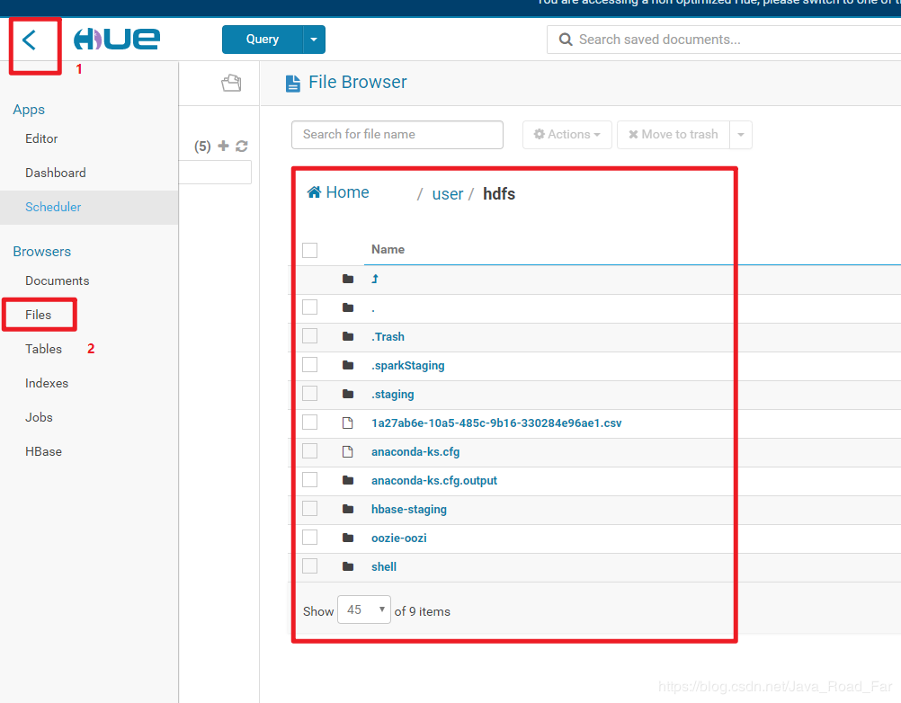
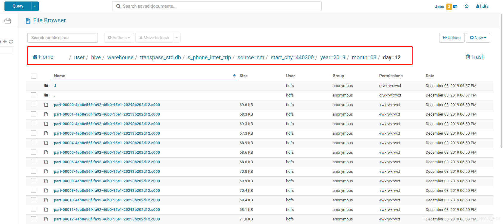
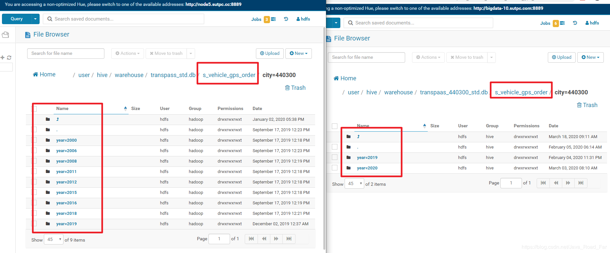
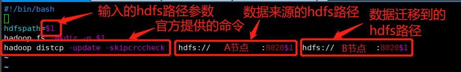

---
# 一、需求说明
把A集群上的数据迁移到B集群上。
需要预先知道A集群主节点的ip地址，和B集群主节点的ip地址。

---
# 二、找需要迁移的数据

然后点击可以查看文件目录树，这里以进入 /user/hive/warehouse/transpass_std.db/s_phone_inter_trip/source=cm/start_city=440300/year=2019/month=03/day=12 文件夹为例

根据实际迁移需求，找到你所想要迁移的数据，然后查看另一台集群上是否已存在。不存在则记录要迁移数据的文件目录，已存在则不需要迁移。


---
# 三、迁移脚本

```bash
#!/bin/bash

hdfspath=$1
hadoop fs -mkdir -p $1
hadoop distcp -update -skipcrccheck hdfs://A节点IP:8020$1 hdfs://B节点IP:8020$1
```
代码说明


将脚本文件保存，这里保存的文件名为hdfs-cp.sh

在脚本文件目录下运行shell脚本，sh hdfs-cp.sh +传输文件路径，这里传输/user/hive/warehouse/transpass_std.db/s_phone_inter_trip/source=cm/start_city=440300/year=2019/month=03为例

```bash
[hdfs@bigdata-1 ~]$ sh hdfs-cp.sh /user/hive/warehouse/transpass_std.db/s_phone_inter_trip/source=cm/start_city=440300/year=2019/month=03
```
运行时间根据数据大小而定，出现job completed successfully 表示传输成功


---
# 五、注意事项
文件太大可能传输失败，这时需要分批传输，不要一次性传太大
官方数据迁移教程：http://hadoop.apache.org/docs/r1.0.4/cn/distcp.html