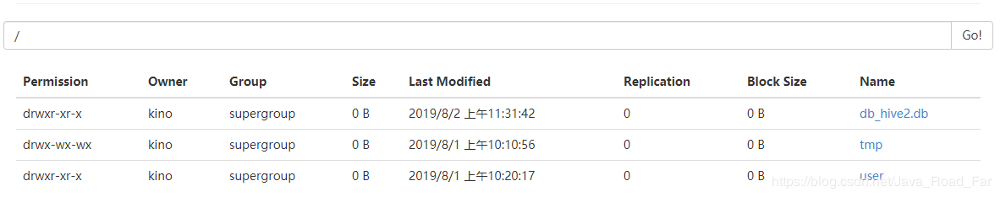
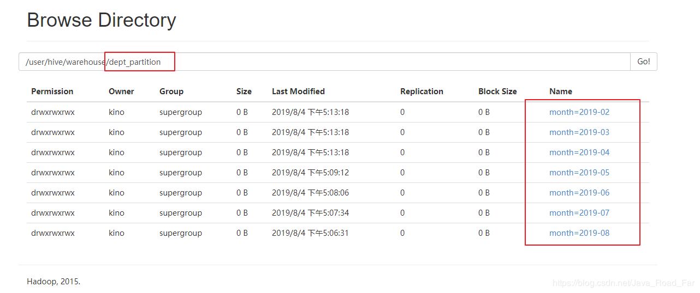
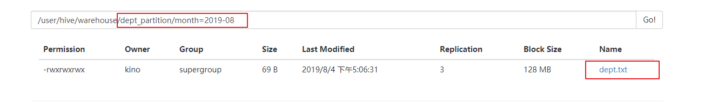

* [一、创建数据库](#%E4%B8%80%E5%88%9B%E5%BB%BA%E6%95%B0%E6%8D%AE%E5%BA%93)
* [二、查询数据库](#%E4%BA%8C%E6%9F%A5%E8%AF%A2%E6%95%B0%E6%8D%AE%E5%BA%93)
* [三、 修改数据库](#%E4%B8%89-%E4%BF%AE%E6%94%B9%E6%95%B0%E6%8D%AE%E5%BA%93)
* [四、删除数据库](#%E5%9B%9B%E5%88%A0%E9%99%A4%E6%95%B0%E6%8D%AE%E5%BA%93)
* [五、 创建表](#%E4%BA%94-%E5%88%9B%E5%BB%BA%E8%A1%A8)
* [六、 管理表](#%E5%85%AD-%E7%AE%A1%E7%90%86%E8%A1%A8)
* [七、 外部表](#%E4%B8%83-%E5%A4%96%E9%83%A8%E8%A1%A8)
* [八、管理表与外部表的互相转换](#%E5%85%AB%E7%AE%A1%E7%90%86%E8%A1%A8%E4%B8%8E%E5%A4%96%E9%83%A8%E8%A1%A8%E7%9A%84%E4%BA%92%E7%9B%B8%E8%BD%AC%E6%8D%A2)
* [九、分区表](#%E4%B9%9D%E5%88%86%E5%8C%BA%E8%A1%A8)

----


# 一、创建数据库
1. 创建一个数据库, 数据库在 HDFS 上的默认存储路径是 `/user/hive/warehouse/*.db`。
	```sql
	hive (default)> create database db_hive;
	```
2. 避免要创建的数据库已经存在错误，增加 `if not exists` 判断。（标准写法）
	```sql
	hive (default)> create database db_hive;
	FAILED: Execution Error, return code 1 from org.apache.hadoop.hive.ql.exec.DDLTask. Database db_hive already exists
	hive (default)> create database if not exists db_hive;
	```
3. 创建一个数据库，指定数据库在HDFS上存放的位置
	```sql
	hive (default)> create database db_hive2 location '/db_hive2.db';
	```
	

---
# 二、查询数据库
1. 显示数据库
	① 显示
	```sql
	hive> show databases;
	```
	② 过滤显示查询的数据库
	```sql
	hive> show databases like 'db_hive*';
	OK
	db_hive
	db_hive_1
	```
2. 查看数据库详情
 ① 显示数据库信息
	```sql
	hive (default)> desc database db_hive2;
	OK
	db_name	comment	location	owner_name	owner_type	parameters
	db_hive2		hdfs://hadoop102:9000/db_hive2.db	kino	USER	
	Time taken: 0.044 seconds, Fetched: 1 row(s)
	```
	② 显示数据库详细信息, extended
	```sql
	hive (default)> desc database extended db_hive2;
	OK
	db_name	comment	location	owner_name	owner_type	parameters
	db_hive2		hdfs://hadoop102:9000/db_hive2.db	kino	USER	
	Time taken: 0.023 seconds, Fetched: 1 row(s)
	```
3. 切换当前数据库
	```sql
	hive (default)> use db_hive2;
	```
---
# 三、 修改数据库
用户可以使用ALTER DATABASE命令为某个数据库的DBPROPERTIES设置键-值对属性值，来描述这个数据库的属性信息。<font color='red'>数据库的其他元数据信息都是不可更改的，包括数据库名和数据库所在的目录位置。</font>

```sql
hive (default)> alter database db_hive2 set dbproperties('createtime'='20170830');
```

在hive中查看修改结果
```sql
hive (default)> desc database extended db_hive;
FAILED: SemanticException [Error 10072]: Database does not exist: db_hive
hive (default)> desc database extended db_hive2;
OK
db_name	comment	location	owner_name	owner_type	parameters
db_hive2		hdfs://hadoop102:9000/db_hive2.db	kino	USER	{createtime=20170830}
Time taken: 0.026 seconds, Fetched: 1 row(s)
```
---
# 四、删除数据库
1. 删除空数据库
	```sql
	hive>drop database db_hive2;
	```

2. 如果删除的数据库不存在, 最好采用 `if exists` 判断数据库是否存在
	```sql
	hive> drop database db_hive;
	FAILED: SemanticException [Error 10072]: Database does not exist: db_hive
	hive> drop database if exists db_hive2;
	```

3. 如果数据库不为空， 可以采用 `cascade` 命令，强制删除
	```sql
	hive> drop database db_hive;
	FAILED: Execution Error, return code 1 from org.apache.hadoop.hive.ql.exec.DDLTask. InvalidOperationException(message:Database db_hive is not empty. One or more tables exist.)
	hive> drop database db_hive cascade;
	```

---
# 五、 创建表
1. 创建表语法
	```sql
	CREATE [EXTERNAL] TABLE [IF NOT EXISTS] table_name 
	[(col_name data_type [COMMENT col_comment], ...)] 
	[COMMENT table_comment] 
	[PARTITIONED BY (col_name data_type [COMMENT col_comment], ...)] 
	[CLUSTERED BY (col_name, col_name, ...) 
	[SORTED BY (col_name [ASC|DESC], ...)] INTO num_buckets BUCKETS] 
	[ROW FORMAT row_format] 
	[STORED AS file_format] 
	[LOCATION hdfs_path]
	```
2. 字段解释说明
	1. CREATE TABLE 创建一个指定名字的表。如果相同名字的表已经存在，则抛出异常；用户可以用 IF NOT EXISTS 选项来忽略这个异常。
	2. EXTERNAL关键字可以让用户创建一个外部表，在建表的同时指定一个指向实际数据的路径（LOCATION），<font color='red'>Hive创建内部表时，会将数据移动到数据仓库指向的路径；若创建外部表，仅记录数据所在的路径，不对数据的位置做任何改变。在删除表的时候，内部表的元数据和数据会被一起删除，而外部表只删除元数据，不删除数据。</font>
	3. COMMENT：为表和列添加注释。
	4. PARTITIONED BY创建分区表
	5. CLUSTERED BY创建分桶表
	6. SORTED BY不常用
	7. ROW FORMAT 
		```sql
		DELIMITED [FIELDS TERMINATED BY char] [COLLECTION ITEMS TERMINATED BY char]
        [MAP KEYS TERMINATED BY char] [LINES TERMINATED BY char] 
   		| SERDE serde_name [WITH SERDEPROPERTIES (property_name=property_value, 				property_name=property_value, ...)]
		```
		用户在建表的时候可以自定义SerDe或者使用自带的SerDe。如果没有指定ROW FORMAT 或者ROW FORMAT DELIMITED，将会使用自带的SerDe。在建表的时候，用户还需要为表指定列，用户在指定表的列的同时也会指定自定义的SerDe，Hive通过SerDe确定表的具体的列的数据。
	
		SerDe是Serialize/Deserilize的简称，目的是用于序列化和反序列化。

	8. STORED AS指定存储文件类型
常用的存储文件类型：**SEQUENCEFILE**（二进制序列文件）、**TEXTFILE**（文本）、**RCFILE**（列式存储格式文件）
如果文件数据是纯文本，可以使用STORED AS TEXTFILE。如果数据需要压缩，使用 STORED AS SEQUENCEFILE。


		① **TEXTFILE**
		默认格式，数据不做压缩，磁盘开销大，数据解析开销大。
可结合Gzip、Bzip2使用(系统自动检查，执行查询时自动解压)，但使用这种方式，hive不会对数据进行切分，
从而无法对数据进行并行操作。
		```sql
		create table if not exists textfileTable(
		site string,
		url  string,
		pv   bigint,
		label string)
		row format delimited
		fields terminated by '\t'
		stored as textfile;
		插入数据操作：
		set hive.exec.compress.output=true;  
		set mapred.output.compress=true;  
		set mapred.output.compression.codec=org.apache.hadoop.io.compress.GzipCodec;  
		set io.compression.codecs=org.apache.hadoop.io.compress.GzipCodec;  
		insert overwrite table textfileTable select * from textfileTable;
		```
	
		② **SEQUENCEFILE**
		SequenceFile是Hadoop API提供的一种二进制文件支持，其具有使用方便、可分割、可压缩的特点。
SequenceFile支持三种压缩选择：NONE，RECORD，BLOCK。Record压缩率低，一般建议使用BLOCK压缩。
		```sql
		create table if not exists seqfileTable(
		site string,
		url  string,
		pv   bigint,
		label string)
		row format delimited
		fields terminated by '\t'
		stored as sequencefile;
		插入数据操作：
		set hive.exec.compress.output=true;  
		set mapred.output.compress=true;  
		set mapred.output.compression.codec=org.apache.hadoop.io.compress.GzipCodec;  
		set io.compression.codecs=org.apache.hadoop.io.compress.GzipCodec;  
		SET mapred.output.compression.type=BLOCK;
		insert overwrite table seqfileTable select * from textfileTable;
		```
		③ **RCFILE**
		RCFILE是一种行列存储相结合的存储方式。首先，其将数据按行分块，保证同一个record在一个块上，避免读一个记录需要读取多个block。其次，块数据列式存储，有利于数据压缩和快速的列存取。
		```sql
		create table if not exists rcfileTable(
		site string,
		url  string,
		pv   bigint,
		label string)
		row format delimited
		fields terminated by '\t'
		stored as rcfile;
		插入数据操作：
		set hive.exec.compress.output=true;  
		set mapred.output.compress=true;  
		set mapred.output.compression.codec=org.apache.hadoop.io.compress.GzipCodec;  
		set io.compression.codecs=org.apache.hadoop.io.compress.GzipCodec;  
		insert overwrite table rcfileTable select * from textfileTable;
		```
	
		<font color='red'>**相比TEXTFILE和SEQUENCEFILE，RCFILE由于列式存储方式，数据加载时性能消耗较大，但是具有较好的压缩比和查询响应。数据仓库的特点是一次写入、多次读取，因此，整体来看，RCFILE相比其余两种格式具有较明显的优势。**</font>
	
	9. <font color='red'>LOCATION ：指定表在HDFS上的存储位置。</font>
	10. LIKE允许用户复制现有的表结构，但是不复制数据。

---
# 六、 管理表
1. 理论
	默认创建的表都是所谓的管理表，有时也被称为内部表。因为这种表，Hive会（或多或少地）控制着数据的生命周期。Hive默认情况下会将这些表的数据存储在由配置项hive.metastore.warehouse.dir(例如，/user/hive/warehouse)所定义的目录的子目录下。	<font color='red'>当我们删除一个管理表时，Hive也会删除这个表中数据</font>。管理表不适合和其他工具共享数据。

2. 案例
	① 普通创建表
	```sql
	create table if not exists student2(
	id int, name string
	)
	row format delimited fields terminated by '\t'
	stored as textfile
	location '/user/hive/warehouse/student2';
	```
	② 根据查询结果创建表（查询的结果会添加到新创建的表中）	
	```sql
	create table if not exists student3 as select id, name from student;
	```
	③ 根据已经存在的表结构创建表
	```sql
	create table if not exists student4 like student;
	```
	④ 查询表的类型
	```sql
	hive (default)> desc formatted student2;
	Table Type:             MANAGED_TABLE  
	```
---
# 七、 外部表
1. 理论
因为表是外部表，所以Hive并非认为其完全拥有这份数据。<font color='red'>删除该表并不会删除掉这份数据，不过描述表的元数据信息会被删除掉。</font>
2. 管理表和外部表的使用场景
每天将收集到的网站日志定期流入HDFS文本文件。在外部表（原始日志表）的基础上做大量的统计分析，用到的中间表、结果表使用内部表存储，数据通过SELECT+INSERT进入内部表。

3. 案例
分别创建部门和员工外部表，并向表中导入数据。
① 原始数据
dept:
	```properties
	10	ACCOUNTING	1700
	20	RESEARCH	1800
	30	SALES	1900
	40	OPERATIONS	1700
	```
	emp:
	```properties
	7369	SMITH	CLERK	7902	1980-12-17	800.00		20
	7499	ALLEN	SALESMAN	7698	1981-2-20	1600.00	300.00	30
	7521	WARD	SALESMAN	7698	1981-2-22	1250.00	500.00	30
	7566	JONES	MANAGER	7839	1981-4-2	2975.00		20
	7654	MARTIN	SALESMAN	7698	1981-9-28	1250.00	1400.00	30
	7698	BLAKE	MANAGER	7839	1981-5-1	2850.00		30
	7782	CLARK	MANAGER	7839	1981-6-9	2450.00		10
	7788	SCOTT	ANALYST	7566	1987-4-19	3000.00		20
	7839	KING	PRESIDENT		1981-11-17	5000.00		10
	7844	TURNER	SALESMAN	7698	1981-9-8	1500.00	0.00	30
	7876	ADAMS	CLERK	7788	1987-5-23	1100.00		20
	7900	JAMES	CLERK	7698	1981-12-3	950.00		30
	7902	FORD	ANALYST	7566	1981-12-3	3000.00		20
	7934	MILLER	CLERK	7782	1982-1-23	1300.00		10
	```

	② 建表语句
	dept:
	```sql
	create external table if not exists default.dept(
	deptno int,
	dname string,
	loc int
	)
	row format delimited fields terminated by '\t';
	```
	emp:
	```sql
	create external table if not exists default.emp(
	empno int,
	ename string,
	job string,
	mgr int,
	hiredate string, 
	sal double, 
	comm double,
	deptno int)
	row format delimited fields terminated by '\t';
	```

	③ 查看创建的表
	```sql
	show tables;
	+-----------+--+
	| tab_name  |
	+-----------+--+
	| dept      |
	| emp       |
	| student   |
	+-----------+--+
	3 rows selected (0.261 seconds)
	```
	④ 向外部表中导入数据
	dept:
	```sql
	load data local inpath '/opt/module/datas/dept.txt' into table dept;
	INFO  : Loading data to table default.dept from file:/opt/module/datas/dept.txt
	INFO  : Table default.dept stats: [numFiles=1, totalSize=69]
	No rows affected (1.956 seconds)
	
	select * from dept;
	+--------------+-------------+-----------+--+
	| dept.deptno  | dept.dname  | dept.loc  |
	+--------------+-------------+-----------+--+
	| 10           | ACCOUNTING  | 1700      |
	| 20           | RESEARCH    | 1800      |
	| 30           | SALES       | 1900      |
	| 40           | OPERATIONS  | 1700      |
	+--------------+-------------+-----------+--+
	```
	emp:
	```sql
	load data local inpath '/opt/module/datas/emp.txt' into table emp;
	INFO  : Loading data to table default.emp from file:/opt/module/datas/emp.txt
	INFO  : Table default.emp stats: [numFiles=1, totalSize=657]
	No rows affected (0.357 seconds)
	
	select * from emp;
	+------------+------------+------------+----------+---------------+----------+-----------+-------------+--+
	| emp.empno  | emp.ename  |  emp.job   | emp.mgr  | emp.hiredate  | emp.sal  | emp.comm  | emp.deptno  |
	+------------+------------+------------+----------+---------------+----------+-----------+-------------+--+
	| 7369       | SMITH      | CLERK      | 7902     | 1980-12-17    | 800.0    | NULL      | 20          |
	| 7499       | ALLEN      | SALESMAN   | 7698     | 1981-2-20     | 1600.0   | 300.0     | 30          |
	| 7521       | WARD       | SALESMAN   | 7698     | 1981-2-22     | 1250.0   | 500.0     | 30          |
	| 7566       | JONES      | MANAGER    | 7839     | 1981-4-2      | 2975.0   | NULL      | 20          |
	| 7654       | MARTIN     | SALESMAN   | 7698     | 1981-9-28     | 1250.0   | 1400.0    | 30          |
	| 7698       | BLAKE      | MANAGER    | 7839     | 1981-5-1      | 2850.0   | NULL      | 30          |
	| 7782       | CLARK      | MANAGER    | 7839     | 1981-6-9      | 2450.0   | NULL      | 10          |
	| 7788       | SCOTT      | ANALYST    | 7566     | 1987-4-19     | 3000.0   | NULL      | 20          |
	| 7839       | KING       | PRESIDENT  | NULL     | 1981-11-17    | 5000.0   | NULL      | 10          |
	| 7844       | TURNER     | SALESMAN   | 7698     | 1981-9-8      | 1500.0   | 0.0       | 30          |
	| 7876       | ADAMS      | CLERK      | 7788     | 1987-5-23     | 1100.0   | NULL      | 20          |
	| 7900       | JAMES      | CLERK      | 7698     | 1981-12-3     | 950.0    | NULL      | 30          |
	| 7902       | FORD       | ANALYST    | 7566     | 1981-12-3     | 3000.0   | NULL      | 20          |
	| 7934       | MILLER     | CLERK      | 7782     | 1982-1-23     | 1300.0   | NULL      | 10          |
	+------------+------------+------------+----------+---------------+----------+-----------+-------------+--+
	14 rows selected (0.156 seconds)
	```
	⑤ 查看表格式化数据
	```sql
	desc formatted dept;
	desc formatted emp;
	```

---

# 八、管理表与外部表的互相转换
1. 查询表的类型
	```sql
	desc formatted student2;
	| Table Type:                   | MANAGED_TABLE                                               | NULL                  |
	```
2. 修改内部表 student2 为外部表
	```sql
	alter table student2 set tblproperties('EXTERNAL'='TRUE');
	No rows affected (0.116 seconds)
	
	desc formatted student2;
	| Table Type:                   | EXTERNAL_TABLE                                              | NULL                  |
	```

<font color='red'>**注意：('EXTERNAL'='TRUE')和('EXTERNAL'='FALSE')为固定写法，区分大小写！**</font>

---
# 九、分区表
分区表实际上就是对应一个HDFS文件系统上的独立的文件夹，该文件夹下是该分区所有的数据文件。<font color='red'>Hive中的分区就是分目录</font>，把一个大的数据集根据业务需要分割成小的数据集。在查询时通过WHERE子句中的表达式选择查询所需要的指定的分区，这样的查询效率会提高很多。




1. 引入分区表（需要根据日期对其日志进行管理）
	```log
	/user/hive/warehouse/log_partition/20170702/20190802.log
	/user/hive/warehouse/log_partition/20170703/20190803.log
	/user/hive/warehouse/log_partition/20170704/20190804.log
	```
2. 创建分区表语法
	```sql
	hive (default)> create table dept_partition(
	deptno int, dname string, loc string
	)
	partitioned by (month string)
	row format delimited fields terminated by '\t';
	```
3. 加载数据到分区表中
	```sql
	load data local inpath '/opt/module/datas/dept.txt' into table dept_partition partition(month='201909');
	load data local inpath '/opt/module/datas/dept.txt' into table dept_partition partition(month='201908');
	load data local inpath '/opt/module/datas/dept.txt' into table dept_partition partition(month='201907');
	```
4. 查询分区表中数据
① 单分区查询
	```sql
	select * from dept_partition where month='201909';
	+------------------------+-----------------------+---------------------+-----------------------+--+
	| dept_partition.deptno  | dept_partition.dname  | dept_partition.loc  | dept_partition.month  |
	+------------------------+-----------------------+---------------------+-----------------------+--+
	| 10                     | ACCOUNTING            | 1700                | 201909                |
	| 20                     | RESEARCH              | 1800                | 201909                |
	| 30                     | SALES                 | 1900                | 201909                |
	| 40                     | OPERATIONS            | 1700                | 201909                |
	+------------------------+-----------------------+---------------------+-----------------------+--+
	```
	② 多分区联合查询
	```sql
	select * from dept_partition where month='201909'
	union
	select * from dept_partition where month = '201908' 
	union 
	select * from dept_partition where month = '201907';
	
	_u3.deptno      _u3.dname       _u3.loc _u3.month
	10      ACCOUNTING      NEW YORK        201707
	10      ACCOUNTING      NEW YORK        201708
	10      ACCOUNTING      NEW YORK        201709
	20      RESEARCH        DALLAS  201707
	20      RESEARCH        DALLAS  201708
	20      RESEARCH        DALLAS  201709
	30      SALES   CHICAGO 201707
	30      SALES   CHICAGO 201708
	30      SALES   CHICAGO 201709
	40      OPERATIONS      BOSTON  201707
	40      OPERATIONS      BOSTON  201708
	40      OPERATIONS      BOSTON  201709
	```

5. 增加分区
① 创建单个分区（<font color='red'>**与增加字段一致: alter table TableName add partition(分区字段='要增加的分区'**</font>)）
	```sql
	hive (default)> alter table dept_partition add partition(month='201706') ;
	```
	② 同时创建多个分区（<font color='red'>**新增多个分区， 分区间不用 , 隔开，但是删除多个分区的时候需要**</font>）
	```sql
	hive (default)> alter table dept_partition add partition(month='201705') partition(month='201704');
	```

6. 删除分区
① 删除单个分区
	```sql
	hive (default)> alter table dept_partition drop partition (month='201704');
	```
	② 同时删除多个分区
	```sql
	hive (default)> alter table dept_partition drop partition (month='201705'), partition (month='201706');
	```
7. 查看分区表都多少分区
	```sql
	hive> show partitions dept_partition;
	```
8. 查看分区表的结构
	```sql
	hive> desc formatted dept_partition;
	
	# Partition Information          
	# col_name              data_type               comment             
	month                   string  
	```


