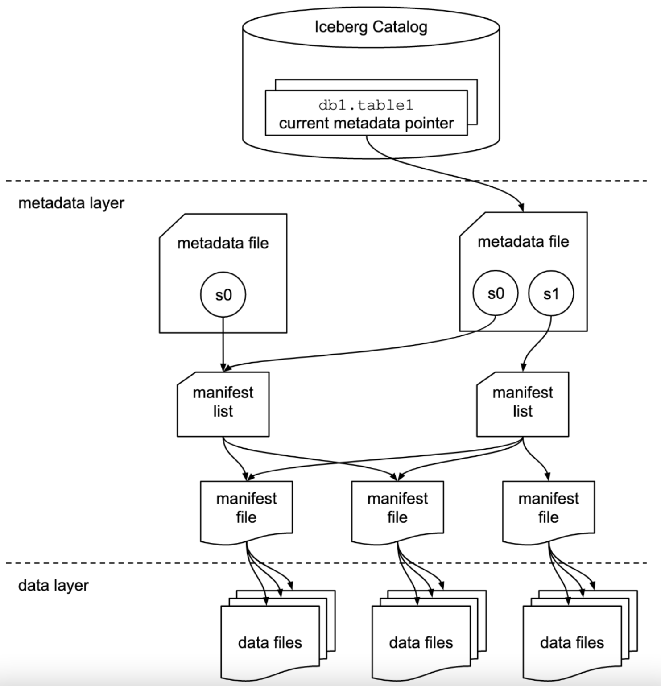

---
# 一、初始化表
## 1.1 create table
```sql
Flink SQL> 
-- create catalog
CREATE CATALOG hadoop_catalog WITH (
  'type'='iceberg',
  'catalog-type'='hadoop',
  'warehouse'='hdfs://nameservice1/kino/warehouse/iceberg/hadoop/',
  'property-version'='1'
);

-- create database
create database iceberg_db;
use iceberg_db;

-- 常规建表
create table testA(
  id bigint,
  name string
);
```

## 1.2 查看 HDFS 文件信息
```bash
[root@jz-desktop-01 ~]# hdfs dfs -ls /kino/warehouse/iceberg/hadoop/iceberg_db/testA
Found 1 items
drwxr-xr-x   - root supergroup          0 2022-05-17 10:49 /kino/warehouse/iceberg/hadoop/iceberg_db/testA/metadata

[root@jz-desktop-01 ~]# hdfs dfs -ls /kino/warehouse/iceberg/hadoop/iceberg_db/testA/metadata
Found 2 items
-rw-r--r--   3 root supergroup       1196 2022-05-17 10:49 /kino/warehouse/iceberg/hadoop/iceberg_db/testA/metadata/v1.metadata.json
-rw-r--r--   3 root supergroup          1 2022-05-17 10:49 /kino/warehouse/iceberg/hadoop/iceberg_db/testA/metadata/version-hint.text
```

## 1.3 查看 v1.metadata.json 
```bash
hdfs dfs -cat /kino/warehouse/iceberg/hadoop/iceberg_db/testA/metadata/v1.metadata.json
{
  "format-version" : 1,
  "table-uuid" : "e95fd904-1358-4604-abb9-02ccdd484ea4",
  "location" : "hdfs://nameservice1/kino/warehouse/iceberg/hadoop/iceberg_db/testA",
  "last-updated-ms" : 1652755770961,
  "last-column-id" : 2,
  "schema" : {
    "type" : "struct",
    "schema-id" : 0,
    "fields" : [ {
      "id" : 1,
      "name" : "id",
      "required" : false,
      "type" : "long"
    }, {
      "id" : 2,
      "name" : "name",
      "required" : false,
      "type" : "string"
    } ]
  },
  "current-schema-id" : 0,
  // 表的 schema 信息
  "schemas" : [ {
    "type" : "struct",
    "schema-id" : 0,
    "fields" : [ {
      "id" : 1,
      "name" : "id",
      "required" : false,
      "type" : "long"
    }, {
      "id" : 2,
      "name" : "name",
      "required" : false,
      "type" : "string"
    } ]
  } ],
  // 表的分区字段
  "partition-spec" : [ ],
  "default-spec-id" : 0,
  "partition-specs" : [ {
    "spec-id" : 0,
    "fields" : [ ]
  } ],
  "last-partition-id" : 999,
  "default-sort-order-id" : 0,
  "sort-orders" : [ {
    "order-id" : 0,
    "fields" : [ ]
  } ],
  "properties" : { },
  "current-snapshot-id" : -1,
  "refs" : { },
  // 表的快照
  "snapshots" : [ ],
  "snapshot-log" : [ ],
  "metadata-log" : [ ]
}

## 记录当前版本号, 对应的是 v$version.metadata.json
hdfs dfs -cat /kino/warehouse/iceberg/hadoop/iceberg_db/testA/metadata/version-hint.text
1
```

# 二、first insert
## 2.1 插入一条数据
```sql
insert into testA values(1001,' 张三');
```
## 2.2 查看 HDFS 文件信息
```bash
[root@jz-desktop-01 ~]# hdfs dfs -ls /kino/warehouse/iceberg/hadoop/iceberg_db/testA/
Found 2 items
drwxr-xr-x   - root supergroup          0 2022-05-17 10:55 /kino/warehouse/iceberg/hadoop/iceberg_db/testA/data
drwxr-xr-x   - root supergroup          0 2022-05-17 10:55 /kino/warehouse/iceberg/hadoop/iceberg_db/testA/metadata
```

## 2.3 查看 HDFS metadata 目录
```bash
[root@jz-desktop-01 ~]# hdfs dfs -ls /kino/warehouse/iceberg/hadoop/iceberg_db/testA/metadata
Found 5 items
-rw-r--r--   3 root supergroup       5808 2022-05-17 10:55 /kino/warehouse/iceberg/hadoop/iceberg_db/testA/metadata/2b2b448b-7f3c-4906-8552-d8ffa0f22478-m0.avro
-rw-r--r--   3 root supergroup       3782 2022-05-17 10:55 /kino/warehouse/iceberg/hadoop/iceberg_db/testA/metadata/snap-5975152508767258906-1-2b2b448b-7f3c-4906-8552-d8ffa0f22478.avro
-rw-r--r--   3 root supergroup       1196 2022-05-17 10:49 /kino/warehouse/iceberg/hadoop/iceberg_db/testA/metadata/v1.metadata.json

// iceberg 表的每次 insert/delete/update 操作, 都会产生一个新的 metadata 文件
-rw-r--r--   3 root supergroup       2336 2022-05-17 10:55 /kino/warehouse/iceberg/hadoop/iceberg_db/testA/metadata/v2.metadata.json
-rw-r--r--   3 root supergroup          1 2022-05-17 10:55 /kino/warehouse/iceberg/hadoop/iceberg_db/testA/metadata/version-hint.text
```

## 2.4 查看 v2.metadata.json
```bash
[root@jz-desktop-01 ~]# hdfs dfs -cat /kino/warehouse/iceberg/hadoop/iceberg_db/testA/metadata/v2.metadata.json
{
  "format-version" : 1,
  "table-uuid" : "e95fd904-1358-4604-abb9-02ccdd484ea4",
  "location" : "hdfs://nameservice1/kino/warehouse/iceberg/hadoop/iceberg_db/testA",
  "last-updated-ms" : 1652756159624,
  "last-column-id" : 2,
  // 表的 schema 信息
  "schema" : {
    "type" : "struct",
    "schema-id" : 0,
    "fields" : [ {
      "id" : 1,
      "name" : "id",
      "required" : false,
      "type" : "long"
    }, {
      "id" : 2,
      "name" : "name",
      "required" : false,
      "type" : "string"
    } ]
  },
  "current-schema-id" : 0,
  "schemas" : [ {
    "type" : "struct",
    "schema-id" : 0,
    "fields" : [ {
      "id" : 1,
      "name" : "id",
      "required" : false,
      "type" : "long"
    }, {
      "id" : 2,
      "name" : "name",
      "required" : false,
      "type" : "string"
    } ]
  } ],
  // 表的分区信息
  "partition-spec" : [ ],
  "default-spec-id" : 0,
  "partition-specs" : [ {
    "spec-id" : 0,
    "fields" : [ ]
  } ],
  "last-partition-id" : 999,
  "default-sort-order-id" : 0,
  "sort-orders" : [ {
    "order-id" : 0,
    "fields" : [ ]
  } ],
  "properties" : { },
  "current-snapshot-id" : 5975152508767258906,
  "refs" : {
    "main" : {
      "snapshot-id" : 5975152508767258906,
      "type" : "branch"
    }
  },
  // snapshot 信息
  "snapshots" : [ {
    "snapshot-id" : 5975152508767258906,  // 一次操作产生一个 snapshot
    "timestamp-ms" : 1652756159624,       // snapshot 产生时间
    "summary" : {                         // snapshot 的统计(摘要)信息
      "operation" : "append",             // 操作是 insert
      "flink.job-id" : "7c3b89ef8a838dac7e32aea4ba5118f9",   // flink webui 任务ID
      "flink.max-committed-checkpoint-id" : "9223372036854775807",
      "added-data-files" : "1",
      "added-records" : "1",
      "added-files-size" : "702",
      "changed-partition-count" : "1",
      "total-records" : "1",
      "total-files-size" : "702",
      "total-data-files" : "1",
      "total-delete-files" : "0",
      "total-position-deletes" : "0",
      "total-equality-deletes" : "0"
    },
    // 此 snapshot 对应的 manifest-list(一个 manifest-list 包含一个或多个 manifest-file, 一个 mainfest-file 可以被多个 manifest-list 引用，iceberg 用此方式做快照，节省了 manifest-file 的冗余引用)
    "manifest-list" : "hdfs://nameservice1/kino/warehouse/iceberg/hadoop/iceberg_db/testA/metadata/snap-5975152508767258906-1-2b2b448b-7f3c-4906-8552-d8ffa0f22478.avro",
    "schema-id" : 0
  } ],
  "snapshot-log" : [ {
    "timestamp-ms" : 1652756159624,
    "snapshot-id" : 5975152508767258906
  } ],
  "metadata-log" : [ {
    "timestamp-ms" : 1652755770961,
    // 此 snapshot 对应的元数据信息
    "metadata-file" :   "hdfs://nameservice1/kino/warehouse/iceberg/hadoop/iceberg_db/testA/metadata/v1.metadata.json"
  } ]
}
```

## 2.5 查看 manifest-list 
```bash
# 下载 avro 工具
# 官方下载页面
https://dlcdn.apache.org/avro/avro-1.11.0/java/
# 下载 1.11.0 版本工具
wget https://dlcdn.apache.org/avro/avro-1.11.0/java/avro-tools-1.11.0.jar

# 下载 avro 文件
hdfs dfs -get hdfs://nameservice1/kino/warehouse/iceberg/hadoop/iceberg_db/testA/metadata/snap-5975152508767258906-1-2b2b448b-7f3c-4906-8552-d8ffa0f22478.avro

java -jar avro-tools-1.11.0.jar  tojson --pretty snap-5975152508767258906-1-2b2b448b-7f3c-4906-8552-d8ffa0f22478.avro
{
  // 这个 manifest-list 下的 manifest-file
  "manifest_path" : "hdfs://nameservice1/kino/warehouse/iceberg/hadoop/iceberg_db/testA/metadata/2b2b448b-7f3c-4906-8552-d8ffa0f22478-m0.avro",
  "manifest_length" : 5808,
  "partition_spec_id" : 0,
  "added_snapshot_id" : {
    "long" : 5975152508767258906
  },
  "added_data_files_count" : {  // 新增的 file
    "int" : 1
  },
  "existing_data_files_count" : {
    "int" : 0
  },
  "deleted_data_files_count" : {
    "int" : 0
  },
  "partitions" : {
    "array" : [ ]
  },
  "added_rows_count" : {  // 新增的行数
    "long" : 1
  },
  "existing_rows_count" : {
    "long" : 0
  },
  "deleted_rows_count" : {
    "long" : 0
  }
}
```

## 2.7 查看 manifest-file
```bash
hdfs dfs -get hdfs://nameservice1/kino/warehouse/iceberg/hadoop/iceberg_db/testA/metadata/2b2b448b-7f3c-4906-8552-d8ffa0f22478-m0.avro

java -jar avro-tools-1.11.0.jar  tojson --pretty 2b2b448b-7f3c-4906-8552-d8ffa0f22478-m0.avro
{
  "status" : 1,
  "snapshot_id" : {
    "long" : 5975152508767258906
  },
  "data_file" : {
    // manifest-file 包含真实的 data(parquet) 文件
    "file_path" : "hdfs://nameservice1/kino/warehouse/iceberg/hadoop/iceberg_db/testA/data/00000-0-24063ce2-8e96-438b-9e77-c42806d1389c-00001.parquet",
    "file_format" : "PARQUET",
    "partition" : { },
    "record_count" : 1,
    "file_size_in_bytes" : 702,
    "block_size_in_bytes" : 67108864,
    "column_sizes" : {
      "array" : [ {
        "key" : 1,
        "value" : 53
      }, {
        "key" : 2,
        "value" : 59
      } ]
    },
    "value_counts" : {
      "array" : [ {
        "key" : 1,
        "value" : 1
      }, {
        "key" : 2,
        "value" : 1
      } ]
    },
    "null_value_counts" : {
      "array" : [ {
        "key" : 1,
        "value" : 0
      }, {
        "key" : 2,
        "value" : 0
      } ]
    },
    "nan_value_counts" : {
      "array" : [ ]
    },
    "lower_bounds" : {
      "array" : [ {
        "key" : 1,
        "value" : "é\u0003\u0000\u0000\u0000\u0000\u0000\u0000"
      }, {
        "key" : 2,
        "value" : " 张三"
      } ]
    },
    "upper_bounds" : {
      "array" : [ {
        "key" : 1,
        "value" : "é\u0003\u0000\u0000\u0000\u0000\u0000\u0000"
      }, {
        "key" : 2,
        "value" : " 张三"
      } ]
    },
    "key_metadata" : null,
    "split_offsets" : {
      "array" : [ 4 ]
    },
    "sort_order_id" : {
      "int" : 0
    }
  }
}
```

## 2.8 在 spark 中加载这个 parquet
```java
scala> spark.read.parquet("hdfs://nameservice1/kino/warehouse/iceberg/hadoop/iceberg_db/testA/data/00000-0-24063ce2-8e96-438b-9e77-c42806d1389c-00001.parquet").show
22/05/17 11:27:06 WARN NativeCodeLoader: Unable to load native-hadoop library for your platform... using builtin-java classes where applicable
+----+-----+
|  id| name|
+----+-----+
|1001| 张三|
+----+-----+
```

## 2.9 查看 version-hint.txt
```bash
hdfs dfs -cat /kino/warehouse/iceberg/hadoop/iceberg_db/testA/metadata/version-hint.text
2
```

# 三、第二次 insert
## 3.1 插入两条数据
```sql
insert into testA values(1002, '李四'),(1003, '王五');
```

## 3.2 查看 HDFS 文件
```bash
[root@jz-desktop-01 iceberg]# hdfs dfs -ls /kino/warehouse/iceberg/hadoop/iceberg_db/testA/metadata
Found 8 items
-rw-r--r--   3 root supergroup       5808 2022-05-17 10:55 /kino/warehouse/iceberg/hadoop/iceberg_db/testA/metadata/2b2b448b-7f3c-4906-8552-d8ffa0f22478-m0.avro
-rw-r--r--   3 root supergroup       5820 2022-05-17 11:49 /kino/warehouse/iceberg/hadoop/iceberg_db/testA/metadata/7516ba25-57dd-493c-889f-44b92d55f4fc-m0.avro
-rw-r--r--   3 root supergroup       3782 2022-05-17 10:55 /kino/warehouse/iceberg/hadoop/iceberg_db/testA/metadata/snap-5975152508767258906-1-2b2b448b-7f3c-4906-8552-d8ffa0f22478.avro
-rw-r--r--   3 root supergroup       3855 2022-05-17 11:49 /kino/warehouse/iceberg/hadoop/iceberg_db/testA/metadata/snap-8240004834922072738-1-7516ba25-57dd-493c-889f-44b92d55f4fc.avro
-rw-r--r--   3 root supergroup       1196 2022-05-17 10:49 /kino/warehouse/iceberg/hadoop/iceberg_db/testA/metadata/v1.metadata.json
-rw-r--r--   3 root supergroup       2336 2022-05-17 10:55 /kino/warehouse/iceberg/hadoop/iceberg_db/testA/metadata/v2.metadata.json
-rw-r--r--   3 root supergroup       3421 2022-05-17 11:49 /kino/warehouse/iceberg/hadoop/iceberg_db/testA/metadata/v3.metadata.json
-rw-r--r--   3 root supergroup          1 2022-05-17 11:49 /kino/warehouse/iceberg/hadoop/iceberg_db/testA/metadata/version-hint.text
```
本次 insert 多出来的文件:
- `v3.metadata.json`: 每次操作都会产生的 snaohost 文件
- `snap-8240004834922072738-1-7516ba25-57dd-493c-889f-44b92d55f4fc.avro`: manifest-list 文件
- `7516ba25-57dd-493c-889f-44b92d55f4fc-m0.avro`: manifest-file 文件

## 3.3 查看 v3.metadata.json
```bash
hdfs dfs -cat /kino/warehouse/iceberg/hadoop/iceberg_db/testA/metadata/v3.metadata.json
{
  "format-version" : 1,
  "table-uuid" : "e95fd904-1358-4604-abb9-02ccdd484ea4",
  "location" : "hdfs://nameservice1/kino/warehouse/iceberg/hadoop/iceberg_db/testA",
  "last-updated-ms" : 1652759389222,
  "last-column-id" : 2,
  // 表的 schema 信息
  "schema" : {
    "type" : "struct",
    "schema-id" : 0,
    "fields" : [ {
      "id" : 1,
      "name" : "id",
      "required" : false,
      "type" : "long"
    }, {
      "id" : 2,
      "name" : "name",
      "required" : false,
      "type" : "string"
    } ]
  },
  "current-schema-id" : 0,
  "schemas" : [ {
    "type" : "struct",
    "schema-id" : 0,
    "fields" : [ {
      "id" : 1,
      "name" : "id",
      "required" : false,
      "type" : "long"
    }, {
      "id" : 2,
      "name" : "name",
      "required" : false,
      "type" : "string"
    } ]
  } ],
  "partition-spec" : [ ],
  "default-spec-id" : 0,
  "partition-specs" : [ {
    "spec-id" : 0,
    "fields" : [ ]
  } ],
  "last-partition-id" : 999,
  "default-sort-order-id" : 0,
  "sort-orders" : [ {
    "order-id" : 0,
    "fields" : [ ]
  } ],
  "properties" : { },
  "current-snapshot-id" : 8240004834922072738,
  "refs" : {
    "main" : {
      "snapshot-id" : 8240004834922072738,
      "type" : "branch"
    }
  },
  // 快照(这里包含了两个 快照, 第一个快照: 第一次 insert 一条的; 第二个快照: 第二次 insert 两条的)
  //    可以在 sparksql 中查询快照信息: select * from hadoop_prod.iceberg_db.testA.history;
  //        made_current_at	snapshot_id	parent_id	is_current_ancestor
  //        2022-05-17 10:55:59.624	5975152508767258906	NULL	true   //此快照只包含一条数据
  //        2022-05-17 11:49:49.222	8240004834922072738	5975152508767258906	true // 此快照有三条(自身两条,父快照一条)数据
  //        Time taken: 0.078 seconds, Fetched 2 row(s)
  // 
  //        通过 spark 查询一个快照的数据
  //        spark.read.option("snapshot-id","5975152508767258906").format("iceberg").load("/kino/warehouse/iceberg/hadoop/iceberg_db/testA").show
  //        +----+-----+
  //        |  id| name|
  //        +----+-----+
  //        |1001| 张三|
  //        +----+-----+
  "snapshots" : [ {
    "snapshot-id" : 5975152508767258906,
    "timestamp-ms" : 1652756159624,
    "summary" : {
      "operation" : "append",
      "flink.job-id" : "7c3b89ef8a838dac7e32aea4ba5118f9",
      "flink.max-committed-checkpoint-id" : "9223372036854775807",
      "added-data-files" : "1",
      "added-records" : "1",
      "added-files-size" : "702",
      "changed-partition-count" : "1",
      "total-records" : "1",
      "total-files-size" : "702",
      "total-data-files" : "1",
      "total-delete-files" : "0",
      "total-position-deletes" : "0",
      "total-equality-deletes" : "0"
    },
    "manifest-list" : "hdfs://nameservice1/kino/warehouse/iceberg/hadoop/iceberg_db/testA/metadata/snap-5975152508767258906-1-2b2b448b-7f3c-4906-8552-d8ffa0f22478.avro",
    "schema-id" : 0
  }, {
    "snapshot-id" : 8240004834922072738,
    "parent-snapshot-id" : 5975152508767258906,
    "timestamp-ms" : 1652759389222,
    "summary" : {
      "operation" : "append",
      "flink.job-id" : "c6fbbfea7f87ac9dc6a54b2787959f69",
      "flink.max-committed-checkpoint-id" : "9223372036854775807",
      "added-data-files" : "1",
      "added-records" : "2",
      "added-files-size" : "692",
      "changed-partition-count" : "1",
      "total-records" : "3",
      "total-files-size" : "1394",
      "total-data-files" : "2",
      "total-delete-files" : "0",
      "total-position-deletes" : "0",
      "total-equality-deletes" : "0"
    },
    "manifest-list" : "hdfs://nameservice1/kino/warehouse/iceberg/hadoop/iceberg_db/testA/metadata/snap-8240004834922072738-1-7516ba25-57dd-493c-889f-44b92d55f4fc.avro",
    "schema-id" : 0
  } ],
  "snapshot-log" : [ {
    "timestamp-ms" : 1652756159624,
    "snapshot-id" : 5975152508767258906
  }, {
    "timestamp-ms" : 1652759389222,
    "snapshot-id" : 8240004834922072738
  } ],
  "metadata-log" : [ {
    "timestamp-ms" : 1652755770961,
    "metadata-file" : "hdfs://nameservice1/kino/warehouse/iceberg/hadoop/iceberg_db/testA/metadata/v1.metadata.json"
  }, {
    "timestamp-ms" : 1652756159624,
    "metadata-file" : "hdfs://nameservice1/kino/warehouse/iceberg/hadoop/iceberg_db/testA/metadata/v2.metadata.json"
  } ]
}
```

## 3.4 查看 第二个 snapshot 的 manifest-list
```bash
hdfs dfs -get hdfs://nameservice1/kino/warehouse/iceberg/hadoop/iceberg_db/testA/metadata/snap-8240004834922072738-1-7516ba25-57dd-493c-889f-44b92d55f4fc.avro

java -jar avro-tools-1.11.0.jar tojson --pretty snap-8240004834922072738-1-7516ba25-57dd-493c-889f-44b92d55f4fc.avro
{
  "manifest_path" : "hdfs://nameservice1/kino/warehouse/iceberg/hadoop/iceberg_db/testA/metadata/7516ba25-57dd-493c-889f-44b92d55f4fc-m0.avro",
  "manifest_length" : 5820,
  "partition_spec_id" : 0,
  "added_snapshot_id" : {
    "long" : 8240004834922072738
  },
  "added_data_files_count" : {
    "int" : 1
  },
  "existing_data_files_count" : {
    "int" : 0
  },
  "deleted_data_files_count" : {
    "int" : 0
  },
  "partitions" : {
    "array" : [ ]
  },
  "added_rows_count" : {
    "long" : 2
  },
  "existing_rows_count" : {
    "long" : 0
  },
  "deleted_rows_count" : {
    "long" : 0
  }
}
{
  "manifest_path" : "hdfs://nameservice1/kino/warehouse/iceberg/hadoop/iceberg_db/testA/metadata/2b2b448b-7f3c-4906-8552-d8ffa0f22478-m0.avro",
  "manifest_length" : 5808,
  "partition_spec_id" : 0,
  "added_snapshot_id" : {
    "long" : 5975152508767258906
  },
  "added_data_files_count" : {
    "int" : 1
  },
  "existing_data_files_count" : {
    "int" : 0
  },
  "deleted_data_files_count" : {
    "int" : 0
  },
  "partitions" : {
    "array" : [ ]
  },
  "added_rows_count" : {
    "long" : 1
  },
  "existing_rows_count" : {
    "long" : 0
  },
  "deleted_rows_count" : {
    "long" : 0
  }
}
```

可以看到，这个 manifest-list 中包含了引用了两个 manifest-file，所以此 snapshot 就包含了 3 条数据(第一次 insert 一条的 & 第二次 insert 两条的)

manifest-list 和 manifest-file 这样的设计，使得 iceberg 的每次 insert、update、delete 产生的(每次 操作都会产生新的 snapshot) metadata file 可以重复引用具体的 file 文件，如果没有 manifest-list，每个 snapshot 就会产生很多冗余引用 


## 3.5 查看 第二个 snapshot 的 manifest-file
```bash
[root@jz-desktop-01 iceberg]# hdfs dfs -get /kino/warehouse/iceberg/hadoop/iceberg_db/testA/metadata/7516ba25-57dd-493c-889f-44b92d55f4fc-m0.avro
[root@jz-desktop-01 iceberg]# java -jar avro-tools-1.11.0.jar tojson --pretty 7516ba25-57dd-493c-889f-44b92d55f4fc-m0.avro
22/05/17 12:46:12 WARN util.NativeCodeLoader: Unable to load native-hadoop library for your platform... using builtin-java classes where applicable
{
  "status" : 1,
  "snapshot_id" : {
    "long" : 8240004834922072738
  },
  "data_file" : {
    // 对应的 data 
    // 用 spark 读取, 可以看到，第二个 snapshot 对应的 manifest-file 是只有两条数据的
    //       scala>         spark.read.parquet("hdfs://nameservice1/kino/warehouse/iceberg/hadoop/iceberg_db/testA/data/00000-0-516ea787-ee46-4bec-9f93-161eb0dc30b4-00001.parquet").show
    //      +----+----+
    //      |  id|name|
    //      +----+----+
    //      |1002|李四|
    //      |1003|王五|
    //      +----+----+
    "file_path" : "hdfs://nameservice1/kino/warehouse/iceberg/hadoop/iceberg_db/testA/data/00000-0-516ea787-ee46-4bec-9f93-161eb0dc30b4-00001.parquet",
    "file_format" : "PARQUET",
    "partition" : { },
    "record_count" : 2,
    "file_size_in_bytes" : 692,
    "block_size_in_bytes" : 67108864,
    "column_sizes" : {
      "array" : [ {
        "key" : 1,
        "value" : 56
      }, {
        "key" : 2,
        "value" : 66
      } ]
    },
    "value_counts" : {
      "array" : [ {
        "key" : 1,
        "value" : 2
      }, {
        "key" : 2,
        "value" : 2
      } ]
    },
    "null_value_counts" : {
      "array" : [ {
        "key" : 1,
        "value" : 0
      }, {
        "key" : 2,
        "value" : 0
      } ]
    },
    "nan_value_counts" : {
      "array" : [ ]
    },
    "lower_bounds" : {
      "array" : [ {
        "key" : 1,
        "value" : "ê\u0003\u0000\u0000\u0000\u0000\u0000\u0000"
      }, {
        "key" : 2,
        "value" : "李四"
      } ]
    },
    "upper_bounds" : {
      "array" : [ {
        "key" : 1,
        "value" : "ë\u0003\u0000\u0000\u0000\u0000\u0000\u0000"
      }, {
        "key" : 2,
        "value" : "王五"
      } ]
    },
    "key_metadata" : null,
    "split_offsets" : {
      "array" : [ 4 ]
    },
    "sort_order_id" : {
      "int" : 0
    }
  }
}
```

## 3.6 查看 version-hint.txt
```bash
[root@jz-desktop-01 iceberg]# hdfs dfs -cat /kino/warehouse/iceberg/hadoop/iceberg_db/testA/metadata/version-hint.text
3
```

# 四、第三次 insert
## 4.1 插入 3 条
```sql
insert into testA values(1004, 'CC'),(1005, 'BB'),(1006, 'AA');
```

## 4.2 查看 HDFS 文件
```bash
[root@jz-desktop-01 iceberg]# hdfs dfs -ls /kino/warehouse/iceberg/hadoop/iceberg_db/testA/metadata
Found 11 items
-rw-r--r--   3 root supergroup       5808 2022-05-17 10:55 /kino/warehouse/iceberg/hadoop/iceberg_db/testA/metadata/2b2b448b-7f3c-4906-8552-d8ffa0f22478-m0.avro
-rw-r--r--   3 root supergroup       5820 2022-05-17 11:49 /kino/warehouse/iceberg/hadoop/iceberg_db/testA/metadata/7516ba25-57dd-493c-889f-44b92d55f4fc-m0.avro
-rw-r--r--   3 root supergroup       5808 2022-05-17 12:50 /kino/warehouse/iceberg/hadoop/iceberg_db/testA/metadata/98cfdc64-2a72-4944-bf31-a493a4e78680-m0.avro
-rw-r--r--   3 root supergroup       3904 2022-05-17 12:50 /kino/warehouse/iceberg/hadoop/iceberg_db/testA/metadata/snap-3048447316468867114-1-98cfdc64-2a72-4944-bf31-a493a4e78680.avro
-rw-r--r--   3 root supergroup       3782 2022-05-17 10:55 /kino/warehouse/iceberg/hadoop/iceberg_db/testA/metadata/snap-5975152508767258906-1-2b2b448b-7f3c-4906-8552-d8ffa0f22478.avro
-rw-r--r--   3 root supergroup       3855 2022-05-17 11:49 /kino/warehouse/iceberg/hadoop/iceberg_db/testA/metadata/snap-8240004834922072738-1-7516ba25-57dd-493c-889f-44b92d55f4fc.avro
-rw-r--r--   3 root supergroup       1196 2022-05-17 10:49 /kino/warehouse/iceberg/hadoop/iceberg_db/testA/metadata/v1.metadata.json
-rw-r--r--   3 root supergroup       2336 2022-05-17 10:55 /kino/warehouse/iceberg/hadoop/iceberg_db/testA/metadata/v2.metadata.json
-rw-r--r--   3 root supergroup       3421 2022-05-17 11:49 /kino/warehouse/iceberg/hadoop/iceberg_db/testA/metadata/v3.metadata.json
-rw-r--r--   3 root supergroup       4506 2022-05-17 12:50 /kino/warehouse/iceberg/hadoop/iceberg_db/testA/metadata/v4.metadata.json
-rw-r--r--   3 root supergroup          1 2022-05-17 12:50 /kino/warehouse/iceberg/hadoop/iceberg_db/testA/metadata/version-hint.text
```

相比上一次，多出来的文件：
- `v4.metadata.json`：新增的 snapshot
- `snap-3048447316468867114-1-98cfdc64-2a72-4944-bf31-a493a4e78680.avro`：manifest-list
- `98cfdc64-2a72-4944-bf31-a493a4e78680-m0.avro`：manifest-file

## 4.3 查看 v4.metadata.json
```bash
{
  "format-version" : 1,
  "table-uuid" : "e95fd904-1358-4604-abb9-02ccdd484ea4",
  "location" : "hdfs://nameservice1/kino/warehouse/iceberg/hadoop/iceberg_db/testA",
  "last-updated-ms" : 1652763012107,
  "last-column-id" : 2,
  // schema 信息
  "schema" : {
    "type" : "struct",
    "schema-id" : 0,
    "fields" : [ {
      "id" : 1,
      "name" : "id",
      "required" : false,
      "type" : "long"
    }, {
      "id" : 2,
      "name" : "name",
      "required" : false,
      "type" : "string"
    } ]
  },
  "current-schema-id" : 0,
  "schemas" : [ {
    "type" : "struct",
    "schema-id" : 0,
    "fields" : [ {
      "id" : 1,
      "name" : "id",
      "required" : false,
      "type" : "long"
    }, {
      "id" : 2,
      "name" : "name",
      "required" : false,
      "type" : "string"
    } ]
  } ],
  // 分区信息
  "partition-spec" : [ ],
  "default-spec-id" : 0,
  "partition-specs" : [ {
    "spec-id" : 0,
    "fields" : [ ]
  } ],
  "last-partition-id" : 999,
  "default-sort-order-id" : 0,
  "sort-orders" : [ {
    "order-id" : 0,
    "fields" : [ ]
  } ],
  "properties" : { },
  "current-snapshot-id" : 3048447316468867114,  // 最新的一个 snapshot id
  "refs" : {
    "main" : {
      "snapshot-id" : 3048447316468867114,
      "type" : "branch"
    }
  },
  // 快照(包含了第一次、第二次、第三次的操作)
  "snapshots" : [ {
    "snapshot-id" : 5975152508767258906,  // 第一个 snapshot 
    "timestamp-ms" : 1652756159624,
    "summary" : {
      "operation" : "append",
      "flink.job-id" : "7c3b89ef8a838dac7e32aea4ba5118f9",
      "flink.max-committed-checkpoint-id" : "9223372036854775807",
      "added-data-files" : "1",
      "added-records" : "1",
      "added-files-size" : "702",
      "changed-partition-count" : "1",
      "total-records" : "1",
      "total-files-size" : "702",
      "total-data-files" : "1",
      "total-delete-files" : "0",
      "total-position-deletes" : "0",
      "total-equality-deletes" : "0"
    },
    // 第一个 snapshot 对应的 manifest-list 
    "manifest-list" : "hdfs://nameservice1/kino/warehouse/iceberg/hadoop/iceberg_db/testA/metadata/snap-5975152508767258906-1-2b2b448b-7f3c-4906-8552-d8ffa0f22478.avro",
    "schema-id" : 0
  }, {
    "snapshot-id" : 8240004834922072738,   // 第二个 snapshot 
    "parent-snapshot-id" : 5975152508767258906,
    "timestamp-ms" : 1652759389222,
    "summary" : {
      "operation" : "append",
      "flink.job-id" : "c6fbbfea7f87ac9dc6a54b2787959f69",
      "flink.max-committed-checkpoint-id" : "9223372036854775807",
      "added-data-files" : "1",
      "added-records" : "2",
      "added-files-size" : "692",
      "changed-partition-count" : "1",
      "total-records" : "3",
      "total-files-size" : "1394",
      "total-data-files" : "2",
      "total-delete-files" : "0",
      "total-position-deletes" : "0",
      "total-equality-deletes" : "0"
    },
    // 第二个 snapshot 包含的 manifest-list
    "manifest-list" : "hdfs://nameservice1/kino/warehouse/iceberg/hadoop/iceberg_db/testA/metadata/snap-8240004834922072738-1-7516ba25-57dd-493c-889f-44b92d55f4fc.avro",
    "schema-id" : 0
  }, {
    "snapshot-id" : 3048447316468867114, // 第三个 snapshot 
    "parent-snapshot-id" : 8240004834922072738,
    "timestamp-ms" : 1652763012107,
    "summary" : {
      "operation" : "append",
      "flink.job-id" : "8f892c609ba9e21c980f1dc11fae89ef",
      "flink.max-committed-checkpoint-id" : "9223372036854775807",
      "added-data-files" : "1",
      "added-records" : "3",
      "added-files-size" : "672",
      "changed-partition-count" : "1",
      "total-records" : "6",
      "total-files-size" : "2066",
      "total-data-files" : "3",
      "total-delete-files" : "0",
      "total-position-deletes" : "0",
      "total-equality-deletes" : "0"
    },
    // 第三个 snapshot 包含的 manifest-list
    "manifest-list" : "hdfs://nameservice1/kino/warehouse/iceberg/hadoop/iceberg_db/testA/metadata/snap-3048447316468867114-1-98cfdc64-2a72-4944-bf31-a493a4e78680.avro",
    "schema-id" : 0
  } ],
  // 快照信息
  "snapshot-log" : [ {
    "timestamp-ms" : 1652756159624,
    "snapshot-id" : 5975152508767258906
  }, {
    "timestamp-ms" : 1652759389222,
    "snapshot-id" : 8240004834922072738
  }, {
    "timestamp-ms" : 1652763012107,
    "snapshot-id" : 3048447316468867114
  } ],
  // 元数据信息
  "metadata-log" : [ {
    "timestamp-ms" : 1652755770961,
    "metadata-file" : "hdfs://nameservice1/kino/warehouse/iceberg/hadoop/iceberg_db/testA/metadata/v1.metadata.json"
  }, {
    "timestamp-ms" : 1652756159624,
    "metadata-file" : "hdfs://nameservice1/kino/warehouse/iceberg/hadoop/iceberg_db/testA/metadata/v2.metadata.json"
  }, {
    "timestamp-ms" : 1652759389222,
    "metadata-file" : "hdfs://nameservice1/kino/warehouse/iceberg/hadoop/iceberg_db/testA/metadata/v3.metadata.json"
  } ]
}
```

## 4.4 查看第三个 snapshot 的 manifest-list
```bash
[root@jz-desktop-01 iceberg]# hdfs dfs -get hdfs://nameservice1/kino/warehouse/iceberg/hadoop/iceberg_db/testA/metadata/snap-3048447316468867114-1-98cfdc64-2a72-4944-bf31-a493a4e78680.avro

[root@jz-desktop-01 iceberg]#
[root@jz-desktop-01 iceberg]#
[root@jz-desktop-01 iceberg]# java -jar avro-tools-1.11.0.jar tojson --pretty snap-3048447316468867114-1-98cfdc64-2a72-4944-bf31-a493a4e78680.avro
// manifest-list 包含三个 manifest-file
{
  // 第三次的 
  "manifest_path" : "hdfs://nameservice1/kino/warehouse/iceberg/hadoop/iceberg_db/testA/metadata/98cfdc64-2a72-4944-bf31-a493a4e78680-m0.avro",
  "manifest_length" : 5808,
  "partition_spec_id" : 0,
  "added_snapshot_id" : {
    "long" : 3048447316468867114
  },
  "added_data_files_count" : {
    "int" : 1
  },
  "existing_data_files_count" : {
    "int" : 0
  },
  "deleted_data_files_count" : {
    "int" : 0
  },
  "partitions" : {
    "array" : [ ]
  },
  "added_rows_count" : {
    "long" : 3
  },
  "existing_rows_count" : {
    "long" : 0
  },
  "deleted_rows_count" : {
    "long" : 0
  }
}
{
  // 第二次的
  "manifest_path" : "hdfs://nameservice1/kino/warehouse/iceberg/hadoop/iceberg_db/testA/metadata/7516ba25-57dd-493c-889f-44b92d55f4fc-m0.avro",
  "manifest_length" : 5820,
  "partition_spec_id" : 0,
  "added_snapshot_id" : {
    "long" : 8240004834922072738
  },
  "added_data_files_count" : {
    "int" : 1
  },
  "existing_data_files_count" : {
    "int" : 0
  },
  "deleted_data_files_count" : {
    "int" : 0
  },
  "partitions" : {
    "array" : [ ]
  },
  "added_rows_count" : {
    "long" : 2
  },
  "existing_rows_count" : {
    "long" : 0
  },
  "deleted_rows_count" : {
    "long" : 0
  }
}
{
  // 第一次的
  "manifest_path" : "hdfs://nameservice1/kino/warehouse/iceberg/hadoop/iceberg_db/testA/metadata/2b2b448b-7f3c-4906-8552-d8ffa0f22478-m0.avro",
  "manifest_length" : 5808,
  "partition_spec_id" : 0,
  "added_snapshot_id" : {
    "long" : 5975152508767258906
  },
  "added_data_files_count" : {
    "int" : 1
  },
  "existing_data_files_count" : {
    "int" : 0
  },
  "deleted_data_files_count" : {
    "int" : 0
  },
  "partitions" : {
    "array" : [ ]
  },
  "added_rows_count" : {
    "long" : 1
  },
  "existing_rows_count" : {
    "long" : 0
  },
  "deleted_rows_count" : {
    "long" : 0
  }
}
```

## 4.5 查看第三次的 manifest-file
```bash
[root@jz-desktop-01 iceberg]# hdfs dfs -get hdfs://nameservice1/kino/warehouse/iceberg/hadoop/iceberg_db/testA/metadata/98cfdc64-2a72-4944-bf31-a493a4e78680-m0.avro

[root@jz-desktop-01 iceberg]#
[root@jz-desktop-01 iceberg]#
[root@jz-desktop-01 iceberg]# java -jar avro-tools-1.11.0.jar tojson --pretty 98cfdc64-2a72-4944-bf31-a493a4e78680-m0.avro
{
  "status" : 1,
  "snapshot_id" : {
    "long" : 3048447316468867114
  },
  "data_file" : {
    // 对应的 data
    // 用 spark 读取, 可以看到，第三个 snapshot 对应的 manifest-file 是只有三条数据的
    //       scala> spark.read.parquet("hdfs://nameservice1/kino/warehouse/iceberg/hadoop/iceberg_db/testA/data/00000-0-baca14c7-7f66-4c38-9e55-e80f05fd286b-00001.parquet").show
    //       +----+----+
    //       |  id|name|
    //       +----+----+
    //       |1004|  CC|
    //       |1005|  BB|
    //       |1006|  AA|
    //       +----+----+
    "file_path" : "hdfs://nameservice1/kino/warehouse/iceberg/hadoop/iceberg_db/testA/data/00000-0-baca14c7-7f66-4c38-9e55-e80f05fd286b-00001.parquet",
    "file_format" : "PARQUET",
    "partition" : { },
    "record_count" : 3,
    "file_size_in_bytes" : 672,
    "block_size_in_bytes" : 67108864,
    "column_sizes" : {
      "array" : [ {
        "key" : 1,
        "value" : 59
      }, {
        "key" : 2,
        "value" : 61
      } ]
    },
    "value_counts" : {
      "array" : [ {
        "key" : 1,
        "value" : 3
      }, {
        "key" : 2,
        "value" : 3
      } ]
    },
    "null_value_counts" : {
      "array" : [ {
        "key" : 1,
        "value" : 0
      }, {
        "key" : 2,
        "value" : 0
      } ]
    },
    "nan_value_counts" : {
      "array" : [ ]
    },
    "lower_bounds" : {
      "array" : [ {
        "key" : 1,
        "value" : "ì\u0003\u0000\u0000\u0000\u0000\u0000\u0000"
      }, {
        "key" : 2,
        "value" : "AA"
      } ]
    },
    "upper_bounds" : {
      "array" : [ {
        "key" : 1,
        "value" : "î\u0003\u0000\u0000\u0000\u0000\u0000\u0000"
      }, {
        "key" : 2,
        "value" : "CC"
      } ]
    },
    "key_metadata" : null,
    "split_offsets" : {
      "array" : [ 4 ]
    },
    "sort_order_id" : {
      "int" : 0
    }
  }
}
```

# 五、update
在 flinksql 中执行，报错

```sql
Flink SQL> update iceberg_db.testA set name = 'tmp' where id = 1001;
[ERROR] Could not execute SQL statement. Reason:
org.apache.flink.table.api.TableException: Unsupported query: update iceberg_db.testA set name = 'tmp' where id = 1001
```

在 spark 中执行

```sql
spark-sql> update hadoop_prod.iceberg_db.testA set name = 'tmp' where id = 1001;
22/05/17 13:07:35 ERROR SparkSQLDriver: Failed in [update hadoop_prod.iceberg_db.testA set name = 'tmp' where id = 1001]
java.lang.UnsupportedOperationException: UPDATE TABLE is not supported temporarily.
	at org.apache.spark.sql.errors.QueryExecutionErrors$.ddlUnsupportedTemporarilyError(QueryExecutionErrors.scala:744)
```

# 六、delete
在 flinksql 中执行

```bash
Flink SQL> delete from testA where id = 1001;
[ERROR] Could not execute SQL statement. Reason:
org.apache.flink.table.api.TableException: Unsupported query: delete from testA where id = 1001
```

在 sparksql 中执行

```sql
spark-sql> delete from hadoop_prod.iceberg_db.testA where id = 1001;
Response code
Time taken: 0.473 seconds
```

查看 HDFS 文件

```bash
[root@jz-desktop-01 iceberg]# hdfs dfs -ls /kino/warehouse/iceberg/hadoop/iceberg_db/testA/metadata
Found 14 items
-rw-r--r--   3 root supergroup       5808 2022-05-17 10:55 /kino/warehouse/iceberg/hadoop/iceberg_db/testA/metadata/2b2b448b-7f3c-4906-8552-d8ffa0f22478-m0.avro
-rw-r--r--   3 root supergroup       5820 2022-05-17 11:49 /kino/warehouse/iceberg/hadoop/iceberg_db/testA/metadata/7516ba25-57dd-493c-889f-44b92d55f4fc-m0.avro
-rw-r--r--   3 root supergroup       5808 2022-05-17 12:50 /kino/warehouse/iceberg/hadoop/iceberg_db/testA/metadata/98cfdc64-2a72-4944-bf31-a493a4e78680-m0.avro
-rw-r--r--   3 root supergroup       5808 2022-05-17 13:09 /kino/warehouse/iceberg/hadoop/iceberg_db/testA/metadata/c02a6578-f98e-4b44-b150-eba7031295c0-m0.avro
-rw-r--r--   3 root supergroup       3904 2022-05-17 12:50 /kino/warehouse/iceberg/hadoop/iceberg_db/testA/metadata/snap-3048447316468867114-1-98cfdc64-2a72-4944-bf31-a493a4e78680.avro
-rw-r--r--   3 root supergroup       3782 2022-05-17 10:55 /kino/warehouse/iceberg/hadoop/iceberg_db/testA/metadata/snap-5975152508767258906-1-2b2b448b-7f3c-4906-8552-d8ffa0f22478.avro
-rw-r--r--   3 root supergroup       3906 2022-05-17 13:09 /kino/warehouse/iceberg/hadoop/iceberg_db/testA/metadata/snap-7752151405581972398-1-c02a6578-f98e-4b44-b150-eba7031295c0.avro
-rw-r--r--   3 root supergroup       3855 2022-05-17 11:49 /kino/warehouse/iceberg/hadoop/iceberg_db/testA/metadata/snap-8240004834922072738-1-7516ba25-57dd-493c-889f-44b92d55f4fc.avro
-rw-r--r--   3 root supergroup       1196 2022-05-17 10:49 /kino/warehouse/iceberg/hadoop/iceberg_db/testA/metadata/v1.metadata.json
-rw-r--r--   3 root supergroup       2336 2022-05-17 10:55 /kino/warehouse/iceberg/hadoop/iceberg_db/testA/metadata/v2.metadata.json
-rw-r--r--   3 root supergroup       3421 2022-05-17 11:49 /kino/warehouse/iceberg/hadoop/iceberg_db/testA/metadata/v3.metadata.json
-rw-r--r--   3 root supergroup       4506 2022-05-17 12:50 /kino/warehouse/iceberg/hadoop/iceberg_db/testA/metadata/v4.metadata.json
-rw-r--r--   3 root supergroup       5411 2022-05-17 13:09 /kino/warehouse/iceberg/hadoop/iceberg_db/testA/metadata/v5.metadata.json
-rw-r--r--   3 root supergroup          1 2022-05-17 13:09 /kino/warehouse/iceberg/hadoop/iceberg_db/testA/metadata/version-hint.text
```

相比上次，多出来的文件

- `v5.metadata.json`: 新增的 snapshot
- `snap-7752151405581972398-1-c02a6578-f98e-4b44-b150-eba7031295c0.avro`：manifest-list
- ` c02a6578-f98e-4b44-b150-eba7031295c0-m0.avro`: manifest-file

## 6.1 查看 v5.metadata.json
```bash
[root@jz-desktop-01 iceberg]# hdfs dfs -cat /kino/warehouse/iceberg/hadoop/iceberg_db/testA/metadata/v5.metadata.json
{
  "format-version" : 1,
  "table-uuid" : "e95fd904-1358-4604-abb9-02ccdd484ea4",
  "location" : "hdfs://nameservice1/kino/warehouse/iceberg/hadoop/iceberg_db/testA",
  "last-updated-ms" : 1652764142755,
  "last-column-id" : 2,
  "schema" : {
    "type" : "struct",
    "schema-id" : 0,
    "fields" : [ {
      "id" : 1,
      "name" : "id",
      "required" : false,
      "type" : "long"
    }, {
      "id" : 2,
      "name" : "name",
      "required" : false,
      "type" : "string"
    } ]
  },
  "current-schema-id" : 0,
  "schemas" : [ {
    "type" : "struct",
    "schema-id" : 0,
    "fields" : [ {
      "id" : 1,
      "name" : "id",
      "required" : false,
      "type" : "long"
    }, {
      "id" : 2,
      "name" : "name",
      "required" : false,
      "type" : "string"
    } ]
  } ],
  "partition-spec" : [ ],
  "default-spec-id" : 0,
  "partition-specs" : [ {
    "spec-id" : 0,
    "fields" : [ ]
  } ],
  "last-partition-id" : 999,
  "default-sort-order-id" : 0,
  "sort-orders" : [ {
    "order-id" : 0,
    "fields" : [ ]
  } ],
  "properties" : { },
  "current-snapshot-id" : 7752151405581972398,
  "snapshots" : [ {
    "snapshot-id" : 5975152508767258906,
    "timestamp-ms" : 1652756159624,
    "summary" : {
      "operation" : "append",
      "flink.job-id" : "7c3b89ef8a838dac7e32aea4ba5118f9",
      "flink.max-committed-checkpoint-id" : "9223372036854775807",
      "added-data-files" : "1",
      "added-records" : "1",
      "added-files-size" : "702",
      "changed-partition-count" : "1",
      "total-records" : "1",
      "total-files-size" : "702",
      "total-data-files" : "1",
      "total-delete-files" : "0",
      "total-position-deletes" : "0",
      "total-equality-deletes" : "0"
    },
    "manifest-list" : "hdfs://nameservice1/kino/warehouse/iceberg/hadoop/iceberg_db/testA/metadata/snap-5975152508767258906-1-2b2b448b-7f3c-4906-8552-d8ffa0f22478.avro",
    "schema-id" : 0
  }, {
    "snapshot-id" : 8240004834922072738,
    "parent-snapshot-id" : 5975152508767258906,
    "timestamp-ms" : 1652759389222,
    "summary" : {
      "operation" : "append",
      "flink.job-id" : "c6fbbfea7f87ac9dc6a54b2787959f69",
      "flink.max-committed-checkpoint-id" : "9223372036854775807",
      "added-data-files" : "1",
      "added-records" : "2",
      "added-files-size" : "692",
      "changed-partition-count" : "1",
      "total-records" : "3",
      "total-files-size" : "1394",
      "total-data-files" : "2",
      "total-delete-files" : "0",
      "total-position-deletes" : "0",
      "total-equality-deletes" : "0"
    },
    "manifest-list" : "hdfs://nameservice1/kino/warehouse/iceberg/hadoop/iceberg_db/testA/metadata/snap-8240004834922072738-1-7516ba25-57dd-493c-889f-44b92d55f4fc.avro",
    "schema-id" : 0
  }, {
    "snapshot-id" : 3048447316468867114,
    "parent-snapshot-id" : 8240004834922072738,
    "timestamp-ms" : 1652763012107,
    "summary" : {
      "operation" : "append",
      "flink.job-id" : "8f892c609ba9e21c980f1dc11fae89ef",
      "flink.max-committed-checkpoint-id" : "9223372036854775807",
      "added-data-files" : "1",
      "added-records" : "3",
      "added-files-size" : "672",
      "changed-partition-count" : "1",
      "total-records" : "6",
      "total-files-size" : "2066",
      "total-data-files" : "3",
      "total-delete-files" : "0",
      "total-position-deletes" : "0",
      "total-equality-deletes" : "0"
    },
    "manifest-list" : "hdfs://nameservice1/kino/warehouse/iceberg/hadoop/iceberg_db/testA/metadata/snap-3048447316468867114-1-98cfdc64-2a72-4944-bf31-a493a4e78680.avro",
    "schema-id" : 0
  }, {
    "snapshot-id" : 7752151405581972398, // 最新的一个 snapshot id
    "parent-snapshot-id" : 3048447316468867114,
    "timestamp-ms" : 1652764142755,
    "summary" : {
      "operation" : "delete",
      "spark.app.id" : "local-1652759895862",
      "deleted-data-files" : "1",
      "deleted-records" : "1",
      "removed-files-size" : "702",
      "changed-partition-count" : "1",
      "total-records" : "5",
      "total-files-size" : "1364",
      "total-data-files" : "2",
      "total-delete-files" : "0",
      "total-position-deletes" : "0",
      "total-equality-deletes" : "0"
    },
    // 对应的 manifest-list
    "manifest-list" : "hdfs://nameservice1/kino/warehouse/iceberg/hadoop/iceberg_db/testA/metadata/snap-7752151405581972398-1-c02a6578-f98e-4b44-b150-eba7031295c0.avro",
    "schema-id" : 0
  } ],
  "snapshot-log" : [ {
    "timestamp-ms" : 1652756159624,
    "snapshot-id" : 5975152508767258906
  }, {
    "timestamp-ms" : 1652759389222,
    "snapshot-id" : 8240004834922072738
  }, {
    "timestamp-ms" : 1652763012107,
    "snapshot-id" : 3048447316468867114
  }, {
    "timestamp-ms" : 1652764142755,
    "snapshot-id" : 7752151405581972398
  } ],
  "metadata-log" : [ {
    "timestamp-ms" : 1652755770961,
    "metadata-file" : "hdfs://nameservice1/kino/warehouse/iceberg/hadoop/iceberg_db/testA/metadata/v1.metadata.json"
  }, {
    "timestamp-ms" : 1652756159624,
    "metadata-file" : "hdfs://nameservice1/kino/warehouse/iceberg/hadoop/iceberg_db/testA/metadata/v2.metadata.json"
  }, {
    "timestamp-ms" : 1652759389222,
    "metadata-file" : "hdfs://nameservice1/kino/warehouse/iceberg/hadoop/iceberg_db/testA/metadata/v3.metadata.json"
  }, {
    "timestamp-ms" : 1652763012107,
    "metadata-file" : "hdfs://nameservice1/kino/warehouse/iceberg/hadoop/iceberg_db/testA/metadata/v4.metadata.json"
  } ]
}
```


## 6.2 查看 delete 这次的 manifest-list
```bash
[root@jz-desktop-01 iceberg]# hdfs dfs -get hdfs://nameservice1/kino/warehouse/iceberg/hadoop/iceberg_db/testA/metadata/snap-7752151405581972398-1-c02a6578-f98e-4b44-b150-eba7031295c0.avro

[root@jz-desktop-01 iceberg]#
[root@jz-desktop-01 iceberg]#
[root@jz-desktop-01 iceberg]# java -jar avro-tools-1.11.0.jar tojson --pretty snap-7752151405581972398-1-c02a6578-f98e-4b44-b150-eba7031295c0.avro
// 
{
  // insert 3 条记录的 manifest-file
  "manifest_path" : "hdfs://nameservice1/kino/warehouse/iceberg/hadoop/iceberg_db/testA/metadata/98cfdc64-2a72-4944-bf31-a493a4e78680-m0.avro",
  "manifest_length" : 5808,
  "partition_spec_id" : 0,
  "added_snapshot_id" : {
    "long" : 3048447316468867114
  },
  "added_data_files_count" : {
    "int" : 1
  },
  "existing_data_files_count" : {
    "int" : 0
  },
  "deleted_data_files_count" : {
    "int" : 0
  },
  "partitions" : {
    "array" : [ ]
  },
  "added_rows_count" : {
    "long" : 3
  },
  "existing_rows_count" : {
    "long" : 0
  },
  "deleted_rows_count" : {
    "long" : 0
  }
}
{
  // insert 1 条的 manifest-file
  "manifest_path" : "hdfs://nameservice1/kino/warehouse/iceberg/hadoop/iceberg_db/testA/metadata/7516ba25-57dd-493c-889f-44b92d55f4fc-m0.avro",
  "manifest_length" : 5820,
  "partition_spec_id" : 0,
  "added_snapshot_id" : {
    "long" : 8240004834922072738
  },
  "added_data_files_count" : {
    "int" : 1
  },
  "existing_data_files_count" : {
    "int" : 0
  },
  "deleted_data_files_count" : {
    "int" : 0
  },
  "partitions" : {
    "array" : [ ]
  },
  "added_rows_count" : {
    "long" : 2
  },
  "existing_rows_count" : {
    "long" : 0
  },
  "deleted_rows_count" : {
    "long" : 0
  }
}
{
  // delete 的那个 manifest—file
  "manifest_path" : "hdfs://nameservice1/kino/warehouse/iceberg/hadoop/iceberg_db/testA/metadata/c02a6578-f98e-4b44-b150-eba7031295c0-m0.avro",
  "manifest_length" : 5808,
  "partition_spec_id" : 0,
  "added_snapshot_id" : {
    "long" : 7752151405581972398
  },
  "added_data_files_count" : {
    "int" : 0
  },
  "existing_data_files_count" : {
    "int" : 0
  },
  "deleted_data_files_count" : {
    "int" : 1
  },
  "partitions" : {
    "array" : [ ]
  },
  "added_rows_count" : {
    "long" : 0
  },
  "existing_rows_count" : {
    "long" : 0
  },
  "deleted_rows_count" : {
    "long" : 1
  }
}
```

## 6.3 查看 history 
```sql
spark-sql> select * from hadoop_prod.iceberg_db.testA.history;
made_current_at	snapshot_id	parent_id	is_current_ancestor
2022-05-17 10:55:59.624	5975152508767258906	NULL	true                  // insert 1 条
2022-05-17 11:49:49.222	8240004834922072738	5975152508767258906	true    // insert 2 条
2022-05-17 12:50:12.107	3048447316468867114	8240004834922072738	true    // insert 3 条
2022-05-17 13:09:02.755	7752151405581972398	3048447316468867114	true    // delete 1 条
Time taken: 0.066 seconds, Fetched 4 row(s)
```

## 6.4 查看 snapshot
```bash
spark-sql> select * from hadoop_prod.iceberg_db.testA.snapshots;
committed_at	snapshot_id	parent_id	operation	manifest_list	summary
2022-05-17 10:55:59.624	5975152508767258906	NULL	append	hdfs://nameservice1/kino/warehouse/iceberg/hadoop/iceberg_db/testA/metadata/snap-5975152508767258906-1-2b2b448b-7f3c-4906-8552-d8ffa0f22478.avro	{"added-data-files":"1","added-files-size":"702","added-records":"1","changed-partition-count":"1","flink.job-id":"7c3b89ef8a838dac7e32aea4ba5118f9","flink.max-committed-checkpoint-id":"9223372036854775807","total-data-files":"1","total-delete-files":"0","total-equality-deletes":"0","total-files-size":"702","total-position-deletes":"0","total-records":"1"}
2022-05-17 11:49:49.222	8240004834922072738	5975152508767258906	append	hdfs://nameservice1/kino/warehouse/iceberg/hadoop/iceberg_db/testA/metadata/snap-8240004834922072738-1-7516ba25-57dd-493c-889f-44b92d55f4fc.avro	{"added-data-files":"1","added-files-size":"692","added-records":"2","changed-partition-count":"1","flink.job-id":"c6fbbfea7f87ac9dc6a54b2787959f69","flink.max-committed-checkpoint-id":"9223372036854775807","total-data-files":"2","total-delete-files":"0","total-equality-deletes":"0","total-files-size":"1394","total-position-deletes":"0","total-records":"3"}
2022-05-17 12:50:12.107	3048447316468867114	8240004834922072738	append	hdfs://nameservice1/kino/warehouse/iceberg/hadoop/iceberg_db/testA/metadata/snap-3048447316468867114-1-98cfdc64-2a72-4944-bf31-a493a4e78680.avro	{"added-data-files":"1","added-files-size":"672","added-records":"3","changed-partition-count":"1","flink.job-id":"8f892c609ba9e21c980f1dc11fae89ef","flink.max-committed-checkpoint-id":"9223372036854775807","total-data-files":"3","total-delete-files":"0","total-equality-deletes":"0","total-files-size":"2066","total-position-deletes":"0","total-records":"6"}
2022-05-17 13:09:02.755	7752151405581972398	3048447316468867114	delete	hdfs://nameservice1/kino/warehouse/iceberg/hadoop/iceberg_db/testA/metadata/snap-7752151405581972398-1-c02a6578-f98e-4b44-b150-eba7031295c0.avro	{"changed-partition-count":"1","deleted-data-files":"1","deleted-records":"1","removed-files-size":"702","spark.app.id":"local-1652759895862","total-data-files":"2","total-delete-files":"0","total-equality-deletes":"0","total-files-size":"1364","total-position-deletes":"0","total-records":"5"}
Time taken: 0.096 seconds, Fetched 4 row(s)
```

# 总结

- Flinksql 和 Sparksql 都暂时不支持 update 语句。
- 每次 insert、delete，都会产生一个新的 snapshot，这个 snapshot 下记录多个 manifest-file(本次新增，本次修改，上一次 snap新增的manifest-file)

