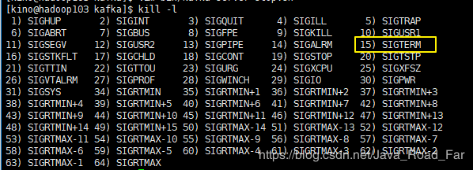

问题描述: 执行 `kafka-server-stop.sh` 命令后， kafka 进程不会被杀死
```bash
[kino@hadoop103 kafka]$ bin/kafka-server-stop.sh 
[kino@hadoop103 kafka]$ jps
12146 Kafka
12783 Jps
```

原因很简单，我们看官方提供的脚本怎么写的
```bash
PIDS=$(ps ax | grep -i 'kafka\.Kafka' | grep java | grep -v grep | awk '{print $1}')
echo -----------------$PIDS
if [ -z "$PIDS" ]; then
  echo "No kafka server to stop"
  exit 1
else
        kill -s TERM $PIDS
fi
```

`kill -s TERM $PIDS` 就是停止 Kafka 进程的命令，为什么有时候不起作用是不是瞬间明白了

**不明白的同学接着看下去**

信号名： `TERM` 对应的 信号编号为 `15`

我们写 kill PID 的时候， 实际上默认使用的是 信号名为`SIGTERM` 这个信号也就是 `15`号信号
这个信号可能会出现三种情况：
1. 程序立刻停止
2. 当程序释放相应资源后再停止
3. 程序可能仍然继续运行

大部分程序接收到SIGTERM信号后，会先释放自己的资源，然后在停止。但是也有程序可以在接受到信号量后，做一些其他的事情，并且这些事情是可以  配置的。如果程序正在等待IO，可能就不会立马做出相应。 也就是说，SIGTERM多半是会被阻塞的、忽略。

---

问题解决： 修改 `kafka-server-stop.sh` 脚本

注释 原本的 PIDS， 增加下面的 一行
```bash
# kill -s TERM $PIDS
kill -s KILL $PIDS
```