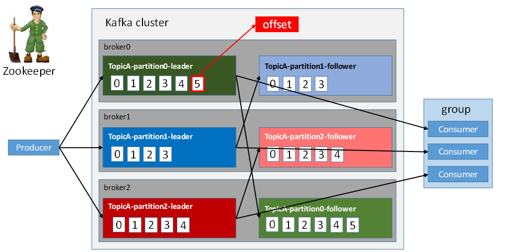
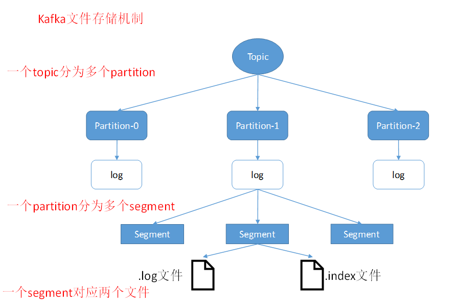
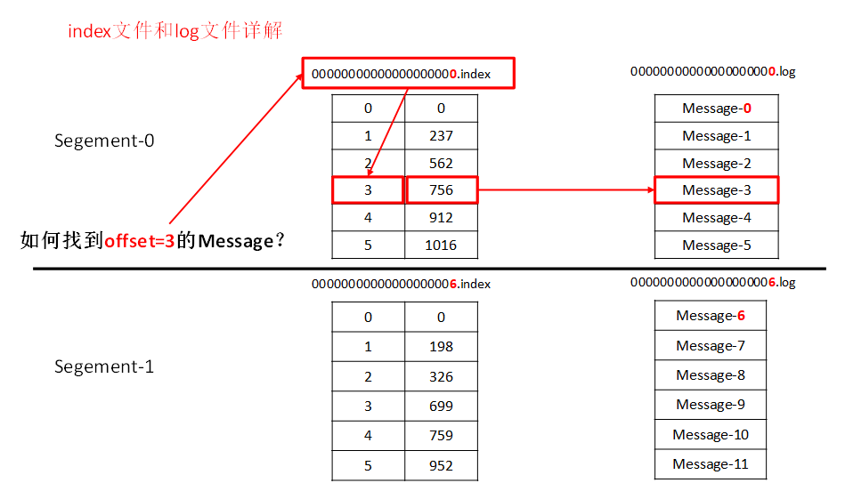
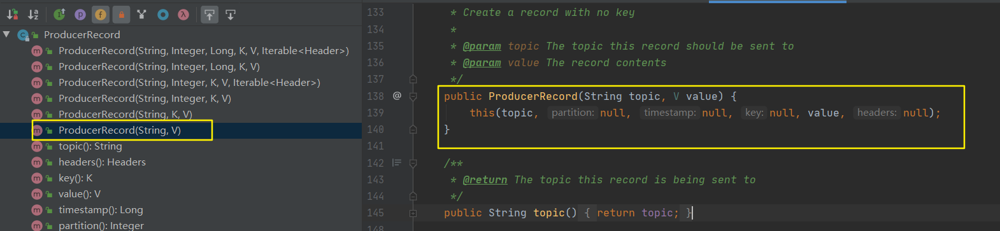
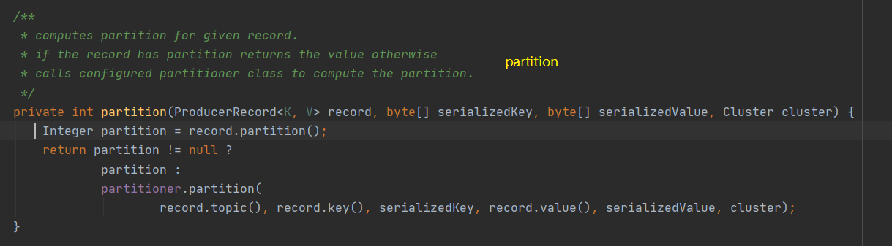
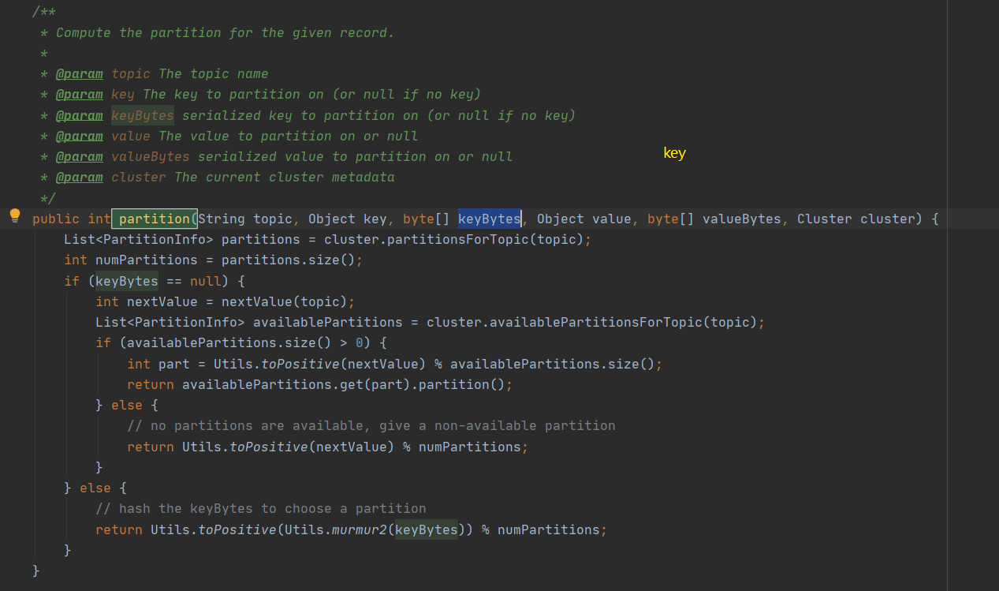
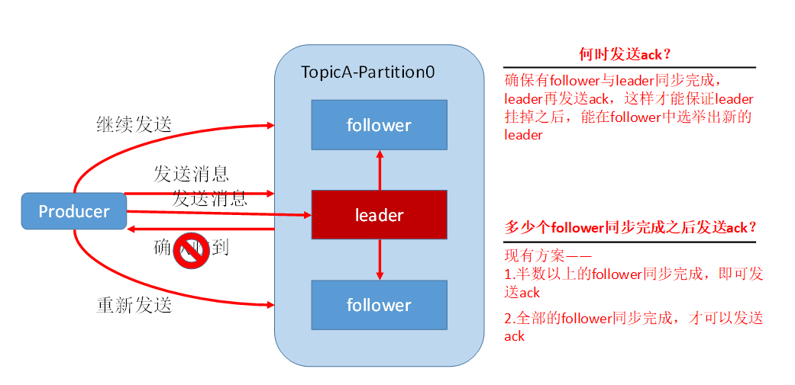
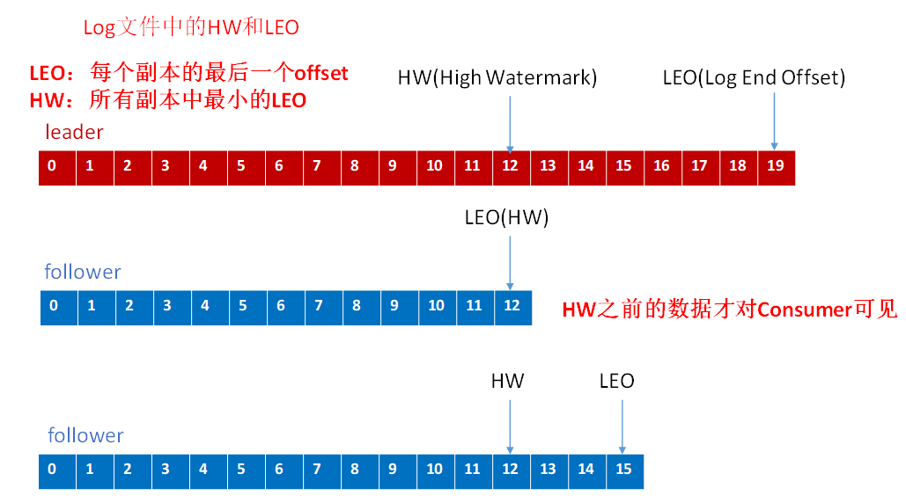

---
# 一、Kafka 是什么?
Kafka 是一个分布式的基于 `发布/订阅` 模式的消息队列, 主要应用于大数据实时处理领域.

和 Kafka 类似的产品还有 RocketMQ、RabbitMQ

# 二、Kafka 基础架构


名词解释: 
- `Producer`: 消息生产者, 就是向kafka broker发消息的客户端
- `Consumer`: 消息消费者, 向kafka broker取消息的客户端
- `Consumer Group(CG)`: 消费者组, 由多个consumer组成。消费者组内每个消费者负责消费不同分区的数据, 一个分区只能由一个消费者消费; 消费者组之间互不影响。所有的消费者都属于某个消费者组, 即消费者组是逻辑上的一个订阅者。
- `Broker`: 一台kafka服务器就是一个broker。一个集群由多个broker组成。一个broker可以容纳多个topic
- `Topic`: 可以理解为一个队列, 生产者和消费者面向的都是一个topic
- `Partition`: 为了实现扩展性, 一个非常大的topic可以分布到多个broker（即服务器）上, 一个topic可以分为多个partition, 每个partition是一个有序的队列
- `Replica`: 副本, 为保证集群中的某个节点发生故障时, 该节点上的partition数据不丢失, 且kafka仍然能够继续工作, kafka提供了副本机制, 一个topic的每个分区都有若干个副本, 一个leader和若干个follower。
- `leader`: 每个分区多个副本的“主”, 生产者发送数据的对象, 以及消费者消费数据的对象都是leader。
- `follower`: 每个分区多个副本中的“从”, 实时从leader中同步数据, 保持和leader数据的同步。leader发生故障时, 某个follower会成为新的follower。


# 三、Kafka 工作流程和文件存储机制
在 kafka 中, 消息是以 Topic 进行分类的, 每一类的 Topic 都有对应的生产者生产消息, 有消费者消费对应 Topic 的消息, 生产和消费都是面向 Topic的

Topic 是逻辑上的概念, 但是 Partition 是物理上的概念, 每个 Partition 对应于一个 log 文件, 该 log 文件中存储的就是 生产者(producer) 生产的消息. 生产者(producer) 生产的消息会被不断**地追加到该 log 文件的末端**, 且每条数据都有自己的 offset, 消费者组中的每个消费者, 都会实时记录自己消费到了哪个 offset, 以便出错恢复时, 从上次的位置继续消费。



由于 生产者生产的消息会不断的追加到 log 文件末尾, 为防止 log 文件过大导致数据定位效率低下, kafka 采取了分片和索引机制, 就是将每个 Partition 分为多个 segment, 每个 segment 对应两个文件: `.index` 和 `.log` 文件, 这些文件位于一个文件夹下, 该文件夹的命名规则为: `topic名称-分区号`, 例如, first 这个 Topic 有三个分区, 则七对应的文件夹为 `first-0`,`first-1`,`first-2`
```bash
00000000000000000000.index
00000000000000000000.log
00000000000000170410.index
00000000000000170410.log
00000000000000239430.index
00000000000000239430.log
```

index 和 log 文件以当前 segment 的第一条消息的 offset 命名, 如下图 index 和 log 文件结构示意图


`.index` 文件存储大量的索引信息, `.log` 文件存储大量的数据, 索引文件中的元数据指向对应数据文件中 message 的物理偏移地址

# 四、Kafka 生产者
## 4.1 分区策略
### 4.1.1 为什么要分区
在上面 <Kafka架构图> 中, 可以看到 TopicA有三个分区, 分别是 `partition0, partition1, partition2`
 
在 Kafka 生产消费消息的时候, 我们肯定是希望能够将数据均匀的分配到所有服务器上, 为的就是多个分区能够提供负载均衡的能力, 不同的分区能够被放置到不同的服务器上, 数据的读写操作也都是针对分区这个粒度而进行的, 这样每个节点的机器都能独立的执行各自分区的读写请求, 并且, 我们还可以通过添加新的加点机器来增加整体系统的吞吐量.

### 4.1.2 分区的策略
所谓分区策略是决定生产者将消息发送到哪个分区算法, Kafka 提供了默认的分区策略, 同时也支持自定义分区策略

#### Kafka 提供的默认分区策略
有兴趣的同学可以使用 idea 创建一个maven工程, 一起看看发送消息的源码

在 pom 文件中增加如下内容:
```xml
<dependencies>
    <dependency>
        <groupId>org.apache.kafka</groupId>
        <artifactId>kafka-clients</artifactId>
        <version>0.11.0.0</version>
    </dependency>
</dependencies>
```
创建一个Java类, 内容如下:
```java
package com.kino.kafka;

import org.apache.kafka.clients.producer.*;

import java.util.Properties;
import java.util.concurrent.ExecutionException;

public class CustomProducer {

    public static void main(String[] args) throws ExecutionException, InterruptedException {
        Properties props = new Properties();
        props.put("bootstrap.servers", "hadoop102:9092");//kafka集群，broker-list
        props.put("acks", "all");
        props.put("retries", 1);//重试次数
        props.put("batch.size", 16384);//批次大小
        props.put("linger.ms", 1);//等待时间
        props.put("buffer.memory", 33554432);//RecordAccumulator缓冲区大小
        props.put("key.serializer", "org.apache.kafka.common.serialization.StringSerializer");
        props.put("value.serializer", "org.apache.kafka.common.serialization.StringSerializer");

        Producer<String, String> producer = new KafkaProducer<>(props);
        for (int i = 0; i < 100; i++) {
            producer.send(new ProducerRecord<String, String>("first", Integer.toString(i), Integer.toString(i)));
        }
        producer.close();
    }
}
```
进入 `new ProducerRecord` 方法内部
```java
/**
 * Create a record to be sent to Kafka
 * 
 * @param topic The topic the record will be appended to
 * @param key The key that will be included in the record
 * @param value The record contents
 */
public ProducerRecord(String topic, K key, V value) {
    this(topic, null, null, key, value, null);
}
```
可以看到我们往Kafka 发送消息调用的 `send` 方法, 里面的 `new ProducerRecord` 是一个重载方法, 实际上会调用:
```java
/**
 * Creates a record with a specified timestamp to be sent to a specified topic and partition
 * 
 * @param topic The topic the record will be appended to
 * @param partition The partition to which the record should be sent
 * @param timestamp The timestamp of the record
 * @param key The key that will be included in the record
 * @param value The record contents
 * @param headers the headers that will be included in the record
 */
public ProducerRecord(String topic, Integer partition, Long timestamp, K key, V value, Iterable<Header> headers) {
    if (topic == null)
        throw new IllegalArgumentException("Topic cannot be null.");
    if (timestamp != null && timestamp < 0)
        throw new IllegalArgumentException(
                String.format("Invalid timestamp: %d. Timestamp should always be non-negative or null.", timestamp));
    if (partition != null && partition < 0)
        throw new IllegalArgumentException(
                String.format("Invalid partition: %d. Partition number should always be non-negative or null.", partition));
    this.topic = topic;
    this.partition = partition;
    this.key = key;
    this.value = value;
    this.timestamp = timestamp;
    this.headers = new RecordHeaders(headers);
}
```
该方法为 最终被调用的方法, 其有 6 个参数:
- `topic`: 发送到这个主题中
- `partition`: 发送到这个分区中
- `timestamp`: 发送的记录的时间戳
- `key`: 对应的秘钥
- `value`: 发送过去的记录
- `headers`: 一条消息的头部信息

在看看这个方法的所有重载方法有哪些, 最少传入哪几个值(发送一条消息必须传入的参数)


可以看见, 这里仅需要一个 topic 名称和 value 即可向 Kafka 发送一条消息

这里 Kafka 的分区分配策略如下:
1. 必须指明 Topic 和 value, 否则报错
2. 如果指明了 partition 的情况下, 直接将知名的值作为 partition 值(看下面名为 `partition` 的图片);
3. 如果没有指明 partition, 但是指定了 Key, 则将 Key 的 hash 值与 Topic 的 partition 取余得到 partition 值(看下面名为 `partition` 的图片);
4. 如果没有指明 partition, 也没有指定 Key, 则第一次调用的时候随机生成一个整数, 将这个值与 Topic 可用的 partition 总数取余得到 partition 值, 也就是 round-robin 算法(看下面名为 `key` 的图片);

该源码在: org.apache.kafka.clients.producer.KafkaProducer


该源码在: org.apache.kafka.clients.producer.internals.DefaultPartitioner



#### 自定义分区策略
1. 编写一个类, 实现 `org.apache.kafka.clients.producer.Partitioner` 接口, 实现 `partition()` 和 `close()` 方法
```java
package com.kino.kafka;

import org.apache.kafka.clients.producer.Partitioner;
import org.apache.kafka.common.Cluster;
import org.apache.kafka.common.utils.Utils;

import java.util.Map;
import java.util.concurrent.atomic.AtomicInteger;

public class MyPartitions implements Partitioner {

    // 线程安全的具有原子性的能返回 int类型 的对象
    private AtomicInteger counter = new AtomicInteger(0);

    /**
     * TODO 自定义分区策略
     * 
     * return 返回自定义分区号
     */
    @Override
    public int partition(String topic, Object key, byte[] keyBytes, Object value, byte[] valueBytes, Cluster cluster) {
        //获取可用分区数
        int numPartitions = cluster.partitionsForTopic(topic).size();
        if (keyBytes == null || keyBytes.length == 0) {
            // 没有 Key 的情况下, 使用 counter 和 可用partition 数量进行取模获取 partition值,
            return counter.addAndGet(1) & Integer.MAX_VALUE % numPartitions;
        } else {
            // 有 Key 的情况下, 根号有 Key 和 可用partition 数量进行取模获取 partition值,
            return Utils.toPositive(Utils.murmur2(keyBytes)) % numPartitions;
        }
    }

    @Override
    public void close() {
        // 关闭方法
        System.out.println("close...");
    }

    @Override
    public void configure(Map<String, ?> configs) {
        System.out.println("configure...");
    }
}
```
2. 在 Properties 增加配置如下:
```java
package com.kino.kafka;

import org.apache.kafka.clients.producer.*;

import java.util.Properties;
import java.util.concurrent.ExecutionException;

public class CustomProducer {

    public static void main(String[] args) throws ExecutionException, InterruptedException {
        Properties props = new Properties();
        props.put("bootstrap.servers", "hadoop102:9092");//kafka集群，broker-list
        props.put("acks", "all");
        props.put("retries", 1);//重试次数
        props.put("batch.size", 16384);//批次大小
        props.put("linger.ms", 1);//等待时间
        props.put("buffer.memory", 33554432);//RecordAccumulator缓冲区大小
        props.put("key.serializer", "org.apache.kafka.common.serialization.StringSerializer");
        props.put("value.serializer", "org.apache.kafka.common.serialization.StringSerializer");

        // 增加一行内容, 填自己实现 Partitioner 接口的自定义分区类名
        props.put(ProducerConfig.PARTITIONER_CLASS_CONFIG, MyPartitions.class.getName());

        Producer<String, String> producer = new KafkaProducer<>(props);
        for (int i = 0; i < 100; i++) {
            producer.send(new ProducerRecord<String, String>("first", Integer.toString(i), Integer.toString(i)));
        }
        producer.close();
    }
}
```

## 4.2 数据可靠行保证(数据丢失)
上面说完了 producer 是怎么发送消息到对应的 topic 的, 那么 Kafka 是如何保证这个数据一定会发送到的呢?

为了保证 producer 能可靠的将数据发送到 topic, topic 的每个 partition 收到 producer 发送的数据后, 都需要像 producer 发送 ack(acknowledgement) 来确认收到, 如果 producer 收到 ack, 则进行下一轮的发送, 否则重新发送数据.

因为 partition 由副本实现容错, 保证一个 partition 数据丢失, Kafka 还能正常工作, 所以对于上面那句话严谨的来说应该是: **当 producer 发送消息到 topic 的一个 partition 的 leader, 如果仅需要 leader 收到就满足需要, 即 leader 收到时就可以返回 ack, 但是如果数据比较重要, 则需要当 leader 下的 follower 同步消息完成后, 才可以返回 ack, 这其中又涉及到多个 follower 要每一个都同步还是部分 follower 同步完成即可?**




### 4.2.1 副本数据同步策略
Kafka 给出了两套副本数据同步方案:

| 方案 | 优点 | 缺点 |
|----| ----| ---- |
| 一半的 follower 同步完成发送 ack | 延迟低 | 选举新的 leader时, 容忍 n 台节点故障, 需要 2n+1 个副本
| 全部的 follower 同步完成发送 ack |选举新的 leader时, 容忍 n 台节点故障, 需要 n+1 个副本 | 延迟高

最终 Kafka 选择了第二种方案:
1. 同样为了容忍 n 台节点故障, 第一种方案需要 2n+1 个副本, 而第二种方案只需要 n+1 个副本, Kafka 的每个分区都有大量的数据, 第一种方案会造成大量的数据冗余
2. 虽然第二种方案的网络延迟比较高, 但是网络延迟对 Kafka 的影响比较小, 且一般 Kafka 都部署在局域网中


### 4.2.2 ISR
上面说到 Kafka 选择了第二种方案

这里我们做一个假设: 
  
当一个 partition 的 leader 收到数据之后, 所有的 follower 开始同步数据, 假如有一个 follower, 因为某种原因发生故障, 一直不能完成 leader 的数据同步工作, 那么 leader 就得一直等待, 直到这个 follower 故障恢复同步完成, 才发送 ack.

这个等待过程可能运维人员发现及时几分钟就恢复了, 也可能运维人员没发现, 那这个过程就得遥遥无期的等待下去了, 很显然这种做法无法接受

Kafka 的 leader 维护了一个动态的 in-sync replica set(ISR), 这个 ISR 的工作是: 当 ISR 中的 follower 完成数据的同步之后, leader 就会给 producer 发送 ack, 如果 follower 长时间没有同步 leader 的数据, 那么这个 follower 就会被踢出 ISR, 该时间的阈值由 `replica.lag.time.max.ms` 参数设定, leader 发生故障后, 就会从 ISR 中选举新的 leader


### 4.2.3 ack 应答机制
对于 Kafka 选择的第二种方案, 需要 ISR 中全部的 follower 同步完 leader 数据后, 才发送 ack, 这样延迟会比较高, 但是对于一些不太重要的数据、对数据的可靠性要求不是很高的、能够容忍数据少量丢失的, 就没有必要等待 ISR 中全部的 follower 全部同步完成

Kafka 一共提供了三种同步的可靠性配置:
- `acks=0`: producer 不等待 broker 的 ack, 延迟最低, broker 一接收到消息没来得及写磁盘, ack 就已经返回,  当 broker 故障时, **会丢数据**
- `acks=1`: producer 等待 broker 的 ack, 但是只等待 partition 的 leader 落盘成功后返回 ack, 如果在 follower 同步 leader 消息成功前, leader 故障, **会丢数据**
- `ack=-1`: producer 等待 broker 的 ack, 此时必须要 partition 的 leader 和 所有 follower 全部落盘成功后, 才会返回 ack, 但是如果在 follower 同步完成后, broker 发送 ack 之前, leader 发生故障, **会数据重复**

### 4.2.4 故障处理细节(HW/LEO)
leader 和 follower 的 offset 图


#### 4.2.4.1 follower 故障
之前说到 ISR 的时候, 在 follower 故障的时候会被踢出 ISR, 等到故障的 follower 恢复后, follower 会读取本地磁盘记录的上次的 HW, 并将 log 文件高于 HW 的部分截取掉, 从 HW 开始向 leader 进行同步, 等这个 follower 的 LEO 大于等于该 partition 的 HW, 即 follower 追上 leader 后, 才可以重新加入 ISR

#### 4.2.4.2 leader 故障
leader 故障后, 会从 ISR 中选举出一个新的 leader, 之后, 为了保证多个副本之间的数据一致性, 其余的 follower 会先将各自的 log 文件高于 HW 的部分截掉, 然后从新的 leader 开始同步数据

## 4.3 Exactly Once 语义
对于一些比较重要的数据, 例如涉及到钱的, 我们就得保证**每条消息被发送且只被发送一次**, 就是说**数据不能多也不能少**

在 0.11 版本之后, Kafka producer 引入了 **幂等性机制(idempotent)**, 配合 **acks=-1** 时的 `at least once` 语义, 就能实现 producer 到 broker 的 Exactly Once 语义

使用时, 只需要将 `enable.idempotence` 属性设置为 true, Kafka 自动将 acks 属性设置为 -1, 并将 retries 属性设置为 `Integer.MAX_VALUE`

# 五、Kafka 消费者
## 5.1 消费者的消费方式
对于 Kafka 这种基于 `发布/订阅` 模式的消息队列, 消费者有两种消费方式可以采用:
1. `pull`: 消费者用 pull(主动拉取) 的方式从 broker 中读取消息
2. `push`: 消费者被动的接收 push的方式, 这种方式会因为不同的消费者消费速度(能力)的不同, 导致数据处理不及时或者网络堵塞.

pull 方式可能会产生一个死循环, 当 topic 中没有数据的时候, 消费者可能会陷入消费循环, 一直返回空数据. 

对于这一种方式, Kafka 在消费者消费数据的时候, 会传入一个时长参数 `timeout`, 如果当前没有数据可以提供消费, consumer 会等待一段时间之后再返回, 这段时长即为 `timeout`

## 5.2 分区分配策略
从 最开始的 Kafka架构图 中可以看到, 一个 consumer group 中有多个 consumer, 一个 topic 有多个 partition, 所以必然会涉及到 partition 分配的问题, 就是说要确定 一个partition由哪个consumer来消费

Kafka 有两个分配策略:
- roundrobin
- range

### 5.2.1 roundrobin


### 5.2.2 range

# 六、Kafka 高效读写


# 七、Zookeeper 在 Kafka 中的作用


# 八、