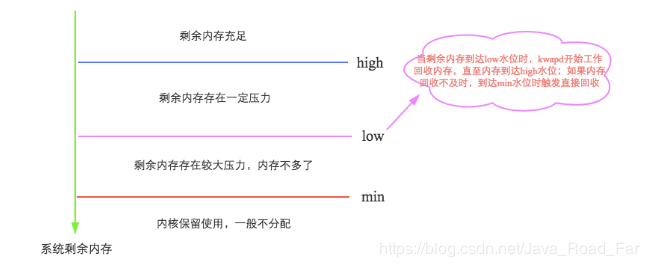
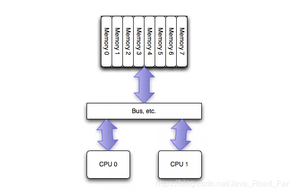
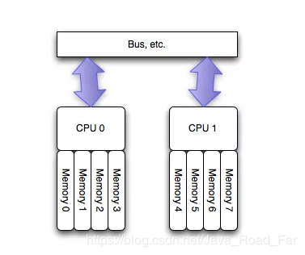

* [一、swap是干嘛的？](#%E4%B8%80swap%E6%98%AF%E5%B9%B2%E5%98%9B%E7%9A%84)
* [二、数据库系统为什么嫌弃swap？](#%E4%BA%8C%E6%95%B0%E6%8D%AE%E5%BA%93%E7%B3%BB%E7%BB%9F%E4%B8%BA%E4%BB%80%E4%B9%88%E5%AB%8C%E5%BC%83swap)
* [三、 swap的工作机制](#%E4%B8%89-swap%E7%9A%84%E5%B7%A5%E4%BD%9C%E6%9C%BA%E5%88%B6)
  * [3\.1 先来看看swap是如何触发的？](#31-%E5%85%88%E6%9D%A5%E7%9C%8B%E7%9C%8Bswap%E6%98%AF%E5%A6%82%E4%BD%95%E8%A7%A6%E5%8F%91%E7%9A%84)

---
本文内容取自于：http://hbasefly.com/2017/05/24/hbase-linux/?gwtaxk=qctky

---
# 一、swap是干嘛的？
&nbsp;&nbsp;&nbsp;&nbsp;&nbsp;&nbsp;在Linux下，SWAP的作用类似Windows系统下的“虚拟内存”。当物理内存不足时，拿出部分硬盘空间当SWAP分区（虚拟成内存）使用，从而解决内存容量不足的情况。

&nbsp;&nbsp;&nbsp;&nbsp;&nbsp;&nbsp;SWAP意思是交换，顾名思义，**当某进程向OS请求内存发现不足时，OS会把内存中暂时不用的数据交换出去，放在SWAP分区中，这个过程称为SWAP OUT。当某进程又需要这些数据且OS发现还有空闲物理内存时，又会把SWAP分区中的数据交换回物理内存中，这个过程称为SWAP IN。**

&nbsp;&nbsp;&nbsp;&nbsp;&nbsp;&nbsp;当然，swap大小是有上限的，一旦swap使用完，操作系统会触发OOM-Killer机制，把消耗内存最多的进程kill掉以释放内存。

---
# 二、数据库系统为什么嫌弃swap？

显然，swap机制的初衷是为了缓解物理内存用尽而选择直接粗暴OOM进程的尴尬。但坦白讲，几乎所有数据库对swap都不怎么待见，无论MySQL、Oracal、MongoDB抑或HBase，为什么？这主要和下面两个方面有关：

>1. 数据库系统一般都对响应延迟比较敏感，如果使用swap代替内存，数据库服务性能必然不可接受。对于响应延迟极其敏感的系统来讲，延迟太大和服务不可用没有任何区别，比服务不可用更严重的是，swap场景下进程就是不死，这就意味着系统一直不可用……再想想如果不使用swap直接oom，是不是一种更好的选择，这样很多高可用系统直接会主从切换掉，用户基本无感知。
>2. 另外对于诸如HBase这类分布式系统来说，其实并不担心某个节点宕掉，而恰恰担心某个节点夯住。一个节点宕掉，最多就是小部分请求短暂不可用，重试即可恢复。但是一个节点夯住会将所有分布式请求都夯住，服务器端线程资源被占用不放，导致整个集群请求阻塞，甚至集群被拖垮。

从这两个角度考虑，所有数据库都不喜欢swap还是很有道理的！

---
# 三、 swap的工作机制
既然数据库们对swap不待见，那是不是就要使用swapoff命令关闭磁盘缓存特性呢？非也，大家可以想想，关闭磁盘缓存意味着什么？实际生产环境没有一个系统会如此激进，要知道这个世界永远不是非0即1的，大家都会或多或少选择走在中间，不过有些偏向0，有些偏向1而已。很显然，在swap这个问题上，数据库必然选择偏向尽量少用。HBase官方文档的几点要求实际上就是落实这个方针：尽可能降低swap影响。知己知彼才能百战不殆，要降低swap影响就必须弄清楚Linux内存回收是怎么工作的，这样才能不遗漏任何可能的疑点。


## 3.1 先来看看swap是如何触发的？
简单来说，Linux会在两种场景下触发内存回收，一种是在内存分配时发现没有足够空闲内存时会立刻触发内存回收；一种是开启了一个守护进程（swapd进程）周期性对系统内存进行检查，在可用内存降低到特定阈值之后主动触发内存回收。第一种场景没什么可说，来重点聊聊第二种场景，如下图所示：

这里就要引出我们关注的第一个参数：vm.min_free_kbytes，代表系统所保留空闲内存的最低限watermark[min]，并且影响watermark[low]和watermark[high]。简单可以认为：
```bash
watermark[min] = min_free_kbytes
watermark[low] = watermark[min] * 5 / 4 = min_free_kbytes * 5 / 4
watermark[high] = watermark[min] * 3 / 2 = min_free_kbytes * 3 / 2
watermark[high] - watermark[low] = watermark[low] - watermark[min] = min_free_kbytes / 4
```
可见，LInux的这几个水位线与参数min_free_kbytes密不可分。min_free_kbytes对于系统的重要性不言而喻，既不能太大，也不能太小。

min_free_kbytes如果太小，［min,low］之间水位的buffer就会很小，在kswapd回收的过程中一旦上层申请内存的速度太快（典型应用：数据库），就会导致空闲内存极易降至watermark[min]以下，此时内核就会进行direct reclaim（直接回收），直接在应用程序的进程上下文中进行回收，再用回收上来的空闲页满足内存申请，因此实际会阻塞应用程序，带来一定的响应延迟。当然，min_free_kbytes也不宜太大，太大一方面会导致应用程序进程内存减少，浪费系统内存资源，另一方面还会导致kswapd进程花费大量时间进行内存回收。再看看这个过程，是不是和Java垃圾回收机制中CMS算法中老生代回收触发机制神似，想想参数-XX:CMSInitiatingOccupancyFraction，是不是？官方文档中要求min_free_kbytes不能小于1G（在大内存系统中设置8G），就是不要轻易触发直接回收。

至此，基本解释了Linux的内存回收触发机制以及我们关注的第一个参数vm.min_free_kbytes。接下来简单看看Linux内存回收都回收些什么。Linux内存回收对象主要分为两种：

1. 文件缓存，这个容易理解，为了避免文件数据每次都要从硬盘读取，系统会将热点数据存储在内存中，提高性能。如果仅仅将文件读出来，内存回收只需要释放这部分内存即可，下次再次读取该文件数据直接从硬盘中读取即可（类似HBase文件缓存）。那如果不仅将文件读出来，而且对这些缓存的文件数据进行了修改（脏数据），回收内存就需要将这部分数据文件写会硬盘再释放（类似MySQL文件缓存）。

2. 匿名内存，这部分内存没有实际载体，不像文件缓存有硬盘文件这样一个载体，比如典型的堆、栈数据等。这部分内存在回收的时候不能直接释放或者写回类似文件的媒介中，这才搞出来swap这个机制，将这类内存换出到硬盘中，需要的时候再加载出来。


具体Linux使用什么算法来确认哪些文件缓存或者匿名内存需要被回收掉，这里并不关心，有兴趣可以参考这里。但是有个问题需要我们思考：既然有两类内存可以被回收，那么在这两类内存都可以被回收的情况下，Linux到底是如何决定到底是回收哪类内存呢？还是两者都会被回收？这里就牵出来了我们第二个关心的参数：swappiness，这个值用来定义内核使用swap的积极程度，值越高，内核就会积极地使用swap，值越低，就会降低对swap的使用积极性。该值取值范围在0～100，默认是60。这个swappiness到底是怎么实现的呢？具体原理很复杂，简单来讲，swappiness通过控制内存回收时，回收的匿名页更多一些还是回收的文件缓存更多一些来达到这个效果。swappiness等于100，表示匿名内存和文件缓存将用同样的优先级进行回收，默认60表示文件缓存会优先被回收掉，至于为什么文件缓存要被优先回收掉，大家不妨想想（回收文件缓存通常情况下不会引起IO操作，对系统性能影响较小）。对于数据库来讲，swap是尽量需要避免的，所以需要将其设置为0。此处需要注意，设置为0并不代表不执行swap哦！


至此，我们从Linux内存回收触发机制、Linux内存回收对象一直聊到swap，将参数min_free_kbytes以及swappiness进行了解释。接下来看看另一个与swap有关系的参数：zone_reclaim_mode，文档说了设置这个参数为0可以关闭NUMA的zone reclaim，这又是怎么回事？提起NUMA，数据库们又都不高兴了，很多DBA都曾经被坑惨过。那这里简单说明三个小问题：NUMA是什么？NUMA和swap有什么关系？zone_reclaim_mode的具体意义？

NUMA（Non-Uniform Memory Access）是相对UMA来说的，两者都是CPU的设计架构，早期CPU设计为UMA结构，如下图(图片来自网络)所示：


为了缓解多核CPU读取同一块内存所遇到的通道瓶颈问题，芯片工程师又设计了NUMA结构，如下图（图片来自网络）所示：



这种架构可以很好解决UMA的问题，即不同CPU有专属内存区，为了实现CPU之间的”内存隔离”，还需要软件层面两点支持：

1. 内存分配需要在请求线程当前所处CPU的专属内存区域进行分配。如果分配到其他CPU专属内存区，势必隔离性会受到一定影响，并且跨越总线的内存访问性能必然会有一定程度降低。

2. 另外，一旦local内存（专属内存）不够用，优先淘汰local内存中的内存页，而不是去查看远程内存区是否会有空闲内存借用。


这样实现，隔离性确实好了，但问题也来了：NUMA这种特性可能会导致CPU内存使用不均衡，部分CPU专属内存不够使用，频繁需要回收，进而可能发生大量swap，系统响应延迟会严重抖动。而与此同时其他部分CPU专属内存可能都很空闲。这就会产生一种怪现象：使用free命令查看当前系统还有部分空闲物理内存，系统却不断发生swap，导致某些应用性能急剧下降。见叶金荣老师的MySQL案例分析： [《找到MySQL服务器发生SWAP罪魁祸首》](https://weibo.com/1680980510/EmvG57wVL?type=comment)。


所以，对于小内存应用来讲，NUMA所带来的这种问题并不突出，相反，local内存所带来的性能提升相当可观。但是对于数据库这类内存大户来说，NUMA默认策略所带来的稳定性隐患是不可接受的。因此数据库们都强烈要求对NUMA的默认策略进行改进，有两个方面可以进行改进：

1. 将内存分配策略由默认的亲和模式改为interleave模式，即会将内存page打散分配到不同的CPU zone中。通过这种方式解决内存可能分布不均的问题，一定程度上缓解上述案例中的诡异问题。对于MongoDB来说，在启动的时候就会提示使用interleave内存分配策略：

	```
	WARNING: You are running on a NUMA machine.
	We suggest launching mongod like this to avoid performance problems:
	numactl –interleave=all mongod [other options]
	```

2. 改进内存回收策略：此处终于请出今天的第三个主角参数zone_reclaim_mode，这个参数定义了NUMA架构下不同的内存回收策略，可以取值0/1/3/4，其中0表示在local内存不够用的情况下可以去其他的内存区域分配内存；1表示在local内存不够用的情况下本地先回收再分配；3表示本地回收尽可能先回收文件缓存对象；4表示本地回收优先使用swap回收匿名内存。可见，HBase推荐配置zone_reclaim_mode＝0一定程度上降低了swap发生的概率。


