# 基本介绍

所有的 Linux 系统都会内建 vi 文本编辑器.

Vim 具有程序编辑的能力, 可以看做是 Vi 的增强版本, 可以主动的以字体颜色辨别语法的正确性, 方便程序的设计.

代码补全、编译及错误跳转等方便编程的功能特别丰富, 被广泛使用.

# vi和vim常用的种模式

## 正常模式:

以 vim 打开一个文件就直接进入一般模式了(这是默认的模式)。在这个模式中， 你可以使用『上下左右』键来移动光标，你可以使用『删除字符』或『删除整行』来处理档案内容， 也可以使用『复制、贴上』来处理你的文件数据。在正常模式下可以使用快捷键

## 插入模式(编辑模式):

i（insert, I, o, O, a, A, r, R等任何一个字母之后才会进入编辑模式, 一般来说按i即可.

## 命令行模式

在这个模式当中， 可以提供你相关指令，完成读取、存盘、替换、离开 vim 、显示行号等的动作则是在此模式中达成的！

# vi和vim基本使用
使用  vim 开发一个 Hello.java 程序, 保存.步骤说明和演示:

回车
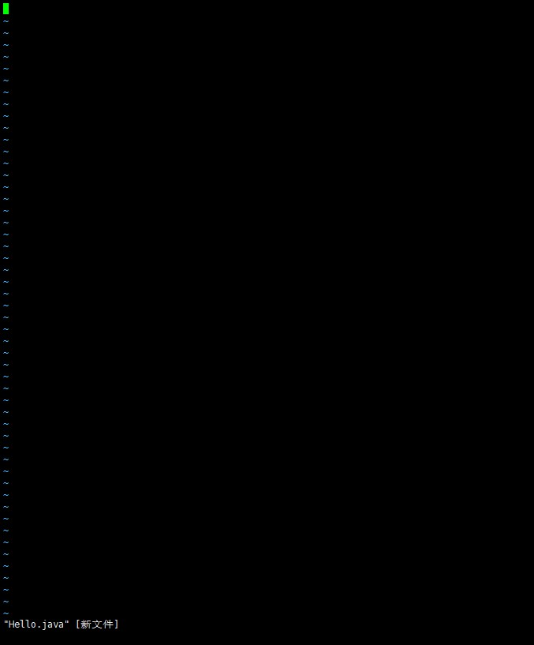

按 "i" 进入 编辑模式
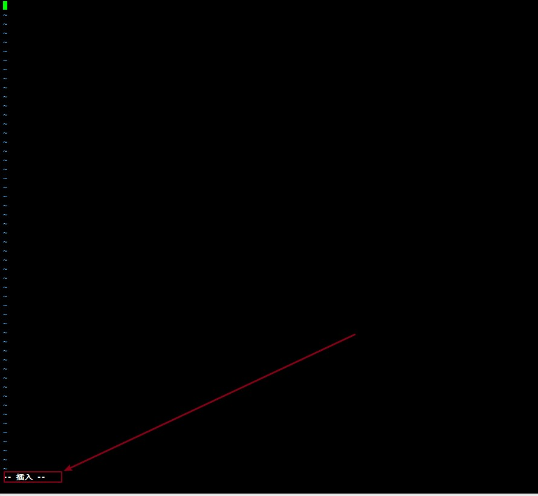

编写代码
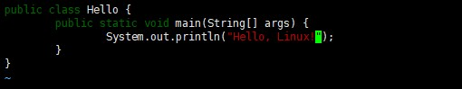

按 "esc" 进入命令模式(是 esc键， 不是输入 ESC 字母)， 从键盘输入 : wq(表示: 写入和保存)，
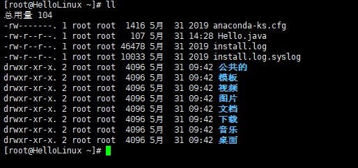

打开 Hello.java： vim Hello.java
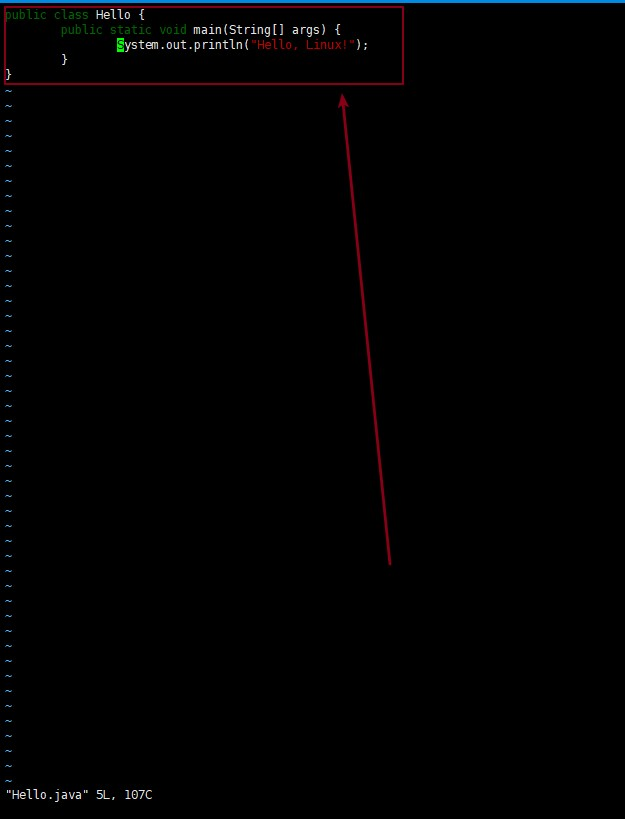

里面已经有了上一次写入的内容;

# vi和vim模式的相互切换
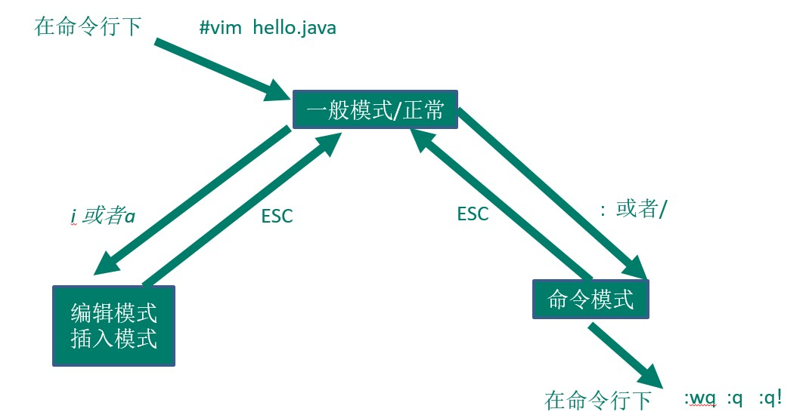

vi和vim快捷键
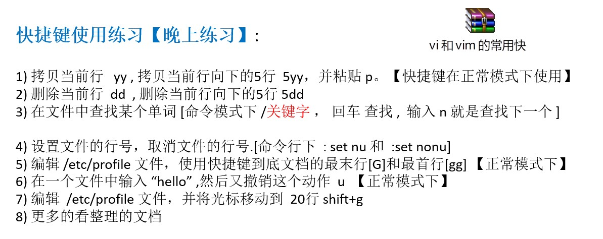
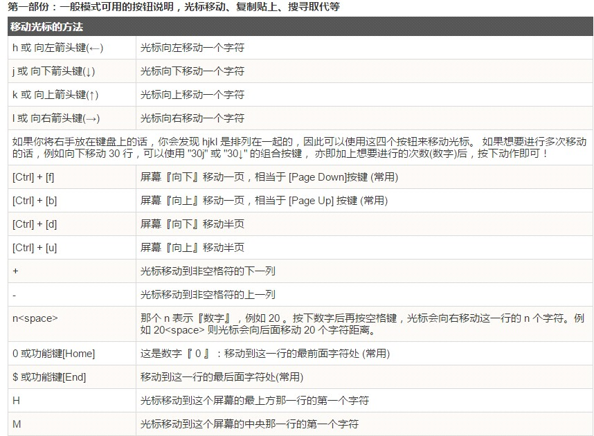
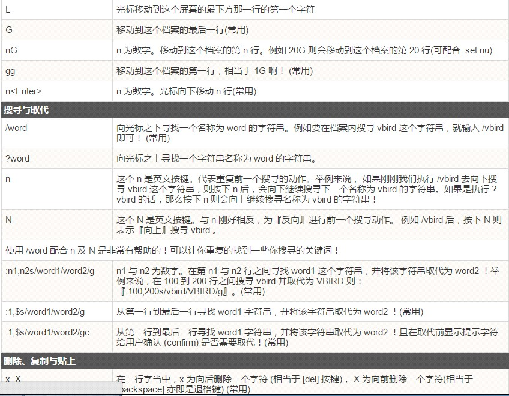
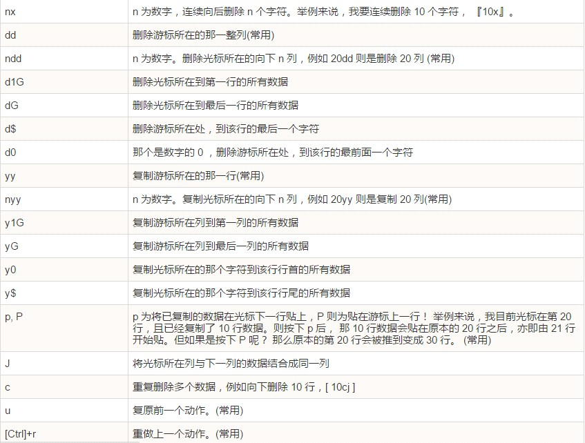
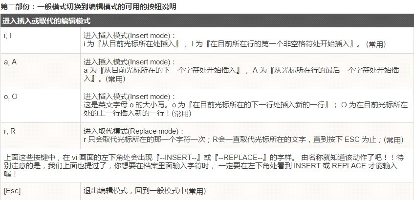
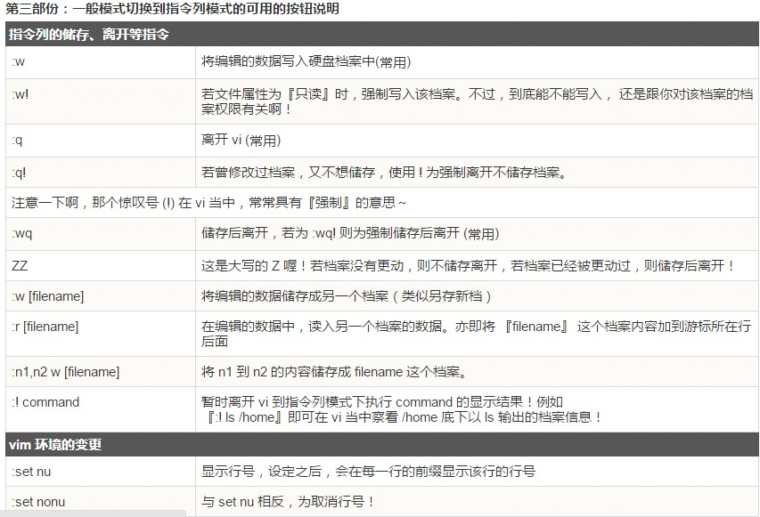
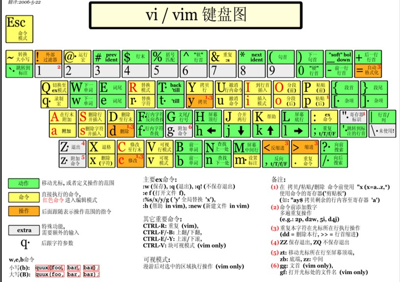
