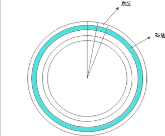
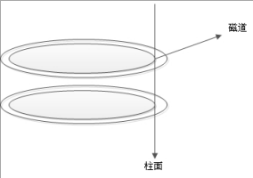
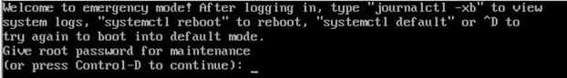
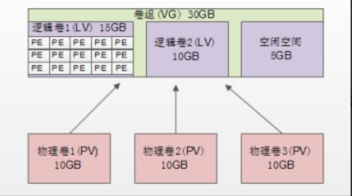

# 硬盘结构



硬盘的大小是使用 `磁头数×柱面数×扇区数×每个扇区的大小` 这样的公式来计算的。其中磁头数（Heads）表示硬盘总共有几个磁头，也可以理解成为硬盘有几个盘面，然后乘以二；柱面数（Cylinders）表示硬盘每一面盘片有几条磁道；扇区数（Sectors）表示每条磁道上有几个扇区；每个扇区的大小一般是 512Byte。

硬盘接口:
- `IDE 硬盘接口`（Integrated Drive Electronics，并口，即电子集成驱动器）也称作“ATA 硬盘”或“PATA 硬盘”，是早期机械硬盘的主要接口，ATA133 硬盘的理论速度可以达到 133MB/s（此速度为理论平均值）
- `SATA 接口`（Serial ATA，串口）是速度更高的硬盘标准，具备了更高的传输速度，并具备了更强的纠错能力。目前已经是 SATA 三代，理论传输速度达到 600MB/s（此速度为理论平均值）
- `SCSI 接口`（Small Computer System Interface，小型计算机系统接口）广泛应用在服务器上，具有应用范围广、多任务、带宽大、CPU 占用率低及支持热插拔等优点，理论传输速度达到320MB/s

# 文件系统
## 特性
- `super block（超级块）`：记录整个文件系统的信息，包括 block 与 inode 的总量，已经使用的 inode 和 block 的数量，未使用的 inode 和 block 的数量，block 与 inode 的大小，文件系统的挂载时间，最近一次的写入时间，最近一次的磁盘检验时间等。
- `data block（数据块，也称作 block）`：用来实际保存数据的（柜子的隔断），block 的大小（1KB、2KB 或 4KB）和数量在格式化后就已经决定，不能改变，除非重新格式化（制作柜子的时候，隔断大小就已经决定，不能更改，除非重新制作柜子）。每个 blcok 只能保存一个文件的数据，要是文件数据小于一个 block 块，那么这个 block 的剩余空间不能被其他文件是要；要是文件数据大于一个 block 块，则占用多个 block 块。Windows 中磁盘碎片整理工具的原理就是把一个文件占用的多个 block 块尽量整理到一起，这样可以加快读写速度。
- `inode（i 节点，柜子门上的标签）`：用来记录文件的权限（r、w、x），文件的所有者和属组，文件的大小，文件的状态改变时间（ctime），文件的最近一次读取时间（atime），文件的最近一次修改时间（mtime），文件的数据真正保存的 block 编号。每个文件需要占用一个 inode。

## 常见文件系统
| 文件系统 | 描述                                                                                                                                                                                                           |
|---|--------------------------------------------------------------------------------------------------------------------------------------------------------------------------------------------------------------|
| ext | Linux 中最早的文件系统, 由于在性能和兼容性上具有很多缺陷, 现在已经很少使用。                                                                                                                                                                  |
| ext2 | 是 ext 文件系统的升级版本, RedHat Linux7.2版本以前的系统默认都是ext2文件系统. 支持最大 16TB 的分区和最大 2TB 的文件。                                                                                                                               |
| ext3 | 是 ext2 文件系统的升级版本，最大的区别就是带日志功能，在系统突然停止时提高文件系统的可靠性。支持最大 16TB 的分区和最大 2TB 的文件。                                                                                                                                   |
| ext4 | 是 ext3 文件系统的升级版本。ext4 在性能、伸缩性和可靠性方面进行了大量改进。ext4 的变化可以说是翻天覆地的，比如向下兼容 ext3、最大 1EB 文件系统和 16TB 文件、无限数量子目录、Extents 连续数据块概念、多块分配、延迟分配、持久预分配、快速 FSCK、日志校验、无日志模式、在线碎片整理、inode 增强、默认启用 barrier等。它是 CentOS6.x 的默认文件系统。 |
| xfs | XFS 最早针对 IRIX 操作系统开发，是一个高性能的日志型文件系统，能够在断电以及操作系统崩溃的情况下，保证文件系统数据的一致性。它是一个 64 位的文件系统，后来进行开源 并且移植到了 Linux 操作系统中，目前 CentOS7.x 将 XFS+LVM 作为默认的文件系统。据官方所说，XFS 对于大文件的读写性能较好。                                         |
| swap | swap 是 Linux 中用于交换分区的文件系统(类似于 Window 中的虚拟内存), 当内存不够用时, 使用交换分区暂时替代内存。 一般大小为内存的 2 倍, 但是不要超过 2GB。 它是 Linux 系统的必须分区。                                                                                             |
| NFS | NFS 是网络文件系统(Network File System) 的缩写， 是用来实现不同主机之间文件共享的一种网络服务，本地主机可以通过挂载的方式使用远程共享的资源。                                                                                                                         |
| iso9660| 光盘的标准文件系统。Linux 要想使用光盘，必须支持 iso9660 文件系统                                                                                                                                                                     |
| fat | Window 下的 fat16 文件系统，在 Linux 中识别为 fat | 
| vfst | Window 下的 fat32 文件系统，在 Linux 中识别为 vfst，最大支持 32GB 的分区和最大 4GB 文件 |
| NTFS | Window 下的 NTFS 文件系统，不过 Linux 默认是不能识别 NTFS 文件系统的，如果需要识别，则需要重新编译内核才能支持。它比 fat32 文件系统更加安全，速度更快，支持最大 2TB 的分区和最大 62GB 的文件 |
| ufs | Sun 公司的操作系统 Solaris 和 SunOS 所采用的文件系统 |
| proc | Linux 中基于内存的虚拟文件系统，用来管理内存存储目录 /proc |
| sysfs | 和 proc 一样，也是基于内存的虚拟文件系统, 用来管理内存存储目录 /sysfs |
| tmpfs | 也是一种机遇内存的虚拟文件系统, 不过也可以使用 swap 交换分区 |

# 常用硬盘管理命令
df: 统计磁盘空间大小。
```bash
$ df -h
文件系统                                                   容量  已用  可用 已用% 挂载点
devtmpfs                                                    32G     0   32G    0% /dev
tmpfs                                                       32G  4.0K   32G    1% /dev/shm
tmpfs                                                       32G  2.8G   29G    9% /run
tmpfs                                                       32G     0   32G    0% /sys/fs/cgroup
/dev/mapper/centos-root                                     50G   23G   28G   45% /
/dev/nvme0n1p2                                            1014M  190M  825M   19% /boot
/dev/mapper/centos-home                                    871G  524G  348G   61% /home
/dev/nvme0n1p1                                             200M   12M  189M    6% /boot/efi
/dev/sdb                                                   3.6T  319G  3.1T   10% /data2
/dev/sda                                                   3.6T  2.8T  686G   81% /data1
```
du: 统计文件大小
```bash
$ du -sh
8.0K	ams.yaml
0	anaconda3
4.0K	anaconda-ks.cfg
96K	assets
4.0K	cm.yaml
1.4M	com
16K	flink-conf.yaml
4.0K	flink-jaas.conf
4.0K	harbor-api.sh
8.0K	install.sh
```
fsck: 文件系统修复命令,但一般意外关机后,下次开机就会自动运行一次
```bash
$ fsck –y /dev/sdb1
```
dump2fs: 显示磁盘状态
```bash
$ dumpe2fs /dev/sdb
dumpe2fs 1.42.9 (28-Dec-2013)
Filesystem volume name:   <none>     # 卷标名
Last mounted on:          /data2     # 挂载点
Filesystem UUID:          cc779485-7ca9-4a00-89cc-230c6f92c2dd    # UUID
Filesystem magic number:  0xEF53
Filesystem revision #:    1 (dynamic)
Filesystem features:      has_journal ext_attr resize_inode dir_index filetype needs_recovery extent flex_bg sparse_super large_file huge_file uninit_bg dir_nlink extra_isize
Filesystem flags:         signed_directory_hash
Default mount options:    user_xattr acl  # 挂载参数
Filesystem state:         clean           # 文件系统状态: 正常
Errors behavior:          Continue
Filesystem OS type:       Linux
Inode count:              244195328       # inode 总数
Block count:              976754646       # 块总数
Reserved block count:     48837732
Free blocks:              805803638
Free inodes:              242082544
First block:              0
Block size:               4096            # 块大小
Fragment size:            4096
Reserved GDT blocks:      791
Blocks per group:         32768
Fragments per group:      32768
Inodes per group:         8192
Inode blocks per group:   512
Flex block group size:    16
Filesystem created:       Tue May 26 17:34:15 2020
Last mount time:          Thu Aug 17 08:09:16 2023
Last write time:          Thu Aug 17 08:09:16 2023
Mount count:              83
Maximum mount count:      -1
Last checked:             Tue May 26 17:34:15 2020
Check interval:           0 (<none>)
Lifetime writes:          1518 GB
Reserved blocks uid:      0 (user root)
Reserved blocks gid:      0 (group root)
First inode:              11
Inode size:	          256             # inode 大小
Required extra isize:     28
Desired extra isize:      28
Journal inode:            8
First orphan inode:       133435468
Default directory hash:   half_md4
Directory Hash Seed:      da6aaab3-3a87-4bd9-86bc-07d47e841d19
Journal backup:           inode blocks
Journal features:         journal_incompat_revoke
日志大小:             128M
Journal length:           32768
Journal sequence:         0x01b23e58
Journal start:            12699
...
Group 29808: (Blocks 976748544-976754645) [INODE_UNINIT, ITABLE_ZEROED]   # 最后一个数组组内容
  Checksum 0xf1cc, unused inodes 8192
  Block bitmap at 976748544 (+0), Inode bitmap at 976748560 (+16)
  Inode表位于 976748576-976749087 (+32)
  5588 free blocks, 8192 free inodes, 0 directories, 8192个未使用的inodes
  可用块数: 976748545-976748559, 976748561-976748575, 976749088-976754645
  可用inode数: 244187137-244195328
... 
```
stat: 查看文件详情
```bash
$ stat anaconda-ks.cfg
  文件："anaconda-ks.cfg"
  大小：1292      	块：8          IO 块：4096   普通文件
设备：fd00h/64768d	Inode：100663362   硬链接：1
权限：(0600/-rw-------)  Uid：(    0/    root)   Gid：(    0/    root)
最近访问：2021-12-10 09:35:47.949988394 +0800
最近更改：2021-12-10 09:35:47.950988394 +0800
最近改动：2021-12-10 09:35:47.950988394 +0800
创建时间：-
```

# 手动分区
这里主要说两种分区表格格式:
1. MBR(Master Boot Record):
    - 容量限制: 支持最大 2TB 的分区, MBR 支持最多 4 个主分区 或者 3 个主分区和1个扩展分区。 每个主分区或扩展分区可以容纳一个文件系统。
    - 主引导记录: MBR 包括一个主引导记录(Master Boot Record), 它位于磁盘的第一个扇区, 用于引导操作系统. 这个引导记录通常是 512 字节大小, 限制了 MBR 分区表的容量.
2. GPT(GUID Partition Table): 
    - 容量扩展: 支持最大 18EB 的分区, 最多可以管理 128 个分区, 其中 1 个系统保留分区，127 个用户自定义分区
    - 安全性: 更好的保护数据完整性。
    - 灵活性: GPT 支持更多的分区类型标识符, 允许更精确地描述分区的用途。有助于提高操作系统的硬盘管理工具的兼容性。
    - 不过 parted 命令也有点小问题，就是命令自身分区的时候只能格式化成 ext2 文件系统，不支持ext3 文件系统，那就更不用说 ext4 文件系统了（截止到 CentOS 6.8 还是这样，这里只是指不能用parted 命令把分区格式化成 ext4 文件系统，但是 parted 命令还是可以识别 ext4 文件系统的）。不过这没有太多的影响，因为我们可以先分区再用 mkfs 进行格式化嘛！

## 查看分区
```bash
# 查看分区
$ fdisk -l 
磁盘 /dev/sda：107.4 GB, 107374182400 字节，209715200 个扇区
Units = 扇区 of 1 * 512 = 512 bytes
扇区大小(逻辑/物理)：512 字节 / 512 字节
I/O 大小(最小/最佳)：512 字节 / 512 字节
磁盘标签类型：dos
磁盘标识符：0x000a0337

   设备 Boot      Start         End      Blocks   Id  System
/dev/sda1   *        2048     2099199     1048576   83  Linux
/dev/sda2         2099200   209715199   103808000   8e  Linux LVM

磁盘 /dev/mapper/centos-root：53.7 GB, 53687091200 字节，104857600 个扇区
Units = 扇区 of 1 * 512 = 512 bytes
扇区大小(逻辑/物理)：512 字节 / 512 字节
I/O 大小(最小/最佳)：512 字节 / 512 字节


磁盘 /dev/mapper/centos-swap：8455 MB, 8455716864 字节，16515072 个扇区
Units = 扇区 of 1 * 512 = 512 bytes
扇区大小(逻辑/物理)：512 字节 / 512 字节
I/O 大小(最小/最佳)：512 字节 / 512 字节


磁盘 /dev/mapper/centos-home：44.1 GB, 44149243904 字节，86228992 个扇区
Units = 扇区 of 1 * 512 = 512 bytes
扇区大小(逻辑/物理)：512 字节 / 512 字节
I/O 大小(最小/最佳)：512 字节 / 512 字节
```
可以看到, 现在系统中一共有一块磁盘: `/dev/sda` `/dev/sda` 磁盘上分了两个区, 分别是 `/dev/sda1`、`/dev/sda2`, 至于剩下的如: `/dev/mapper` 相关的磁盘, 会在后面解释.


## 加硬盘
在 vmware 中添加一块新的硬盘即可. 

## MBR 分区
```bash
# 查看分区信息
$ fdisk -l
磁盘 /dev/sda：107.4 GB, 107374182400 字节，209715200 个扇区
Units = 扇区 of 1 * 512 = 512 bytes
扇区大小(逻辑/物理)：512 字节 / 512 字节
I/O 大小(最小/最佳)：512 字节 / 512 字节
磁盘标签类型：dos
磁盘标识符：0x000a0337

   设备 Boot      Start         End      Blocks   Id  System
/dev/sda1   *        2048     2099199     1048576   83  Linux
/dev/sda2         2099200   209715199   103808000   8e  Linux LVM

磁盘 /dev/sdb：42.9 GB, 42949672960 字节，83886080 个扇区
Units = 扇区 of 1 * 512 = 512 bytes
扇区大小(逻辑/物理)：512 字节 / 512 字节
I/O 大小(最小/最佳)：512 字节 / 512 字节


磁盘 /dev/mapper/centos-root：53.7 GB, 53687091200 字节，104857600 个扇区
Units = 扇区 of 1 * 512 = 512 bytes
扇区大小(逻辑/物理)：512 字节 / 512 字节
I/O 大小(最小/最佳)：512 字节 / 512 字节


磁盘 /dev/mapper/centos-swap：8455 MB, 8455716864 字节，16515072 个扇区
Units = 扇区 of 1 * 512 = 512 bytes
扇区大小(逻辑/物理)：512 字节 / 512 字节
I/O 大小(最小/最佳)：512 字节 / 512 字节


磁盘 /dev/mapper/centos-home：44.1 GB, 44149243904 字节，86228992 个扇区
Units = 扇区 of 1 * 512 = 512 bytes
扇区大小(逻辑/物理)：512 字节 / 512 字节
I/O 大小(最小/最佳)：512 字节 / 512 字节
```
现在看到多了一块磁盘: `/dev/sdb`, 开始分区
```bash
$ fdisk /dev/sdb
欢迎使用 fdisk (util-linux 2.23.2)。

更改将停留在内存中，直到您决定将更改写入磁盘。
使用写入命令前请三思。

Device does not contain a recognized partition table
使用磁盘标识符 0x89f74d63 创建新的 DOS 磁盘标签。

命令(输入 m 获取帮助)：n
```
这里可以输入的信息如下:
- a: 设置可引导标记
- b: 编辑 bsd 磁盘标签
- c: 设置 DOS 操作系统兼容标记
- d: 删除一个分区
- l: 显示已知的文件系统类型
- m: 显示帮助文档
- n: 新建分区
- o: 建立空白 DOS 分区表
- p: 显示分区列表
- q: 不保存退出
- s: 创建空白 SUN 磁盘标签
- t: 改变一个分区的系统 ID
- u: 改变显示记录单位
- v: 验证分区表
- w: 保存退出
- x: 附加功能(仅专家)


```bash
$ fdisk /dev/sdb
欢迎使用 fdisk (util-linux 2.23.2)。

更改将停留在内存中，直到您决定将更改写入磁盘。
使用写入命令前请三思。

Device does not contain a recognized partition table
使用磁盘标识符 0x89f74d63 创建新的 DOS 磁盘标签。

命令(输入 m 获取帮助)：n
Partition type:
   p   primary (0 primary, 0 extended, 4 free)
   e   extended
Select (default p): p    # 每个磁盘必须有一个主分区
分区号 (1-4，默认 1)：     # 分区号默认从1开始, 修改成其他的可能导致浪费磁盘空间
起始 扇区 (2048-83886079，默认为 2048)：    # 分区从什么扇区开始的
Last 扇区, +扇区 or +size{K,M,G} (2048-83886079，默认为 83886079)：+2G # 这里可以直接输入扇区数,也可以输入该分区需要的大小, 如 +2G

命令(输入 m 获取帮助)：p  # 上面已经创建了一个新的主分区, 可以直接查看一下
磁盘 /dev/sdb：42.9 GB, 42949672960 字节，83886080 个扇区
Units = 扇区 of 1 * 512 = 512 bytes
扇区大小(逻辑/物理)：512 字节 / 512 字节
I/O 大小(最小/最佳)：512 字节 / 512 字节
磁盘标签类型：dos
磁盘标识符：0x89f74d63

   设备 Boot      Start         End      Blocks   Id  System
/dev/sdb1            2048     4196351     2097152   83  Linux

命令(输入 m 获取帮助)：n  # 主分区创建之后, 也可以继续创建主分区, 也可以继续创建扩展分区
Partition type:
   p   primary (1 primary, 0 extended, 3 free)
   e   extended
Select (default p): e   # 创建扩展分区, 所有参数用默认的(即剩下空间都是扩展分区)
分区号 (2-4，默认 2)：
起始 扇区 (4196352-83886079，默认为 4196352)：
将使用默认值 4196352
Last 扇区, +扇区 or +size{K,M,G} (4196352-83886079，默认为 83886079)：
将使用默认值 83886079
分区 2 已设置为 Extended 类型，大小设为 38 GiB

命令(输入 m 获取帮助)：p

磁盘 /dev/sdb：42.9 GB, 42949672960 字节，83886080 个扇区
Units = 扇区 of 1 * 512 = 512 bytes
扇区大小(逻辑/物理)：512 字节 / 512 字节
I/O 大小(最小/最佳)：512 字节 / 512 字节
磁盘标签类型：dos
磁盘标识符：0x89f74d63

   设备 Boot      Start         End      Blocks   Id  System
/dev/sdb1            2048     4196351     2097152   83  Linux
/dev/sdb2         4196352    83886079    39844864    5  Extended

命令(输入 m 获取帮助)：n  # 扩展分区无法写入数据, 需要在扩展分区中创建逻辑分区
Partition type:
   p   primary (1 primary, 1 extended, 2 free)
   l   logical (numbered from 5)  # 一个磁盘可以有4个主分区, 不管主分区有没有4个, 逻辑分区都是从5开始的
Select (default p): l
添加逻辑分区 5
起始 扇区 (4198400-83886079，默认为 4198400)：
将使用默认值 4198400
Last 扇区, +扇区 or +size{K,M,G} (4198400-83886079，默认为 83886079)：+2G  # 设置这个逻辑分区大小为2G
分区 5 已设置为 Linux 类型，大小设为 2 GiB

命令(输入 m 获取帮助)：p

磁盘 /dev/sdb：42.9 GB, 42949672960 字节，83886080 个扇区
Units = 扇区 of 1 * 512 = 512 bytes
扇区大小(逻辑/物理)：512 字节 / 512 字节
I/O 大小(最小/最佳)：512 字节 / 512 字节
磁盘标签类型：dos
磁盘标识符：0x89f74d63

   设备 Boot      Start         End      Blocks   Id  System
/dev/sdb1            2048     4196351     2097152   83  Linux
/dev/sdb2         4196352    83886079    39844864    5  Extended
/dev/sdb5         4198400     8392703     2097152   83  Linux

命令(输入 m 获取帮助)：w
The partition table has been altered!

Calling ioctl() to re-read partition table.
正在同步磁盘。
```
到此磁盘分区已经完成, 可以查看分区信息
```bash
$ fdisk -l
磁盘 /dev/sda：107.4 GB, 107374182400 字节，209715200 个扇区
Units = 扇区 of 1 * 512 = 512 bytes
扇区大小(逻辑/物理)：512 字节 / 512 字节
I/O 大小(最小/最佳)：512 字节 / 512 字节
磁盘标签类型：dos
磁盘标识符：0x000a0337

   设备 Boot      Start         End      Blocks   Id  System
/dev/sda1   *        2048     2099199     1048576   83  Linux
/dev/sda2         2099200   209715199   103808000   8e  Linux LVM

磁盘 /dev/sdb：42.9 GB, 42949672960 字节，83886080 个扇区
Units = 扇区 of 1 * 512 = 512 bytes
扇区大小(逻辑/物理)：512 字节 / 512 字节
I/O 大小(最小/最佳)：512 字节 / 512 字节
磁盘标签类型：dos
磁盘标识符：0x89f74d63

   设备 Boot      Start         End      Blocks   Id  System
/dev/sdb1            2048     4196351     2097152   83  Linux
/dev/sdb2         4196352    83886079    39844864    5  Extended
/dev/sdb5         4198400     8392703     2097152   83  Linux

磁盘 /dev/mapper/centos-root：53.7 GB, 53687091200 字节，104857600 个扇区
Units = 扇区 of 1 * 512 = 512 bytes
扇区大小(逻辑/物理)：512 字节 / 512 字节
I/O 大小(最小/最佳)：512 字节 / 512 字节


磁盘 /dev/mapper/centos-swap：8455 MB, 8455716864 字节，16515072 个扇区
Units = 扇区 of 1 * 512 = 512 bytes
扇区大小(逻辑/物理)：512 字节 / 512 字节
I/O 大小(最小/最佳)：512 字节 / 512 字节


磁盘 /dev/mapper/centos-home：44.1 GB, 44149243904 字节，86228992 个扇区
Units = 扇区 of 1 * 512 = 512 bytes
扇区大小(逻辑/物理)：512 字节 / 512 字节
I/O 大小(最小/最佳)：512 字节 / 512 字节
```

### 格式化
分区创建之后, 需要将每一个分区格式化, `parted -l` 命令可以查看未挂载的文件系统类型, 以及哪些分区尚未格式化
```bash
$ parted -l
Model: VMware, VMware Virtual S (scsi)
Disk /dev/sda: 107GB
Sector size (logical/physical): 512B/512B
Partition Table: msdos                 # MBR 分区表显示 msdos 
Disk Flags:

Number  Start   End     Size    Type     File system  标志
 1      1049kB  1075MB  1074MB  primary  xfs          启动
 2      1075MB  107GB   106GB   primary               lvm


Model: VMware, VMware Virtual S (scsi)
Disk /dev/sdb: 42.9GB
Sector size (logical/physical): 512B/512B
Partition Table: msdos
Disk Flags:

Number  Start   End     Size    Type      File system  标志
 1      1049kB  2149MB  2147MB  primary                        # 这里可以看到分区没有文件系统
 2      2149MB  42.9GB  40.8GB  extended
 5      2150MB  4297MB  2147MB  logical


Model: Linux device-mapper (linear) (dm)
Disk /dev/mapper/centos-home: 44.1GB
Sector size (logical/physical): 512B/512B
Partition Table: loop
Disk Flags:

Number  Start  End     Size    File system  标志
 1      0.00B  44.1GB  44.1GB  xfs


Model: Linux device-mapper (linear) (dm)
Disk /dev/mapper/centos-swap: 8456MB
Sector size (logical/physical): 512B/512B
Partition Table: loop
Disk Flags:

Number  Start  End     Size    File system     标志
 1      0.00B  8456MB  8456MB  linux-swap(v1)


Model: Linux device-mapper (linear) (dm)
Disk /dev/mapper/centos-root: 53.7GB
Sector size (logical/physical): 512B/512B
Partition Table: loop
Disk Flags:

Number  Start  End     Size    File system  标志
 1      0.00B  53.7GB  53.7GB  xfs


警告: 无法以读写方式打开 /dev/sr0 (只读文件系统)。/dev/sr0 已按照只读方式打开。
Model: NECVMWar VMware SATA CD01 (scsi)
Disk /dev/sr0: 10.2GB
Sector size (logical/physical): 2048B/2048B
Partition Table: msdos
Disk Flags:

Number  Start   End     Size    Type     File system  标志
 2      11.7MB  47.8MB  36.0MB  primary
```
格式化
```bash
$ mkfs -t ext4 /dev/sdb1
mke2fs 1.42.9 (28-Dec-2013)
文件系统标签=
OS type: Linux
块大小=4096 (log=2)
分块大小=4096 (log=2)
Stride=0 blocks, Stripe width=0 blocks
131072 inodes, 524288 blocks
26214 blocks (5.00%) reserved for the super user
第一个数据块=0
Maximum filesystem blocks=536870912
16 block groups
32768 blocks per group, 32768 fragments per group
8192 inodes per group
Superblock backups stored on blocks:
	32768, 98304, 163840, 229376, 294912

Allocating group tables: 完成
正在写入inode表: 完成
Creating journal (16384 blocks): 完成
Writing superblocks and filesystem accounting information: 完成

$ mkfs -t ext4 /dev/sdb5
mke2fs 1.42.9 (28-Dec-2013)
文件系统标签=
OS type: Linux
块大小=4096 (log=2)
分块大小=4096 (log=2)
Stride=0 blocks, Stripe width=0 blocks
131072 inodes, 524288 blocks
26214 blocks (5.00%) reserved for the super user
第一个数据块=0
Maximum filesystem blocks=536870912
16 block groups
32768 blocks per group, 32768 fragments per group
8192 inodes per group
Superblock backups stored on blocks:
	32768, 98304, 163840, 229376, 294912

Allocating group tables: 完成
正在写入inode表: 完成
Creating journal (16384 blocks): 完成
Writing superblocks and filesystem accounting information: 完成
```
mkfs 命令简单易用, 但是不能调整分区的默认参数的(比如块大小是4096), 这些默认参数除非特殊情况, 否则不需要调整, 如果需要调整, 需要使用 `mke2fs` 命令进行重新格式化。
```bash
# 语法
$ mke2fs [选项] 分区设备文件名
# 示例: 格式化分区, 并指定 block 的大小为 2048 
$ mke2fs -t ext4 -b 2048 /dev/sdb6
```
选项：
- `-t` 文件系统： 指定格式化成哪个文件系统，如 ext2，ext3，ext4
- `-b` 字节： 指定 block 块的大小
- `-i` 字节： 指定“字节/inode”的比例，也就是多少个字节分配一个 inode
- `-j` 建立带有 ext3 日志功能的文件系统
- `-L` 卷标名： 给文件系统设置卷标名，就不使用 e2label 命令设定了

此时再次查看文件系统类型
```bash
$ parted -l 
Model: VMware, VMware Virtual S (scsi)
Disk /dev/sda: 107GB
Sector size (logical/physical): 512B/512B
Partition Table: msdos
Disk Flags:

Number  Start   End     Size    Type     File system  标志
 1      1049kB  1075MB  1074MB  primary  xfs          启动
 2      1075MB  107GB   106GB   primary               lvm


Model: VMware, VMware Virtual S (scsi)
Disk /dev/sdb: 42.9GB
Sector size (logical/physical): 512B/512B
Partition Table: msdos
Disk Flags:

Number  Start   End     Size    Type      File system  标志
 1      1049kB  2149MB  2147MB  primary   ext4              # 文件系统是 ext4 类型的
 2      2149MB  42.9GB  40.8GB  extended
 5      2150MB  4297MB  2147MB  logical   ext4              # 文件系统是 ext4 类型的
... 
```

### 建立挂载点并挂载
格式化之后, 即可以开始手动挂载了
```bash
## 创建挂载点
$ mkdir -p /app/data1
$ mkdir -p /app/data2

## 挂载
$ mount /dev/sdb1 /app/data1
$ mount /dev/sdb5 /app/data2
```
此时可以使用 `mount` 命令查看已经挂载的分区
```bash
$ mount 
sysfs on /sys type sysfs (rw,nosuid,nodev,noexec,relatime,seclabel)
proc on /proc type proc (rw,nosuid,nodev,noexec,relatime)
...
# 刚挂载上来的两个新分区
/dev/sdb1 on /app/data1 type ext4 (rw,relatime,seclabel,data=ordered)
/dev/sdb5 on /app/data2 type ext4 (rw,relatime,seclabel,data=ordered)
```

### 自动挂载
系统默认的自动挂载
```bash
$ vim /etc/fstab
#
# /etc/fstab
# Created by anaconda on Sat Sep 16 01:06:48 2023
#
# Accessible filesystems, by reference, are maintained under '/dev/disk'
# See man pages fstab(5), findfs(8), mount(8) and/or blkid(8) for more info
#
/dev/mapper/centos-root /                       xfs     defaults        0 0
UUID=2f4b2c7c-638a-40e9-bb72-5074c8e1597e /boot                   xfs     defaults        0 0
/dev/mapper/centos-home /home                   xfs     defaults        0 0
/dev/mapper/centos-swap swap                    swap    defaults        0 0
```
查看分区UUID
```bash
$ dumpe2fs /dev/sdb1 | grep UUID
# 或者 
$ ll /dev/dist/by-uuid总用量 0
lrwxrwxrwx. 1 root root 10 9月  17 23:49 0f7bee7b-02fe-4229-bda9-3656be3a6bff -> ../../sdb5
lrwxrwxrwx. 1 root root  9 9月  17 23:18 2020-11-02-15-15-23-00 -> ../../sr0
lrwxrwxrwx. 1 root root 10 9月  17 23:49 2f4b2c7c-638a-40e9-bb72-5074c8e1597e -> ../../sda1
lrwxrwxrwx. 1 root root 10 9月  17 23:49 58ac1ee5-df7b-4fd0-a026-46d0d86651bd -> ../../dm-1
lrwxrwxrwx. 1 root root 10 9月  17 23:49 a0ff8fcf-a2bf-4dae-be74-be4bd9bcc2cc -> ../../dm-2
lrwxrwxrwx. 1 root root 10 9月  17 23:49 b443b91f-bda0-437e-837e-417a6fbddad1 -> ../../dm-0
lrwxrwxrwx. 1 root root 10 9月  17 23:49 c833600a-47f4-45d7-9909-641e9d64f462 -> ../../sdb1
```
手动挂载
```bash
$ vim /etc/fstab
# 可以写
UUID=c833600a-47f4-45d7-9909-641e9d64f462       /app/data1      ext4 defaults 0 0
UUID=0f7bee7b-02fe-4229-bda9-3656be3a6bff       /app/data2      ext4 defaults 0 0
# 也可以写(二选一)
/dev/sdb1 /app/data1      ext4 defaults 0 0
/dev/sdb5 /app/data2      ext4 defaults 0 0
```
该文件的参数说明:
- `第一列`: 设备文件名
- `第二列`: 挂载点
- `第三列`: 文件系统
- `第四列`: 挂载选项
- `第五列`: 是否可以被备份   0 不备份 1 每天备份 2 不定期备份
- `第六列`: 是否检测磁盘 fsck   0 不检测  1 启动时检测 2 启动后检测

校验自动挂载是否有误
```bash
$ mount -a
```
如果无输出, 表示没有问题, 如果自动挂载有误, 会导致系统无法启动。

### 自动挂载错误修复
先调整一个错误信息
```bash
$ vim /etc/fstab
# 将 c833600a-47f4-45d7-9909-641e9d64f462 改成 c833600a-47f4-45d7-9909-641e9d64f463
UUID=c833600a-47f4-45d7-9909-641e9d64f463       /app/data1      ext4 defaults 0 0
UUID=0f7bee7b-02fe-4229-bda9-3656be3a6bff       /app/data2      ext4 defaults 0 0
```
重启系统
```bash
$ reboot
```
重启之后, 系统无法启动, 只能在服务器上操作, 开机后可以看到如下信息:

这里只能输入root账户的密码才能登录, 登录系统之后, 修改自动挂载文件
```bash
$ vim /etc/fstab
```
在保存的时候会发现这是一个只读文件, 因为系统无法正常启动导致的, 需要重新挂载一下根分区
```bash
$ mount -o remount,rw /
```
再将文件修改正常之后重新启动即可。


## parted GPT分区
### 准备分区
```bash
$ parted /dev/sdb
GNU Parted 3.1
使用 /dev/sdb
Welcome to GNU Parted! Type 'help' to view a list of commands.
(parted)
```
以下内容是 Centos6.x 中的交互命令

| 交互命令                                   | 说明                   |
|----------------------------------------|----------------------|
| check NUMBER                           | 做一次简单的文件系统检测         |
| cp [FROM-DEVICE] FROM_NUMBER TO-NUMBER | 复制文件系统到另一个分区         |
| help [COMMAND]                         | 显示所有的命令帮助            |
 | mklabel, mktable LABEL-TYPE            | 创建新的磁盘卷标(分区表)        |
 | mkfs NUMBER FS-TYPE                    | 在分区上建立文件系统           |
 | mkpart PART-TYPE [FS-TYPE] START END   | 创建一个分区               |
 | mkpartfs PART-TYPE FS-TYPE START END   | 创建分区, 并建立文件系统        |
 | move NUMBER START END                  | 移动分区                 |
 | name NUMBER NAME                       | 给分区命名                |
 | print                                  | 显示分区表，活动设备，空闲空间，所有分区 |
 | quit                                   | 退出                   |
 | rescue START END                       | 修复丢失的分区              |
 | resize NUMBER START END                | 修改分区大小               |
 | rm NUMBER                              | 删除分区                 |
 | select DEVICE                          | 选择需要编辑的设备            |
 | set NUMBER FLAG START                  | 改变分区标记               |
 | toggle [NUMBER [FLAG]]                 | 切换分区表的状态             |
 | unit UNIT                              | 设置默认的单位              |
 | Version                                | 显示版本                 | 

在 centos7.x 中的帮助命令, 相比与6.x, 7.x中没有格式化的命令, 需要在centos上直接操作 `mkfs` 命令

| 交互命令                                  | 说明                            |
|---------------------------------------|-------------------------------|
| align-check TYPE N                    | 检查分区N的TYPE（min/opt）对齐         |
| help [COMMAND]                        | 打印常规帮助或COMMAND上的帮助            |
| mklabel,mktable LABEL-TYPE            | 创建一个新的磁盘标签（分区表）               |
| mkpart PART-TYPE [FS-TYPE] START END  | 创建一个分区                        |
| name NUMBER NAME                      | name partition NUMBER as NAME |
| print [devices/free/list,all/NUMBER]  | 显示分区表、可用设备、可用空间、所有找到的分区或特定分区  |
| quit                                  | 退出程序                          |
| rescue START END                      | 营救START和END附近丢失的分区            |
| resizepart NUMBER END                 | 调整分区大小NUMBER                  |
| rm NUMBER                             | 删除分区编号                        |
| select DEVICE                         | 选择要编辑的设备                      |
| disk_set FLAG STATE                   | 更改所选设备上的FLAG                  |
| disk_toggle [FLAG]                    | 切换选定设备上的FLAG状态                |
| set NUMBER FLAG STATE                 | 更改分区NUMBER上的标志                |
| toggle [NUMBER [FLAG]]                | 切换分区NUMBER上FLAG的状态            |
| unit UNIT                             | 将默认单位设置为unit                  |
| version                               | 显示GNU Parted的版本号和版权信息         |

### print 查看分区
```bash
(parted) print
Model: VMware, VMware Virtual S (scsi)
Disk /dev/sdb: 42.9GB
Sector size (logical/physical): 512B/512B
Partition Table: msdos
Disk Flags:

Number  Start   End     Size    Type      File system  标志
 1      1049kB  2149MB  2147MB  primary   ext4
 2      2149MB  42.9GB  40.8GB  extended
 5      2150MB  4297MB  2147MB  logical   ext4
```
分区信息总共七列，分别是：
- `Number`：分区号
- `Start`：分区起始位置，这里不再像 fdisk 用柱面表示，而是使用 Byte 更加直观
- `End`：分区结束位置
- `Size`：分区大小
- `Type`：分区类型
- `File system`：文件系统类型。我不是说 parted 不支持 ext4 文件系统吗？注意，我一直都是说 parted 不能直接把分区直接格式化成 ext4 文件系统，但是它是可以识别的。
- `标志`：Flags，就是分区的标记

### 将已有分区修改成 GPT 分区
```bash
(parted) mklabel gpt
警告: 正在使用 /dev/sdb 上的分区。  # 因为 /dev/sdb 分区已经挂载, 所以有警告, 
                                # 如果强制修改, 原来分区的所有数据都会丢失.
忽略/Ignore/放弃/Cancel? Ignore  # 输入 Ignore 忽略报错
警告: The existing disk label on /dev/sdb will be destroyed and all data on this disk will be lost. Do you want to continue?
是/Yes/否/No? yes               # 输入 yes
错误: Partition(s) 1, 5 on /dev/sdb have been written, but we have been unable to inform the kernel of the change, probably because it/they are in use.  As a result, the old
partition(s) will remain in use.  You should reboot now before making further changes.                      # 下次重启后, 才能生效
忽略/Ignore/放弃/Cancel? Ignore

(parted) print                # 查看分区表
Model: VMware, VMware Virtual S (scsi)
Disk /dev/sdb: 42.9GB
Sector size (logical/physical): 512B/512B
Partition Table: gpt          # 分区表已经变成 gpt
Disk Flags:

Number  Start  End  Size  File system  Name  标志
                                                   # 所有分区已经不见了

```
修改了分区表，如果这块硬盘已经有分区了，那么原有分区和分区中的数据都会消失，而且需要重启系统才会生效。

还有我们转换分区表的目的是为了支持大于 2TB 的分区，如果分区并没有大于 2TB，那么这步是可以不执行的。

**注意：一定要把/etc/fstab 文件中和原有分区的内容删除掉，才能重启动。要不系统启动就一定会报错的。**


### 建立分区
因为修改过了分区表，所以/dev/sdb 中的所有数据都消失了，所以我们可以重新对这块硬盘分区了。不过建立分区时，默认文件系统就只能建立成 ext2 了(经过尝试我发现, centos7 中, 可以创建 ext4 文件系统)
```bash
(parted) mkpart
分区名称？  []? disk1
文件系统类型？  [ext2]? ext4
起始点？ 1MB
结束点？ 2GB
(parted) mkpart
分区名称？  []? disk2
文件系统类型？  [ext2]?
起始点？ 2GB
结束点？ 4GB
(parted) mkpart
分区名称？  []? disk3
文件系统类型？  [ext2]?
起始点？ 4GB
结束点？ 6GB
(parted) print
Model: VMware, VMware Virtual S (scsi)
Disk /dev/sdb: 42.9GB
Sector size (logical/physical): 512B/512B
Partition Table: gpt
Disk Flags:

Number  Start   End     Size    File system  Name   标志
 1      1049kB  2000MB  1999MB  ext4         disk1
 2      2000MB  4000MB  2001MB               disk2
 3      4000MB  6000MB  2000MB               disk3
```
现在的 print 查看的分区，和第一次查看 MBR 分区表的分区时有些不一样了，少了 Type 这个字段，也就是分区类型的字段，多了 Name 分区名字段。分区类型是标识主分区、扩展分区和逻辑分区的，不过这种标识只在 MBR 分区表中使用，我们现在已经变成了 GPT 分区表了，所以就不再有 Type 类型了。也就说折磨我们很久的主分区、扩展分区和逻辑分区的概念不再有用了。


### 格式化建立文件系统
先查看下分区信息
```bash
磁盘 /dev/sda：107.4 GB, 107374182400 字节，209715200 个扇区
Units = 扇区 of 1 * 512 = 512 bytes
扇区大小(逻辑/物理)：512 字节 / 512 字节
I/O 大小(最小/最佳)：512 字节 / 512 字节
磁盘标签类型：dos
磁盘标识符：0x000a0337

   设备 Boot      Start         End      Blocks   Id  System
/dev/sda1   *        2048     2099199     1048576   83  Linux
/dev/sda2         2099200   209715199   103808000   8e  Linux LVM
WARNING: fdisk GPT support is currently new, and therefore in an experimental phase. Use at your own discretion.

磁盘 /dev/sdb：42.9 GB, 42949672960 字节，83886080 个扇区
Units = 扇区 of 1 * 512 = 512 bytes
扇区大小(逻辑/物理)：512 字节 / 512 字节
I/O 大小(最小/最佳)：512 字节 / 512 字节
磁盘标签类型：gpt
Disk identifier: 50A83644-6479-4DD7-A355-9AF6B69CDDBE


#         Start          End    Size  Type            Name
 1         2048      3905535    1.9G  Microsoft basic disk1
 2      3905536      7813119    1.9G  Microsoft basic disk2
 3      7813120     11718655    1.9G  Microsoft basic disk3
...
```
格式化
```bash
$ mkfs -t ext4 /dev/sdb1
mke2fs 1.42.9 (28-Dec-2013)
文件系统标签=
OS type: Linux
块大小=4096 (log=2)
分块大小=4096 (log=2)
Stride=0 blocks, Stripe width=0 blocks
122160 inodes, 487936 blocks
24396 blocks (5.00%) reserved for the super user
第一个数据块=0
Maximum filesystem blocks=501219328
15 block groups
32768 blocks per group, 32768 fragments per group
8144 inodes per group
Superblock backups stored on blocks:
	32768, 98304, 163840, 229376, 294912

Allocating group tables: 完成
正在写入inode表: 完成
Creating journal (8192 blocks): 完成
Writing superblocks and filesystem accounting information: 完成

$ mkfs -t ext2 /dev/sdb2
mke2fs 1.42.9 (28-Dec-2013)
文件系统标签=
OS type: Linux
块大小=4096 (log=2)
分块大小=4096 (log=2)
Stride=0 blocks, Stripe width=0 blocks
122160 inodes, 487936 blocks
24396 blocks (5.00%) reserved for the super user
第一个数据块=0
Maximum filesystem blocks=503316480
15 block groups
32768 blocks per group, 32768 fragments per group
8144 inodes per group
Superblock backups stored on blocks:
	32768, 98304, 163840, 229376, 294912

Allocating group tables: 完成
正在写入inode表: 完成
Writing superblocks and filesystem accounting information: 完成

$ mkfs -t ext4 /dev/sdb3
mke2fs 1.42.9 (28-Dec-2013)
文件系统标签=
OS type: Linux
块大小=4096 (log=2)
分块大小=4096 (log=2)
Stride=0 blocks, Stripe width=0 blocks
122160 inodes, 488192 blocks
24409 blocks (5.00%) reserved for the super user
第一个数据块=0
Maximum filesystem blocks=501219328
15 block groups
32768 blocks per group, 32768 fragments per group
8144 inodes per group
Superblock backups stored on blocks:
	32768, 98304, 163840, 229376, 294912

Allocating group tables: 完成
正在写入inode表: 完成
Creating journal (8192 blocks): 完成
Writing superblocks and filesystem accounting information: 完成
```
格式化完了之后, 查看一下分区信息
```bash
$ parted -l
Model: VMware, VMware Virtual S (scsi)
Disk /dev/sda: 107GB
Sector size (logical/physical): 512B/512B
Partition Table: msdos
Disk Flags:

Number  Start   End     Size    Type     File system  标志
 1      1049kB  1075MB  1074MB  primary  xfs          启动
 2      1075MB  107GB   106GB   primary               lvm


Model: VMware, VMware Virtual S (scsi)
Disk /dev/sdb: 42.9GB
Sector size (logical/physical): 512B/512B
Partition Table: gpt
Disk Flags:

Number  Start   End     Size    File system  Name   标志
 1      1049kB  2000MB  1999MB  ext4         disk1        # ext4 类型的文件系统
 2      2000MB  4000MB  2001MB  ext2         disk2        # ext2 类型的文件系统
 3      4000MB  6000MB  2000MB  ext4         disk3        # ext4 类型的文件系统
```

### 调整分区大小
parted 命令还有一大优势，就是可以调整分区的大小（windows 中也可以实现，不过要不需要转换成动态磁盘，要不需要依赖第三方工具，如硬盘分区魔术师）。起始 Linux 中 LVM 和 RAID 是可以支持分区调整的，不过这两种方法也可以看成是动态磁盘方法，我们后面介绍。使用 parted命令调整分区要更加简单。

**注意：parted 调整已经挂载使用的分区时，是不会影响分区中的数据的，也就是说数据不会丢失。但是一定要先卸载分区，再调整分区大小，否则数据是会出现问题的。还有要调整大小的分区必须已经建立了文件系统（格式化），否则会报错;另外,目前调整分区大小还要求必须是ext2格式的.**
```bash
(parted) resizepart
分区编号？ 2
结束点？  [4000MB]? 8GB

(parted) print
Model: VMware, VMware Virtual S (scsi)
Disk /dev/sdb: 42.9GB
Sector size (logical/physical): 512B/512B
Partition Table: gpt
Disk Flags:

Number  Start   End     Size    File system  Name   标志
 1      1049kB  2000MB  1999MB  ext4         disk1
 2      2000MB  8000MB  6000MB  ext2         disk2
```

### 删除分区
```bash
(parted) rm 2

(parted) print
Model: VMware, VMware Virtual S (scsi)
Disk /dev/sdb: 42.9GB
Sector size (logical/physical): 512B/512B
Partition Table: gpt
Disk Flags:

Number  Start   End     Size    File system  Name   标志
 1      1049kB  2000MB  1999MB  ext4         disk1
```

### 挂载分区
```bash
# 手动挂载
$ mkdir -p /app/data3
$ mount /dev/sdb1 /app/data3

# 自动挂载 
$ vim /etc/fstab
/dev/sdb1 /app/data3 ext4 defaults 0 0
```

## swap 分区
[Swap 分区详细介绍](../../../note/linux/Linux-Swap分区.md)

这里先把分区表表格式调整为 MBR 格式
```bash
$ parted /dev/sdb
(parted) mklabel msdos
警告: 正在使用 /dev/sdb 上的分区。
忽略/Ignore/放弃/Cancel? Ignore
警告: The existing disk label on /dev/sdb will be destroyed and all data on this disk will be lost. Do you want to continue?
是/Yes/否/No? yes
错误: Partition(s) 1 on /dev/sdb have been written, but we have been unable to inform the kernel of the change, probably because it/they are in use.  As a result, the old
partition(s) will remain in use.  You should reboot now before making further changes.
忽略/Ignore/放弃/Cancel? Ignore
(parted)

## 然后重启

## 重新分区
$ fdisk /dev/sdb
欢迎使用 fdisk (util-linux 2.23.2)。

更改将停留在内存中，直到您决定将更改写入磁盘。
使用写入命令前请三思。


命令(输入 m 获取帮助)：n    # 添加分区
Partition type:
   p   primary (0 primary, 0 extended, 4 free)
   e   extended
Select (default p): p   # 添加主分区
分区号 (1-4，默认 1)：1
起始 扇区 (2048-83886079，默认为 2048)：
将使用默认值 2048
Last 扇区, +扇区 or +size{K,M,G} (2048-83886079，默认为 83886079)：+1G   # 1G大小
分区 1 已设置为 Linux 类型，大小设为 1 GiB

命令(输入 m 获取帮助)：print

磁盘 /dev/sdb：42.9 GB, 42949672960 字节，83886080 个扇区
Units = 扇区 of 1 * 512 = 512 bytes
扇区大小(逻辑/物理)：512 字节 / 512 字节
I/O 大小(最小/最佳)：512 字节 / 512 字节
磁盘标签类型：dos
磁盘标识符：0x0009ab85

   设备 Boot      Start         End      Blocks   Id  System
/dev/sdb1            2048     2099199     1048576   83  Linux

命令(输入 m 获取帮助)：t
已选择分区 1
Hex 代码(输入 L 列出所有代码)：82
已将分区“Linux”的类型更改为“Linux swap / Solaris”

命令(输入 m 获取帮助)：print

磁盘 /dev/sdb：42.9 GB, 42949672960 字节，83886080 个扇区
Units = 扇区 of 1 * 512 = 512 bytes
扇区大小(逻辑/物理)：512 字节 / 512 字节
I/O 大小(最小/最佳)：512 字节 / 512 字节
磁盘标签类型：dos
磁盘标识符：0x0009ab85

   设备 Boot      Start         End      Blocks   Id  System
/dev/sdb1            2048     2099199     1048576   82  Linux swap / Solaris

命令(输入 m 获取帮助)：w
The partition table has been altered!

Calling ioctl() to re-read partition table.
正在同步磁盘。
```
格式化
```bash
$ mkswap /dev/sdb1
mkswap: /dev/sdb1: warning: wiping old ext4 signature.
正在设置交换空间版本 1，大小 = 1048572 KiB
无标签，UUID=e65ebd75-24c9-40ae-ad5e-75ea2a5c11dc
```
使用 swap 分区
```bash
$ free -h
              total        used        free      shared  buff/cache   available
Mem:           7.6G        381M        7.1G         11M        137M        7.0G
Swap:          7.9G          0B        7.9G

$ swapon /dev/sdb1
$ free -h
              total        used        free      shared  buff/cache   available
Mem:           7.6G        381M        7.1G         11M        137M        7.0G
Swap:          8.9G          0B        8.9G
```
这里其实也是挂载了swap分区,可以在 /etc/fstab 中配置自动挂载
```bash
/dev/sdb1 swap  swap  defaults 0 0
```

# 磁盘配额
## 磁盘配额的条件
内核必须支持磁盘配额
```bash
$ grep CONFIG_QUOTA /boot/config-3.10.0-1160.el7.x86_64
CONFIG_QUOTA=y
CONFIG_QUOTA_NETLINK_INTERFACE=y
# CONFIG_QUOTA_DEBUG is not set
CONFIG_QUOTA_TREE=y
CONFIG_QUOTACTL=y
CONFIG_QUOTACTL_COMPAT=y
```
系统中必须安装了 quota 工具, Linux 默认是安装了 quota 工具的
```bash
# 安装 quota
$ yum -y install quota
# 查看是否安装 quota
$ rpm -qa | grep quota
```
要支持磁盘配额的分区必须开启磁盘配额功能，这个功能需要手工开启，不再是默认就开启的

相关概念:
- `用户配额和组配额`: 如果用户限制和组限制同时存在，那么哪个限制更小，哪个限制优先生效。
- `磁盘容量限制和文件个数限制`
- `软限制和硬限制`
- `宽限时间`: 如果用户的空间占用数处于软限制和硬限制之间，统会在用户登陆时警告用户磁盘将满，，这个
时间就是宽限时间，默认是 7 天。如果达到了宽限时间，用户的磁盘占用量还超过软限制，那么软限
制就会升级为硬限制。

## 准备分区
准备一个5GB的分区并挂载, 我这是一个 msdos 类型的分区
```bash
$ fdisk -l
...
磁盘 /dev/sdb：42.9 GB, 42949672960 字节，83886080 个扇区
Units = 扇区 of 1 * 512 = 512 bytes
扇区大小(逻辑/物理)：512 字节 / 512 字节
I/O 大小(最小/最佳)：512 字节 / 512 字节
磁盘标签类型：dos
磁盘标识符：0x000ee4ea

   设备 Boot      Start         End      Blocks   Id  System
...
```
如果是 gpt 类型的, 也可以直接修改
```bash
$ parted /dev/sdb
GNU Parted 3.1
使用 /dev/sdb
Welcome to GNU Parted! Type 'help' to view a list of commands.
(parted) mktable
新的磁盘标签类型？ msdos   ## <----
警告: The existing disk label on /dev/sdb will be destroyed and all data on this disk will be lost. Do you want to continue?
是/Yes/否/No? yes
(parted) p
Model: VMware, VMware Virtual S (scsi)
Disk /dev/sdb: 42.9GB
Sector size (logical/physical): 512B/512B
Partition Table: msdos
```
开始挂载
```bash
# 创建分区
$ fdisk /dev/sdb
欢迎使用 fdisk (util-linux 2.23.2)。

更改将停留在内存中，直到您决定将更改写入磁盘。
使用写入命令前请三思。


命令(输入 m 获取帮助)：n
Partition type:
   p   primary (0 primary, 0 extended, 4 free)
   e   extended
Select (default p): p
分区号 (1-4，默认 1)：
起始 扇区 (2048-83886079，默认为 2048)：
将使用默认值 2048
Last 扇区, +扇区 or +size{K,M,G} (2048-83886079，默认为 83886079)：+5G
分区 1 已设置为 Linux 类型，大小设为 5 GiB

命令(输入 m 获取帮助)：w

# 格式化
$ mkfs -t ext4 /dev/sdb1

# 挂载
$ mount /dev/sdb1 /app/data1

# 查看
$ df -h
文件系统                 容量  已用  可用 已用% 挂载点
devtmpfs                 3.8G     0  3.8G    0% /dev
tmpfs                    3.9G     0  3.9G    0% /dev/shm
tmpfs                    3.9G   12M  3.8G    1% /run
tmpfs                    3.9G     0  3.9G    0% /sys/fs/cgroup
/dev/mapper/centos-root   50G  2.2G   48G    5% /
/dev/sda1               1014M  151M  864M   15% /boot
/dev/mapper/centos-home   42G   33M   42G    1% /home
tmpfs                    781M     0  781M    0% /run/user/0
/dev/sdb1                4.8G   20M  4.6G    1% /app/data1
```
准备3个普通用户 `user1`、`user2`、`user3`
```bash
$ useradd user1
$ useradd user2
$ useradd user3
```
## 在分区上开启磁盘配额功能
```bash
$ mount -o remount,usrquota,grpquota /app/data1
...
/dev/sdb1 on /app/data1 type ext4 (rw,relatime,seclabel,quota,usrquota,grpquota,data=ordered)
```
如果需要永久生效，则需要修改/etc/fstab 文件
```bash
$ vim /etc/fstab
/dev/sdb1 /app/data1 ext4 defaults,usrquota,grpquota  0 0
```

## SELinux 开关
临时关闭
```bash
# 设置
$ setenforce 0
# 查看
$ getenforce
Permissive
```
永久关闭
```bash
$ vim /etc/selinux/config
SELINUX=disabled
```

## 建立磁盘配额的配置文件
需要先关闭SELinux，否则会报错
```bash
# 语法
$ quotacheck [选项] [分区名]
```
选项：
- `-a`：扫描/etc/mtab 文件中所有启用磁盘配额功能的分区。如果加入此参数，命令后面就不需要加入分区名了
- `-c`：不管原有的配置文件，重新扫描并建立新的配置文件
- `-u`：建立用户配额的配置文件，也就是生成 aquota.user 文件
- `-g`：建立组配额的配置文件，会生成 aquota.group 文件
- `-v`：显示扫描过程
- `-m`：强制以读写的方式扫描文件系统，和-M 类似。一般扫描根分区时使用。
- `-f`：强制扫描文件系统，并写入新的配置文件。一般扫描新添加的硬盘分区时使用

```bash
$ quotacheck -avug
quotacheck: Your kernel probably supports journaled quota but you are not using it. Consider switching to journaled quota to avoid running quotacheck after an unclean shutdown.
quotacheck: Scanning /dev/sdb1 [/app/data1] done
quotacheck: Cannot stat old user quota file /app/data1/aquota.user: 没有那个文件或目录. Usage will not be subtracted.
quotacheck: Cannot stat old group quota file /app/data1/aquota.group: 没有那个文件或目录. Usage will not be subtracted.
quotacheck: Checked 3 directories and 0 files
quotacheck: Old file not found.

$ ls /app/data1
aquota.group  aquota.user  lost+found
```
此时文件夹中已经多了两个 `aquota.user`、`aquota.group` 文件

ps: 如果需要给根分区开启配额功能, 需要
```bash
$ vim /etc/fstab
/dev/mapper/centos-root /                       xfs     defaults,usrquota,grpquota        0 0
```
然后开启配额功能
```bash
$ mount -o remount /
```
重新挂载分区
```bash
$ quotacheck -avugm
```
如果我们自动扫描根分区建立配额配置文件时, 因为根分区已经挂载成读写系统, 而 quotacheck 需要把分区先挂载成只读分区, 然后建立配置文件, 最后再挂载回来, 所以不能直接在根分区建立配置文件。这时候就需要使用 -m 强制以读写方式扫描文件系统了。

## 设置用户和组的配额限制
```bash
# 语法
$ edquota [选项] [用户名或组名]
```
选项：
- `-u:` 用户名： 设定用户配额
- `-g:` 组名： 设定组配额
- `-t:` 设定宽限时间
- `-p:` 复制配额限制。如果已经设定好某个用户的配额限制，其他用户的配额限制如果和这个用户相同，那么可以直接复制配额限制，而不用都手工指定

为 user1 用户限制用户配额
```bash
$ edquota -u user1 
Disk quotas for user user1 (uid 1001):
  Filesystem                   blocks       soft       hard     inodes     soft     hard
  /dev/sdb1                         0          40000        50000          0        8        10
```
- `Filesystem`： 分区名
- `blocks`: 已经占用的容量
- `soft`: 软限制(单位: kb)
- `hard`: 硬限制(单位: kb)
- `inodes`: 已占用文件数量
- `soft`: 软限制
- `hard`: 硬限制

这个文件不用对齐，是7列就行

## 启动和关闭配额
配额的配置完成，接下来只需要启动配额就大功告成了，启动命令如下：
```bash
# 语法
$ quotaon [选项] [分区名]
```
选项：
- `-a`：依据/etc/mtab 文件启动所有的配额分区。如果不加-a，后面就一定要指定分区名
- `-u`：启动用户配额
- `-g`：启动组配额
- `-v`：显示启动过程的信息

```bash
$ quotaon -uv /app/data1
/dev/sdb1 [/app/data1]: user quotas turned on
```
关闭配额的命令如下：
```bash
# 语法
$ quotaoff [选项] [分区名]
```
选项
- `-a`：依据/etc/mtab 文件关闭所有的配额分区。如果不加-a，后面就一定要指定分区名
- `-u`：关闭用户配额
- `-g`：关闭组配额

```bash
# 依据 /etc/mtab 文件关闭配额分区
$ quotaoff –a 
```

## 磁盘配额查询
```bash
# 语法
$ quota [选项] [用户名或组名]
```
选项：
- `-u`: 用户名： 查询用户配额
- `-g`: 组名： 查询组配额
- `-v`: 显示详细信息
- `-s`: 以习惯单位显示容量大小，如 M，G

```bash
$ quota -uvs user1
Disk quotas for user user1 (uid 1001):
     Filesystem   space   quota   limit   grace   files   quota   limit   grace
      /dev/sdb1      0K  40000K  50000K               0       8      10
```
repquota 查询文件系统配额
```bash
# 语法
$ repquota [选项] [分区名]
```
选项：
- `-a`： 依据/etc/mtab 文件查询配额。如果不加-a 选项，就一定要加分区名
- `-u`： 查询用户配额
- `-g`： 查询组配额
- `-v`： 显示详细信息
- `-s`： 以习惯单位显示容量大小

```bash
$ repquota -auv /app/data1
*** Report for user quotas on device /dev/sdb1
Block grace time: 7days; Inode grace time: 7days
                        Space limits                File limits
User            used    soft    hard  grace    used  soft  hard  grace
----------------------------------------------------------------------
root      --     20K      0K      0K              2     0     0
user1     --      0K  40000K  50000K              0     8    10

Statistics:
Total blocks: 7
Data blocks: 1
Entries: 2
Used average: 2.000000

*** Report for group quotas on device /dev/sdb1
Block grace time: 7days; Inode grace time: 7days
                        Space limits                File limits
Group           used    soft    hard  grace    used  soft  hard  grace
----------------------------------------------------------------------
root      --     20K      0K      0K              2     0     0

Statistics:
Total blocks: 6
Data blocks: 1
Entries: 1
Used average: 1.000000
```

## 测试
```bash
$ chown user1 /app/data1
```
以user1登录
```bash
$ su user1
```
往这个配额分区下写文件
```bash
$ dd if=/dev/zero of=/app/data1/test bs=1M count=60
sdb1: warning, user block quota exceeded.
sdb1: write failed, user block limit reached.
dd: 写入"/app/data1/test" 出错: 超出磁盘限额
记录了49+0 的读入
记录了48+0 的写出
51195904字节(51 MB)已复制，0.0683165 秒，749 MB/秒
```
出现超额限制了
```bash
$ ll -h
总用量 49M
-rw-------. 1 root  root  6.0K 9月  19 22:51 aquota.group
-rw-------. 1 root  root  7.0K 9月  19 23:04 aquota.user
drwx------. 2 root  root   16K 9月  19 22:42 lost+found
-rw-rw-r--. 1 user1 user1  49M 9月  19 23:10 test
```

## 配额复制
user3 用户的配额值和 user2 用户完全一样，我们就可以使用 user2 用户作为模板进行复制。这样我们如果需要建立大量的配额值一致的用户时，就会非常方便，不用一个个手工建立了。复制命令如下：
```bash
$ edquota -p user2 -u user3
```

## 非交互设定用户磁盘配额
```bash
# 语法
$ setquota -u 用户名 容量软限制 容量硬限制 个数软限制  个数硬限制 分区名
```
再添加两个用户
```bash
$ useradd user4
$ useradd user5
```
设置配额: 设定用户在 `/app/data1` 分区的容量软限制为 10MB，硬限制 20MB。文件个数软限制 5 个，硬限制8 个。
```bash
$ setquota -u user4 10000 20000 5 8 /app/data1
```
这个命令在写脚本批量设置时更加方便。当然写脚本时也可以先建立一个模板的用户，设定好磁盘配额，再进行配额复制，也是可以的。

## 修改宽限时间
```bash
$ edquota -t
Grace period before enforcing soft limits for users:
Time units may be: days, hours, minutes, or seconds
  Filesystem             Block grace period     Inode grace period
  /dev/sdb1                     7days                  7days
```
- `Filesystem`: 分区名
- `Block grace period`: 容量宽限时间
- `Inode grace period`: 个数宽限时间

# LVM逻辑卷管理
## 物理卷
LVM 是 Logical Volume Manager 的简称，中文就是逻辑卷管理; 可以动态修改大小



- `物理卷（PV，Physical Volume）`：就是真正的物理硬盘或分区。
- `卷组（VG，Volume Group）`：将多个物理卷合起来就组成了卷组，组成同一个卷组的物理卷可以是同一个硬盘的不同分区，也可以是不同硬盘上的不同分区。我们可以把卷组想象为一个逻辑硬盘。
- `逻辑卷（LV，Logical Volume）`：卷组是一个逻辑硬盘，硬盘必须分区之后才能使用，这个分区我们称作逻辑卷。逻辑卷可以格式化和写入数据。我们可以把逻辑卷想象成为分区。
- `物理扩展（PE，Physical Extend）`：PE 是用来保存数据的最小单元，我们的数据实际上都是写入 PE 当中，PE 的大小是可以配置的，默认是 4MB

### 硬盘分区

创建方式就是使用 fdisk 交互命令，不过需要注意的是分区的系统 ID 不再是 Linux 默认的分区ID 号 83 了，而要改成 LVM 的 ID 号 8e。

### 建立物理卷

建立物理卷时，我们说即可以把整块硬盘都建立成物理卷，也可以把某个分区建立成物理卷。

如果要把整块硬盘都建立成物理卷，命令如下
```bash
$ pvcreate /dev/sdb
```
在我们的使用中，是要把分区建立成为物理卷，所以执行以下命令：
```bash
$ pvcreate /dev/sdb1
```

### 查看物理卷
```bash
$ pvscan 
  PV /dev/sda2   VG centos          lvm2 [<99.00 GiB / 4.00 MiB free]
  PV /dev/sdb1                      lvm2 [5.00 GiB]
  Total: 2 [<104.00 GiB] / in use: 1 [<99.00 GiB] / in no VG: 1 [5.00 GiB]
```
我们可以看到在我的系统中，`/dev/sda2`、`/dev/sdb1` 是物理卷。最后一行的意思是：总共 2 个物理卷[大小] / 使用了 1 个卷[大小] / 空闲 1 个卷[大小]。

第二个查询命令是 pvdisplay，它可以查看到更详细的物理卷状态，命令如下：
```bash
$ pvdisplay 
--- Physical volume ---
  PV Name               /dev/sda2
  VG Name               centos
  PV Size               <99.00 GiB / not usable 3.00 MiB
  Allocatable           yes
  PE Size               4.00 MiB
  Total PE              25343
  Free PE               1
  Allocated PE          25342
  PV UUID               Ww0dcF-YE6n-KLJf-OyvR-cjwu-C9fz-Xg7ElT

  "/dev/sdb1" is a new physical volume of "5.00 GiB"
  --- NEW Physical volume ---
  PV Name               /dev/sdb1
  VG Name
  PV Size               5.00 GiB
  Allocatable           NO
  PE Size               0
  Total PE              0
  Free PE               0
  Allocated PE          0
  PV UUID               eZLt6X-T9JA-K20v-qHhw-XAQR-MWVZ-1kM63F
```
### 删除物理卷
```bash
$ pvremove /dev/sdb1 
```

## 卷组
### 建立卷组
```bash
# 语法
$ vgcreate [选项] 卷组名 物理卷名
```
选项：
- `-s` PE(卷组) 大小：指定 PE 的大小，单位可以是 MB,GB,TB 等。如果不写默认 PE, 大小是 4MB

```bash
$ vgcreate -s 8MB scvg /dev/sdb1
  Volume group "scvg" successfully created
```

### 查看卷组

查看卷组的命令同样是两个，vgscan 主要是查看系统中是否有卷组，而 vgdisplay 则是查看卷组的详细状态的。命令如下：
```bash
$ vgscan
  Reading volume groups from cache.
  Found volume group "scvg" using metadata type lvm2
  Found volume group "centos" using metadata type lvm2
  
$ vgdisplay
  --- Volume group ---
  VG Name               scvg          # 卷组名
  System ID
  Format                lvm2
  Metadata Areas        1
  Metadata Sequence No  1
  VG Access             read/write    # 卷组访问状态
  VG Status             resizable     # 卷组的状态
  MAX LV                0             # 最大逻辑卷数
  Cur LV                0
  Open LV               0
  Max PV                0             # 最大物理卷数
  Cur PV                1             # 当前物理卷数
  Act PV                1
  VG Size               4.99 GiB      # 卷组大小
  PE Size               8.00 MiB      # PE 大小
  Total PE              639           # PE 总数
  Alloc PE / Size       0 / 0         # 已用 PE 数量/大小
  Free  PE / Size       639 / 4.99 GiB  # 空闲 PE 数量/大小
  VG UUID               toW2Kz-J0fl-O538-bvp1-jiKj-OgTt-gCAD86

  --- Volume group ---
  VG Name               centos
  System ID
  Format                lvm2
  Metadata Areas        1
  Metadata Sequence No  4
  VG Access             read/write
  VG Status             resizable
  MAX LV                0
  Cur LV                3
  Open LV               3
  Max PV                0
  Cur PV                1
  Act PV                1
  VG Size               <99.00 GiB
  PE Size               4.00 MiB
  Total PE              25343
  Alloc PE / Size       25342 / 98.99 GiB
  Free  PE / Size       1 / 4.00 MiB
  VG UUID               dqvTel-xc3N-vgz7-asNc-mmaZ-jvtr-32MAVi
```

### 增加卷组容量
再创建一个物理卷
```bash
$ fdisk /dev/sdb
欢迎使用 fdisk (util-linux 2.23.2)。

更改将停留在内存中，直到您决定将更改写入磁盘。
使用写入命令前请三思。


命令(输入 m 获取帮助)：n
Partition type:
   p   primary (1 primary, 0 extended, 3 free)
   e   extended
Select (default p): p
分区号 (2-4，默认 2)：2
起始 扇区 (10487808-83886079，默认为 10487808)：
将使用默认值 10487808
Last 扇区, +扇区 or +size{K,M,G} (10487808-83886079，默认为 83886079)：+5G
分区 2 已设置为 Linux 类型，大小设为 5 GiB

命令(输入 m 获取帮助)：w
The partition table has been altered!

$ pvcreate /dev/sdb2
  Physical volume "/dev/sdb2" successfully created.
```
增加到卷组 `scvg` 中
```bash
$ vgextend scvg /dev/sdb2
  Volume group "scvg" successfully extended
```

### 减小卷组容量
不建议减少, 可能会造成数据丢失
```bash
$ vgreduce scvg /dev/sdb2
Removed "/dev/sdb2" from volume group "scvg"
```

### 删除卷组
```bash
$ vgremove scvg
Volume group "scvg" successfully removed
```
卷组删除之后，才能删除删除物理卷。还要注意的是 scvg 卷组还没有添加任何的逻辑卷，那如果拥有了逻辑卷，记得先删除逻辑卷再删除卷组。还记得我刚说的吗？删除就是安装的反过程，每一步都不能跳过。

## 逻辑卷
### 建立逻辑卷
```bash
# 语法
$ lvcreate [选项] [-n 逻辑卷名] 卷组名
```
选项：
- `-L`: 容量：指定逻辑卷大小，单位 MB，GB，TB 等
- `-l`: 个数：按照 PE 个数指定逻辑卷大小，这个参数需要换算容量，太麻烦
- `-n`: 逻辑卷名：指定逻辑卷名

那我们就建立一个 1.5GB 的 userlv 逻辑卷吧，建立命令如下：
```bash
$ lvcreate -L 1.5G -n userlv scvg
  Logical volume "userlv" created.
```

### 格式化
建立完逻辑卷之后，还要格式化和挂载之后逻辑卷才能正常使用。

格式化和挂载命令和操作普通分区时是一样的，不过需要注意的是逻辑卷的设备文件名是 `/dev/卷组名/逻辑卷名`，如我们的 userlv 的设备文件名就是 `/dev/scvg/userlv`,具体命令如下：
```bash
$ mkfs -t ext4 /dev/scvg/userlv
mke2fs 1.42.9 (28-Dec-2013)
文件系统标签=
OS type: Linux
块大小=4096 (log=2)
分块大小=4096 (log=2)
Stride=0 blocks, Stripe width=0 blocks
98304 inodes, 393216 blocks
19660 blocks (5.00%) reserved for the super user
第一个数据块=0
Maximum filesystem blocks=402653184
12 block groups
32768 blocks per group, 32768 fragments per group
8192 inodes per group
Superblock backups stored on blocks:
	32768, 98304, 163840, 229376, 294912

Allocating group tables: 完成
正在写入inode表: 完成
Creating journal (8192 blocks): 完成
Writing superblocks and filesystem accounting information: 完成
```

### 挂载
```bash
$ mkdir /disklvm
$ mount /dev/scvg/userlv /disklvm/
$ df -h
文件系统                 容量  已用  可用 已用% 挂载点
devtmpfs                 3.8G     0  3.8G    0% /dev
tmpfs                    3.9G     0  3.9G    0% /dev/shm
tmpfs                    3.9G   12M  3.8G    1% /run
tmpfs                    3.9G     0  3.9G    0% /sys/fs/cgroup
/dev/mapper/centos-root   50G  2.2G   48G    5% /
/dev/sda1               1014M  151M  864M   15% /boot
/dev/mapper/centos-home   42G   33M   42G    1% /home
tmpfs                    781M     0  781M    0% /run/user/0
/dev/mapper/scvg-userlv  1.5G  4.5M  1.4G    1% /disklvm
```

### 查看逻辑卷
同样的查看命令是两个，第一个命令 lvscan 只能看到系统中是否拥有逻辑卷，命令如下：
```bash
$ lvscan
  ACTIVE            '/dev/scvg/userlv' [1.50 GiB] inherit
  ACTIVE            '/dev/centos/swap' [<7.88 GiB] inherit
  ACTIVE            '/dev/centos/home' [<41.12 GiB] inherit
  ACTIVE            '/dev/centos/root' [50.00 GiB] inherit
```
第二个命令是 lvdisplay 可以看到逻辑卷的详细信息，命令如下：
```bash
$ lvdisplay
 --- Logical volume ---
  LV Path                /dev/scvg/userlv
  LV Name                userlv
  VG Name                scvg
  LV UUID                4ThDGK-nid2-FQ0d-d1YT-MlNl-JNH3-aePlPc
  LV Write Access        read/write
  LV Creation host, time kino1, 2023-09-20 00:08:05 +0800
  LV Status              available
  # open                 1
  LV Size                1.50 GiB
  Current LE             192
  Segments               1
  Allocation             inherit
  Read ahead sectors     auto
  - currently set to     8192
  Block device           253:3

  --- Logical volume ---
  LV Path                /dev/centos/swap
  LV Name                swap
  VG Name                centos
  LV UUID                OCrrac-0qFm-2GHq-50fy-SMsW-AcNr-yWhif8
  LV Write Access        read/write
  LV Creation host, time kino1, 2023-09-16 01:06:47 +0800
  LV Status              available
  # open                 2
  LV Size                <7.88 GiB
  Current LE             2016
  Segments               1
  Allocation             inherit
  Read ahead sectors     auto
  - currently set to     8192
  Block device           253:1

  --- Logical volume ---
  LV Path                /dev/centos/home
  LV Name                home
  VG Name                centos
  LV UUID                ZXTPuc-xrp2-WLsV-EV9K-gaeO-rbiF-26UQGp
  LV Write Access        read/write
  LV Creation host, time kino1, 2023-09-16 01:06:47 +0800
  LV Status              available
  # open                 1
  LV Size                <41.12 GiB
  Current LE             10526
  Segments               1
  Allocation             inherit
  Read ahead sectors     auto
  - currently set to     8192
  Block device           253:2

  --- Logical volume ---
  LV Path                /dev/centos/root
  LV Name                root
  VG Name                centos
  LV UUID                52SvaX-q3iT-S4Kf-8PpJ-rrfZ-fvM3-rpeOHP
  LV Write Access        read/write
  LV Creation host, time kino1, 2023-09-16 01:06:47 +0800
  LV Status              available
  # open                 1
  LV Size                50.00 GiB
  Current LE             12800
  Segments               1
  Allocation             inherit
  Read ahead sectors     auto
  - currently set to     8192
  Block device           253:0
```

### 调整逻辑卷大小
```bash
# 语法
$ lvresize [选项] 逻辑卷设备文件名
```
选项：
- `-L 容量`：安装容量调整大小，单位 KB，GB,TB 等。使用+代表增加空间，-号代表减少空间。如果直接写容量，代表设定逻辑卷大小为指定大小。
- `-l 个数`：按照 PE 个数调整逻辑卷大小

我们先在/disklvm 中建立点文件，一会调整完大小，我们看看数据是否会丢失：
```bash
$ touch /disklvm/testf
$ mkdir /disklvm/testd
$ ls 
lost+found  testd  testf
```
查看剩下的逻辑卷
```bash
$ vgdisplay
  --- Volume group ---
  VG Name               scvg
  System ID
  Format                lvm2
  Metadata Areas        2
  Metadata Sequence No  3
  VG Access             read/write
  VG Status             resizable
  MAX LV                0
  Cur LV                1
  Open LV               1
  Max PV                0
  Cur PV                2
  Act PV                2
  VG Size               9.98 GiB
  PE Size               8.00 MiB
  Total PE              1278
  Alloc PE / Size       192 / 1.50 GiB
  Free  PE / Size       1086 / 8.48 GiB  # 剩 8.48G 
  VG UUID               toW2Kz-J0fl-O538-bvp1-jiKj-OgTt-gCAD86
```
调整逻辑卷到8G
```bash
$ lvresize -L 8G /dev/scvg/userlv
  Rounding size to boundary between physical extents: 8 GiB.
  Size of logical volume scvg/userlv changed from 1.50 GiB (192 extents) to 8 GiB (1086 extents).
  Logical volume scvg/userlv successfully resized.
```
查看挂载文件情况, 使用df查看却不见变化
```bash
$ df -h
文件系统                 容量  已用  可用 已用% 挂载点
devtmpfs                 3.8G     0  3.8G    0% /dev
tmpfs                    3.9G     0  3.9G    0% /dev/shm
tmpfs                    3.9G   12M  3.8G    1% /run
tmpfs                    3.9G     0  3.9G    0% /sys/fs/cgroup
/dev/mapper/centos-root   50G  2.2G   48G    5% /
/dev/sda1               1014M  151M  864M   15% /boot
/dev/mapper/centos-home   42G   33M   42G    1% /home
tmpfs                    781M     0  781M    0% /run/user/0
/dev/mapper/scvg-userlv  1.5G  4.6M  1.4G    1% /disklvm
```
刚刚只是逻辑卷的大小改变了，如果需要让分区使用这个新逻辑卷，还要使用 `resize2fs` 命令来调整分区的大小。

不过这里就体现了 LVM 的优势，我们不需要卸载分区，直接就能调整分区的大小。resize2fs 命令如下：
```bash
# 语法
$ resize2fs [选项] [设备文件名] [调整的大小]
```
选项：
- `-f`： 强制调整
- `设备文件名`：指定调整哪个分区的大小
- `调整的大小`：指定把分区调整到多大，要加 M，G 等单位。如果不加大小，会使用整个分区

```bash
$ resize2fs /dev/scvg/userlv 
resize2fs 1.42.9 (28-Dec-2013)
Filesystem at /dev/scvg/userlv is mounted on /disklvm; on-line resizing required
old_desc_blocks = 1, new_desc_blocks = 2
The filesystem on /dev/scvg/userlv is now 2224128 blocks long.

$ df -h
文件系统                 容量  已用  可用 已用% 挂载点
devtmpfs                 3.8G     0  3.8G    0% /dev
tmpfs                    3.9G     0  3.9G    0% /dev/shm
tmpfs                    3.9G   12M  3.8G    1% /run
tmpfs                    3.9G     0  3.9G    0% /sys/fs/cgroup
/dev/mapper/centos-root   50G  2.2G   48G    5% /
/dev/sda1               1014M  151M  864M   15% /boot
/dev/mapper/centos-home   42G   33M   42G    1% /home
tmpfs                    781M     0  781M    0% /run/user/0
/dev/mapper/scvg-userlv  8.4G  6.8M  8.0G    1% /disklvm

# 文件也没有丢失
$ ls /disklvm/
lost+found  testd  testf
```

### 删除逻辑卷
```bash
$ lvremove 逻辑卷设备文件名
```
我们删除 userlv 这个逻辑卷，记得删除时要先卸载。命令如下：
```bash
$ umount /dev/scvg/userlv 
$ lvremove /dev/scvg/userlv
```