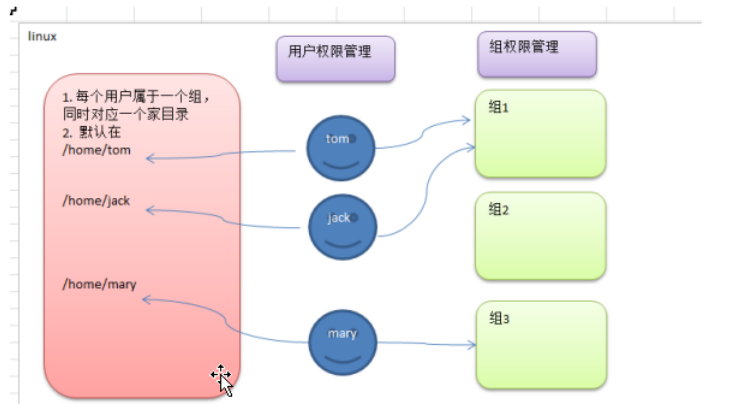
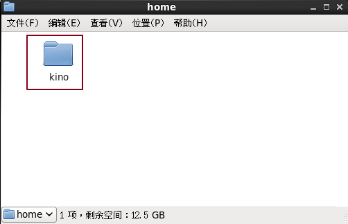
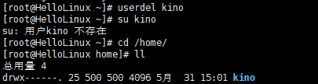
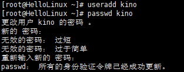
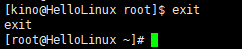
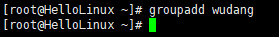
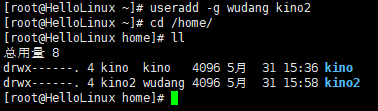
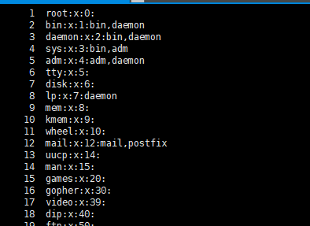
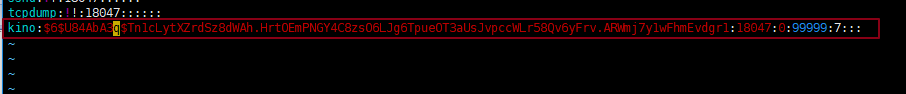

# 1. 基本介绍
Linux系统是一个多用户多任务的操作系统，任何一个要使用系统资源的用户，都必须首先向系统管理员申请一个账号，然后以这个账号的身份进入系统。



# 2. 添加用户

## 2.1 基本语法
```bash
useradd   用户名
```


## 2.2 应用案例
案例1:添加一个用户 kino
```bash
useradd kino
```

## 2.3 细节说明
当创建用户成功后，会自动的创建和用户同名的家目录 【/home/kino】
也可以通过 `useradd -d  /home/skyorder2`   新的用户名jack2，给新创建的用户指定家目录



# 3. 指定/修改密码
## 3.1 基本语法
```bash
passwd    用户名    // 如果没带用户名，则是给当前登录的用户修改密码
```


## 3.2 应用案例
给kino 指定密码
```bash
passwd kino
```


# 4. 删除用户

## 4.1 基本语法
```bash
userdel   用户名
```

## 4.2 应用案例
删除用户kino，但是要保留家目录  userdel 用户名 
```bash
userdel kino
```


删除用户以及用户主目录   
```bash
userdel –r kino
```


## 4.3 细节说明
是否保留家目录的讨论？ [一般保留]


# 5. 查询用户信息指令

## 5.1 基本语法
```bash
id  用户名
```

## 5.2 应用实例
案例1：请查询root  信息


细节说明
当用户不存在时，返回无此用户
	


# 6. 切换用户

## 6.1 介绍 
在操作Linux中，如果当前用户的权限不够，可以通过 su - 指令，切换到高权限用户，比如root

## 6.2 基本语法
```bash
su  –  切换用户名
```


## 6.3 应用实例
创建一个用户kino, ，指定密码，然后切换到 kino.
		
		

## 6.4 细节说明
从权限高的用户切换到权限低的用户，不需要输入密码，反之需要。
当需要返回到原来用户时，使用exit指令
如果 su – 没带用户名，则默认切换到root用户

	


# 7. 用户组

## 7.1 介绍
	   类似于角色，系统可以对共性的多个用户进行统一的管理。

## 7.2 新增组
```bash
groupadd 组名   
```

## 7.2.1 案例演示 [增加 wudang  ] 武当
	

## 7.3 增加用户时直接加上组
指令(基本语法)
```bash
useradd  –g 用户组 用户名
```
增加一个用户 zwj, 直接将他指定到 wudang

	


## 7.4 删除组 
指令(基本语法)
```bash
groupdel 组名
```
案例演示

	


## 7.5 修改用户的组
指令(基本语法)
```bash
usermod  –g 新的组名 用户名
```
案例演示
创建一个shaolin组，让将zwj 用户修改到shaolin

# 8. groups命令，会返回当前登录用户的用户组
	


# 9. cat /etc/group,来查看系统所有的用户组

	

# 10. 用户和组的相关文件

## 10.1 /etc/passwd 文件 
用户（user的配置文件，记录用户的各种信息
每行的含义：用户名:口令:用户标识号:组标识号:注释性描述:主目录:登录Shell

	

## 10.2 /etc/shadow 文件
口令的配置文件
每行的含义：登录名:加密口令:最后一次修改时间:最小时间间隔:最大时间间隔:警告时间:不活动时间:失效时间:

	


## 10.3 /etc/group 文件
组(group)的配置文件，记录Linux包含的组的信息
每行含义：组名:口令:组标识号:组内用户列表

			
