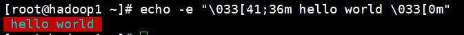
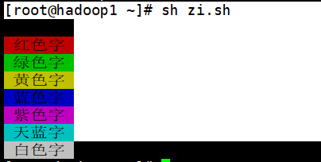
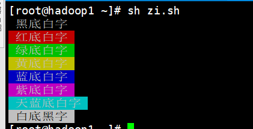

Shell 的 echo 命令用于字符串的输出, 命令格式如下:
```bash
[root@hadoop1 ~]# echo string
```

# 一、输出普通的字符串
```bash
[root@hadoop1 ~]# echo 'hello world'
hello world
```
这里的双引号完全可以省略, 以下命令与上面实例效果一致: 
```bash
[root@hadoop1 ~]# echo hello world
hello world
```

# 二、输出时显示转义字符
```bash
[root@hadoop1 ~]# echo "\"hello world\""
"hello world"
```
双引号也可以完全省略

# 三、输出显示变量
```bash
[root@hadoop1 ~]# a=kino
[root@hadoop1 ~]# echo hello $a
hello kino
```

# 四、输出显示换行
```bash
[root@hadoop1 ~]# echo -e "OK! \n\nhello world" # -e 开启转义
OK! 

hello world
```

# 五、输出到指定文件
```bash
[root@hadoop1 ~]# echo "\"hello world\"" >> myfile
```

# 六、原样输出字符串，不进行转义或取变量(用单引号)
```bash
[root@hadoop1 ~]# echo '$a\"'
$a\"
```

# 七、显示命令执行结果
```bash
[root@hadoop1 ~]# echo `date`
2020年 11月 03日 星期二 14:22:55 CST
```

# 八、输出内容带颜色
shell脚本中echo显示内容带颜色显示, echo显示带颜色, 需要使用参数-e 
```bash
[root@hadoop1 ~]# echo -e "\033[41;36m hello world \033[0m" 
```


其中41的位置代表底色, 36的位置是代表字的颜色 

注: 
1. 字背景颜色和文字颜色之间是英文的"" 
2. 文字颜色后面有个m 
3. 字符串前后可以没有空格，如果有的话，输出也是同样有空格 

下面是相应的字和背景颜色, 可以自己来尝试找出不同颜色搭配 

字颜色范围(30—–37):
```bash
echo -e "\033[30m 黑色字 \033[0m" 
echo -e "\033[31m 红色字 \033[0m" 
echo -e "\033[32m 绿色字 \033[0m" 
echo -e "\033[33m 黄色字 \033[0m" 
echo -e "\033[34m 蓝色字 \033[0m" 
echo -e "\033[35m 紫色字 \033[0m" 
echo -e "\033[36m 天蓝字 \033[0m" 
echo -e "\033[37m 白色字 \033[0m" 
```


背景颜色范围(40—–47):
```bash
echo -e "\033[40;37m 黑底白字 \033[0m" 
echo -e "\033[41;37m 红底白字 \033[0m" 
echo -e "\033[42;37m 绿底白字 \033[0m" 
echo -e "\033[43;37m 黄底白字 \033[0m" 
echo -e "\033[44;37m 蓝底白字 \033[0m" 
echo -e "\033[45;37m 紫底白字 \033[0m" 
echo -e "\033[46;37m 天蓝底白字 \033[0m"
echo -e "\033[47;30m 白底黑字 \033[0m"
```


控制参数:
```bash
\33[0m 关闭所有属性: echo -e "\033[33;0m this is yelow flashing warning \033[0m" 
\33[1m 设置高亮度: echo -e "\033[33;1m this is yelow flashing warning \033[0m" 
\33[4m 下划线: echo -e "\033[33;4m this is yelow flashing warning \033[0m" 
\33[5m 闪烁: echo -e "\033[33;5m this is yelow flashing warning \033[0m" 
\33[7m 反显: echo -e "\033[33;7m this is yelow flashing warning \033[0m" 
\33[8m 消隐: echo -e "\033[33;8m this is yelow flashing warning \033[0m" 
\33[30m — \33[37m 设置前景色 
\33[40m — \33[47m 设置背景色 
\33[nA 光标上移n行 
\33[nB 光标下移n行 
\33[nC 光标右移n行 
\33[nD 光标左移n行 
\33[y;xH设置光标位置 
\33[2J 清屏 
\33[K 清除从光标到行尾的内容 
\33[s 保存光标位置 
\33[u 恢复光标位置 
\33[?25l 隐藏光标 
\33[?25h 显示光标
```