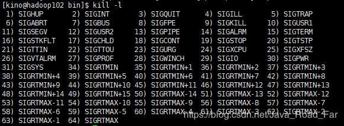
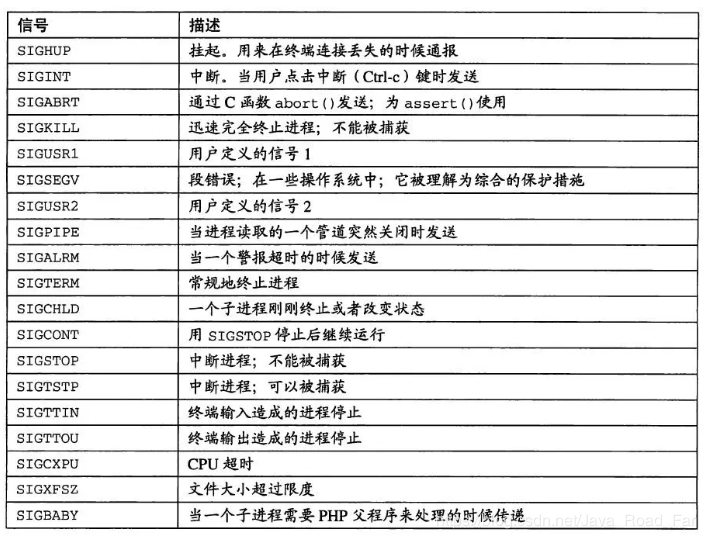

先看看 kill 命令的帮助

- `kill `


	可以看到使用 `kill` 命令时, 可以选择性传入参数 `-s sigspec  或者 -n signum`，那么这参数又是个是什么东西........


- 帮助说我们可以通过 `kill -l`（查看Linux/Unix的信号编号）


	下图是对部分信号量解释: 
	
	| 信号编号 | 信号名 | 含义|
	|--|--| --|
	|0  |  EXIT| 程序退出时收到该信息。	
	|1| 	HUP | 	挂掉电话线或终端连接的挂起信号，这个信号也会造成<br>某些进程在没有终止的情况下重新初始化。
	|2| 	INT | 	表示结束进程，但并不是强制性的，常用的 "Ctrl+C" 组合键发出<br>就是一个 kill -2 的信号。
	|3| 	QUIT| 	退出。
	|9| 	KILL	| 杀死进程，即强制结束进程。
	|11| 	SEGV | 	段错误。
	|15| 	TERM	| 正常结束进程，是 kill 命令的默认信号。

	
<font color='red'>**我们可以看到表格中 `信号名` 和 图片中的不一致，因为 信号名 可以省略掉 `SIG`**</font>

	可以看到 kill 命令可以传入的 "信号编号" 还是不少的....... 

常用的kill 命令及其信号解释

1. 标准 kill 命令。
	```java
	[kino@hadoop102 bin]$ jps
	20097 Jps
	19836 JobHistoryServer
	19773 NodeManager
	[kino@hadoop102 bin]$ kill 19836
	# 杀死 PID 为 19836 的 JobHistoryServer 进程， 默认信号是 15， 正常停止
	# 如果默认信号 15 不能杀死该进程， 则可以尝试使用 信号9， 强制杀死进程
	
	[kino@hadoop102 bin]$ jps
	20115 Jps
	19773 NodeManager
	# PID 为 19836 的 JobHistoryServer 进程 已被杀死
	```
2. 使用“-1”信号，让进程重启。
	```
	[kino@hadoop102 bin]$ kill -1 19773 
	```

3. 使用 “-9” 强制杀死进程
	```bash
	[kino@hadoop102 bin]$ kill -9 19773 
	```
	
	实际上就是系统给这个进程下了一个 "必死" 的命令，不管这个进程当前正在处理什么任务(IO等等)，都将强制结束

	`kill -9 pid` 的危害： 进程在运行时突然终止，进程在结束后不能自我清理。


---

**我们在使用 kill 命令的时候， 可以传入 信号编号，也可以传入信号名**
```bash
kill PID 等价于 kill -15 PID 等价于 kill -s TERM	

kill -9 PID 等价与 kill -s SIGKILL PID

kill -1 PID 等价于 kill -s SIGHUP PID
```

