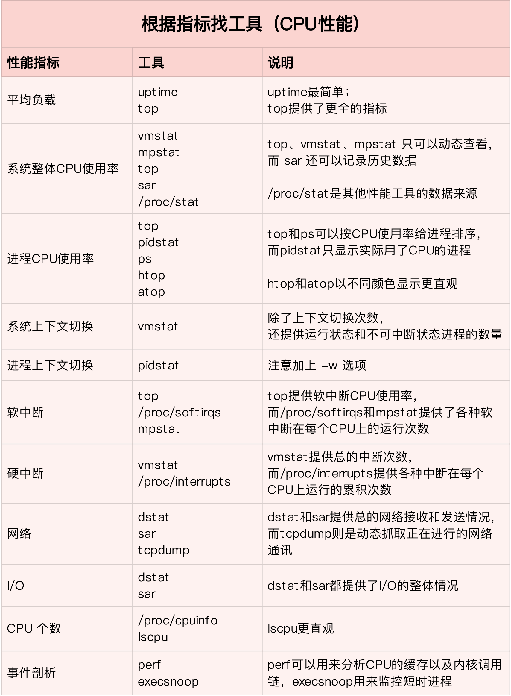
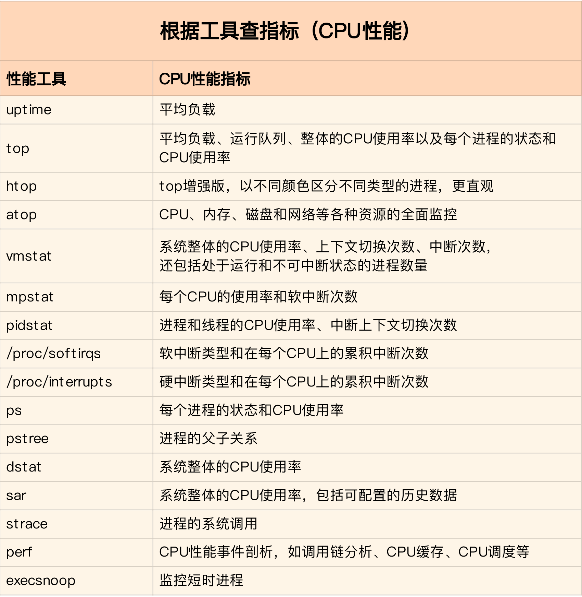
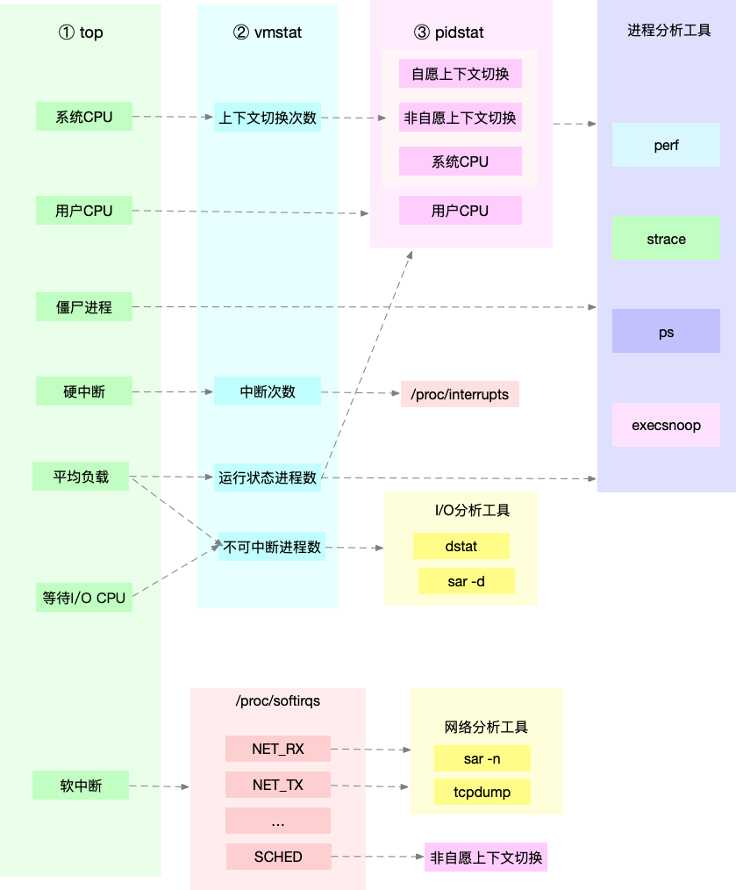

# 一、平均负载
查看系统负载
```bash
$ uptime
 11:45:19 up 46 days, 20:09,  4 users,  load average: 3.92, 7.41, 8.94
```
- `11:45:19`: 当前时间.
- `up 46 days`: 系统运行时间.
- `4 users`: 正在登录用户数.
- `3.92, 7.41, 8.94`: 过去 1分钟、5分钟、15分钟系统的平均负载.

平均负载的官方说明
```bash
$ man uptime 
    DESCRIPTION
       uptime  gives  a  one line display of the following information.  The current time, how long the system has been running, how many users are currently logged on, and the
       system load averages for the past 1, 5, and 15 minutes.

       This is the same information contained in the header line displayed by w(1).

       System load averages is the average number of processes that are either in a runnable or uninterruptable state.  A process in a runnable state is either using the CPU or
       waiting  to  use the CPU.  A process in uninterruptable state is waiting for some I/O access, eg waiting for disk.  The averages are taken over the three time intervals.
       Load averages are not normalized for the number of CPUs in a system, so a load average of 1 means a single CPU system is loaded all the time while on a 4 CPU  system  it
       means it was idle 75% of the time.
```

# 二、上下文切换
上下文切换是对任务当前运行状态的暂存和恢复.

当多个进程竞争CPU的时候，CPU为了保证每个进程能公平被调度运行，采取了处理任务时间分片的机制，轮流处理多个进程，由于CPU处理速度非常快，在人类的感官上认为是并行处理，实际是"伪"并行，同一时间只有一个任务在运行处理。

根据 Tsuna 的测试报告，每次上下文切换都需要几十纳秒到到微秒的CPU时间，这些时间对CPU来说，就好比人类对1分钟或10分钟的感觉概念。在分秒必争的计算机处理环境下，浪费太多时间在切换上，只能会降低真正处理任务的时间，表象上导致延时、排队、卡顿现象发生。

进程上下文切换、线程上下文切换、中断上下文切换

系统调用、进程状态转换(运行、就绪、阻塞)、时间片耗尽、系统资源不足、sleep、优先级调度、硬件中断等

线程是调度的基本单位，进程是资源拥有的基本单位，同属一个进程的线程，发生上下文切换，只切换线程的私有数据，共享数据不变，因此速度非常快。

举例:
1. 银行分配各个窗口给来办理业务的人
2. 如果只有1个窗口开放（系统资源不足），大部分都得等
3. 如果正在办理业务的突然说自己不办了（sleep）,那他就去旁边再想想（等）
4. 如果突然来了个VIP客户，可以强行插队
5. 如果突然断电了（中断），都得等。。

```bash
$ vmstat -Sm
procs -----------memory---------- ---swap-- -----io---- -system-- ------cpu-----
 r  b   swpd   free   buff  cache   si   so    bi    bo   in   cs us sy id wa st
 0  0      0    737   4045  60876    0    0     2   142    0    0  1  1 96  2  0
```
- cs: 每秒上下文切换的次数
- in: 每秒中断的次数
- r: 就绪队列的长度
- b: 处于不可中断睡眠状态的进程数


```bash
$ pidstat -w 1
14时04分21秒   UID       PID   cswch/s nvcswch/s  Command
14时04分22秒     0         1      3.92      0.00  systemd
14时04分22秒     0         9      1.96      0.00  ksoftirqd/0
14时04分22秒     0        10    125.49      0.00  rcu_sched
14时04分22秒     0        18      4.90      0.00  ksoftirqd/1
```
- cswch/s: 自愿上下文切换的次数, 是指进程无法获取所需资源，导致的上下文切换。比如说， I/O、内存等系统资源不足时，就会发生自愿上下文切换
- nvcswch/s: 非自愿上下文切换的次数, 是指进程由于时间片已到等原因，被系统强制调度，进而发生的上下文切换。比如说，大量进程都在争抢 CPU 时，就容易发生非自愿上下文切换

## 2.1 上下文切换案例
机器配置：4 CPU，8GB 内存, 预先安装 sysbench 和 sysstat 包，如 `apt install sysbench sysstat`

先观察空间状态的上下文切换次数
```bash
# 间隔1秒后输出1组数据
$ vmstat 1 1
procs -----------memory---------- ---swap-- -----io---- -system-- ------cpu-----
 r  b   swpd   free   buff  cache   si   so    bi    bo   in   cs us sy id wa st
 0  0      0 6984064  92668 830896    0    0     2    19   19   35  1  0 99  0  0
```
在第一个终端里运行 sysbench ，模拟系统多线程调度的瓶颈：
```bash
# 以10个线程运行5分钟的基准测试，模拟多线程切换的问题
$ sysbench --threads=10 --max-time=300 threads run
```
在第二个终端运行 vmstat ，观察上下文切换情况：
```bash
# 每隔1秒输出1组数据（需要Ctrl+C才结束）
$ vmstat -wSm 5
--procs-- -----------------------memory---------------------- ---swap-- -----io---- -system-- --------cpu--------
   r    b         swpd         free         buff        cache   si   so    bi    bo   in   cs  us  sy  id  wa  st
   6    0            0         6370           53          942    0    0   343  1091 2891 1326   8  10  81   1   0
  12    0            0         5922           70         1273    0    0     2   674 12533 1152821  43  53   4   0   0
  17    0            0         5913           70         1274    0    0     6  1302 11481 1045158  42  52   5   0   0
```
可以发现，cs 列的上下文切换次数从之前的 35 骤然上升到了 100万。同时，注意观察其他几个指标：
- r 列：就绪队列的长度已经到了 17，远远超过了系统 CPU 的个数 4，所以肯定会有大量的 CPU 竞争。
- us（user）和 sy（system）列：这两列的 CPU 使用率加起来上升到了 100%，其中系统 CPU 使用率，也就是 sy 列高达 52%，说明 CPU 主要是被内核占用了。
- in 列：中断次数也上升到了 1.1 万左右，说明中断处理也是个潜在的问题。

综合这几个指标，我们可以知道，系统的就绪队列过长，也就是正在运行和等待 CPU 的进程数过多，导致了大量的上下文切换，而上下文切换又导致了系统 CPU 的占用率升高。

那么到底是什么进程导致了这些问题呢？

我们继续分析，在第三个终端再用 pidstat 来看一下， CPU 和进程上下文切换的情况：
```bash
# 每隔1秒输出1组数据（需要 Ctrl+C 才结束）
# -w参数表示输出进程切换指标，而-u参数则表示输出CPU使用指标
$ pidstat -w -u 1
Linux 5.15.0-122-generic (iZwz946lk55rdedrd1852fZ) 	11/06/2024 	_x86_64_	(4 CPU)

10:34:00 PM   UID       PID    %usr %system  %guest   %wait    %CPU   CPU  Command
10:34:01 PM     0      1732    0.00    0.99    0.00    0.00    0.99     1  AliYunDun
10:34:01 PM     0      4888  115.84  268.32    0.00    0.00  384.16     2  sysbench
10:34:01 PM     0      4919    0.00    0.99    0.00    0.00    0.99     1  pidstat

10:34:00 PM   UID       PID   cswch/s nvcswch/s  Command
10:34:01 PM     0        14     24.75      0.00  rcu_sched
10:34:01 PM     0        22      1.98      0.00  ksoftirqd/1
10:34:01 PM     0        34      0.99      0.00  ksoftirqd/3
10:34:01 PM     0        43      1.98      0.00  kcompactd0
10:34:01 PM     0        50      1.98      0.00  kworker/3:1-events
10:34:01 PM     0       117      7.92      0.00  kworker/1:1-events
10:34:01 PM     0       181      5.94      0.00  kworker/2:2-events
10:34:01 PM     0       450      1.98      0.00  multipathd
10:34:01 PM     0       833      0.99      0.00  cron
10:34:01 PM     0      1732     12.87      0.00  AliYunDun
10:34:01 PM     0      1743     31.68      0.00  AliYunDunMonito
10:34:01 PM     0      2719      0.99      0.00  kworker/0:0-mm_percpu_wq
10:34:01 PM     0      4765      4.95      0.00  kworker/u8:0-events_power_efficient
10:34:01 PM     0      4920      0.99    301.19  pidstat
```

从 pidstat 的输出你可以发现，CPU 使用率的升高果然是 sysbench 导致的，它的 CPU 使用率已经达到了 380%。但上下文切换则是来自其他进程，包括非自愿上下文切换频率最高的 pidstat ，以及自愿上下文切换频率最高的内核线程 kworker 和 sshd。

> pidstat 输出的上下文切换次数，加起来也就几百，比 vmstat 的 100万 明显小了太多。这是怎么回事呢？难道是工具本身出了错吗？

pidstat 默认显示进程的指标数据，加上 -t 参数后，才会输出线程的指标。

在第三个终端里， Ctrl+C 停止刚才的 pidstat 命令，再加上 -t 参数，重试一下看看：
```bash
# 每隔1秒输出一组数据（需要 Ctrl+C 才结束）
# -wt 参数表示输出线程的上下文切换指标
$ pidstat -wt 1
08:14:05      UID      TGID       TID   cswch/s nvcswch/s  Command
...
Average:        0      4888      4889  14679.44  32730.84  (sysbench)__sysbench
Average:        0         -      4890  19777.57  32812.15  |__sysbench
Average:        0         -      4891  19424.30  38166.36  |__sysbench
Average:        0         -      4892  17148.60  30822.43  |__sysbench
Average:        0         -      4893  18337.38  37526.17  |__sysbench
...
```

另外也可以top看看系统整体情况
```bash
top - 22:35:59 up 42 min,  3 users,  load average: 12.15, 9.69, 5.53
Tasks: 135 total,   1 running, 134 sleeping,   0 stopped,   0 zombie
%Cpu(s): 30.5 us, 66.3 sy,  0.0 ni,  3.2 id,  0.0 wa,  0.0 hi,  0.0 si,  0.0 st
MiB Mem :   7266.8 total,   5834.8 free,    252.5 used,   1179.5 buff/cache
MiB Swap:      0.0 total,      0.0 free,      0.0 used.   6751.1 avail Mem

    PID USER      PR  NI    VIRT    RES    SHR S  %CPU  %MEM     TIME+ COMMAND
   4888 root      20   0   33484   9676   8204 S 386.3   0.1   7:55.21 sysbench
     43 root      20   0       0      0      0 S   0.3   0.0   0:00.06 kcompactd0
   1732 root      20   0   96172  13692  11976 S   0.3   0.2   0:11.03 AliYunDun
   1743 root      20   0  135204  23420  16176 S   0.3   0.3   0:21.34 AliYunDunMonito
      1 root      20   0  167664  12972   8184 S   0.0   0.2   0:03.27 systemd
      2 root      20   0       0      0      0 S   0.0   0.0   0:00.00 kthreadd
      3 root       0 -20       0      0      0 I   0.0   0.0   0:00.00 rcu_gp
```
可以看到 us 和 sy 都有升高, 并且 sy 明显更高, 这是因为上下文切换是在内核空间的, 每次上下文切换时, 都会消耗用户空间和内核空间的资源, 比如内核堆栈、寄存器、全局变量等。

小结:
- 自愿上下文切换变多了，说明进程都在等待资源，有可能发生了 I/O 等其他问题；
- 非自愿上下文切换变多了，说明进程都在被强制调度，也就是都在争抢 CPU，说明 CPU 的确成了瓶颈；
- 中断次数变多了，说明 CPU 被中断处理程序占用，还需要通过查看 `/proc/interrupts` 文件来分析具体的中断类型。


# 三、CPU使用率
Linux 作为一个多任务操作系统，将每个 CPU 的时间划分为很短的时间片，再通过调度器轮流分配给各个任务使用，因此造成多任务同时运行的错觉。

Linux 通过事先定义的节拍率（内核中表示为 HZ），触发时间中断，并使用全局变量 Jiffies 记录了开机以来的节拍数。每发生一次时间中断，Jiffies 的值就加 1。

节拍率 HZ 是内核的可配选项，可以设置为 100、250、1000 等。不同的系统可能设置不同数值，你可以通过查询 /boot/config 内核选项来查看它的配置值。
```bash
$ grep 'CONFIG_HZ=' /boot/config-$(uname -r)
CONFIG_HZ=250
```

CPU 使用率，就是除了空闲时间外的其他时间占总 CPU 时间的百分比，用公式来表示就是：

CPU 使用率=1-$\frac{空闲时间new-空闲时间old}{总cpu时间new-总cpu时间old}$

top查看cpu使用率
```bash
# 默认每3秒刷新一次
$ top
top - 11:58:59 up 9 days, 22:47,  1 user,  load average: 0.03, 0.02, 0.00
Tasks: 123 total,   1 running,  72 sleeping,   0 stopped,   0 zombie
%Cpu(s):  0.3 us,  0.3 sy,  0.0 ni, 99.3 id,  0.0 wa,  0.0 hi,  0.0 si,  0.0 st
KiB Mem :  8169348 total,  5606884 free,   334640 used,  2227824 buff/cache
KiB Swap:        0 total,        0 free,        0 used.  7497908 avail Mem

  PID USER      PR  NI    VIRT    RES    SHR S  %CPU %MEM     TIME+ COMMAND
    1 root      20   0   78088   9288   6696 S   0.0  0.1   0:16.83 systemd
    2 root      20   0       0      0      0 S   0.0  0.0   0:00.05 kthreadd
    4 root       0 -20       0      0      0 I   0.0  0.0   0:00.00 kworker/0:0H
...
```
第三行 %Cpu 就是系统的 CPU 使用率, top 默认显示的是所有 CPU 的平均值，这个时候你只需要按下数字 1 ，就可以切换到每个 CPU 的使用率了

继续往下看，空白行之后是进程的实时信息，每个进程都有一个 %CPU 列，表示进程的 CPU 使用率。它是用户态和内核态 CPU 使用率的总和，包括进程用户空间使用的 CPU、通过系统调用执行的内核空间 CPU 、以及在就绪队列等待运行的 CPU。在虚拟化环境中，它还包括了运行虚拟机占用的 CPU。

pidstat 查看进程cpu使用率
```bash
# 每隔1秒输出一组数据，共输出5组
$ pidstat 1 5
15:56:02      UID       PID    %usr %system  %guest   %wait    %CPU   CPU  Command
15:56:03        0     15006    0.00    0.99    0.00    0.00    0.99     1  dockerd

...

Average:      UID       PID    %usr %system  %guest   %wait    %CPU   CPU  Command
Average:        0     15006    0.00    0.99    0.00    0.00    0.99     -  dockerd
```

## 3.1 cpu使用率案例
安装: `apt install docker.io sysstat linux-tools-common apache2-utils`

```bash
$ docker run --name nginx -p 10000:80 -itd feisky/nginx:sp
$ docker run --name phpfpm -itd --network container:nginx feisky/php-fpm:sp
```
使用 curl 访问 http://[VM1 的 IP]:10000，确认 Nginx 已正常启动。你应该可以看到 It works! 的响应。
```bash
$ curl http://127.0.0.1:10000/
It works!
```
测试一下这个 Nginx 服务的性能。在第二个终端运行下面的 ab 命令。要注意，与上次操作不同的是，这次我们需要并发 100 个请求测试 Nginx 性能，总共测试 1000 个请求。
```bash
# 并发100个请求测试Nginx性能，总共测试1000个请求
$ ab -c 100 -n 1000 http://127.0.0.1:10000/
This is ApacheBench, Version 2.3 <$Revision: 1706008 $>
Copyright 1996 Adam Twiss, Zeus Technology Ltd, 
...
Requests per second:    87.86 [#/sec] (mean)
Time per request:       1138.229 [ms] (mean)
...
```
从 ab 的输出结果我们可以看到，Nginx 能承受的每秒平均请求数，只有 87 多一点，是不是感觉它的性能有点差呀。那么，到底是哪里出了问题呢？我们再用 top 和 pidstat 来观察一下。

这次，我们在第二个终端，将测试的并发请求数改成 5，同时把请求时长设置为 10 分钟（-t 600）。这样，当你在第一个终端使用性能分析工具时， Nginx 的压力还是继续的。

继续在第二个终端运行 ab 命令：
```bash
$ ab -c 5 -t 600 http://127.0.0.1:10000/
```
在第一个终端运行 top 命令，观察系统的 CPU 使用情况：
```bash
$ top
...
%Cpu(s): 80.8 us, 15.1 sy,  0.0 ni,  2.8 id,  0.0 wa,  0.0 hi,  1.3 si,  0.0 st
...

  PID USER      PR  NI    VIRT    RES    SHR S  %CPU %MEM     TIME+ COMMAND
 6882 root      20   0    8456   5052   3884 S   2.7  0.1   0:04.78 docker-containe
 6947 systemd+  20   0   33104   3716   2340 S   2.7  0.0   0:04.92 nginx
 7494 daemon    20   0  336696  15012   7332 S   2.0  0.2   0:03.55 php-fpm
 7495 daemon    20   0  336696  15160   7480 S   2.0  0.2   0:03.55 php-fpm
10547 daemon    20   0  336696  16200   8520 S   2.0  0.2   0:03.13 php-fpm
10155 daemon    20   0  336696  16200   8520 S   1.7  0.2   0:03.12 php-fpm
10552 daemon    20   0  336696  16200   8520 S   1.7  0.2   0:03.12 php-fpm
15006 root      20   0 1168608  66264  37536 S   1.0  0.8   9:39.51 dockerd
 4323 root      20   0       0      0      0 I   0.3  0.0   0:00.87 kworker/u4:1
...
```
CPU 使用率最高的进程也只不过才 2.7%，看起来并不高。系统的整体 CPU 使用率是比较高的：用户 CPU 使用率（us）已经到了 80%，系统 CPU 为 15.1%，而空闲 CPU （id）则只有 2.8%。

为什么用户 CPU 使用率这么高呢？我们再重新分析一下进程列表，看看有没有可疑进程：
- docker-containerd 进程是用来运行容器的，2.7% 的 CPU 使用率看起来正常；
- Nginx 和 php-fpm 是运行 Web 服务的，它们会占用一些 CPU 也不意外，并且 2% 的 CPU 使用率也不算高；
- 再往下看，后面的进程呢，只有 0.3% 的 CPU 使用率，看起来不太像会导致用户 CPU 使用率达到 80%。

在第一个终端，运行 pidstat 命令：
```bash
# 间隔1秒输出一组数据（按Ctrl+C结束）
$ pidstat 1
...
04:36:24      UID       PID    %usr %system  %guest   %wait    %CPU   CPU  Command
04:36:25        0      6882    1.00    3.00    0.00    0.00    4.00     0  docker-containe
04:36:25      101      6947    1.00    2.00    0.00    1.00    3.00     1  nginx
04:36:25        1     14834    1.00    1.00    0.00    1.00    2.00     0  php-fpm
04:36:25        1     14835    1.00    1.00    0.00    1.00    2.00     0  php-fpm
04:36:25        1     14845    0.00    2.00    0.00    2.00    2.00     1  php-fpm
04:36:25        1     14855    0.00    1.00    0.00    1.00    1.00     1  php-fpm
04:36:25        1     14857    1.00    2.00    0.00    1.00    3.00     0  php-fpm
04:36:25        0     15006    0.00    1.00    0.00    0.00    1.00     0  dockerd
04:36:25        0     15801    0.00    1.00    0.00    0.00    1.00     1  pidstat
04:36:25        1     17084    1.00    0.00    0.00    2.00    1.00     0  stress
04:36:25        0     31116    0.00    1.00    0.00    0.00    1.00     0  atopacctd
...
```
所有进程的 CPU 使用率也都不高啊，最高的 Docker 和 Nginx 也只有 4% 和 3%，即使所有进程的 CPU 使用率都加起来，也不过是 21%，离 80% 还差得远

回到第一个终端，重新运行 top 命令，并观察一会儿：
```bash
$ top
top - 04:58:24 up 14 days, 15:47,  1 user,  load average: 3.39, 3.82, 2.74
Tasks: 149 total,   6 running,  93 sleeping,   0 stopped,   0 zombie
%Cpu(s): 77.7 us, 19.3 sy,  0.0 ni,  2.0 id,  0.0 wa,  0.0 hi,  1.0 si,  0.0 st
KiB Mem :  8169348 total,  2543916 free,   457976 used,  5167456 buff/cache
KiB Swap:        0 total,        0 free,        0 used.  7363908 avail Mem

  PID USER      PR  NI    VIRT    RES    SHR S  %CPU %MEM     TIME+ COMMAND
 6947 systemd+  20   0   33104   3764   2340 S   4.0  0.0   0:32.69 nginx
 6882 root      20   0   12108   8360   3884 S   2.0  0.1   0:31.40 docker-containe
15465 daemon    20   0  336696  15256   7576 S   2.0  0.2   0:00.62 php-fpm
15466 daemon    20   0  336696  15196   7516 S   2.0  0.2   0:00.62 php-fpm
15489 daemon    20   0  336696  16200   8520 S   2.0  0.2   0:00.62 php-fpm
 6948 systemd+  20   0   33104   3764   2340 S   1.0  0.0   0:00.95 nginx
15006 root      20   0 1168608  65632  37536 S   1.0  0.8   9:51.09 dockerd
15476 daemon    20   0  336696  16200   8520 S   1.0  0.2   0:00.61 php-fpm
15477 daemon    20   0  336696  16200   8520 S   1.0  0.2   0:00.61 php-fpm
24340 daemon    20   0    8184   1616    536 R   1.0  0.0   0:00.01 stress
24342 daemon    20   0    8196   1580    492 R   1.0  0.0   0:00.01 stress
24344 daemon    20   0    8188   1056    492 R   1.0  0.0   0:00.01 stress
24347 daemon    20   0    8184   1356    540 R   1.0  0.0   0:00.01 stress
...
```
就绪队列中居然有 6 个 Running 状态的进程（6 running）,再仔细看进程列表，这次主要看 Running（R） 状态的进程。你有没有发现， Nginx 和所有的 php-fpm 都处于 Sleep（S）状态，而真正处于 Running（R）状态的，却是几个 stress 进程。这几个 stress 进程就比较奇怪了，需要我们做进一步的分析。

还是使用 pidstat 来分析这几个进程，并且使用 -p 选项指定进程的 PID。首先，从上面 top 的结果中，找到这几个进程的 PID。比如，先随便找一个 24344，然后用 pidstat 命令看一下它的 CPU 使用情况：
```bash
$ pidstat -p 24344

16:14:55      UID       PID    %usr %system  %guest   %wait    %CPU   CPU  Command
```
奇怪，居然没有任何输出。难道是 pidstat 命令出问题了吗？之前我说过，在怀疑性能工具出问题前，最好还是先用其他工具交叉确认一下。那用什么工具呢？ ps 应该是最简单易用的。我们在终端里运行下面的命令，看看 24344 进程的状态：
```bash
# 从所有进程中查找PID是24344的进程
$ ps aux | grep 24344
root      9628  0.0  0.0  14856  1096 pts/0    S+   16:15   0:00 grep --color=auto 24344
```
还是没有输出。现在终于发现问题，原来这个进程已经不存在了，所以 pidstat 就没有任何输出。既然进程都没了，那性能问题应该也跟着没了吧。我们再用 top 命令确认一下：
```bash
$ top
...
%Cpu(s): 80.9 us, 14.9 sy,  0.0 ni,  2.8 id,  0.0 wa,  0.0 hi,  1.3 si,  0.0 st
...

  PID USER      PR  NI    VIRT    RES    SHR S  %CPU %MEM     TIME+ COMMAND
 6882 root      20   0   12108   8360   3884 S   2.7  0.1   0:45.63 docker-containe
 6947 systemd+  20   0   33104   3764   2340 R   2.7  0.0   0:47.79 nginx
 3865 daemon    20   0  336696  15056   7376 S   2.0  0.2   0:00.15 php-fpm
  6779 daemon    20   0    8184   1112    556 R   0.3  0.0   0:00.01 stress
...
```
结果还跟原来一样，用户 CPU 使用率还是高达 80.9%，系统 CPU 接近 15%，而空闲 CPU 只有 2.8%，Running 状态的进程有 Nginx、stress 等。

刚刚我们看到 stress 进程不存在了，怎么现在还在运行呢？再细看一下 top 的输出，原来，这次 stress 进程的 PID 跟前面不一样了，原来的 PID 24344 不见了，现在的是 6779。

进程的 PID 在变，这说明什么呢？在我看来，要么是这些进程在不停地重启，要么就是全新的进程，这无非也就两个原因：
- 第一个原因，进程在不停地崩溃重启，比如因为段错误、配置错误等等，这时，进程在退出后可能又被监控系统自动重启了。
- 第二个原因，这些进程都是短时进程，也就是在其他应用内部通过 exec 调用的外面命令。这些命令一般都只运行很短的时间就会结束，你很难用 top 这种间隔时间比较长的工具发现（上面的案例，我们碰巧发现了）。

用 pstree 就可以用树状形式显示所有进程之间的关系：
```bash
$ pstree | grep stress
        |-docker-containe-+-php-fpm-+-php-fpm---sh---stress
        |         |-3*[php-fpm---sh---stress---stress]
```
从这里可以看到，stress 是被 php-fpm 调用的子进程，并且进程数量不止一个（这里是 3 个）。找到父进程后，我们能进入 app 的内部分析了。

从代码中可以看到，给请求加入 verbose=1 参数后，就可以查看 stress 的输出。你先试试看，在第二个终端运行：
```bash
$ curl http://127.0.0.1:10000?verbose=1
Server internal error: Array
(
    [0] => stress: info: [19607] dispatching hogs: 0 cpu, 0 io, 0 vm, 1 hdd
    [1] => stress: FAIL: [19608] (563) mkstemp failed: Permission denied
    [2] => stress: FAIL: [19607] (394) <-- worker 19608 returned error 1
    [3] => stress: WARN: [19607] (396) now reaping child worker processes
    [4] => stress: FAIL: [19607] (400) kill error: No such process
    [5] => stress: FAIL: [19607] (451) failed run completed in 0s
)
```
看错误消息 mkstemp failed: Permission denied ，以及 failed run completed in 0s。原来 stress 命令并没有成功，它因为权限问题失败退出了。看来，我们发现了一个 PHP 调用外部 stress 命令的 bug：没有权限创建临时文件。

从这里我们可以猜测，正是由于权限错误，大量的 stress 进程在启动时初始化失败，进而导致用户 CPU 使用率的升高。

在第一个终端中运行 perf record -g 命令 ，并等待一会儿（比如 15 秒）后按 Ctrl+C 退出。然后再运行 perf report 查看报告：
```bash
# 记录性能事件，等待大约15秒后按 Ctrl+C 退出
$ perf record -g

# 查看报告
$ perf report
```
这样，你就可以看到下图这个性能报告：
```bash
Samples: 204K of event 'cpu-clock:ppp', Event count (approx.): 51246750000
  Children      Self  Command          Shared Object                                         Symbol
    21.89%    21.57%  stress           libc-2.24.so                                          [.] random                                                                                       ◆
    16.50%    16.27%  stress           libc-2.24.so                                          [.] random_r                                                                                     ▒
+    6.17%     0.00%  php-fpm          [kernel.kallsyms]                                     [k] entry_SYSCALL_64_after_hwframe                                                               ▒
+    6.17%     0.02%  php-fpm          [kernel.kallsyms]                                     [k] do_syscall_64                                                                                ▒
+    6.08%     0.00%  php-fpm          [kernel.kallsyms]                                     [k] x64_sys_call                                                                                 ▒
     5.55%     5.46%  stress           libc-2.24.so                                          [.] rand                                                                                         ▒
+    3.68%     0.00%  stress           [kernel.kallsyms]                                     [k] asm_exc_page_fault                                                                           ▒
+    3.68%     0.00%  stress           [kernel.kallsyms]                                     [k] exc_page_fault                                                                               ▒
+    3.63%     0.70%  stress           [kernel.kallsyms]                                     [k] do_user_addr_fault                                                                           ▒
+    3.31%     0.01%  php-fpm          libc-2.24.so                                          [.] _IO_proc_open                                                                                ▒
+    2.90%     0.02%  php-fpm          libc-2.24.so                                          [.] __libc_fork
...
```
你看，stress 占了所有 CPU 时钟事件的 21%，而 stress 调用调用栈中比例最高的，是随机数生成函数 random()，看来它的确就是 CPU 使用率升高的元凶了。随后的优化就很简单了，只要修复权限问题，并减少或删除 stress 的调用，就可以减轻系统的 CPU 压力。

## 3.2 execsnoop
execsnoop 是一个专为短时进程设计的工具。它通过 ftrace 实时监控进程的 exec() 行为，并输出短时进程的基本信息，包括进程 PID、父进程 PID、命令行参数以及执行的结果。
```bash
# 按 Ctrl+C 结束
$ execsnoop
PCOMM            PID    PPID   RET ARGS
sh               30394  30393    0
stress           30396  30394    0 /usr/local/bin/stress -t 1 -d 1
sh               30398  30393    0
stress           30399  30398    0 /usr/local/bin/stress -t 1 -d 1
sh               30402  30400    0
stress           30403  30402    0 /usr/local/bin/stress -t 1 -d 1
sh               30405  30393    0
stress           30407  30405    0 /usr/local/bin/stress -t 1 -d 1
...
```

# 四、不可中断
- 中断: 由硬件或软件触发信号, 通知CPU需要处理某个任务. 中断可以打断当前正在执行的程序, 以便处理更加紧急的任务, 例如设备输入、系统调用等。处理完中断之后, CPU会恢复到之前的任务.
- 不可中断: 不可中断可以保证任务处理到关键时候不允许被打断, 通常都是涉及到了资源访问, 比如磁盘IO. 当进程处于不可中断状态时候, 即使有中断请求, CPU也不会打断这个进程. 这种状态通常用于确保数据一致性和系统稳定性.

看个案例: centos服务器(8c32g)部署了mysql服务, 集群负载高, wa 高
```bash
$ top
top - 12:05:23 up 45 days, 18:32,  1 user,  load average: 20.67, 20.02, 18.36
Tasks: 156 total,   1 running, 154 sleeping,   1 stopped,   0 zombie
%Cpu(s): 12.7 us,  0.2 sy,  0.0 ni,  5.1 id, 82.0 wa,  0.0 hi,  0.0 si,  0.0 st
KiB Mem : 32779912 total,   221988 free,  8047468 used, 24510456 buff/cache
KiB Swap:  5242876 total,  4694396 free,   548480 used. 24257928 avail Mem

  PID USER      PR  NI    VIRT    RES    SHR S  %CPU %MEM     TIME+ COMMAND
29166 mysql     20   0   10.4g   7.1g  12328 S 102.0 22.9  20497:57 mysqld
 7548 root      20   0  714688  59780   2408 T   0.7  0.2 327:46.54 titanagent
 9172 root      20   0       0      0      0 S   0.3  0.0   0:03.70 kworker/4:1
    1 root      20   0  128172   5288   3348 S   0.0  0.0  15:10.56 systemd
    2 root      20   0       0      0      0 S   0.0  0.0   0:01.53 kthreadd
```
查看 mysqld 的子线程状态
```bash
$ top -Hp 29166
# 按 O 之后输入 S=D 过滤不可中断的进程
top - 12:06:46 up 45 days, 18:33,  1 user,  load average: 22.28, 20.70, 18.73
Threads: 147 total,   1 running, 146 sleeping,   0 stopped,   0 zombie
%Cpu(s): 12.9 us,  0.2 sy,  0.0 ni,  0.0 id, 86.9 wa,  0.0 hi,  0.0 si,  0.0 st
KiB Mem : 32779912 total,   222992 free,  8052244 used, 24504676 buff/cache
KiB Swap:  5242876 total,  4694396 free,   548480 used. 24252904 avail Mem

  PID USER      PR  NI    VIRT    RES    SHR S %CPU %MEM     TIME+ COMMAND
29856 mysql     20   0   10.4g   7.1g  12476 D  0.7 22.9   8:01.31 connection
31580 mysql     20   0   10.4g   7.1g  12476 D  0.4 22.9   4:25.51 connection
 2255 mysql     20   0   10.4g   7.1g  12476 D  0.4 22.9   0:27.42 connection
29186 mysql     20   0   10.4g   7.1g  12476 D  0.0 22.9  13:53.34 ib_io_wr-4
29204 mysql     20   0   10.4g   7.1g  12476 D  0.0 22.9  45:58.13 ib_log_flush
29766 mysql     20   0   10.4g   7.1g  12476 D  0.0 22.9   2:06.32 ib_src_main
29807 mysql     20   0   10.4g   7.1g  12476 D  0.0 22.9  10:25.67 connection
29814 mysql     20   0   10.4g   7.1g  12476 D  0.0 22.9  16:47.92 connection
29826 mysql     20   0   10.4g   7.1g  12476 D  0.0 22.9   6:11.39 connection
29853 mysql     20   0   10.4g   7.1g  12476 D  0.0 22.9  14:27.05 connection
29859 mysql     20   0   10.4g   7.1g  12476 D  0.0 22.9  49:34.41 connection
29882 mysql     20   0   10.4g   7.1g  12476 D  0.0 22.9  25:17.89 connection
31579 mysql     20   0   10.4g   7.1g  12476 D  0.0 22.9 689:47.32 connection
```
可以看到大量不可中断的子线程, 其中更是有一些连接长时间处于不可中断状态, 并且可以看到 wa 高达 86.9, 于是查看系统IO
```bash
$ iostat -x 1 10
Device:         rrqm/s   wrqm/s     r/s     w/s    rkB/s    wkB/s avgrq-sz avgqu-sz   await r_await w_await  svctm  %util
sda               0.00     0.00    0.00    0.00     0.00     0.00     0.00   217.00    0.00    0.00    0.00   0.00 100.00
sdb               0.00     0.00    1.00   12.00    16.00   208.00    34.46    21.52 1970.15 2686.00 1910.50  76.92 100.00
dm-0              0.00     0.00    0.00    0.00     0.00     0.00     0.00   220.00    0.00    0.00    0.00   0.00 100.00
dm-1              0.00     0.00    0.00    0.00     0.00     0.00     0.00     4.00    0.00    0.00    0.00   0.00 100.00

avg-cpu:  %user   %nice %system %iowait  %steal   %idle
           0.13    0.00    0.13   95.74    0.00    4.01
```
可以看到 sda 和 sdb 两块挂载盘的 %util 满了, 说明 磁盘IO 有问题

# 五、僵尸进程
正常情况下，当一个进程创建了子进程后，它应该通过系统调用 wait() 或者 waitpid() 等待子进程结束，回收子进程的资源；而子进程在结束时，会向它的父进程发送 SIGCHLD 信号，所以，父进程还可以注册 SIGCHLD 信号的处理函数，异步回收资源。

如果父进程没这么做，或是子进程执行太快，父进程还没来得及处理子进程状态，子进程就已经提前退出，那这时的子进程就会变成僵尸进程。换句话说，父亲应该一直对儿子负责，善始善终，如果不作为或者跟不上，都会导致“问题少年”的出现。

通常，僵尸进程持续的时间都比较短，在父进程回收它的资源后就会消亡；或者在父进程退出后，由 init 进程回收后也会消亡。

一旦父进程没有处理子进程的终止，还一直保持运行状态，那么子进程就会一直处于僵尸状态。大量的僵尸进程会用尽 PID 进程号，导致新进程不能创建，所以这种情况一定要避免。


# 5.1 不可中断进程和僵尸进程的案例
提示: 可能会卡死服务器,建议用虚拟机或者临时云服务器.

环境: ubuntu22 1c1g
预安装: `apt install docker.io dstat sysstat`

运行
```bash
docker rm -f app
docker run --privileged --name=app -itd feisky/app:iowait /app -d /dev/vda3
```
观察集群负载
```bash
$ top
top - 13:53:31 up 18 min,  1 user,  load average: 2.68, 0.63, 0.23
Tasks: 121 total,   2 running, 119 sleeping,   0 stopped,   0 zombie
%Cpu(s):  0.7 us,  3.4 sy,  0.0 ni,  0.0 id, 95.3 wa,  0.0 hi,  0.7 si,  0.0 st
MiB Mem :    955.6 total,     72.9 free,    719.0 used,    163.7 buff/cache
MiB Swap:      0.0 total,      0.0 free,      0.0 used.     84.2 avail Mem

    PID USER      PR  NI    VIRT    RES    SHR S  %CPU  %MEM     TIME+ COMMAND
   4362 root      20   0   70056  65832    324 D   0.0   6.7   0:00.03 app
   4363 root      20   0   70056  65832    324 D   0.3   6.7   0:00.04 app
   4360 root      20   0   70056  65516      8 D   0.0   6.7   0:00.04 app
   4361 root      20   0   70056  65516      8 D   0.0   6.7   0:00.04 app
   4356 root      20   0   70056  65508      0 D   0.0   6.7   0:00.05 app
   4357 root      20   0   70056  65508      0 R   0.0   6.7   0:00.05 app
   1068 root      20   0 1912656  52496  25928 S   0.0   5.4   0:01.17 dockerd
   4365 root      20   0   70056  51312    324 D   0.0   5.2   0:00.02 app
   4364 root      20   0   70056  45768    324 D   0.0   4.7   0:00.02 app
    734 root      20   0 1801044  27876  13016 S   0.3   2.8   0:00.96 containerd
    408 root      rt   0  289312  27096   9072 S   0.0   2.8   0:00.10 multipathd
```
最近1分钟、5分钟、15分钟的负载依次降低, 代表这集群负载正在升高, 过滤僵死进程
```bash
$ top  ### 按 o 之后输入 S=Z
top - 13:59:57 up 2 min,  1 user,  load average: 42.99, 12.97, 4.52
Tasks: 144 total,   1 running, 126 sleeping,   0 stopped,  17 zombie
%Cpu(s):  0.3 us, 44.2 sy,  0.0 ni,  0.0 id, 95.2 wa,  0.0 hi,  0.2 si,  0.0 st
MiB Mem :    955.6 total,     49.3 free,    866.0 used,     40.3 buff/cache
MiB Swap:      0.0 total,      0.0 free,      0.0 used.      9.0 avail Mem

    PID USER      PR  NI    VIRT    RES    SHR S  %CPU  %MEM     TIME+ COMMAND
   1577 root      20   0   70056  65516      0 D   0.1   6.7   0:00.07 app
   1587 root      20   0   70056  65516      0 D   0.4   6.7   0:00.09 app
   1588 root      20   0   70056  65516      0 D   0.1   6.7   0:00.05 app
   1602 root      20   0   70056  65516      0 D   1.6   6.7   0:00.24 app
   1603 root      20   0   70056  65516      0 D   2.2   6.7   0:00.32 app
   1604 root      20   0   70056  65516      0 D   4.4   6.7   0:00.62 app
   1607 root      20   0   70056  65516      0 D   3.7   6.7   0:00.51 app
   1608 root      20   0   70056  45972      0 D   3.4   4.7   0:00.48 app
   1610 root      20   0   70056  44920      0 D   2.1   4.6   0:00.29 app
   1612 root      20   0   70056  32496      0 D   0.9   3.3   0:00.13 app
   1098 root      20   0 1912144  27152   2552 S   0.1   2.8   0:00.32 dockerd
   ...
```
可以看到最近1分钟、5分钟、15分钟的平均负载依次降低, 代表着服务器负载正在上升, 且 iowait 已经达到了 55.2%, 并且存在 17 个僵尸进程。

这能得出以下结论:
1. iowait 太高, 导致了系统负载升高.
2. 僵尸进程在不断增多, 说明程序没有正常清理子进程的资源.


# 六、软中断

中断是一种异步的事件处理机制，用来提高系统的并发处理能力。中断事件发生，会触发执行中断处理程序，而中断处理程序被分为上半部和下半部这两个部分。

- 上半部对应硬中断，用来快速处理中断；
- 下半部对应软中断，用来异步处理上半部未完成的工作。

Linux 中的软中断包括网络收发、定时、调度、RCU 锁等各种类型，我们可以查看 proc 文件系统中的 `/proc/softirqs` ，观察软中断的运行情况。

软中断案例
1. 机器配置: 1c1g
2. 预先安装 docker、sysstat、sar 、hping3、tcpdump 等工具，比如 `apt-get install -y docker.io sysstat hping3 tcpdump`。

> sar 是一个系统活动报告工具，既可以实时查看系统的当前活动，又可以配置保存和报告历史统计数据。
> 
> hping3 是一个可以构造 TCP/IP 协议数据包的工具，可以对系统进行安全审计、防火墙测试等。
> 
> tcpdump 是一个常用的网络抓包工具，常用来分析各种网络问题。

```bash
$ docker run -itd --name=nginx -p 80:80 nginx
```
尝试访问这个nginx确保正常启动
```bash
$ curl http://172.29.254.69
<!DOCTYPE html>
<html>
<head>
<title>Welcome to nginx!</title>
<style>
html { color-scheme: light dark; }
body { width: 35em; margin: 0 auto;
font-family: Tahoma, Verdana, Arial, sans-serif; }
</style>
</head>
<body>
<h1>Welcome to nginx!</h1>
<p>If you see this page, the nginx web server is successfully installed and
working. Further configuration is required.</p>

<p>For online documentation and support please refer to
<a href="http://nginx.org/">nginx.org</a>.<br/>
Commercial support is available at
<a href="http://nginx.com/">nginx.com</a>.</p>

<p><em>Thank you for using nginx.</em></p>
</body>
</html>
```
开启一个新的终端, 运行 hping3 命令, 来模拟Nginx客户端请求:
```bash
# -S参数表示设置TCP协议的SYN（同步序列号），-p表示目的端口为80# 
# -i u100表示每隔100微秒发送一个网络帧
# 注：如果你在实践过程中现象不明显，可以尝试把100调小，比如调成10甚至1$ 
$ hping3 -S -p 80 -i u100 172.29.254.69
```
此时回到上一个终端, 应该能感受出响应变慢了, 尝试 top 看系统状况
```bash
$ top
top - 22:23:57 up  8:03,  2 users,  load average: 0.66, 0.76, 0.54
Tasks: 114 total,   2 running, 112 sleeping,   0 stopped,   0 zombie
%Cpu(s): 21.8 us, 37.1 sy,  0.0 ni, 10.2 id,  0.0 wa,  0.0 hi, 31.0 si,  0.0 st
MiB Mem :    955.6 total,     84.4 free,    255.1 used,    616.1 buff/cache
MiB Swap:      0.0 total,      0.0 free,      0.0 used.    532.3 avail Mem

    PID USER      PR  NI    VIRT    RES    SHR S  %CPU  %MEM     TIME+ COMMAND
   4083 root      20   0   11832   5976   5528 R  77.1   0.6  12:11.22 hping3
   1444 root      20   0  130504  20660  15832 S   1.0   2.1   4:45.70 AliYunDunMonito
     13 root      20   0       0      0      0 S   0.7   0.0   0:23.03 ksoftirqd/0
     ...
```
可以看到系统平均负载、wa等都相对比较正常, 唯独 si 稍微有点高达到了 31%, 系统可能存在比较频繁的软中断, 软中断是CPU开始正式处理高优先级的任务了, 不太可能像硬中断频繁那样是因为等待系统资源, 软中断的情况也比较多, 再看看软中断的相关信息
```bash
$ watch -d cat /proc/softirqs
Every 2.0s: cat /proc/softirqs              iZbp1643sf4zgucdf3bh7bZ: Tue Oct 22 22:27:48 2024
                    CPU0       CPU1
          HI:          2          0
       TIMER:    1265933          0
      NET_TX:          4          0
      NET_RX:   80778417          0
       BLOCK:      38377          0
    IRQ_POLL:          0          0
     TASKLET:        449          0
       SCHED:          0          0
     HRTIMER:       2845          0
         RCU:   17240947          0
```
多观察会发现 TIMER、NET_RX、RCU 都有很大的变化, 但是 NET_RX 相对来说变化更大一下, 所以开始怀疑是网络发送引起的软中断, 再看看网卡情况
```bash
$ sar -n DEV 1
Linux 5.15.0-122-generic (iZbp1643sf4zgucdf3bh7bZ) 	10/22/2024 	_x86_64_	(1 CPU)

10:29:21 PM     IFACE   rxpck/s   txpck/s    rxkB/s    txkB/s   rxcmp/s   txcmp/s  rxmcst/s   %ifutil
10:29:22 PM        lo      0.00      0.00      0.00      0.00      0.00      0.00      0.00      0.00
10:29:22 PM      eth0      3.00      1.00      0.17      0.04      0.00      0.00      0.00      0.00
10:29:22 PM   docker0  20764.00  41528.00    892.20   2189.95      0.00      0.00      0.00      0.00
10:29:22 PM veth324d733  20764.00  41528.00   1176.09   2189.95      0.00      0.00      0.00      0.18

10:29:22 PM     IFACE   rxpck/s   txpck/s    rxkB/s    txkB/s   rxcmp/s   txcmp/s  rxmcst/s   %ifutil
10:29:23 PM        lo      0.00      0.00      0.00      0.00      0.00      0.00      0.00      0.00
10:29:23 PM      eth0      2.00     16.00      0.13      2.52      0.00      0.00      0.00      0.00
10:29:23 PM   docker0  21129.00  42258.00    907.89   2228.45      0.00      0.00      0.00      0.00
10:29:23 PM veth324d733  21129.00  42258.00   1196.76   2228.45      0.00      0.00      0.00      0.18
```
先解释参数:
- 第一列 `10:29:21 PM`: 时间
- 第二列 `IFACE`: 网卡
- 第三四列 `rxpck/s`、`txpck/s`: 每秒网卡 收到、发送 的帧数, 也就是 PPS
- 第五六列 `rxkB/s`、`txkB/s`: 每秒网卡 收到、发送 的字节数, 也就是 BPS

这里能看到 docker0 这个网卡的 收发 帧数 比 收发 字节数多很多, 稍微计算一下 892.20 * 1024 / 20764.00 = 43.99, 说明平均每个网络帧只有 44字节, 很显然是很小的网络帧, 属于小包问题. 

再用 tcpdump 抓取这个网卡的信息
```bash
$ tcpdump -i docker0 -n tcp
22:14:11.562935 IP 172.29.254.69.774 > 172.17.0.2.80: Flags [S], seq 1779350409, win 512, length 0
22:14:11.562938 IP 172.17.0.2.80 > 172.29.254.69.774: Flags [S.], seq 3488339637, ack 1779350410, win 64240, options [mss 1460], length 0
22:14:11.562941 IP 172.29.254.69.774 > 172.17.0.2.80: Flags [R], seq 1779350410, win 0, length 0
22:14:11.563002 IP 172.29.254.69.775 > 172.17.0.2.80: Flags [S], seq 1917762204, win 512, length 0
22:14:11.563006 IP 172.17.0.2.80 > 172.29.254.69.775: Flags [S.], seq 648867213, ack 1917762205, win 64240, options [mss 1460], length 0
22:14:11.563015 IP 172.29.254.69.775 > 172.17.0.2.80: Flags [R], seq 1917762205, win 0, length 0
22:14:11.563034 IP 172.29.254.69.776 > 172.17.0.2.80: Flags [S], seq 2062694594, win 512, length 0
22:14:11.563036 IP 172.17.0.2.80 > 172.29.254.69.776: Flags [S.], seq 1428040479, ack 2062694595, win 64240, options [mss 1460], length 0
22:14:11.563040 IP 172.29.254.69.776 > 172.17.0.2.80: Flags [R], seq 2062694595, win 0, length 0
22:14:11.563101 IP 172.29.254.69.777 > 172.17.0.2.80: Flags [S], seq 1327119535, win 512, length 0
22:14:11.563105 IP 172.17.0.2.80 > 172.29.254.69.777: Flags [S.], seq 2952525786, ack 1327119536, win 64240, options [mss 1460], length 0
22:14:11.563115 IP 172.29.254.69.777 > 172.17.0.2.80: Flags [R], seq 1327119536, win 0, length 0
22:14:11.563131 IP 172.29.254.69.778 > 172.17.0.2.80: Flags [S], seq 1469159056, win 512, length 0
22:14:11.563135 IP 172.17.0.2.80 > 172.29.254.69.778: Flags [S.], seq 1226500663, ack 1469159057, win 64240, options [mss 1460], length 0
22:14:11.563138 IP 172.29.254.69.778 > 172.17.0.2.80: Flags [R], seq 1469159057, win 0, length 0
22:14:11.563199 IP 172.29.254.69.779 > 172.17.0.2.80: Flags [S], seq 1305617053, win 512, length 0
22:14:11.563202 IP 172.17.0.2.80 > 172.29.254.69.779: Flags [S.], seq 3218348663, ack 1305617054, win 64240, options [mss 1460], length 0
22:14:11.563211 IP 172.29.254.69.779 > 172.17.0.2.80: Flags [R], seq 1305617054, win 0, length 0
22:14:11.563230 IP 172.29.254.69.780 > 172.17.0.2.80: Flags [S], seq 1485853587, win 512, length 0
22:14:11.563232 IP 172.17.0.2.80 > 172.29.254.69.780: Flags [S.], seq 479197061, ack 1485853588, win 64240, options [mss 1460], length 0
22:14:11.563236 IP 172.29.254.69.780 > 172.17.0.2.80: Flags [R], seq 1485853588, win 0, length 0
22:14:11.563295 IP 172.29.254.69.781 > 172.17.0.2.80: Flags [S], seq 1140929301, win 512, length 0
....
```
能看到非常多的如上信息, 摘取其中一条先解释:
```bash
22:14:11.562935 IP 172.29.254.69.774 > 172.17.0.2.80: Flags [S], seq 1779350409, win 512, length 0
```
- 第一列 `22:14:11.562935`: 时间
- 第二列 `IP 172.29.254.69.774 > 172.17.0.2.80`: 表示这个网络帧是从 172.29.254.69 的 774 端口发送到 172.17.0.2 的 80端口的
- 第三列 `Flags [S]`: 表示这是一个 SYN 包(三次握手), 后面还有 [S.] 表示 SYN-ACK 包, 是服务器表示同意建立连接了

这么多类似的信息基本表名 172.17.0.2.80 收到了 SYN Flood 攻击, 最简单的办法就是封掉172.29.254.69这个ip


# 七、总结







