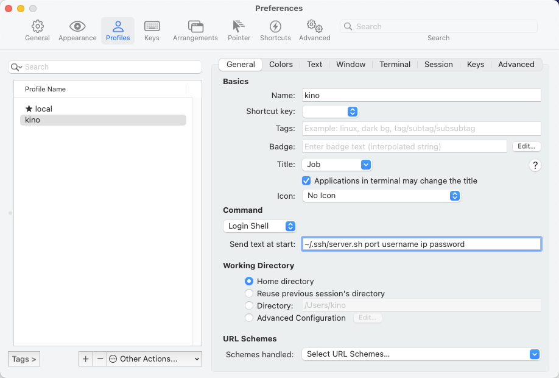

---


# 一、创建脚本
```bash
$ cd ~/.ssh
$ vim server.sh
#!/usr/bin/expect

set timeout 30
spawn ssh -p [lindex $argv 0] [lindex $argv 1]@[lindex $argv 2]
expect {
        "(yes/no)?"
        {send "yes\n";exp_continue}
        "password:"
        {send "[lindex $argv 3]\n"}
}
interact

$ chmod +x server.sh
```
如上面的代码所示，其含有四个参数，分别为

- `[lindex $argv 0]`，表示服务器端口号；
- `[lindex $argv 1]`，表示服务器名称；
- `[lindex $argv 2]`，表示服务器 IP 地址；
- `[lindex $argv 3]` ，表示服务器密码。

# 二、配置
`iTerm2` -> `Preferences` -> `Profiles`


# 三、使用
`command + o` 打开, 选中要登录的服务器即可。

# 四、主题
下载：https://iterm2colorschemes.com/

使用: `iTerm2` -> `Preferences` -> `Profiles` -> `Colors` -> `Import...`


