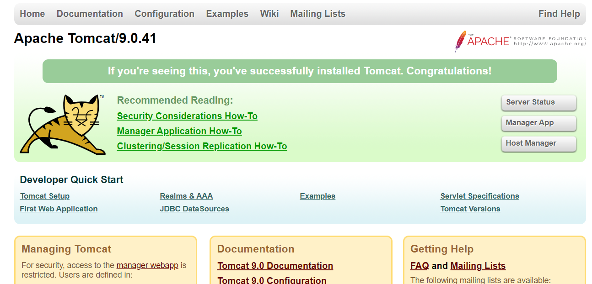
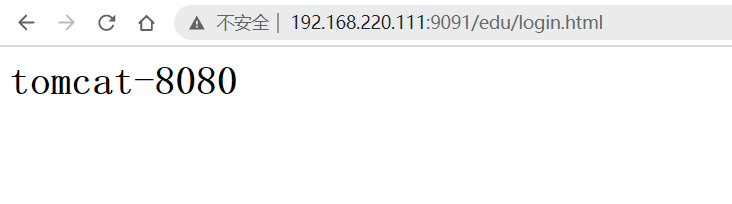

---
# 一、Nginx 简介
[中文简介文档](https://www.nginx.cn/doc/general/overview.html)

# 二、Centos 安装 Nginx
## 2.1 安装编译工具及库文件
```bash
$ yum -y install make zlib zlib-devel gcc-c++ libtool  openssl openssl-devel
```
## 2.2 安装 pcre 
pcre 作用是 Nginx 支持 Rewrite 功能
```bash
$ cd /usr/local/src
$ wget http://downloads.sourceforge.net/project/pcre/pcre/8.35/pcre-8.35.tar.gz
$ tar zxvf pcre-8.35.tar.gz
$ cd pcre-8.35
$ ./configure
$ make && make install
$ pcre-config --version
8.35
```

## 2.3 编译安装 nginx
[Nginx 下载地址](http://nginx.org/)

```bash
# 查看编译的帮助文档
$ ./configure --help

  # 如果下面几个参数没有设置, 默认都放在 --prefix 指定的路径下
  --prefix=PATH                      set installation prefix
  --sbin-path=PATH                   set nginx binary pathname
  --modules-path=PATH                set modules path
  --conf-path=PATH                   set nginx.conf pathname
  --error-log-path=PATH              set error log pathname
  --pid-path=PATH                    set nginx.pid pathname
  --lock-path=PATH                   set nginx.lock pathname

 # --with 和 --without 是确认需要使用什么模块和不使用哪些模块
 # --with: 默认不会被编译进 nginx 中, 编译需要手动指定
 --with-*****
 # --without: 默认会被编译进 nginx 中, 不编译需要手动指定
 --without-*****
 
# 使用默认编译
$ ./configure --prefix=/app/nginx/    # 将nginx 编译到 /app/nginx 目录下
# 编译完成后会输出如下信息: 
...
Configuration summary
  + using system PCRE library
  + OpenSSL library is not used
  + using system zlib library

  nginx path prefix: "/app/nginx/"
  nginx binary file: "/app/nginx//sbin/nginx"
  nginx modules path: "/app/nginx//modules"
  nginx configuration prefix: "/app/nginx//conf"
  nginx configuration file: "/app/nginx//conf/nginx.conf"
  nginx pid file: "/app/nginx//logs/nginx.pid"
  nginx error log file: "/app/nginx//logs/error.log"
  nginx http access log file: "/app/nginx//logs/access.log"
  nginx http client request body temporary files: "client_body_temp"
  nginx http proxy temporary files: "proxy_temp"
  nginx http fastcgi temporary files: "fastcgi_temp"
  nginx http uwsgi temporary files: "uwsgi_temp"
  nginx http scgi temporary files: "scgi_temp"
  
# 编译完成后, 会在 nginx/objs/ 目录(中间文件)下生成 ngx_modules.c 文件, 这个文件包含了编译时会被编译进去的模块
$ cat objs/ngx_modules.c
...

$ make && make install

$ cd /app/nginx && ll
drwxr-xr-x. 2 root root 4096 8月  20 18:56 conf
drwxr-xr-x. 2 root root   40 8月  20 18:56 html
drwxr-xr-x. 2 root root    6 8月  20 18:56 logs
drwxr-xr-x. 2 root root   19 8月  20 18:56 sbin
```

# 三、Nginx 常用命令
```bash
$ cd /usr/local/nginx/
```
## 3.1 帮助
```bash
$ sbin/nginx -help
nginx version: nginx/1.19.6
Usage: nginx [-?hvVtTq] [-s signal] [-p prefix]
             [-e filename] [-c filename] [-g directives]

Options:
  -?,-h         : this help
  -v            : show version and exit
  -V            : show version and configure options then exit
  -t            : test configuration and exit
  -T            : test configuration, dump it and exit
  -q            : suppress non-error messages during configuration testing
  -s signal     : send signal to a master process: stop, quit, reopen, reload
  -p prefix     : set prefix path (default: /usr/local/nginx/)
  -e filename   : set error log file (default: logs/error.log)
  -c filename   : set configuration file (default: conf/nginx.conf)
  -g directives : set global directives out of configuration file
```

## 3.2 启动
```bash
$ ps -ef | grep nginx
root      17986  11127  0 18:49 pts/0    00:00:00 grep --color=auto nginx
$ sbin/nginx 
$ ps -ef | grep nginx
root      17989      1  0 18:49 ?        00:00:00 nginx: master process sbin/nginx
nobody    17990  17989  0 18:49 ?        00:00:00 nginx: worker process
root      17992  11127  0 18:49 pts/0    00:00:00 grep --color=auto nginx
```

## 3.3 暴力停止 
```bash
$ sbin/nginx -s stop
```

## 3.4 优雅停止
```bash
$ sbin/nginx -s quit
```

## 3.4 重新加载配置文件
```bash
$ sbin/nginx -s reload
```

## 3.5 指定启动的配置文件
```bash
$ sbin/nginx -c /usr/local/nginx/conf/nginx.conf
```

## 3.6 热部署
```bash
```

# 四、Nginx 配置文件
## 4.1 配置文件路径
```bash
$ cd /usr/local/nginx/conf
$ ll
总用量 68
...
-rw-r--r--. 1 root root 2656 1月   9 18:45 nginx.conf
...
```

## 4.2 配置文件内容
配置文件包含如下三部分:
1. 全局块:
   
   比如处理并发数的配置 -> `worker_processes  1;`
2. events 块: 影响 Nginx 服务器与用户的网络连接
   
    由 events 标签括起来的内容, 比如支持最大的连接数 -> `worker_connections  1024;`
3. http 块
    1. http 全局块
    2. server 块


# 五、反向代理1
效果: 在浏览器中输入 `www.kino.com` 跳转到 tomcat 主页面中

## 5.1 部署 tomcat

[下载tomcat](https://tomcat.apache.org/download-90.cgi)

###
```bash
$ tar -zxvf apache-tomcat-9.0.41.tar.gz
$ mv apache-tomcat-9.0.41 tomcat-8080
$ cd tomcat-8080
$ bin/startop.sh
$ ps -ef | grep tomcat
root      18406      1 41 19:12 pts/1    00:00:02 /usr/local/jdk1.8.0_131/bin/java -Djava.util.logging.config.file=/opt/software/tomcat-8080/conf/logging.properties -Djava.util.logging.manager=org.apache.juli.ClassLoaderLogManager -Djdk.tls.ephemeralDHKeySize=2048 -Djava.protocol.handler.pkgs=org.apache.catalina.webresources -Dorg.apache.catalina.security.SecurityListener.UMASK=0027 -Dignore.endorsed.dirs= -classpath /opt/software/tomcat-8080/bin/bootstrap.jar:/opt/software/tomcat-8080/bin/tomcat-juli.jar -Dcatalina.base=/opt/software/tomcat-8080 -Dcatalina.home=/opt/software/tomcat-8080 -Djava.io.tmpdir=/opt/software/tomcat-8080/temp org.apache.catalina.startup.Bootstrap start
root      18440  18303  0 19:13 pts/1    00:00:00 grep --color=auto tomcat
```
如果有防火墙, 开启8080 端口
```bash
$ firewall-cmd --add-port=8080/tcp --permanent
success
$ firewall-cmd --reload
```
在浏览器中输入: 虚拟机ip:8080, 即可访问 tomcat 页面



## 5.2 配置 Nginx
```config
$ vim conf/nginx.conf
server {
        listen       80;
        server_name  192.168.220.111;

        #charset koi8-r;

        #access_log  logs/host.access.log  main;

        location / {
            root   html;
            proxy_pass  http://192.168.220.111:8080;
            index  index.html index.htm;
        }
...
```
重新加载配置文件
```bash
$ sbin/nginx -s reload
```
在浏览器中输入: www.kino.com


# 六、反向代理2
效果: 根据不同的路径跳转到不同的端口服务中, nginx 监听 9091端口, 访问: `192.168.220.111:9091/edu` 跳转到 8080的tomcat, 访问 `192.168.220.111:9092/vod` 跳转到 8081 端口的tomcat

准备两个tomcat, 修改 tomcat 配置文件改端口
```bash
$ cp -R tomcat-8080 tomcat-8081
$ vim tomcat-8081/conf/server.xml
<Server port="8005" shutdown="SHUTDOWN">
改为
<Server port="8006" shutdown="SHUTDOWN">

<Connector port="8080" protocol="HTTP/1.1"
改为
<Connector port="8081" protocol="HTTP/1.1"
```
在两个tomcat 的 webapps 目录下创建 nginx 目录, 并创建 login.html
```bash
$ mkdir tomcat-8080/webapps/edu
$ mkdir tomcat-8081/webapps/vod
$ vim tomcat-8080/webapps/edu/login.html
<html>
  <head>
    <title>tomcat-8080</title>
  </head>
  <body>
    <h1>tomcat-8080</h1>
  </body>
</html>
$ vim tomcat-8080/webapps/vod/login.html
<html>
  <head>
    <title>tomcat-8081</title>
  </head>
  <body>
    <h1>tomcat-8081</h1>
  </body>
</html>
```
启动两个tomcat
```bash
$ tomcat-8080/bin/startup.sh 
Using CATALINA_BASE:   /opt/software/tomcat-8080
Using CATALINA_HOME:   /opt/software/tomcat-8080
Using CATALINA_TMPDIR: /opt/software/tomcat-8080/temp
Using JRE_HOME:        /usr/local/jdk1.8.0_131
Using CLASSPATH:       /opt/software/tomcat-8080/bin/bootstrap.jar:/opt/software/tomcat-8080/bin/tomcat-juli.jar
Using CATALINA_OPTS:   
Tomcat started.
$ tomcat-8081/bin/startup.sh 
Using CATALINA_BASE:   /opt/software/tomcat-8081
Using CATALINA_HOME:   /opt/software/tomcat-8081
Using CATALINA_TMPDIR: /opt/software/tomcat-8081/temp
Using JRE_HOME:        /usr/local/jdk1.8.0_131
Using CLASSPATH:       /opt/software/tomcat-8081/bin/bootstrap.jar:/opt/software/tomcat-8081/bin/tomcat-juli.jar
Using CATALINA_OPTS:   
Tomcat started.
```
有防火墙就开放端口
```bash
$ firewall-cmd --add-port=8081/tcp --permanent
success
$ firewall-cmd --reload
```
在浏览器访问两个tomcat的login.html


配置 Nginx
```bash
server {
        listen       9091;
        server_name  192.168.220.111;

        location ~ /edu/ {
            # alias /opt/nginx/a.html
            proxy_pass  http://192.168.220.111:8080;
        }

        location ~ /vod/ {
            proxy_pass  http://192.168.220.111:8081;
        }
    }
...
```
重新加载 Nginx 配置文件
```bash
$ sbin/nginx -s reload
```
在浏览器中访问: `192.168.220.111:9091/edu/login.html` 和 `192.168.220.111:9092/vod/login.html`




# 七、负载均衡
效果: 在浏览器中输入 `192.168.220.111/edu/login.html`, 平均分配到 8080 和 8081 端口上

准备如上两个tomcat, 将 vod 修改成 edu
```bash
$ mv /opt/software/tomcat-8081/webapps/vod/ /opt/software/tomcat-8081/webapps/edu
$ ll /opt/software/tomcat-8081/webapps/
总用量 4
drwxr-x---. 15 root root 4096 1月   9 19:27 docs
drwxr-xr-x.  2 root root   24 1月   9 19:35 edu
drwxr-x---.  7 root root   99 1月   9 19:27 examples
drwxr-x---.  6 root root   79 1月   9 19:27 host-manager
drwxr-x---.  6 root root  114 1月   9 19:27 manager
drwxr-x---.  3 root root  223 1月   9 19:27 ROOT
$ /opt/software/tomcat-8081/bin/shutdown.sh
$ /opt/software/tomcat-8081/bin/startup.sh
```

编辑 Nginx 配置文件
```bash
$ vim conf/nginx.conf
http {
...
    upstream kinoserver{
        server 192.168.220.111:8080;
        server 192.168.220.111:8081;
    }


    server {
        listen       80;
        server_name  192.168.220.111;

        #charset koi8-r;

        #access_log  logs/host.access.log  main;

        location / {
           proxy_pass  http://kinoserver;
           root  html;
           index  index.html  index.htm;
        }
...
```
重新加载 Nginx 配置文件
```bash
$ sbin/nginx -s reload
```
在浏览器中输入: `192.168.220.111/edu/login.html`, nginx 将以轮询(默认)的方式进行负载均衡

此外 upstream 还有另外两种分配策略:
- 按权重(weight): 指定轮询几率, weight 和访问率成正比, 用于服务器性能不均的情况;
  ```bash
   upstream kinoserver{
        server 192.168.220.111:8080 weight=5;
        server 192.168.220.111:8081 weight=10;
    }
  ```
- 按IP hash(ip_hash): 按每个请求的ip进行hash结果分配, 这样每个访客固定一个后端服务器, 可以解决 Session 问题;
  ```bash
   upstream kinoserver{
        ip_hash;
        server 192.168.220.111:8080;
        server 192.168.220.111:8081;
    }
  ```
- 第三方(fair): 按后台服务器的响应时间来分配请求, 响应时间短的游侠分配, 和 weight 分配策略类似;
   ```bash
   upstream kinoserver{
        server 192.168.220.111:8080;
        server 192.168.220.111:8081;
        fair;
    }
  ```
