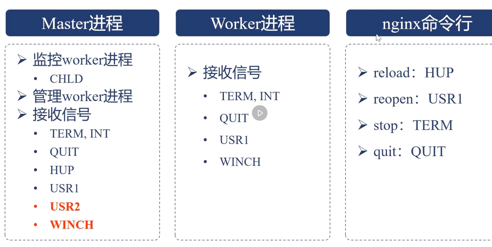

---
# 一、Nginx 安装部署
## 1.1 安装编译工具及库文件
```bash
$ yum -y install make zlib zlib-devel gcc-c++ libtool  openssl openssl-devel
```

## 1.2 安装 pcre
pcre 作用是 Nginx 支持 Rewrite 功能
```bash
$ cd /usr/local/src
$ wget http://downloads.sourceforge.net/project/pcre/pcre/8.35/pcre-8.35.tar.gz
$ tar zxvf pcre-8.35.tar.gz
$ cd pcre-8.35
$ ./configure
$ make && make install
$ pcre-config --version
8.35
```

## 1.3 编译安装 nginx
[Nginx 下载地址](http://nginx.org/)
```bash
# 查看编译的帮助文档
$ ./configure --help

  # 如果下面几个参数没有设置, 默认都放在 --prefix 指定的路径下
  --prefix=PATH                      set installation prefix
  --sbin-path=PATH                   set nginx binary pathname
  --modules-path=PATH                set modules path
  --conf-path=PATH                   set nginx.conf pathname
  --error-log-path=PATH              set error log pathname
  --pid-path=PATH                    set nginx.pid pathname
  --lock-path=PATH                   set nginx.lock pathname

 # --with 和 --without 是确认需要使用什么模块和不使用哪些模块
 # --with: 默认不会被编译进 nginx 中, 编译需要手动指定
 --with-*****
 # --without: 默认会被编译进 nginx 中, 不编译需要手动指定
 --without-*****
 
# 使用默认编译
$ ./configure --prefix=/app/nginx/    # 将nginx 编译到 /app/nginx 目录下
# 编译完成后会输出如下信息: 
...
Configuration summary
  + using system PCRE library
  + OpenSSL library is not used
  + using system zlib library

  nginx path prefix: "/app/nginx/"
  nginx binary file: "/app/nginx//sbin/nginx"
  nginx modules path: "/app/nginx//modules"
  nginx configuration prefix: "/app/nginx//conf"
  nginx configuration file: "/app/nginx//conf/nginx.conf"
  nginx pid file: "/app/nginx//logs/nginx.pid"
  nginx error log file: "/app/nginx//logs/error.log"
  nginx http access log file: "/app/nginx//logs/access.log"
  nginx http client request body temporary files: "client_body_temp"
  nginx http proxy temporary files: "proxy_temp"
  nginx http fastcgi temporary files: "fastcgi_temp"
  nginx http uwsgi temporary files: "uwsgi_temp"
  nginx http scgi temporary files: "scgi_temp"
  
# 编译完成后, 会在 nginx/objs/ 目录(中间文件)下生成 ngx_modules.c 文件, 这个文件包含了编译时会被编译进去的模块
$ cat objs/ngx_modules.c
...

$ make && make install

$ cd /app/nginx && ll
drwxr-xr-x. 2 root root 4096 8月  20 18:56 conf
drwxr-xr-x. 2 root root   40 8月  20 18:56 html
drwxr-xr-x. 2 root root    6 8月  20 18:56 logs
drwxr-xr-x. 2 root root   19 8月  20 18:56 sbin
```

# 二、Nginx 目录结构
```bash
$ cd /usr/local/nginx && ls 
client_body_temp conf fastcgi_temp html logs proxy_temp sbin scgi_temp uwsgi_temp
```

其中这几个文件夹在刚安装后是没有的，主要用来存放运行过程中的临时文件
```bash
client_body_temp fastcgi_temp proxy_temp scgi_temp
```
- conf: 用来存放配置文件相关
- html: 用来存放静态文件的默认目录 html、css等
- sbin: nginx的主程序

# 三、Nginx 常用命令
```bash
$ cd /usr/local/nginx/
```

## 3.1 帮助
```bash
$ sbin/nginx -help
nginx version: nginx/1.19.6
Usage: nginx [-?hvVtTq] [-s signal] [-p prefix]
             [-e filename] [-c filename] [-g directives]

Options:
  -?,-h         : this help
  -v            : show version and exit
  -V            : show version and configure options then exit
  -t            : test configuration and exit
  -T            : test configuration, dump it and exit
  -q            : suppress non-error messages during configuration testing
  -s signal     : send signal to a master process: stop, quit, reopen, reload
  -p prefix     : set prefix path (default: /usr/local/nginx/)
  -e filename   : set error log file (default: logs/error.log)
  -c filename   : set configuration file (default: conf/nginx.conf)
  -g directives : set global directives out of configuration file
```

## 3.2 启动
```bash
$ ps -ef | grep nginx
root      17986  11127  0 18:49 pts/0    00:00:00 grep --color=auto nginx
$ sbin/nginx 
$ ps -ef | grep nginx
root      17989      1  0 18:49 ?        00:00:00 nginx: master process sbin/nginx
nobody    17990  17989  0 18:49 ?        00:00:00 nginx: worker process
root      17992  11127  0 18:49 pts/0    00:00:00 grep --color=auto nginx
```

## 3.3 暴力停止
```bash
$ sbin/nginx -s stop
```

## 3.4 优雅停止
```bash
$ sbin/nginx -s quit
```

## 3.4 重新加载配置文件
```bash
$ sbin/nginx -s reload
```
reload 流程:
1. 向 master 进程发送 HUP 信号(reload 命令)
2. master 进程校验配置语法是否正确
3. master 进程打开新的监听端口
4. master 进程用新配置启动新的 worker 子进程
5. master 进程向老 worker 子进程发送 QUIT 信号
6. 老 worker 进程关闭监听句柄, 处理完当前连接后, 结束进程

**nginx worker进程长期处于 worker process is shutting down状态的问题**
```bash
root     30261     1  0 3月13 ?       00:00:00 nginx: master process /usr/local/nginx/sbin/nginx
nginx    30262 30261  0 3月13 ?       00:49:57 nginx: worker process is shutting down
nginx    30263 30261  0 3月13 ?       00:11:15 nginx: worker process is shutting down
nginx    30266 30261  0 3月13 ?       00:06:33 nginx: worker process is shutting down
nginx    30267 30261  0 3月13 ?       00:05:18 nginx: worker process is shutting down
nginx    30410 30261  0 3月14 ?       02:50:27 nginx: worker process is shutting down
```
Nginx 配置中如果有 WebSocket 或者 upstream 反向代理时, reload 之后, 长连接一直处于未断开状态, 导致每次reload都无法让worker进程退出.

解决办法:
```bash
$ vim nginx.conf
# 增加配置
worker_shutdown_timeout 10s;
```

worker 进程优雅关闭的流程:
1. 设置定时器: worker_shutdown_timeout
2. 关闭监听句柄
3. 关闭空闲连接
4. 在循环中等待全部连接关闭
5. 退出进程


## 3.5 指定启动的配置文件
```bash
$ sbin/nginx -c /usr/local/nginx/conf/nginx.conf
```

## 3.6 Nginx 日志切割
```bash
$ ll
drwxr-xr-x  2 nginx nginx         4096 5月  20 10:44 ./
drwxrwxr-x 16 root  syslog        4096 5月  20 00:05 ../
-rw-r--r--  1 root  root   10603437739 5月  20 10:41 access.log
-rw-r--r--  1 nginx root       1628903 5月  20 10:44 error.log
-rw-r--r--  1 nginx root     449966635 5月  20 10:44 tcp-access.log

$ mv access.log access.log.bak
$ ./sbin/nginx -s reopen
$ ll 
drwxr-xr-x  2 nginx nginx         4096 5月  20 10:44 ./
drwxrwxr-x 16 root  syslog        4096 5月  20 00:05 ../
-rw-r--r--  1 root  root   10603437739 5月  20 10:41 access.log.bak
-rw-r--r--  1 nginx root       1628903 5月  20 10:44 error.log
-rw-r--r--  1 nginx root     449966635 5月  20 10:44 tcp-access.log
-rw-r--r--  1 nginx root          1333 5月  20 10:46 access.log
```
mv 到 reopen 之间会不会丢失句? 只要没有在 mv 和 reopen 之间重启 Nginx 或 kill worker 进程, 就不会丢失日志记录.

因为 Nginx 打开日志文件时, 会持有一个指向日志文件的文件描述符, 这个文件描述符绑定到文件的 iNode(而不是路径).

在执行 mv access.log access.log.bak 时, 只是把文件的路径指针改了, 对于Nginx来说, 它任然持有旧的文件描述符, 日志会继续写入原来的文件, 不会修饰日志.

## 3.7 热升级




| 信号       | 作用        |
|----------|-----------|
| TERM/INT | 立即关闭整个服务  |
| QUIT     | "优雅"地关闭整个服务 | 
| HUP      | 重读配置文件并使用服务对新配置项生效 |
| USR1 | 重新打开日志文件, 可以用来进行日志切割 | 
| USR2 | 平滑升级到最新版的nginx | 
| WINCH | 所有子进程不在接收处理新链接, 相当于给 worker 进程发送 QUIR 指令 | 


升级Nginx的时候, 可以做到新Nginx进程和旧Nginx进程同时提供服务.

```bash
$ /usr/local/nginx/sbin# ll
total 13272
-rwxr-xr-x 1 nginx nginx 6812410 12月  9  2021 nginx.old   # 当前运行的Nginx
-rwxr-xr-x 1 nginx nginx 6791672 12月  9  2021 nginx       # 新编译出来的Nginx

# 查看当前Nginx进程
$ ps -ef|grep nginx 
root     30261     1  0 3月13 ?       00:00:00 nginx: master process /usr/local/nginx/sbin/nginx
nginx      867 30261  0 5月16 ?       00:23:12 nginx: worker process
nginx      868 30261  0 5月16 ?       00:00:13 nginx: worker process
nginx      869 30261  0 5月16 ?       00:00:01 nginx: worker process
nginx      870 30261  0 5月16 ?       00:00:00 nginx: worker process

# 向当前Nginx master 发送热升级指令, 新master/worker启动之后, 请求将不会再去旧进程中.
$ kill -USR2 30261
$ ps -ef|grep nginx 
root     30261     1  0 3月13 ?       00:00:00 nginx: master process /usr/local/nginx/sbin/nginx
nginx      867 30261  0 5月16 ?       00:23:16 nginx: worker process
nginx      868 30261  0 5月16 ?       00:00:13 nginx: worker process
nginx      869 30261  0 5月16 ?       00:00:01 nginx: worker process
nginx      870 30261  0 5月16 ?       00:00:00 nginx: worker process
root     23021 30261  0 11:06 ?        00:00:00 nginx: master process /usr/local/nginx/sbin/nginx
nginx    23022 23021  0 11:06 ?        00:00:00 nginx: worker process
nginx    23032 23021  0 11:06 ?        00:00:00 nginx: worker process
nginx    23033 23021  0 11:06 ?        00:00:00 nginx: worker process
nginx    23034 23021  0 11:06 ?        00:00:00 nginx: worker process

# 向旧Nginx master发送退出worker指令, master 进程不会自动退出, 此时如果新进程有问题, 还可以重启旧进程的worker
$ kill -WINCH 30261
$ ps -ef|grep nginx 
root     30261     1  0 3月13 ?       00:00:00 nginx: master process /usr/local/nginx/sbin/nginx
nginx      867 30261  0 5月16 ?       00:23:16 nginx: worker process is shutting down
nginx      868 30261  0 5月16 ?       00:00:13 nginx: worker process is shutting down
nginx      900 30261  0 5月06 ?       01:03:45 nginx: worker process is shutting down
nginx    18185 30261  0 4月24 ?       00:09:19 nginx: worker process is shutting down
```

热升级流程:
1. 将旧Nginx文件换成新Nginx文件(注意备份)
2. 向Master进程发送 USR2 信号
3. Master进程修改pid文件名, 加后缀.oldbin
4. Master进程用新Nginx文件启动新Master进程
5. 向老Master进程发送 QUIR 信号, 关闭老Master进程
6. 回滚: 向老Master发送 HUP, 向新Master发送 QUIT


# 四、Nginx HTTP 模块


## 4.1 处理 HTTP 请求头部的流程

这部分需要补充计算机组成相关的知识. 相关链接如下:

[03 | 基础篇：经常说的 CPU 上下文切换是什么意思？（上）](https://time.geekbang.org/column/article/69859)

[如果这篇文章说不清epoll的本质，那就过来掐死我吧！ （1）](https://zhuanlan.zhihu.com/p/63179839)

[如果这篇文章说不清epoll的本质，那就过来掐死我吧！ （2）](https://zhuanlan.zhihu.com/p/64138532)

[如果这篇文章说不清epoll的本质，那就过来掐死我吧！ （3）](https://zhuanlan.zhihu.com/p/64746509)

[图解 | 深入揭秘 epoll 是如何实现 IO 多路复用的！](https://mp.weixin.qq.com/s/OmRdUgO1guMX76EdZn11UQ)

[I/O 多路复用：select/poll/epoll
](https://www.xiaolincoding.com/os/8_network_system/selete_poll_epoll.html#%E6%9C%80%E5%9F%BA%E6%9C%AC%E7%9A%84-socket-%E6%A8%A1%E5%9E%8B)

首先启动 Nginx, 对应的配置如下:
```bash
$ cat nginx.conf
worker_processes  1;
events {
    use epoll;
    worker_connections  1024;
}
http {
    include       mime.types;
    default_type  application/octet-stream;
    sendfile        on;
    keepalive_timeout  65;
    server {
        listen       80;
        server_name  localhost;
        location / {
            root   html;
            index  index.html index.htm;
        }
        error_page   500 502 503 504  /50x.html;
        location = /50x.html {
            root   html;
        }
    }
}

$ ./sbin/nginx
$ ps -ef|grep nginx
root      4156     1  0 13:30 ?        00:00:00 nginx: master process ./sbin/nginx
nobody   16675  4156  0 16:32 ?        00:00:00 nginx: worker process
$ ll /proc/16675/fd   # 查看当前进程的文件描述符
dr-x------ 2 nobody nogroup  0 5月  22 16:33 ./
dr-xr-xr-x 9 nobody nogroup  0 5月  22 16:32 ../
lrwx------ 1 nobody nogroup 64 5月  22 16:33 0 -> /dev/null
lrwx------ 1 nobody nogroup 64 5月  22 16:33 1 -> /dev/null
lrwx------ 1 nobody nogroup 64 5月  22 16:33 10 -> 'anon_inode:[eventpoll]'            # epoll 本身的 fd 是 10
lrwx------ 1 nobody nogroup 64 5月  22 16:33 11 -> 'anon_inode:[eventfd]'              # eventfd 的 fd 是 11
l-wx------ 1 nobody nogroup 64 5月  22 16:33 2 -> /usr/local/nginx/logs/error.log      # error.log 文件的fd 是 2
l-wx------ 1 nobody nogroup 64 5月  22 16:33 4 -> /usr/local/nginx/logs/access.log     # access.log 文件的fd 是 4
l-wx------ 1 nobody nogroup 64 5月  22 16:33 5 -> /usr/local/nginx/logs/error.log      # error.log 文件的fd 是 5
lrwx------ 1 nobody nogroup 64 5月  22 16:33 6 -> 'socket:[40184994]'                  # 已连接的 socket 的 fd 是 6
lrwx------ 1 nobody nogroup 64 5月  22 16:33 7 -> 'socket:[40188263]'                  # 已连接的 socket 的 fd 是 7
```
整个启动的伪代码如下:
```java
int main(){
    listen(lfd, ...);                              # 监听端口

    cfd1 = accept(...);							   # 接收客户端连接, 阻塞, 生成 fd1
    cfd2 = accept(...);							   # 接收客户端连接, 阻塞, 生成 fd2
    efd = epoll_create(...);					   # 创建 epfd

    epoll_ctl(efd, EPOLL_CTL_ADD, cfd1, ...);	   # epoll_ctl 将需要监听的 socket(fd1) 放到红黑树中
    epoll_ctl(efd, EPOLL_CTL_ADD, cfd2, ...);	   # epoll_ctl 将需要监听的 socket(fd2) 放到红黑树中
    epoll_wait(efd, ...)						   # epoll_wait 是阻塞的, 监听红黑树中的socket是否有事件发生
}
```

Nginx 在启动的时候, 监听了 80端口, 并且创建了两个 socket, 分别是 6/7, 在内核中创建了 epoll 对象本身(fd=10), 还创建了 eventfd(fd=11), eventfd 是用来实现线程间/进程间时间唤醒的机制, 它可以唤醒 epoll_wait 中的 worker, strace 查看该进程:
```bash
$ strace -p 16675
strace: Process 16675 attached
epoll_wait(10,
```
epoll_wait 等待文件描述符10的事件

现在请求Nginx
```bash
$ curl localhost:80
epoll_wait(10, [{EPOLLIN, {u32=2662486032, u64=22843298566160}}], 512, -1) = 1
# 客户端有socket连接上来了, 文件描述符是 3
accept4(6, {sa_family=AF_INET, sin_port=htons(53188), sin_addr=inet_addr("127.0.0.1")}, [112->16], SOCK_NONBLOCK) = 3
# epoll_ctl 将文件描述符 3 添加到 epoll 的红黑树中, 设置监听 EPOLLIN(可读)、EPOLLRDHUP(对端关闭连接)、EPOLLET(边沿触发)
# 文件描述符 3 并不会立即进入就绪链表, 除非内核判断该 socket 当前可读
epoll_ctl(10, EPOLL_CTL_ADD, 3, {EPOLLIN|EPOLLRDHUP|EPOLLET, {u32=2662486480, u64=22843298566608}}) = 0
# 客户端发送了数据, 内核唤醒线程, 将 fd=3 放入就绪列表, epoll_wait 返回后, Nginx 处理该链接数据
epoll_wait(10, [{EPOLLIN, {u32=2662486480, u64=22843298566608}}], 512, 60000) = 1
# 读取客户端请求
recvfrom(3, "GET / HTTP/1.1\r\nHost: localhost\r"..., 1024, 0, NULL, NULL) = 73
stat("/usr/local/nginx/html/index.html", {st_mode=S_IFREG|0644, st_size=21, ...}) = 0
# 打开 index.html 文件
openat(AT_FDCWD, "/usr/local/nginx/html/index.html", O_RDONLY|O_NONBLOCK) = 8
fstat(8, {st_mode=S_IFREG|0644, st_size=21, ...}) = 0
# 写响应数据
writev(3, [{iov_base="HTTP/1.1 200 OK\r\nServer: nginx/1"..., iov_len=236}], 1) = 236
sendfile(3, 8, [0] => [21], 21)         = 21
# 写 access.log 日志文件
write(4, "127.0.0.1 - - [22/May/2025:16:56"..., 85) = 85
# socket 关闭
close(8)                                = 0
setsockopt(3, SOL_TCP, TCP_NODELAY, [1], 4) = 0
epoll_wait(10, [{EPOLLIN|EPOLLRDHUP, {u32=2662486480, u64=22843298566608}}], 512, 65000) = 1
recvfrom(3, "", 1024, 0, NULL, NULL)    = 0
close(3)                                = 0
epoll_wait(10,
```

以下是 操作系统内核 - 事件模块 - HTTP 模块 的流程图


在三次握手中, 只完成了前两次握手, 这个TCP连接仅仅处于就绪队列中, Nginx并不会感知到, 只有当第三次握手完成后, 内核才会触发 Nginx 的 epoll_wait 通知有读事件(返回文件句柄fd), 用 accept 方法, 它会分配 TCP 连接的连接内存池(Nginx 中内存池分为 连接内存池 和 请求内存池), 连接内存池的大小由 `connection_pool_size` 决定, 默认 512 字节, `connection_pool_size` 仅仅维护着 TCP 连接相关的参数。

然后 HTTP 模块接收请求的处理, 当触发 accept 后, ngx_http_init_connection 回调方法就会被执行, 新建立的连接的读事件就会通过 epoll_ctl 函数添加到 epoll 中并且添加定时器, 定时器的作用是: 当指定时间内, 请求头还未完整发完, 就超时(`client_header_timeout`), Nginx 会返回 408 状态码到客户端。

`client_header_timeout` 参数的验证:
```bash 
$ cat nginx.conf   # 确保重启Nginx让配置生效
http {
    ...
    client_header_timeout 10s;
    ...
}

# telnet 127.0.0.1 80
Trying 127.0.0.1...
Connected to localhost.
Escape character is '^]'.
# 10s 后, 会输出这行日志, 
Connection closed by foreign host.   
```
以下是tcpdump的结果:
```bash
tcpdump tcp -i lo0 -t -s 0 -c 100 and dst port 80 and src host 127.0.0.1
tcpdump: verbose output suppressed, use -v[v]... for full protocol decode
listening on lo0, link-type NULL (BSD loopback), snapshot length 524288 bytes
# telnet 会打印下面两行日志
IP localhost.54727 > localhost.http: Flags [S], seq 2169026392, win 65535, options [mss 16344,nop,wscale 6,nop,nop,TS val 1950842678 ecr 0,sackOK,eol], length 0
IP localhost.54727 > localhost.http: Flags [.], ack 2893272354, win 6380, options [nop,nop,TS val 1950842678 ecr 1099374196], length 0
# 超过10s后会再打印两行日志
IP localhost.54727 > localhost.http: Flags [.], ack 2, win 6380, options [nop,nop,TS val 1950852681 ecr 1099384199], length 0
IP localhost.54727 > localhost.http: Flags [F.], seq 0, ack 2, win 6380, options [nop,nop,TS val 1950852681 ecr 1099384199], length 0
```

当客户端的数据发过来后, 内核会响应 ACK, 同时, 事件模块的 epoll_wait 会拿到这个请求, 这个请求的回调方法是 `ngx_http_wait_request_handler`, 它会分配读取用户数据的读缓冲区 `client_header_buffer_size: 1k`, `client_header_buffer_size` 的内存是从 `connection_pool_size` 中分出来的(`connection_pool_size` 可以扩展), 这个参数也不是越大越好, 如果用户发送的数据量小, 这个内存设置的很大, worker 进程也会分配这么多内存出来; 


如果用户的数据超过了设置的 1k,


# 四、location 中的正则表达式
## 4.1 location 的作用
location 指令的作用是根据 用户请求的URI 进行匹配, 匹配到了就执行相关操作。

## 4.2 location 语法
```bash
location [=|~|~*|^~] /uri/ {
   ......
}
```

## 4.3 location 正则
1. `/` 通用匹配, 任何请求都会匹配到.
2. `=` 精确匹配.
3. `~` 正则匹配, 区分大小写.
4. `~*` 正则匹配, 不区分大小写.
5. `^~` 非正则匹配, 匹配以指定模式开头的 location.
6. `*` 代表'任意字符'.
7. `$` 以'什么结尾的匹配'.
8. `^` 以'什么开头'的匹配.
9. `!~*` 不区分大小写匹配失败.
10. `!~` 区分大小写匹配'失败-->!(取反)'.

**备注： `~`开头的都是`正则匹配`,例如`^~`不是正则匹配.**

## 4.4 location 转义
```bash
~^/prefix/.*\.html$ 
 
解释：~ 表示后面跟的是'正则',而且是区分大小写的（ "~ "区分大小写,"~* "不区分大小写）
 
~^/prefix/.*\.html$  就是'正则表达式了'
 
1) ^在正则里表示,以什么'开始'
 
2) /prefix/ 表示符合这个'文件夹路径的'
 
3) ".*" 表示匹配'单个字符多次'
 
4) "\." 表示转义 "."  采用 "." 本身,而非他在'正则里'的意思（非\r\n的单个字符）。
 
5) $ 表示以什么'结尾'
```

# 五、反向代理
## 5.1 示例1
效果: 在浏览器中输入 `www.kino.com` 跳转到 tomcat 主页面中

### 5.1.1 部署 tomcat

[下载tomcat](https://tomcat.apache.org/download-90.cgi)

###
```bash
$ tar -zxvf apache-tomcat-9.0.41.tar.gz
$ mv apache-tomcat-9.0.41 tomcat-8080
$ cd tomcat-8080
$ bin/startop.sh
$ ps -ef | grep tomcat
root      18406      1 41 19:12 pts/1    00:00:02 /usr/local/jdk1.8.0_131/bin/java -Djava.util.logging.config.file=/opt/software/tomcat-8080/conf/logging.properties -Djava.util.logging.manager=org.apache.juli.ClassLoaderLogManager -Djdk.tls.ephemeralDHKeySize=2048 -Djava.protocol.handler.pkgs=org.apache.catalina.webresources -Dorg.apache.catalina.security.SecurityListener.UMASK=0027 -Dignore.endorsed.dirs= -classpath /opt/software/tomcat-8080/bin/bootstrap.jar:/opt/software/tomcat-8080/bin/tomcat-juli.jar -Dcatalina.base=/opt/software/tomcat-8080 -Dcatalina.home=/opt/software/tomcat-8080 -Djava.io.tmpdir=/opt/software/tomcat-8080/temp org.apache.catalina.startup.Bootstrap start
root      18440  18303  0 19:13 pts/1    00:00:00 grep --color=auto tomcat
```
如果有防火墙, 开启8080 端口
```bash
$ firewall-cmd --add-port=8080/tcp --permanent
success
$ firewall-cmd --reload
```
在浏览器中输入: 虚拟机ip:8080, 即可访问 tomcat 页面


### 5.1.2 配置 Nginx
```config
$ vim conf/nginx.conf
server {
        listen       80;
        server_name  192.168.220.111;
        location / {
            proxy_pass  http://192.168.220.111:8080;
        }
...
```
重新加载配置文件
```bash
$ sbin/nginx -s reload
```
在浏览器中输入: www.kino.com


## 5.2 示例2
效果: 根据不同的路径跳转到不同的端口服务中, nginx 监听 9091端口, 访问: `192.168.220.111:9091/edu` 跳转到 8080的tomcat, 访问 `192.168.220.111:9092/vod` 跳转到 8081 端口的tomcat

准备两个tomcat, 修改 tomcat 配置文件改端口
```bash
$ cp -R tomcat-8080 tomcat-8081
$ vim tomcat-8081/conf/server.xml
<Server port="8005" shutdown="SHUTDOWN">
改为
<Server port="8006" shutdown="SHUTDOWN">

<Connector port="8080" protocol="HTTP/1.1"
改为
<Connector port="8081" protocol="HTTP/1.1"
```
在两个tomcat 的 webapps 目录下创建 nginx 目录, 并创建 login.html
```bash
$ mkdir tomcat-8080/webapps/edu
$ mkdir tomcat-8081/webapps/vod
$ vim tomcat-8080/webapps/edu/login.html
<html>
  <head>
    <title>tomcat-8080</title>
  </head>
  <body>
    <h1>tomcat-8080</h1>
  </body>
</html>
$ vim tomcat-8080/webapps/vod/login.html
<html>
  <head>
    <title>tomcat-8081</title>
  </head>
  <body>
    <h1>tomcat-8081</h1>
  </body>
</html>
```
启动两个tomcat
```bash
$ tomcat-8080/bin/startup.sh 
Using CATALINA_BASE:   /opt/software/tomcat-8080
Using CATALINA_HOME:   /opt/software/tomcat-8080
Using CATALINA_TMPDIR: /opt/software/tomcat-8080/temp
Using JRE_HOME:        /usr/local/jdk1.8.0_131
Using CLASSPATH:       /opt/software/tomcat-8080/bin/bootstrap.jar:/opt/software/tomcat-8080/bin/tomcat-juli.jar
Using CATALINA_OPTS:   
Tomcat started.
$ tomcat-8081/bin/startup.sh 
Using CATALINA_BASE:   /opt/software/tomcat-8081
Using CATALINA_HOME:   /opt/software/tomcat-8081
Using CATALINA_TMPDIR: /opt/software/tomcat-8081/temp
Using JRE_HOME:        /usr/local/jdk1.8.0_131
Using CLASSPATH:       /opt/software/tomcat-8081/bin/bootstrap.jar:/opt/software/tomcat-8081/bin/tomcat-juli.jar
Using CATALINA_OPTS:   
Tomcat started.
```
有防火墙就开放端口
```bash
$ firewall-cmd --add-port=8081/tcp --permanent
success
$ firewall-cmd --reload
```
在浏览器访问两个tomcat的login.html


配置 Nginx
```bash
server {
        listen       9091;
        server_name  192.168.220.111;

        location ~ /edu/ {
            # alias /opt/nginx/a.html
            proxy_pass  http://192.168.220.111:8080;
        }

        location ~ /vod/ {
            proxy_pass  http://192.168.220.111:8081;
        }
    }
...
```
重新加载 Nginx 配置文件
```bash
$ sbin/nginx -s reload
```
在浏览器中访问: `192.168.220.111:9091/edu/login.html` 和 `192.168.220.111:9092/vod/login.html`


## 5.3 动静分离
如果用户请求为静态资源, 直接通过nginx获取不用将请求转发到后端接口。
```bash
server {
        listen       9091;
        server_name  192.168.220.111;
        
        location / {
            proxy_pass  http://192.168.220.111:8080;
        }
        
        location /css {
            root /usr/local/nginx/static;
            index index.html index.htm;
        }
        location /img {
            root /usr/local/nginx/static;
            index index.html index.htm;
        }
        location /js {
            root /usr/local/nginx/static;
            index index.html index.htm;
        }
}
```
使用一个 location(正则) 转发 `/css、/img、/js`.
```bash
location ~*/(css|img|js) {
  root /usr/local/nginx/static;
  index index.html index.htm;
}
```

# 六、负载均衡
效果: 在浏览器中输入 `192.168.220.111/edu/login.html`, 平均分配到 8080 和 8081 端口上

准备如上两个tomcat, 将 vod 修改成 edu
```bash
$ mv /opt/software/tomcat-8081/webapps/vod/ /opt/software/tomcat-8081/webapps/edu
$ ll /opt/software/tomcat-8081/webapps/
总用量 4
drwxr-x---. 15 root root 4096 1月   9 19:27 docs
drwxr-xr-x.  2 root root   24 1月   9 19:35 edu
drwxr-x---.  7 root root   99 1月   9 19:27 examples
drwxr-x---.  6 root root   79 1月   9 19:27 host-manager
drwxr-x---.  6 root root  114 1月   9 19:27 manager
drwxr-x---.  3 root root  223 1月   9 19:27 ROOT
$ /opt/software/tomcat-8081/bin/shutdown.sh
$ /opt/software/tomcat-8081/bin/startup.sh
```

编辑 Nginx 配置文件
```bash
$ vim conf/nginx.conf
http {
...
    upstream kinoserver{
        server 192.168.220.111:8080;
        server 192.168.220.111:8081;
    }

    server {
        listen       80;
        server_name  192.168.220.111;

        #charset koi8-r;

        #access_log  logs/host.access.log  main;

        location / {
           proxy_pass  http://kinoserver;
           root  html;
           index  index.html  index.htm;
        }
...
```
重新加载 Nginx 配置文件
```bash
$ sbin/nginx -s reload
```
在浏览器中输入: `192.168.220.111/edu/login.html`, nginx 将以**轮询(默认)**的方式进行负载均衡。

## 6.1 负载均衡策略
1. 轮询(默认): 默认情况下使用轮询方式，逐一转发，这种方式适用于无状态请求;
2. weight: 指定轮询几率, weight 和访问率成正比, 用于服务器性能不均的情况;
   ```bash
   upstream kinoserver{
        server 192.168.220.111:8080 weight=5;
        server 192.168.220.111:8081 weight=10;
    }
   ```
3. ip_hash: 按每个请求的ip进行hash结果分配, 这样每个访客固定一个后端服务器, 可以解决 Session 问题;
   ```bash
   upstream kinoserver{
        ip_hash;
        server 192.168.220.111:8080;
        server 192.168.220.111:8081;
    }
   ```
4. fair: 按后台服务器的响应时间来分配请求, 响应时间短的游侠分配, 和 weight 分配策略类似;
   ```bash
   upstream kinoserver{
     server 192.168.220.111:8080;
     server 192.168.220.111:8081;
     fair;
   }
   ```
5. url_hash: 根据用户访问的url定向转发请求
   ```bash
   upstream kinoserver{
        url_hash;
        server 192.168.220.111:8080;
        server 192.168.220.111:8081;
    }
   ```

# 七、root 和 alias 区别
## 示例1
```bash
server {
        listen       9091;
        server_name  192.168.220.111;

        location /nginx/ {
            root /opt/nginx/;
        }
```
- 在 alias 目录配置下, 访问 192.168.220.111:9091/nginx/a.html 实际上访问的是 /opt/nginx/a.html
- 在 root 目录配置下, 访问 192.168.220.111:9091/nginx/a.html 实际上访问的是 /opt/nginx/nginx/a.html

## 示例2
当 location 匹配访问的path 和 alias 设置的目录名不一致时
```bash
    server {
        listen       9091;
        server_name  192.168.220.111;

        location /nginx1/ {
            alias /opt/nginx/;
        }
```
在浏览器中输入: 192.168.220.111:9091/nginx1/a.html 此时可以正常访问

当 location 匹配访问的path 和 root 设置的目录名不一致时
```bash
    server {
        listen       9091;
        server_name  192.168.220.111;

        location /nginx1/ {
            root /opt;
        }
```
在浏览器中输入: 192.168.220.111:9091/nginx1/a.html 此时不能正常访问, 查看 nginx 日志发现实际访问的路径是 `/opt/nginx1/a.html`
```bash
2021/01/09 20:48:19 [error] 22304#0: *148 open() "/opt/nginx1/a.html" failed (2: No such file or directory), client: 192.168.220.1, server: 192.168.220.111, request: "GET /nginx1/a.html HTTP/1.1", host: "192.168.220.111:9091"
```

区别:
- 在 alias 目录配置下, 访问的是 **alias + location<font color='red'>上一级</font>** 组合的地址
- 在 root 目录配置下, 访问的是 **alias + location** 组合的地址
- 当 location 匹配目录 和 alias 目录不一致时, 访问的本地目录还是 alias 配置的目录
- 当 location 匹配目录 和 root 目录不一致时, 需要将 **本地目录名 和 location 匹配访问的path名保持一致**


# 八、Nginx 斜杠(/) 说明
1. location 中的字符有没有 `/` 都没有影响。也就是说 `/user` 和 `/user/` 是一样的。
2. 如果 URL 结构是 `http://domain.com/` 的形式, 尾部有没有 `/` 都不会重定向。因为浏览器在发起请求的时候, 默认加了 `/`。虽然很多浏览器在地址栏里也不会显示 `/`。
3. 如果 URL 的结构是 `http://domain.com/some-dir/`。尾部缺少 `/` 将导致重定向。因为根据约定，URL 尾部的 `/` 表示目录，没有 `/` 表示文件, 当找不到的话会将 some-dir 当成目录, 重定向到 `/some-dir/`,去该目录下找默认文件。

## 8.1 proxy_pass 末尾带/
测试地址: http://localhost/test/hello.html

```bash
测试地址：http://192.168.171.129/test/tes.jsp
 
'场景一'：
location ^~ /test/ {
    proxy_pass http://192.168.171.129:8080/server/;
}
代理后实际访问地址：http://192.168.171.129:8080/server/tes.jsp -->'test由于匹配,所以会去除,然后拼接未匹配的'
 
'场景二'：
location ^~ /test {
    proxy_pass http://192.168.171.129:8080/server/;
}
代理后实际访问地址：http://192.168.171.129:8080/server//tes.jsp
 
'场景三'：
location ^~ /test/ {
    proxy_pass http://192.168.171.129:8080/;
}
代理后实际访问地址：http://192.168.171.129:8080/tes.jsp
 
'场景四':
location ^~ /test {
    proxy_pass http://192.168.171.129:8080/;
}
代理后实际访问地址：http://192.168.171.129:8080//tes.jsp
```

## 8.2 proxy_pass 末尾不带/
测试地址: http://localhost/test/hello.html
```bash
### 末尾不带/

proxy_pass配置中'url末尾不带/时',如url中'不包含path',则直接将'原uri拼接'在proxy_pass中url之后；如url中'包含path',则将原uri'去除location匹配表达式后的内容'拼接在proxy_pass中的url之后

 测试地址：http://192.168.171.129/test/tes.jsp
'场景一'：
 location ^~ /test/{
	proxy_pass http://192.168.171.129:8080/server;
 }
 代理后实际访问地址：http://192.168.171.129:8080/'servertes.jsp' -->'去除"/test/",然后拼接'
'场景二'：
location ^~ /test {
    proxy_pass http://192.168.171.129:8080/server;
}
代理后实际访问地址：http://192.168.171.129:8080/server/tes.jsp   -->'去除"/test",然后拼接"/tes.jsp"-->场景一和场景二的区别'
 
'场景三'：
location ^~ /test/ {
    proxy_pass http://192.168.171.129:8080;
}
代理后实际访问地址：http://192.168.171.129:8080/test/tes.jsp     -->'场景三和场景四常用'
 
'场景四'：
location ^~ /test {
    proxy_pass http://192.168.171.129:8080;
}
代理后实际访问地址：http://192.168.171.129:8080/test/tes.jsp
```
# 九、UrlRewrite

# 十、Nginx+Keepalived
安装 keepalived
```bash
yum install -y keepalived
```
配置nginx1
```bash
vim /etc/nginx/conf.d/web.conf 
server{
        listen 8080;
        root /usr/local/nginx/html;
        index test.html;
}
echo "<h1>This is web1</h1>"  > /usr/local/nginx/html/test.html
```
配置nginx2
```bash
vim /etc/nginx/conf.d/web.conf 
server{
        listen 8080;
        root /usr/local/nginx/html;
        index test.html;
}
echo "<h1>This is web2</h1>"  > /usr/local/nginx/html/test.html
```
启动两个nginx
```bash
cd $NGINX_HOME
./nginx
```
配置 keepalived(nginx1)
```bash
vim /etc/keepalived/keepalived.conf
! Configuration File for keepalived
global_defs {
   notification_email {
     acassen@firewall.loc
     failover@firewall.loc
     sysadmin@firewall.loc
   }
   notification_email_from Alexandre.Cassen@firewall.loc
   smtp_server 192.168.200.1
   smtp_connect_timeout 30
   router_id LVS_DEVEL
   vrrp_skip_check_adv_addr
   vrrp_garp_interval 0
   vrrp_gna_interval 0
}
vrrp_script nginx_check {
  script "/tools/nginx_check.sh"
  interval 1
}
vrrp_instance VI_1 {
  state MASTER
  interface ens33
  virtual_router_id 52
  priority 100
  advert_int 1
  authentication {
    auth_type PASS
    auth_pass test
  }
  virtual_ipaddress {
    192.168.149.100
  }
  track_script {
    nginx_check
  }
  notify_master /tools/master.sh
  notify_backup /tools/backup.sh
  notify_fault /tools/fault.sh
  notify_stop /tools/stop.sh
}
```
配置 keepalived(nginx2)
```bash
vim /etc/keepalived/keepalived.conf
! Configuration File for keepalived
global_defs {
   notification_email {
     acassen@firewall.loc
     failover@firewall.loc
     sysadmin@firewall.loc
   }
   notification_email_from Alexandre.Cassen@firewall.loc
   smtp_server 192.168.200.1
   smtp_connect_timeout 30
   router_id LVS_DEVEL
   vrrp_skip_check_adv_addr
   vrrp_garp_interval 0
   vrrp_gna_interval 0
}
vrrp_script nginx_check {
  script "/tools/nginx_check.sh"
  interval 1
}
vrrp_instance VI_1 {
  state BACKUP
  interface ens33
  virtual_router_id 52
  priority 99
  advert_int 1
  authentication {
    auth_type PASS
    auth_pass test
  }
  virtual_ipaddress {
    192.168.149.100
  }
  track_script {
    nginx_check
  }
  notify_master /tools/master.sh
  notify_backup /tools/backup.sh
  notify_fault /tools/fault.sh
  notify_stop /tools/stop.sh
}
```
健康检查脚本
```bash
vim /etc/keepalived/nginx_check.sh
#!/bin/bash
if [ -f /usr/local/nginx/logs/nginx.pid ]; then
  echo "success"
  exit 0
else
  echo "failed"
  exit 1
fi

chmod +x /etc/keepalived/nginx_check.sh
```
启动keepalived
```bash
vim /etc/keepalived/keepalived.conf
systemctl stop keepalived.service
systemctl start keepalived.service
systemctl status keepalived.service
```
访问nginx: http://192.168.149.100:8080, 停止启动一个nginx, 再次查看效果


# 十一、解决SEE流缓存
使用了nginx网关,可能会出现nginx缓冲sse流的问题,导致的现象是,客户端调用sse接口时,流数据并不是一条条出现的,而是一口气出现的。

nginx 增加如下配置:
```bash
server {
    listen 80;
    server_name xxxx;
    charset utf-8;
    
    # 增加如下三个配置
    proxy_http_version 1.1;
    proxy_set_header Upgrade $http_upgrade;
    proxy_set_header Connection "upgrade";
    
    location / {
      # 增加如下三个配置
      proxy_cache off;
      proxy_buffering off;
      add_header X-Accel-Buffering "no";
      
      include /usr/local/nginx/conf/proxy;
      proxy_pass http://xxxxx:xxxx;
    }
}
```
如果是 ingress nginx 增加如下配置:
```bash
    nginx.ingress.kubernetes.io/proxy-buffering: "off"
    nginx.ingress.kubernetes.io/proxy-http-version: "1.1"
    nginx.ingress.kubernetes.io/configuration-snippet: |
      proxy_set_header Upgrade $http_upgrade;
      proxy_set_header Connection "upgrade";
      proxy_cache off;
      add_header X-Accel-Buffering "no";
```

# 十二、默认转发443端口

nginx 的 https 协议是需要 SSL 模块支持的。

检查 nginx 是否安装了 SSL 模块, 如果没有 SSL 模块, 需要重新编译, 然后替换当前的 nginx。
```bash
$ ./sbin/nginx -V
nginx version: nginx/1.18.0
built by gcc 4.8.5 20150623 (Red Hat 4.8.5-44) (GCC) 
built with OpenSSL 1.0.2k-fips  26 Jan 2017
TLS SNI support enabled
configure arguments: --prefix=/app/nginx/ --with-http_ssl_module
```

conf 文件, 省略了证书相关步骤
```bash
server {
    listen       80;
    server_name  raomin.com;
    rewrite ^(.*) https://$server_name$1 permanent;
}
server {
    listen 443;
    server_name raomin.com;
    # 配置你的 ssl
    ssl on;
    ssl_certificate      key/server.crt;
    ssl_certificate_key  key/server.key;
    ssl_session_cache    shared:SSL:1m;
    ssl_session_timeout  5m;
    # ssl_ciphers  HIGH:!aNULL:!MD5;
    ssl_protocols TLSv1 TLSv1.1 TLSv1.2;
    ssl_ciphers ECDHE-RSA-AES128-GCM-SHA256:HIGH:!aNULL:!MD5:!RC4:!DHE;
    ssl_prefer_server_ciphers  on;


    location / {
        proxy_redirect ~(.*)http://(.*) $1https://$2;
        proxy_http_version 1.1;
        proxy_set_header Upgrade $http_upgrade;
        proxy_set_header Connection "upgrade";
        proxy_set_header   X-Real-IP $remote_addr;
        proxy_set_header Host  $host;
        proxy_set_header X-Request-Id $request_id;
        proxy_pass  https://xxxxx; # 你的服务
    }
}
```
重启 nginx 即可
```bash
$ ./sbin/nginx -s reload 
```


# 十三、nginx 缓存
## 强制缓存
```bash
server {
    listen 80;
    server_name 127.0.0.1;
    location ~* \.(jps|png|gif|woff2)$ {
#       add_header Cache-Control "private, max-age=3600";
#       add_header Pragma "no-cache";
       expires 1y;
       etag off;
       add_header Last-Modified "";
       root /Users/kino/Downloads/;
    }
}
```


## 协商缓存
```bash
server {
    listen 80;
    server_name 127.0.0.1;
    location ~* \.(jps|png|gif|woff2)$ {
       etag on;
       root /Users/kino/Downloads/;
    }
}
```