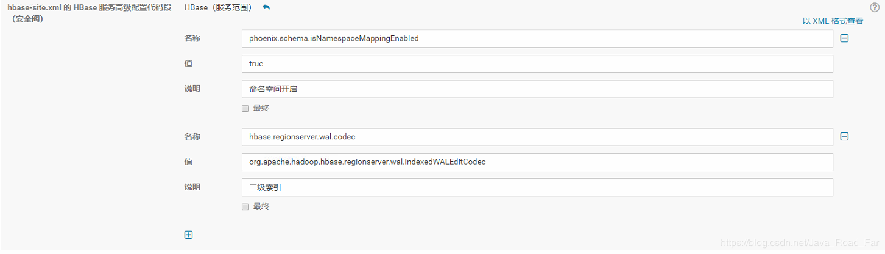
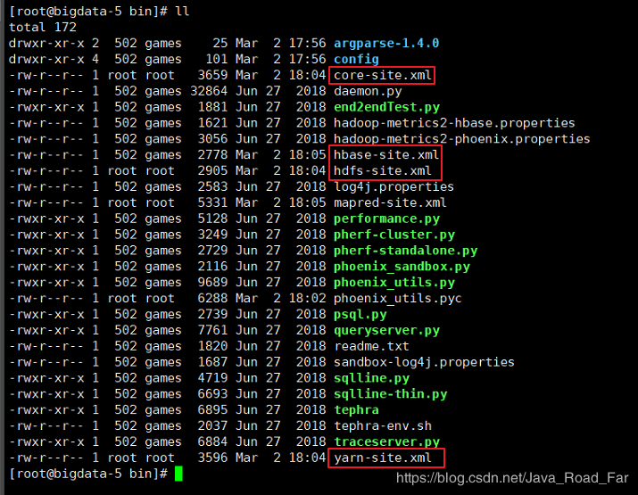

# 下载 Phoenix
http://phoenix.apache.org/download.html

---
# 解压
```bash
[root@bigdata-5 ~]# tar -zxvf apache-phoenix-5.0.0-HBase-2.0-bin.tar.gz 
apache-phoenix-5.0.0-HBase-2.0-bin/
apache-phoenix-5.0.0-HBase-2.0-bin/bin/
apache-phoenix-5.0.0-HBase-2.0-bin/examples/
......
```

---
# 拷贝指定 jar到 HBase 的lib目录
phoenix-core-<version>.jar
htrace-core-3.1.0-incubating.jar
```bash
[root@bigdata-5 phoenix]# cp 上述两个.jar /opt/cloudera/parcels/CDH-6.1.1-1.cdh6.1.1.p0.875250/lib/hbase/lib/
```
---
# 在 CDG - hbase配置中加入相关参数



hbase-site.xml 的 HBase 服务高级配置代码段（安全阀）
```xml
phoenix.schema.isNamespaceMappingEnabled
true
命名空间开启

hbase.regionserver.wal.codec
org.apache.hadoop.hbase.regionserver.wal.IndexedWALEditCodec
二级索引
```

hbase-site.xml 的 HBase 客户端高级配置代码段（安全阀）
```xml
phoenix.schema.isNamespaceMappingEnabled
true
```

---
# 将 hdfs 和 hbase 相关配置文件拷贝到 Phoenix/bin目录下



---
# 重启 Hbase即可连接Phoenix