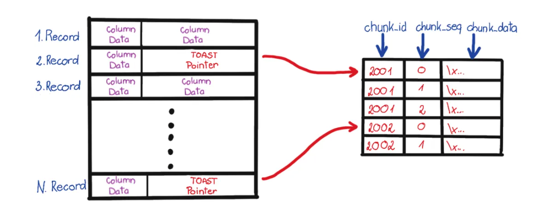

# 事故说明
uat有个服务用到了pgsql, pgsql 使用 Kubernetes 部署的一个单机版的, 因为不了解 pgsql, 所以连归档日志也没有做, 更没有定期备份数据库, 数据卷还是使用的 hostpath....

再后面又部署了sit环境, 部署脚本拷贝的uat的k8s yaml文件, 好巧不巧pgsql刚好落到了同一个k8s节点, 导致两个环境的数据互相对冲, 就开始出现问题, 比如什么 wal 不能解析, 于是运行了 `pg_resetwal` 没有带参数, 直接把数据库推回起点。

至此, pgsql 炸锅了, 并且没有备份库、没有归档日志、没有从库。甚至 ecs 没有开启磁盘快照, 连磁盘恢复这条路都堵死了, 彻底凉凉...

所以现在唯一的好消息是, 在一顿操作之间, 没有 rm -rf pg_data 目录, 当然这个目录也是各种操作之后留下来的, 不知道还有没有用.

# 解决问题

本地恢复用到了一个工具: [pg_filedump](https://github.com/df7cb/pg_filedump), `pg_filedump` 是从 pgsql 数据页面中抽取原始二进制数据的, 把数据文件交给它, 只要告诉它每一列的类型, 它就能解析出对应的数据。

在尝试解析数据之前, 需要先搞清楚现在有什么数据库, 这个信息记录在 `pg_database` 视图中, 这是一张系统表, 位于 `global` 目录中, 在集群初始化的时候会默认分配固定的 OID: 1261, 所以这个视图对应的物理文件的位置应该是 `base/1261`.

这个视图有非常多的字段, 目前最应该关心的是两个数据, `datname`和`oid`, `datname` 是数据库名称, `oid` 是用于定位数据库目录位置的. 这样就可以用 `pg_filedump` 将需要的表解析出来, `pg_filedump` 有多个参数, `-D` 参数可以告诉这张表每一行的数据类型是什么, 多个类型使用 `,` 隔开, `~` 表示忽略后面的所有列.

```bash
pg_filedump -D 'oid,name,~' global/1261

*******************************************************************
* PostgreSQL File/Block Formatted Dump Utility
*
* File: global/1261
* Options used: -D oid,name,~
*******************************************************************

Block    0 ********************************************************
<Header> -----
 Block Offset: 0x00000000         Offsets: Lower      36 (0x0024)
 Block: Size 8192  Version    4            Upper    8072 (0x1f88)
 LSN:  logid      0 recoff 0x014d5a58      Special  8192 (0x2000)
 Items:    3                      Free Space: 8036
 Checksum: 0x0000  Prune XID: 0x00000000  Flags: 0x0004 (ALL_VISIBLE)
 Length (including item array): 36

<Data> -----
 Item   1 -- Length:   37  Offset: 8152 (0x1fd8)  Flags: NORMAL
Error: unable to decode a tuple, callback #2 returned -1. Partial data: 3374
 Item   2 -- Length:   37  Offset: 8112 (0x1fb0)  Flags: NORMAL
Error: unable to decode a tuple, callback #2 returned -1. Partial data: 3375
 Item   3 -- Length:   37  Offset: 8072 (0x1f88)  Flags: NORMAL
Error: unable to decode a tuple, callback #2 returned -1. Partial data: 3377

*** End of File Encountered. Last Block Read: 0 ***
```
从这里看我的 `global/1261` 文件应该是彻底损坏了... 因为正确的结果应该是:
```bash
*******************************************************************
* PostgreSQL File/Block Formatted Dump Utility
*
* File: global/1261
* Options used: -D oid,name,~
*******************************************************************

Block    0 ********************************************************
<Header> -----
 Block Offset: 0x00000000         Offsets: Lower      36 (0x0024)
 Block: Size 8192  Version    4            Upper    8072 (0x1f88)
 LSN:  logid      0 recoff 0x014d5a58      Special  8192 (0x2000)
 Items:    3                      Free Space: 8036
 Checksum: 0x0000  Prune XID: 0x00000000  Flags: 0x0004 (ALL_VISIBLE)
 Length (including item array): 36

<Data> -----
 Item   1 -- Length:   37  Offset: 8152 (0x1fd8)  Flags: NORMAL
COPY: 123456
 ...
COPY: 23456
 ...
...
```
其中 COPY 后面的数字就是每个数据库的 `OID`, 至此, 我只能找当前还有哪些 `OID` 文件, 好消息是这个数据库就一个服务使用, 理论上就只有一个 `OID`, 在 `base` 目录发现了:
```bash
ll base/
total 44
drwx------  7 root root  4096 Aug  7 17:20 ./
drwx------ 20 root root  4096 Aug  8 22:04 ../
drwx------  2 root root  4096 Aug  7 17:20 1/
drwx------  2 root root 20480 Aug  7 22:30 16384/
drwx------  2 root root  4096 Aug  7 17:20 4/
drwx------  2 root root  4096 Aug  7 17:20 5/
drwx------  2 root root  4096 Aug  7 17:20 pgsql_tmp/
```
16384 应该就是我的数据库, 也就是说我的服务的所有的表都在 16384 目录下面. 现在明确了要恢复的数据文件目录, 接下来需要解析出下面这个表:
1. `pg_class`: 这张表最重要, 这是数据库级别的视图, OID 默认就是 1259, 所以 pg_class 对应的文件夹就是 `base/16384/1259`.

根据 `pg_class` 的表结构定义, 解析其二进制文件: `pg_filedump -D 'oid,name,oid,oid,oid,oid,oid,oid,oid,int,real,int,oid,bool,bool,char,char,smallint,smallint,bool,bool,bool,bool,bool,bool,char,bool,oid,xid,xid,text,text,text' -i base/16384/1259` 就可以看到解析出来的数据了:
```bash


*******************************************************************
* PostgreSQL File/Block Formatted Dump Utility
*
* File: base/16384/1259
* Options used: -D
*******************************************************************

Block    0 ********************************************************
<Header> -----
 Block Offset: 0x00000000         Offsets: Lower     216 (0x00d8)
 Block: Size 8192  Version    4            Upper     720 (0x02d0)
 LSN:  logid      4 recoff 0x33704bb0      Special  8192 (0x2000)
 Items:   48                      Free Space:  504
 Checksum: 0x0000  Prune XID: 0x00000000  Flags: 0x0001 (HAS_FREE_LINES)
 Length (including item array): 216

<Data> -----
 Item   1 -- Length:    0  Offset:   47 (0x002f)  Flags: REDIRECT
 Item   2 -- Length:  172  Offset: 8016 (0x1f50)  Flags: NORMAL
  XMIN: 726  XMAX: 0  CID|XVAC: 0
  Block Id: 0  linp Index: 2   Attributes: 33   Size: 32
  infomask: 0x0901 (HASNULL|XMIN_COMMITTED|XMAX_INVALID)
  t_bits: [0]: 0xff [1]: 0xff [2]: 0xff [3]: 0x3f
          [4]: 0x00

COPY: 16385	alembic_version	2200	16387	0	10	2	16385	0	1	1.000000000000	1	0	t	f	p	r	1	0	f	f	f	f	f	t	d	f0	726	1	\N	\N	\N
 Item   3 -- Length:  172  Offset: 7840 (0x1ea0)  Flags: NORMAL
  XMIN: 726  XMAX: 0  CID|XVAC: 1
  Block Id: 0  linp Index: 3   Attributes: 33   Size: 32
  infomask: 0x0901 (HASNULL|XMIN_COMMITTED|XMAX_INVALID)
  t_bits: [0]: 0xff [1]: 0xff [2]: 0xff [3]: 0x3f
          [4]: 0x00

COPY: 16388	alembic_version_pkc	2200	0	0	10	403	16388	0	2	1.000000000000	0	0	f	f	p	i	1	0	f	f	f	f	f	t	nf	0	0	0	\N	\N	\N
 Item   4 -- Length:    0  Offset:    7 (0x0007)  Flags: REDIRECT
 Item   5 -- Length:  172  Offset: 7664 (0x1df0)  Flags: NORMAL
  XMIN: 726  XMAX: 0  CID|XVAC: 16
  Block Id: 0  linp Index: 5   Attributes: 33   Size: 32
  infomask: 0x0901 (HASNULL|XMIN_COMMITTED|XMAX_INVALID)
  t_bits: [0]: 0xff [1]: 0xff [2]: 0xff [3]: 0x3f
          [4]: 0x00

COPY: 16501	conversations	2200	16503	0	10	2	16501	0	318	1581.000000000000	0	16508	t	f	p	r	24	0	f	f	f	f	f	t	df	0	726	1	\N	\N	\N
 Item  35 -- Length:  172  Offset: 2736 (0x0ab0)  Flags: NORMAL
  XMIN: 122743  XMAX: 122743  CID|XVAC: 62
  Block Id: 20  linp Index: 36   Attributes: 33   Size: 32
  infomask: 0x2521 (HASNULL|COMBOCID|XMIN_COMMITTED|XMAX_COMMITTED|UPDATED|HOT_UPDATED|HEAP_ONLY)
  t_bits: [0]: 0xff [1]: 0xff [2]: 0xff [3]: 0x3f
          [4]: 0x00
```
同样的, COPY 后面就是每张表的 OID, 后面就是表的名字.

在打印出来的信息中有个值得关注的参数是 `XMAX`, 它如果不为`0`, 则代表某一行被删除了, 那它就不能是最终被恢复的数据。 

接下来就是找到数据库中的每张表的 OID 了, 可以一行行过滤:
```bash
pg_filedump -D 'oid,name,~' base/16384/1259 | grep "apps"
COPY: 16620	installed_apps
COPY: 16712	recommended_apps
COPY: 17022	tool_published_apps
COPY: 16465	apps
COPY: 16465	apps
COPY: 16465	apps
COPY: 16465	apps
COPY: 16465	apps
COPY: 16465	apps
COPY: 16465	apps
```
可以看到 apps 表的 OID就是 16465, 解析这张表的内容, 需要明确知道这张表的数据类型, 毕竟是自己的系统, 表结构还是有的, 如果连表结构都不知道, 那得多花点时间从系统库的 `pg_catalog` 中还原出 DDL, 对于这张表, 尝试解析的数据内容如下:
```bash
pg_filedump -i -f -D 'uuid,uuid,varchar,varchar,varchar,varchar,uuid,varchar,bool,bool,int,int,bool,bool,timestamp,timestamp,bool,uuid,text,text,int,varchar,uuid,uuid,bool' base/16384/16465 | less

*******************************************************************
* PostgreSQL File/Block Formatted Dump Utility
*
* File: base/16384/16465
* Options used: -i -f -D
*******************************************************************

Block    0 ********************************************************
<Header> -----
 Block Offset: 0x00000000         Offsets: Lower     296 (0x0128)
 Block: Size 8192  Version    4            Upper    1272 (0x04f8)
 LSN:  logid      4 recoff 0x205a4f80      Special  8192 (0x2000)
 Items:   68                      Free Space:  976
 Checksum: 0x0000  Prune XID: 0x001a8b69  Flags: 0x0000 ()
 Length (including item array): 296

  0000: 04000000 804f5a20 00000000 2801f804  .....OZ ....(...
  0010: 00200420 698b1a00 02000100 389f8201  . . i.......8...
  0020: a89e1401 05000100 e09d8201 1a000100  ................
  0030: a89c6a02 3e000100 00800100 d09bb001  ..j.>...........
  0040: 18000100 109b7801 38000100 0a000100  ......x.8.......
  0050: 509a7201 11000100 b0993401 15000100  P.r.......4.....
  0060: 37000100 20991401 80983401 0f000100  7... .....4.....
  0070: 20000100 b0979201 33000100 d096b601   .......3.......
  0080: 40000100 41000100 29000100 1f000100  @...A...).......
  0090: 38962401 78957601 00800100 44000100  8.$.x.v.....D...
  00a0: 70940402 0c000100 31000100 3a000100  p.......1...:...
  00b0: 2a000100 2b000100 c8934401 00938201  *...+.....D.....
  00c0: 50925401 2d000100 90917201 2f000100  P.T.-.....r./...
  00d0: c8908201 00800100 a08f4602 00800100  ..........F.....
  00e0: 908e1602 35000100 c08d9201 3f000100  ....5.......?...
  00f0: e88ca201 f08bea01 23000100 308b7201  ........#...0.r.
  0100: 07000100 43000100 42000100 688a8201  ....C...B...h...
  0110: c8893401 d088f001 c0871602 f8868a01  ..4.............
  0120: f0850402 f884f001                    ........

<Data> -----
 Item   1 -- Length:    0  Offset:    2 (0x0002)  Flags: REDIRECT
 Item   2 -- Length:  193  Offset: 7992 (0x1f38)  Flags: NORMAL
  XMIN: 160697  XMAX: 0  CID|XVAC: 2
  Block Id: 0  linp Index: 2   Attributes: 25   Size: 32
  infomask: 0x2903 (HASNULL|HASVARWIDTH|XMIN_COMMITTED|XMAX_INVALID|UPDATED|HEAP_ONLY)
  t_bits: [0]: 0xff [1]: 0xff [2]: 0xe5 [3]: 0x01

  1f38: b9730200 00000000 02000000 00000000  .s..............
  1f48: 02001980 032920ff ffe50100 00000000  .....) .........
  1f58: 83bf51d6 d5604bfc bb853f87 e0b686ae  ..Q..`K...?.....
  1f68: dcd08724 176d43e1 a43c33b1 23eb9075  ...$.mC..<3.#..u
  1f78: 17746573 745f6167 656e7417 6167656e  .test_agent.agen
  1f88: 742d6368 61740bf0 9fa49611 23464645  t-chat......#FFE
  1f98: 41443514 6027f3c9 c6427e89 c01846f5  AD5.`'...B~...F.
  1fa8: e80a1f0f 6e6f726d 616c0101 00000000  ....normal......
  1fb8: 00000000 00000000 00c495de 8dd20200  ................
  1fc8: 00c495de 8dd20200 00030d65 6d6f6a69  ...........emoji
  1fd8: 3a773df2 29ae4609 b9d9bd36 1af182e6  :w=.).F....6....
  1fe8: 3a773df2 29ae4609 b9d9bd36 1af182e6  :w=.).F....6....
  1ff8: 00                                   .

COPY: 83bf51d6-d560-4bfc-bb85-3f87e0b686ae      dcd08724-176d-43e1-a43c-33b123eb9075    test_agent      agent-chat      🤖      #FFEAD5 146027f3-c9c6-427e-89c0-1846f5e80a1f    normal  t       t       0       0       f       f       2025-03-05 02:25:20.000000      2025-03-05 02:25:20.000000      f       \N              \N      \N      emoji   3a773df2-29ae-4609-b9d9-bd361af182e6    3a773df2-29ae-4609-b9d9-bd361af182e6    f
 Item   3 -- Length:  138  Offset: 7848 (0x1ea8)  Flags: NORMAL
  XMIN: 122675  XMAX: 0  CID|XVAC: 0
  Block Id: 0  linp Index: 3   Attributes: 19   Size: 32
...
COPY: ae016553-111c-4f80-b42b-d86b9a1894bd      dcd08724-176d-43e1-a43c-33b123eb9075    通用分布分析解读_deepseek_R1    workflow        🤖      #FFEAD5 \N      normal  t       t       0       0       f       f       2025-02-12 04:02:39.000000      2025-05-13 06:21:02.349938      f       3eb2a366-98f3-400b-8cf1-2a9c2f32eefb    适用于通用分布场景的分析解读    \N      \N      emoji   3a773df2-29ae-4609-b9d9-bd361af182e6    3a773df2-29ae-4609-b9d9-bd361af182e6    f
 Item  65 -- Length:  197  Offset: 1432 (0x0598)  Flags: NORMAL
  XMIN: 1765447  XMAX: 1765738  CID|XVAC: 0
  Block Id: 1  linp Index: 48   Attributes: 25   Size: 32
  infomask: 0x2503 (HASNULL|HASVARWIDTH|XMIN_COMMITTED|XMAX_COMMITTED|UPDATED|HOT_UPDATED|HEAP_ONLY)
  t_bits: [0]: 0xbf [1]: 0xff [2]: 0xe7 [3]: 0x01

  0598: 47f01a00 6af11a00 00000000 00000100  G...j...........
  05a8: 300019c0 032520bf ffe70100 00000000  0....% .........
  05b8: 6027ad9c 236a464f a9d818b8 22f3e0f3  `'..#jFO...."...
  05c8: dcd08724 176d43e1 a43c33b1 23eb9075  ...$.mC..<3.#..u
  05d8: 1553514c e7949fe6 88901377 6f726b66  .SQL.......workf
  05e8: 6c6f770b f09fa496 11234646 45414435  low......#FFEAD5
  05f8: 0f6e6f72 6d616c01 01000000 00000000  .normal.........
  0608: 00000000 00000000 00d44b2b 24de0200  ..........K+$...
  0618: 00d44b2b 24de0200 00cbf095 2e02f140  ..K+$..........@
  0628: bb95fb2e 27f1abcf cc0b5445 53540d65  ....'.....TEST.e
  0638: 6d6f6a69 3a773df2 29ae4609 b9d9bd36  moji:w=.).F....6
  0648: 1af182e6 3a773df2 29ae4609 b9d9bd36  ....:w=.).F....6
  0658: 1af182e6 00                          .....

COPY: 6027ad9c-236a-464f-a9d8-18b822f3e0f3      dcd08724-176d-43e1-a43c-33b123eb9075    SQL生成 workflow        🤖      #FFEAD5 \N      normal  t       t       0       0       f       f       2025-07-30 13:21:20.000000      2025-07-30 13:21:20.000000      f       cbf0952e-02f1-40bb-95fb-2e27f1abcfcc    TEST    \N      \N      emoji   3a773df2-29ae-4609-b9d9-bd361af182e6    3a773df2-29ae-4609-b9d9-bd361af182e6    f

*** End of File Encountered. Last Block Read: 1 ***
```
正常情况下: 每行数据前面都会有 COPY, COPY代表解析成功了, 如果是 Error 则表示解析失败, 失败的原因有很多种, 但是好就好在我没有出现, 所以我也不知道 Error 的怎么搞.

每行种的 `\N` 表示 NULL.

这样我就拿到了每行的数据, 把 `COPY: `截取掉, 就能 load csv 文件到数据库表中进行数据还原了.

在解析其他表的时候, 发现数据不全, 最后发现是 TOAST: 超标属性存储技术. 导致的.

如果 发现一行数据中有 `(TOASTED)` 的标识就代表被切片了, 放在了 TOAST 表中, 具体细节可以查看相关博客.



在这里尝试解析 TOAST 中的压缩数据, 至少花了大半夜的时间, 最后发现就是一个参数的事!!!
```bash
 pg_filedump help
Error: Could not open file <help>.

Usage: pg_filedump [-abcdfhikxy] [-R startblock [endblock]] [-D attrlist] [-S blocksize] [-s segsize] [-n segnumber] file

Display formatted contents of a PostgreSQL heap/index/control file
Defaults are: relative addressing, range of the entire file, block
               size as listed on block 0 in the file

The following options are valid for heap and index files:
  -a  Display absolute addresses when formatting (Block header
      information is always block relative)
  -b  Display binary block images within a range (Option will turn
      off all formatting options)
  -d  Display formatted block content dump (Option will turn off
      all other formatting options)
  -D  Decode tuples using given comma separated list of types
      Supported types:
        bigint bigserial bool char charN date float float4 float8 int
        json macaddr name numeric oid real serial smallint smallserial text
        time timestamp timestamptz timetz uuid varchar varcharN xid xml
      ~ ignores all attributes left in a tuple
  -f  Display formatted block content dump along with interpretation
  -h  Display this information
  -i  Display interpreted item details
  -k  Verify block checksums
  -o  Do not dump old values.
  -R  Display specific block ranges within the file (Blocks are
      indexed from 0)
        [startblock]: block to start at
        [endblock]: block to end at
      A startblock without an endblock will format the single block
  -s  Force segment size to [segsize]
  -t  Dump TOAST files
  -v  Ouput additional information about TOAST relations
  -n  Force segment number to [segnumber]
  -S  Force block size to [blocksize]
  -x  Force interpreted formatting of block items as index items
  -y  Force interpreted formatting of block items as heap items

The following options are valid for control files:
  -c  Interpret the file listed as a control file
  -f  Display formatted content dump along with interpretation
  -S  Force block size to [blocksize]
Additional functions:
  -m  Interpret file as pg_filenode.map file and print contents (all
      other options will be ignored)

Report bugs to <pgsql-bugs@postgresql.org>
```
- `-t`: 加上这个参数就能直接解析出被 TOAST 的字段值.

至此, 通过上述的方法, 就能直接整理出来所有表的数据了, 但是在还原的时候还是特别耗费精力, 比如就需要特别注意 `XMAX` 表示的数据。 


