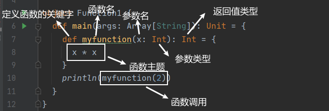

---
# 一、函数的基本语法


```scala
package function

import javax.rmi.CORBA.Util

object Function1 {
  def main(args: Array[String]): Unit = {
    // 1. 声明函数
    def myfunction(x: Int): Int = {
      x * x
    }
    // 2. 调用函数
    println(myfunction(2))
  }
}
```
# 二、函数至简原则
函数至简原则: 能省则省

## 2.1 至简原则细节
1. return 可以省略, Scala 会使用函数体的最后一行代码作为返回值;
2. 返回值类型如果能推断出来, 就能省略;
3. 如果函数体只有一行代码, 可以省略 `{}`
4. 如果函数无参数, 则可以省略小括号; 若定义函数时省略小括号, 则调用函数也需省略小括号; 若定义函数时未省略, 调用时可省略也可不省略;
5. 如果函数明确声明 Unit, 那么即使函数体重使用return 关键字也不起作用;
6. Scala 如果想要自动推断无返回值, 可以省略等号;
7. 如果不关心, 之关系逻辑处理, 那么函数名(def) 可以省略;
8. 如果函数明确使用 return 关键字, 那么函数返回就不能使用自行推断, 需要声明返回值类型;

## 2.2 细节对应的案例
```scala
package function

import java.util.Date

object TestFunction2 {
  def main(args: Array[String]): Unit = {
    //0. 函数的标准写法
    def f1(s: String): String = {
      return s + new Date()
    }
    println("函数的标准写法: \n"+f1("hello "))

    //至简原则: 能省则省

    //1. return 可以省略,scala 会使用函数体最后一行代码作为返回值
    def f2(s:String): String = {
      s + new Date()
    }
    println("1: \n"+f2("hello "))

    //2. 返回值类型如果能够推断出来, 那么可以省略
    def f3(s: String) = {
      s + new Date()
    }
    println("\n2: \n"+f3("hello "))

    //3. 如果函数体只有一行代码, 可以省略花括号
    def f4(s: String) = s + new Date()
    println("\n3: \n"+f4("hello "))

    //如果函数无参数, 但是声明参数列表, 那么调用时, 小括号可以加也可以不加
    def f5() = new Date()
    println(f5())
    println("\n3: \n"+f5)

    //4. 如果函数没有参数列表, 那么小括号也可以省略(调用时小括号必须省内略)
    def f6 = new Date()
    println("\n4: \n"+f6)

    //5. 如果函数明确声明unit，那么即使函数体中使用return关键字也不起作用
    def f7(): Unit = {
      //return new Date()
      new Date()
    }
    println("\n5: \n"+f7)

    //6. scala如果想要自动推断无返回值,可以省略等号
    // 将无返回值的函数称之为过程
    def f8() {
      new Date()
    }
    println("\n6: \n"+f8)

    //7. 如果不关心名称，只关系逻辑处理，那么函数名（def）可以省略
    //()->{ println("xxxxx") }
    val f = (x:String) => {
      new Date()
    }
    // 万物皆函数 : 变量也可以是函数
    println("\n7: \n"+f("ximenqing"))

    //8. 如果函数明确使用return关键字，那么函数返回就不能使用自行推断了,需要声明返回值类型
    def f9() :Date = {
      return new Date()
    }
    println("\n8: \n"+f9)
  }
}
```
输出:
```scala
函数的标准写法: 
hello Sun Aug 23 17:34:34 CST 2020
1: 
hello Sun Aug 23 17:34:34 CST 2020

2: 
hello Sun Aug 23 17:34:34 CST 2020

3: 
hello Sun Aug 23 17:34:34 CST 2020
Sun Aug 23 17:34:34 CST 2020

3: 
Sun Aug 23 17:34:34 CST 2020

4: 
Sun Aug 23 17:34:34 CST 2020

5: 
()

6: 
()

7: 
Sun Aug 23 17:34:34 CST 2020

8: 
Sun Aug 23 17:34:34 CST 2020

Process finished with exit code 0
```