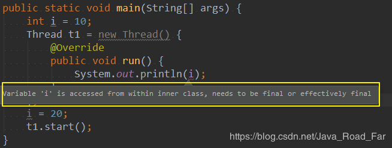
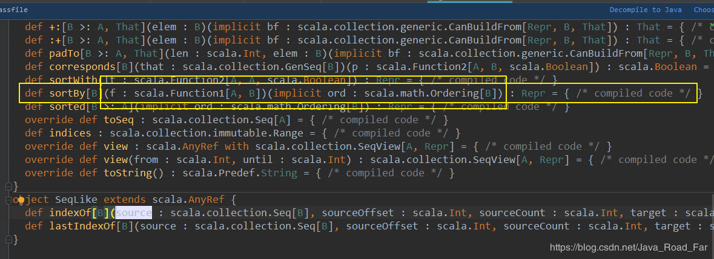

* [一、闭包：函数式编程的标配](#%E4%B8%80%E9%97%AD%E5%8C%85%E5%87%BD%E6%95%B0%E5%BC%8F%E7%BC%96%E7%A8%8B%E7%9A%84%E6%A0%87%E9%85%8D)
* [二、柯里化](#%E4%BA%8C%E6%9F%AF%E9%87%8C%E5%8C%96)


---

# 一、闭包：函数式编程的标配
	
从 Java 问题引申闭包

在 Java 中，匿名函数不能访问外部变量
```scala
public static void main(String[] args) {
    int i = 10;
    Thread t1 = new Thread() {
        @Override
        public void run() {
            System.out.println(i);
        }
    };
    t1.start();
}
```
此时编译器没有报错，运行也能出结果，但是这个结果很明显不符合要求

但是为什么没有报错呢，此时我们在为 i 重新赋值，发现 原来内部类能引用外部变量是因为java自动将外部变量 i 变成了 final 修饰的属性了

为什么 内部类访问 外部变量  需要将外部变量声明为 final 呢？就是因为 **内部类对象的生命周期会超过局部变量的生命周期**， 例如上述例子， 子线程 Thread 正在运行时，main 线程可能已经结束了， main 线程结束了，i 自然而然就被销毁了，但是此时 子线程却还用着 i，就是因为内部类的生命周期大于外部变量的生命周期了

对于上述问题， scala 是如何解决的呢？ 答案就是 闭包了；

**定义： 闭包是一个函数，返回值依赖于声明在函数外部的一个或多个变量。
通常来说：如果一个函数，访问到了它的外部(局部)变量的值，那么这个函数和它所处的环境，成为闭包**

我们看一段 scala 代码
```scala
def main(args: Array[String]): Unit = {
    var a = 10

    def foo(): Unit = {
        println(a)
    }

    foo
}
```
运行结果为: `10`

为什么 foo() 方法能访问到 外部变量 呢？ 就是因为 scala 的闭包(foo 函数和变量a组成了闭包)，因为闭包的存在，在 mian 函数销毁时，会阻止 变量 i 的销毁

**通常来说：如果一个函数，访问到了它的外部(局部)变量的值，那么这个函数和它所处的环境，成为闭包**

下面我们用闭包实现： 任意一个数 n + 4
```scala
def main(args: Array[String]): Unit = {
     val a4 = add(4)
     println(a4(5))
     println(a4(6))
     println(a4(7))
 }

 // 这个 add 是一个高阶函数
 // 能接受一个函数 或 返回 一个函数 的函数, 称为高阶函数
 def add(a: Int) = {
     // 匿名函数
     (b: Int) => a + b
 }
```
运行结果: 
```scala
9
10
11
```
上面的写法还是很繁琐，需要调用函数后，返回一个值，由这个值再去调用其中的匿名函数，所以再简化简化
```scala
def main(args: Array[String]): Unit = {
//        val a4 = add(4)
//        println(a4(5))
//        println(a4(6))
//        println(a4(7))
    
    println(add(4)(5))
    println(add(4)(6))
    println(add(5)(6))
}

def add(a: Int)(b: Int): Int = a + b

//    def add(a: Int): Int => Int = {
//        // 匿名函数
//        (b: Int) => a + b
//    }
```
那么 add(4)(5) 和 原来的 add(4, 5) 有什么区别呢?
```scala
def main(args: Array[String]): Unit = {
//        val a4 = add(4)
//        println(a4(5))
//        println(a4(6))
//        println(a4(7))

    println(add(4)(5))
    println(add(4)(6))
    println(add(5)(6))
    
    println(add1(4, 5))
}

def add1(a: Int, b: Int): Int = a + b
def add(a: Int)(b: Int): Int = a + b
```

`def add1(a: Int, b: Int): Int = a + b`
`def add(a: Int)(b: Int): Int = a + b`
这两个方法最大的区别在于 `闭包`，函数 `add` 的 `b` 来自于外部变量，而 函数 `add1` 的 `b` 来自于传入的参数


我们整个推导过程，成为函数的 `柯里化`

整个推导过程为：
从原始的
```scala
def add1(a: Int, b: Int): Int = a + b
```
推导出
```scala
def add(a: Int) = {
    // 匿名函数
    (b: Int) => a + b
}
```
推导出
```scala
def add(a: Int)(b: Int): Int = a + b
```


# 二、柯里化
**定义： 把一个参数列表的多个参数，编程多个参数列表**

柯里化的底层一定由闭包支撑着

柯里化的用处在 隐式转换、在 spark 中有大量的使用
