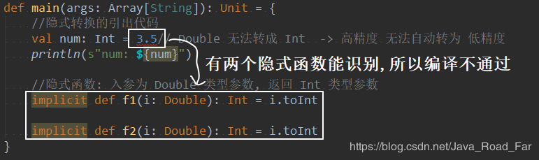

* [一、scala 隐式转换引出](#%E4%B8%80scala-%E9%9A%90%E5%BC%8F%E8%BD%AC%E6%8D%A2%E5%BC%95%E5%87%BA)
* [二、scala 丰富核心类库](#%E4%BA%8Cscala-%E4%B8%B0%E5%AF%8C%E6%A0%B8%E5%BF%83%E7%B1%BB%E5%BA%93)
* [三、scala 隐式值](#%E4%B8%89scala-%E9%9A%90%E5%BC%8F%E5%80%BC)
* [四、 scala 隐式类](#%E5%9B%9B-scala-%E9%9A%90%E5%BC%8F%E7%B1%BB)
* [五、scala 隐式的转换时机](#%E4%BA%94scala-%E9%9A%90%E5%BC%8F%E7%9A%84%E8%BD%AC%E6%8D%A2%E6%97%B6%E6%9C%BA)
* [六、隐式的解析机制](#%E5%85%AD%E9%9A%90%E5%BC%8F%E7%9A%84%E8%A7%A3%E6%9E%90%E6%9C%BA%E5%88%B6)
* [七、 隐式转换时，遵守两个基本的前提](#%E4%B8%83-%E9%9A%90%E5%BC%8F%E8%BD%AC%E6%8D%A2%E6%97%B6%E9%81%B5%E5%AE%88%E4%B8%A4%E4%B8%AA%E5%9F%BA%E6%9C%AC%E7%9A%84%E5%89%8D%E6%8F%90)

---
# 一、scala 隐式转换引出
隐式转换的引出，先看一段代码
```scala
//隐式转换的引出代码
val num: Int = 3.5// Double 无法转成 Int  -> 高精度 无法自动转为 低精度
println(s"num: ${num}")
```
**概念**
**隐式转换**: 以 implicit 关键字声明的， 带有单个参数的函数，这种函数 将会自动应用， 将值从一种类型转为另一种类型;

用隐式转换的概念，优化上面的代码，让编译通过
```scala
def main(args: Array[String]): Unit = {
	//隐式函数: 入参为 Double 类型参数, 返回 Int 类型参数
    implicit def f1(i: Double): Int = i.toInt

    //隐式转换的引出代码
    val num: Int = 3.5// Double 无法转成 Int  -> 高精度 无法自动转为 低精度
    println(s"num: ${num}")
}
```

**隐式转换的注意事项和细节：**
- 隐式转换函数的函数名是可以任意的, **隐式转换与函数名**无关, 只与**函数签名(函数参数类型和返回值)有关**
- 隐式函数可以有多个, 但是需要保证在当前环境下, **只有一个隐式函数能被识别**

第二个细节是什么意思呢？ 看一段代码

正确的姿势应该是：
```scala
def main(args: Array[String]): Unit = {
	//隐式函数: 入参为 Double 类型参数, 返回 Int 类型参数
    implicit def f1(i: Double): Int = i.toInt

    implicit def f2(i: Float): Int = i.toInt

    //隐式转换的引出代码
    val num1: Int = 3.5// Double 无法转成 Int  -> 高精度 无法自动转为 低精度
    val num2: Int = 3.5f
    println(s"num1: ${num1}, num2: ${num2}")
}
```
---

# 二、scala 丰富核心类库
**隐式转换的小案例一**：丰富 mySQL 源码的功能
```scala
object ImplicitDemo2 {
    def main(args: Array[String]): Unit = {
        val mySQL = new MySQL
        mySQL.insert()
        mySQL.update()
        mySQL.delete()
    }
    
    implicit  def myMethod(o: MySQL): KinoSQL = {
        new KinoSQL
    }
}

//定义一个类, 假设 MySQL 源码中只有一个 insert 方法
class MySQL {
    def insert(): Unit = {
        println("insert...")
    }
}

//定义一个我自己的类, 完善方法
class KinoSQL {
    //修改方法
    def update(): Unit = {
        println("update...")
    }
    //删除方法
    def delete(): Unit = {
        println("delete...")
    }
}
```

**隐式转换的小案例二**
```scala
object ImplicitDemo3 {
    def main(args: Array[String]): Unit = {
        //隐式函数: 接受 File对象, 返回自定义的 RichFile 对象, 该对象用于读取文件并输出
        implicit def file3RichFile(file:File) = new RichFile(file)

        val path: String = "D:\\Work\\idea\\WorkSpace\\scala\\src\\com\\kino\\scala\\day05\\work\\teacher\\implicitdemo\\ImplicitDemo3.scala"
        val content:String  = new File(path).readContent
        println(content)
    }
}

class RichFile(file: File){
    def readContent = Source.fromFile(file).mkString
}
```


---
# 三、scala 隐式值
**隐式值概念**： 也叫隐式变量, 将某个形参变量标记为 implicit, 所以编译器会在方法省略隐式参数的情况下去
```scala
def main(args: Array[String]): Unit = {
    //这就是 隐式值
    implicit val str1: String = "kino"

    def hello(implicit name: String): Unit = {
        println(s"name: ${name}")
    }

    hello //底层 hello$1(str1);
}
```

**隐式值、默认值、传值 的优先级**
1. 普通函数, 隐式参数有默认值
	```scala
	//普通函数, 隐式参数有默认值
	def hello(implicit context: String = "jack"): Unit = {
	    println(s"Hello, ${context}")
	}
	hello // Hello, scala
	```
2. 同时有 implicit 值和 默认值, implicit 优先级高
	```scala
	implicit val name: String = "scala"
	//当 同时又 implicit 值和 默认值, implicit 优先级高
	def hello2(implicit context: String = "jack"): Unit = {
	    println(s"Hello2, ${context}")
	}
	hello2 // Hello, scala
	```
3. 当一个隐式参数匹配不到隐式值, 仍会使用默认值
	```scala
	implicit val name: Int = 10
	def hello3(implicit context: String = "jack"): Unit = {
	    println(s"Hello3, ${context}")
	}
	hello3 // Hello3, jack
	```
4. 当没有隐式值, 没有默认值, 又没有传值, 就会报错
	```scala
	def hello4(implicit context: String): Unit = {
	    println(s"Hello4, ${context}")
	}
	hello4 //报错
	```
总结： 
1. 编译器优先级： 传值 > 隐式值 > 默认值
2. 隐式匹配时，不能有二义性
3. 如果一个都没有， 就会报错
---

# 四、 scala 隐式类
在 scala 2.10 后提供了 隐式类，可以使用 implicit 声明类， 隐式类非常强大，同样可以扩展类的功能，比前面使用隐式转换丰富类库的功能更加方便

使用隐式类，有如下几个特别：
1. 其所带的构造参数有且只能有一个
2. 隐式类必须被定义在 **"类" 或 "伴生对象" 或 "包对象"** 里，即隐式类不能是 顶级的（top-level objects）
3. 隐式类不能是 case class （case class 样例类）
4. 作用域内不能有与之相同名称的标识符
```scala
object ImplicitDemo5 {
    def main(args: Array[String]): Unit = {
    	//隐式类不能是 顶级的（top-level objects）, 所以要写在这
        implicit class DB1(val m: MySQL1) {
            def addSuffix(): String = {
                m + "scala"
            }
        }

        //创建一个 MySQL 实例
        val mySQL = new MySQL1
        mySQL.sayOK() // 本身
        mySQL.addSuffix() //通过 mySQL 关联到 DB1, 调到 DB1 的 addSuffix() 方法
    }
}

class MySQL1 {
    def sayOK(): Unit = {
        println("sayOk")
    }
}
```
---

# 五、scala 隐式的转换时机
1. 当方法中的参数的类型 与 目标类型 不一致时，或者是复制时
	```scala
	def main(args: Array[String]): Unit = {
        //隐式函数: 入参 -> Double, 返回 Int
        implicit def f1(d: Double): Int = {
            d.toInt
        }
        
        //普通函数: 入参 -> Int
        def test1(n: Int): Unit = {
            println("ok")
        }
        
        //调用 入参为 Int 的 test1 函数
        //之所以不报错, 是因为经过了 隐式函数: f1
        test1(10.2)
    }
	```
3. 当对象调用所在类中不存在的方法或成员时，编译器会自动将对象进行隐式转换(根据类型)


---
# 六、隐式的解析机制
即： 编译器是如何查找到缺失信息的，解析具有以下两种规则：
1. 首先会在当前代码作用域下查找隐式实体（隐式方法、隐式类、隐式对象）。
2. 如果第一条规则查找隐式实体失败，会继续在隐式参数的类型的作用域里查找。类型的作用域是指与该类型相关联的全部伴生模块，一个隐式实体的类型 T 它的查找范围如下(第二种情况范围广且复杂，在使用时，应当尽量避免出现):
	1. 如果 T被定义为 T with A with B with C, 那么 A,B,C 都是 T 的部分，在 T 的隐式解析过程中，它们的伴生对象都会被搜索
	2. 如果 T是参数化类型，那么类型参数和 与类型参数相关联的部分都算作 T 的部分，比如 List[String] 的隐式搜索会搜索 List 的伴生对象和 String 的伴生对象
	3. 如果 T 是一个 单例类型 p.T，即 T 是属于某个 p 对象内，那么这个 p 对象也会被搜索
	4. 如果 T 是个类型注入 S#T， 那么 S 和 T 都会被搜索

---

# 七、 隐式转换时，遵守两个基本的前提

1. 不能存在二义性
2. 隐式操作不能嵌套使用， 如：隐式转换函数
```scala
//1. 不能存在二义性
//2. 隐式操作不能嵌套使用， 如：隐式转换函数
def f2(d: Double): Int = {
    d.toInt
    val num2: Int = 2.3 // 底层 f1$1(2.3) 对应的就是 f1, 就会形成递归
}

val num1: Int = 1.1
```