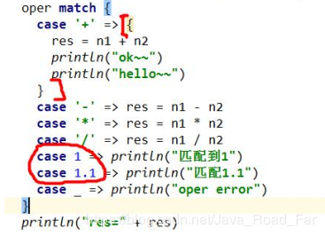
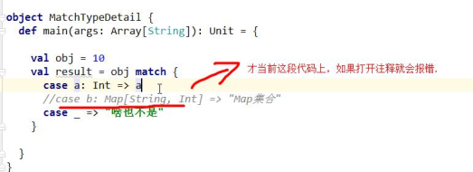

* [一、match 基本介绍](#%E4%B8%80match-%E5%9F%BA%E6%9C%AC%E4%BB%8B%E7%BB%8D)
* [二、match 的细节和注意事项](#%E4%BA%8Cmatch-%E7%9A%84%E7%BB%86%E8%8A%82%E5%92%8C%E6%B3%A8%E6%84%8F%E4%BA%8B%E9%A1%B9)
* [三、模式匹配之条件守卫](#%E4%B8%89%E6%A8%A1%E5%BC%8F%E5%8C%B9%E9%85%8D%E4%B9%8B%E6%9D%A1%E4%BB%B6%E5%AE%88%E5%8D%AB)
* [四、模式匹配之变量匹配、常量匹配](#%E5%9B%9B%E6%A8%A1%E5%BC%8F%E5%8C%B9%E9%85%8D%E4%B9%8B%E5%8F%98%E9%87%8F%E5%8C%B9%E9%85%8D%E5%B8%B8%E9%87%8F%E5%8C%B9%E9%85%8D)
* [五、模式匹配之类型匹配](#%E4%BA%94%E6%A8%A1%E5%BC%8F%E5%8C%B9%E9%85%8D%E4%B9%8B%E7%B1%BB%E5%9E%8B%E5%8C%B9%E9%85%8D)
* [六、模式匹配之数组匹配](#%E5%85%AD%E6%A8%A1%E5%BC%8F%E5%8C%B9%E9%85%8D%E4%B9%8B%E6%95%B0%E7%BB%84%E5%8C%B9%E9%85%8D)
* [七、模式匹配之集合匹配](#%E4%B8%83%E6%A8%A1%E5%BC%8F%E5%8C%B9%E9%85%8D%E4%B9%8B%E9%9B%86%E5%90%88%E5%8C%B9%E9%85%8D)
* [八、模式匹配之元组匹配](#%E5%85%AB%E6%A8%A1%E5%BC%8F%E5%8C%B9%E9%85%8D%E4%B9%8B%E5%85%83%E7%BB%84%E5%8C%B9%E9%85%8D)
* [九、模式匹配之变量声明匹配](#%E4%B9%9D%E6%A8%A1%E5%BC%8F%E5%8C%B9%E9%85%8D%E4%B9%8B%E5%8F%98%E9%87%8F%E5%A3%B0%E6%98%8E%E5%8C%B9%E9%85%8D)
* [十、模式匹配之对象匹配](#%E5%8D%81%E6%A8%A1%E5%BC%8F%E5%8C%B9%E9%85%8D%E4%B9%8B%E5%AF%B9%E8%B1%A1%E5%8C%B9%E9%85%8D)
* [十一、模式匹配之样例(模板)类](#%E5%8D%81%E4%B8%80%E6%A8%A1%E5%BC%8F%E5%8C%B9%E9%85%8D%E4%B9%8B%E6%A0%B7%E4%BE%8B%E6%A8%A1%E6%9D%BF%E7%B1%BB)
* [十二、case 语句的中置(缀)表达式](#%E5%8D%81%E4%BA%8Ccase-%E8%AF%AD%E5%8F%A5%E7%9A%84%E4%B8%AD%E7%BD%AE%E7%BC%80%E8%A1%A8%E8%BE%BE%E5%BC%8F)

# 一、match 基本介绍

scala 中的模式匹配类似于 Java 中的 switch 语法, 但是更加强大;

模式匹配语法中, 采用 match 关键字声明, 每个分支采用 case 关键字进行声明, 当需要匹配时,会从第一个 case 分支开始, 如果匹配成功, 那么执行对应的逻辑代码, 如果匹配不成功, 继续执行下一个分支进行判断; 如果所有 case 都不匹配, 那么会执行 case _ 分支, 类似于 Java 中 default 语句;

```java
def main(args: Array[String]): Unit = {
        val a: Int = 1
        val b: Int = 2
        val op: String = StdIn.readLine("请输入一个运算符: ")
        val Plus = "+"
        op match {
            case "+" => println(s"$a + $b = ${a + b}")
            case "-" => println(s"$a - $b = ${a - b}")
            case "*" => println(s"$a * $b = ${a * b}")
            case "/" => println(s"$a / $b = ${a / b}")
            case _ => println("运算符输入有误...")
        }
    }
```
---

# 二、match 的细节和注意事项
1. 如果所有 case 都不匹配，那么会执行 case _ 分支，类似于 Java 中的 default 语句
2. 如果所有 case 都不匹配，又没有写 case _ 分支，那么会抛出 MatchError
3. 每个 case 中，不用 break，自动终端 case
4. 可以在 match 中使用其他类型，而不仅仅是字符
5. `=>` 等价于 Java switch 的 `:`
6. `=>` 后面的代码块到下一个 case，是作为一整体执行，可以使用 {} 括起来， 也可以不括

---
# 三、模式匹配之条件守卫
概念： 如果想要表达匹配某个范围的数据，就需要在 模式匹配中增加条件守卫
```java
def main(args: Array[String]): Unit = {
    val list = List(1, 2, 'a', "abc", "+", "-", true)
    for (c <- list) {
        c match {
            //如果 c 为 Int 类型的
            case a: Int => println(a + 1)
            //如果 c 为 "+"
            case "+" => println(1)
            //如果 c 为 "-"
            case "-" => println(1)
            //如果 c 为变量
            case a => println("不满足条件的变量: " + a)
        }
    }
    println("---------------------")

    // "+"、"-" 都输出 1, 简化一下
    for (c <- list) {
        c match {
            case a: Int => println(a + 1)
            case op: String if op == "+" || op == "-" => println(1)
            case a => println("不满足条件的变量: " + a)
        }
    }
}
```

---
# 四、模式匹配之变量匹配、常量匹配

**变量匹配：** 在 case 关键字后跟变量名，那么 match 前表达式的值会赋值给那个变量
**常量匹配：** 常量的首字母必须大写

```java
def main(args: Array[String]): Unit = {
    val a: Int = 1
    val b: Int = 2
    val op: String = StdIn.readLine("请输入一个运算符: ")
    val Plus = "+"
    op match {
        //常量匹配: 常量的首字母必须大写
        case Plus => println(s"plus: $a + $b = ${a + b}")
        //变量匹配
        case "+" => println(s"$a + $b = ${a + b}")
        case "-" => println(s"$a - $b = ${a - b}")
        case "*" => println(s"$a * $b = ${a * b}")
        case "/" => println(s"$a / $b = ${a / b}")
        case aa => println(s"aa = ${aa}")
        case _ => println("运算符输入有误...")
    }
}
```

---
# 五、模式匹配之类型匹配
概念：可以匹配**对象的任意类型**，这样做避免了使用 **isInstanceOf** 和 **asInstanceOf** 方法
```java
/**
 * scala 模式匹配之: 类型匹配
 *     可以匹配 对象的任意类型, 这样做避免了使用 isInstanceOf 和 asInstanceOf 方法
 */
def main(args: Array[String]): Unit = {
    val a:Int = StdIn.readInt()
    //说明 obj 实例的类型 根据 a 的值来返回
    val obj = if(a == 1) 1
                    else if (a == 2)"2"
                    else if (a == 3) BigInt(3)
                    else if (a == 4) Map("aa" -> 1)
                    else if (a == 5) Map(1 -> "aa")
                    else if (a == 6) Array(1, 2, 3)
                    else if (a == 7) Array("aa", 1)
                    else if (a == 8) Array("aa")

    println(obj)

    val result = obj match {
        case a: Int => a
        case b: Map[String, Int] => "对象是一个字符串-数字的 Map集合"
        case c: Map[Int, String] => "对象是一个数字-字符串的 Map集合"
        case d: Array[String] => "对象是一个字符串数组" //对象是一个字符串数组
        case e: Array[Int] => "对象是一个数字数组"
        case f: BigInt => Int.MaxValue
        case _ => "啥也不是"
    }
    println(s"result: ${result.toString}")
}
```
**从1-8 的运行结果：**
```java
1
result: 啥也不是
result: 2147483647
result: 对象是一个字符串-数字的 Map集合
result: 对象是一个字符串-数字的 Map集合
result: 对象是一个数字数组
result: 啥也不是
result: 对象是一个字符串数组
```
从上面的结果我们可以看见，Map 的 `K，V` 类型不一样，返回的结果却是一样的，原因是 **`泛型擦除`**，Java 中，泛型的声明只存在于 `.java` 文件中，在 编译后的`.class` 文件中被擦除掉了，而 scala 最终会翻译成为 `.class` 文件，即此处 Map 的泛型被擦除了，所以不管声明 Map 的 `K，V` 为何种类型，都会被擦除掉

既然会被 泛型擦除，那么我们的写法就可以简写成：
```java
//case b: Map[String, Int] => "对象是一个字符串-数字的 Map集合"
//case c: Map[Int, String] => "对象是一个数字-字符串的 Map集合"

//改写成
case g: Map[_, _] => "泛型擦除 -- 对象是一个数字-字符串的 Map集合"
```
scala 中的 List 也会有泛型，同样的这里也会被泛型擦除，如果有，也可以简写成 : `case q: List[_] => 对象时 List 类型的集合`

后面我们还会说到 `List 匹配` 和 `Map 匹配`

类型匹配注意事项：
1. Map[String, Int] 和 Map[int, String]是两种不同的类型, 其他类推
2. 在进行类型匹配时，编译器会预先检测是否有可能的匹配，如果没有则报错

3. 如果 case _ 出现在 match 中间，则表示隐藏变量名，即不适用，而不是表示默认匹配


----
# 六、模式匹配之数组匹配
```java
def main(args: Array[String]): Unit = {
   //        foo(Array(1, 3, 2.3))
   //       foo(Map(1 -> 97.2))
   //        foo(1.1 :: Nil)


    val arr = Array(10, 20, 30, 40)
    arr match {
        //全部匹配
        //case Array(10, 20, 30, 40) => println("Array(10, 20, 30, 40)...")
        //占位符匹配
        //case Array(10, _, _, _) => println("Array(10, _, _, _)...")
        //获取匹配对象中的参数
        //case Array(10, a, _, b) => println(s"Array(10, $a, _, $b)")
        //通配符匹配
        //case Array(10, _*) => println(s"Array(10, _*)")
        //通配符匹配, 将部分元素转为 集合
        case Array(10, a@_*) => println(s"Array(10, a@_*) ${a.mkString(",")}")
        case _ =>
    }
}

def foo(obj: Any): Unit = {
    obj match {
        //匹配数组类型 new int[]
        case a: Array[_] => println(s"Array[Int] ${a.mkString(", ")}")
        case a: Map[_, _] => println(s"Map[_, _]")
        case a: List[_] => println(s"List[_]")
        case _: Int =>
        case _ =>
    }
}
```

---
# 七、模式匹配之集合匹配
```java
def main(args: Array[String]): Unit = {
    val list = List(1, 2, 4, 10)
    list match {
        //case List(_, a, _, _) => println(a)
        //case List(a, b@_*) => println(s"$a, $b")
        case a :: b :: c :: d :: Nil => println(s"$a, $b, $c, $d")
    }
}
```

---
# 八、模式匹配之元组匹配
```java
def main(args: Array[String]): Unit = {
    val t: (Int, Int, Int) = (1, 2, 3)
    t match {
        //全部匹配
        //case (a, b, c) => println(a, b, c)
        //部分匹配
        //case (1, _, c) => println(c)
        //报错
        case (a: Int, b: Int, c: Double) => println(a, b, c)
        case _ => println("类型不匹配")
    }
}
```

---
# 九、模式匹配之变量声明匹配
match 中， 每一个 case 都可以单独提取出来，意思是一样的
```java
//变量声明中的模式匹配
val array = Array(10, 20, 30)
//提取 array 的后两个元素
val Array(_, a, b) = array
println(s"${a}, ${b}")

//提取 array 的前两个元素, 并将后一个元素取为 集合
val Array(d, e, f@_*) = array
println(d, e, f)

//取模求余
val (k, v): (BigInt, BigInt) = BigInt(10) /% 3
println(k, v)
```

---

# 十、模式匹配之对象匹配
```java
object MatchDemo8 {
    /**
      * 对象匹配: 什么才算是匹配呢? 匹配规则如下:
      *     1. case 中对象的 unapply 方法(对象提取器) 返回 Some 集合则为匹配成功
      *     2. 返回 None 集合则为匹配失败
      */
    def main(args: Array[String]): Unit = {
        //先进入 Square 的 apply 方法得到 5 * 5
        val number: Double = Square(5.0) //35.0
        number match {
            //case Square(n) 的运行机制
            //1. 当匹配到 case Square(n)
            //2. 调用 Square 的 unapply(z: Double), z 的值就是 number
            //3. 如果对象提取器 unapply(z: Double) 返回的是 Some(6), 则表示匹配成功
                //同时将 6 赋给 Square(n) 的 n
            //4. 如果对象提取器 unapply(z: Double) 返回的是 None, 则表示匹配失败
            case Square(n) => println(s"匹配成功 n=${n}")
            case _ => println("nothing matched")
        }
    }
}
object Square {
    //1. unapply 方法时对象提取器
    //2. 接受 z: Double 类型
    //3. 返回类型是 Option[Double]
    //4. 返回的值是 Some(math.sqrt(z)) 返回 z 的开平方的值, 并放入到 Some(x)
    def unapply(z: Double): Option[Double] = {
        println(s"unapply 被调用 z = ${z}")
        //None
        Some(z)
    }

    def apply(z: Double): Double = z * z
}
```

**以上是对象匹配的一种匹配规则：**
1. case 中对象的 `unapply` 方法(对象提取器) 返回 `Some` 集合则为匹配成功
2. 返回 None 集合则为匹配失败

**对象匹配的第二种匹配规则：**

1. `2.11.1 之后`, 返回值 `Option` 不是必须的了, 也可以返回其他的类型的对象
2. 必须要有两个方法
	1. `isEmpty`：表示是否匹配成功，true 成功，false 成功
	2. `get`：如果成功，则从这个方法获取具体的匹配到的值 
```java
object MatchDemo9 {
    def main(args: Array[String]): Unit = {
        val r: Double = 9
        r match {
            // 将 r 传给 My 的 unapply 的形参, 如果 isEmpty 为 true,
            // 则将 get 返回的值 给到 该形参 a, 最后打印最终结果 a
            case My(a) => println(a)
            case _ =>
        }
    }
}

object  My {
    def unapply(arg: Double): My = new My(arg)
}
class My(r: Double) {
    //表示是否匹配成功, true 成功, false 成功
    def isEmpty: Boolean = r < 0
    //如果成功, 则从这个方法获取具体的匹配到的值
    //如果失败, 则不做任何操作
    def get: Double = math.sqrt(r)
}
```

---
# 十一、模式匹配之样例(模板)类
样例类说明：
1. 样例类仍然是类
2. 样例类用 case 关键字进行声明
3. 样例类是为 **模式匹配而优化** 的类
4. 构造器中的每一个参数都成为 **val** -- 除非它被显示地声明为 var(不建议这样做)
5. 在样例类对应的伴生对象中提供 apply 方法让你不用 new 关键字就能构造出相应的对象
6. 提供 unapply 方法让模式匹配可以工作
7. 将自动生成 **toString、equals、hashCode 和 copy** 方法(有点类似模板类，直接给生成，供程序员使用)
8. 除上述外，样例类和其他类完全一样。你可以添加方法和子弹，扩展他们
```java
object MatchDemo10 {
    def main(args: Array[String]): Unit = {
        val user = new MatchUser("kino", 18)

        user match {
            case MatchUser(name, age) => println(name, age)
        }

        val MatchUser(name, age) = user
        println(name, age)
    }
}

//object MatchUser {
//    def unapply(arg: MatchUser): Option[(String, Int)] = Some((arg.name, arg.age))
//    def apply(name: String, age: Int) = new MatchUser(name, age)
//}

case class MatchUser(val name: String, val age: Int)
class MatchUser1(val name: String, val age: Int)
```

---
# 十二、case 语句的中置(缀)表达式
什么是中置表达式? 

1 + 2 就是一个中置表达式

如果 unapply 方法产出的一个元组， 你可以在 case 语句中使用中置表达法。比如可以匹配一个 List 序列

```java
def main(args: Array[String]): Unit = {
   List(1, 3, 5, 9) match {// 修改并测试
        //1. 两个元素箭 :: 叫中置表达式, 至少 first, second 两个匹配才行
        //2. first 匹配第一个 second 匹配第二个, rest 匹配剩余部分 (5, 9)
        //case first :: second :: rest :: fourth => println(s"$first, $second, $rest, ${fourth.length}, ${fourth}")
        case a :: b :: c :: d :: f => println(s"$a, $b, $c, $d, $f, f的长度: ${f.length}")
        case _ => println("匹配不到")
    }
}
```