---
# 一、Sentry概述
`cdh` 版本的 `hadoop` 在对数据安全上的处理通常采用 `Kerberos+Sentry` 的结构。
`kerberos` 主要负责平台用户的用户认证，`sentry` 则负责数据的权限管理。
## 1.1 Sentry是什么
Apache Sentry是Cloudera公司发布的一个Hadoop开源组件，它提供了细粒度级、基于角色的授权以及多租户的管理模式。

Sentry提供了对Hadoop集群上经过身份验证的用户和应用程序的数据控制和强制执行精确级别权限的功能。Sentry目前可以与Apache Hive，Hive Metastore / HCatalog，Apache Solr，Impala和HDFS（仅限于Hive表数据）一起使用。 

Sentry旨在成为Hadoop组件的可插拔授权引擎。它允许自定义授权规则以验证用户或应用程序对Hadoop资源的访问请求。Sentry是高度模块化的，可以支持Hadoop中各种数据模型的授权。

## 1.2 Sentry中的角色
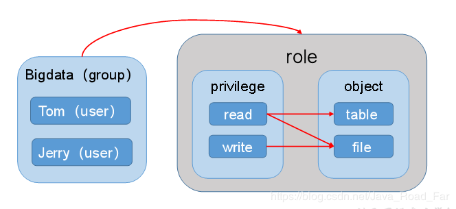
- object: 受保护的对象
- privilege: 对 object 的访问权限
- role: privilege 的集合
- user: 用户
- group: user 的集合

---
# 二、Sentry安装部署
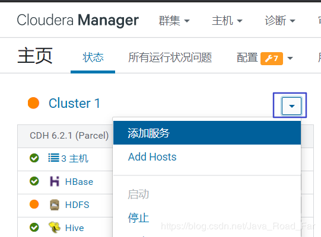
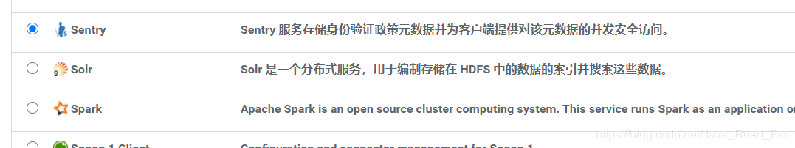
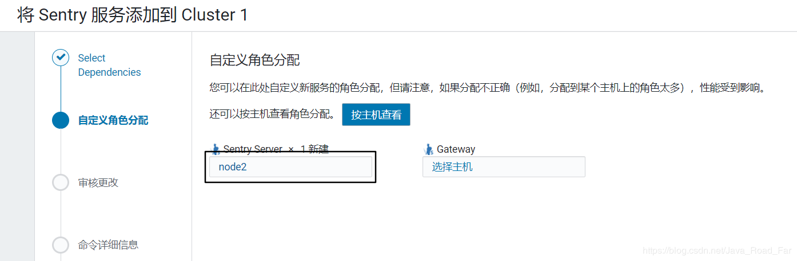
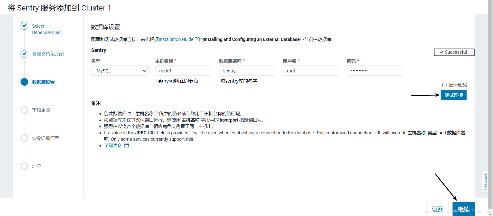
如果没有sentry库的，用root登陆mysql，执行以下sql：

```sql
mysql> CREATE DATABASE sentry DEFAULT CHARACTER SET utf8 DEFAULT COLLATE utf8_general_ci;
```
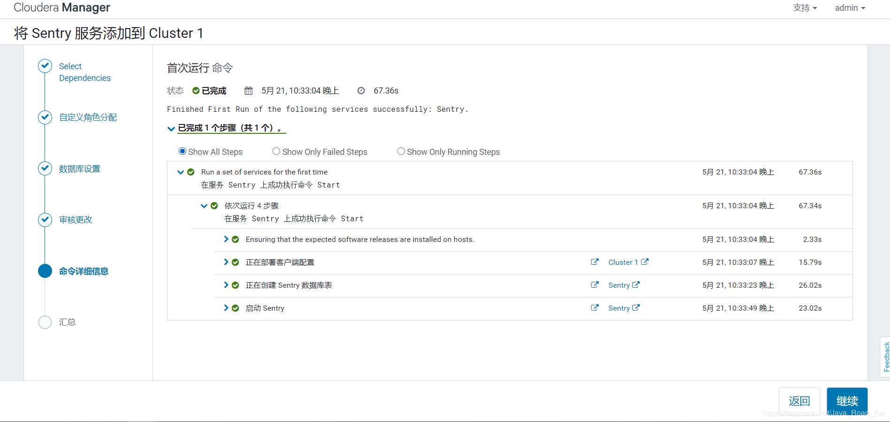

---
# 三、Sentry与Hive/Impala集成
## 3.1 修改配置参数
1. 取消HiveServer2用户模拟
	在hive配置项中搜索  “<font color="red">**HiveServer2 启用模拟**</font>”，取消勾选
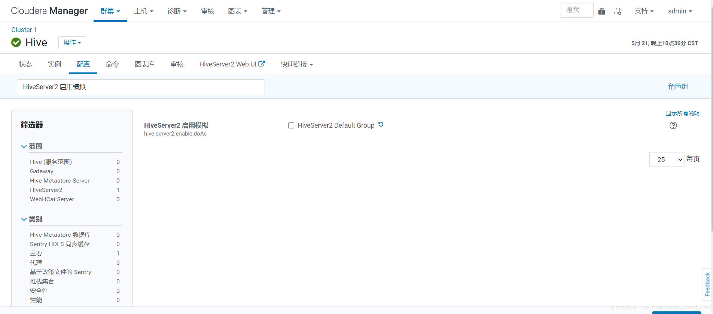
2. 确保hive用户能够提交MR任务
在yarn配置项中搜索“<font color="red">**允许的系统用户**</font>”，确保包含“hive”。
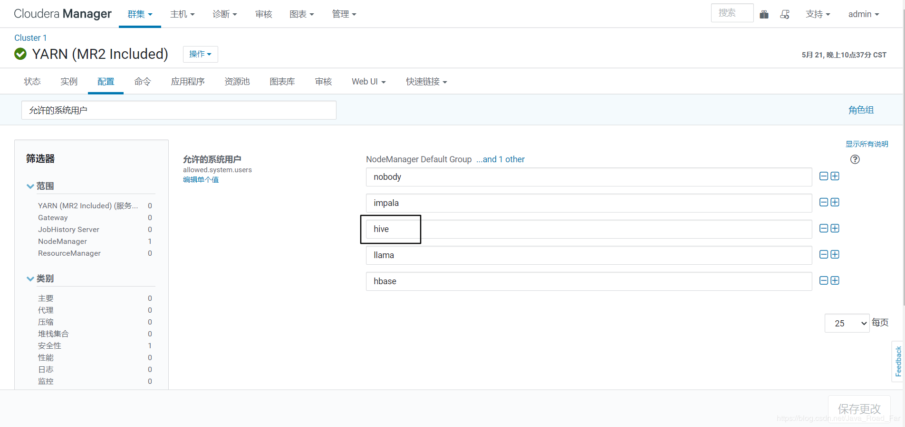
## 3.2 配置Hive使用Sentry
1. 在Hive配置项中搜索“<font color="red">**启用数据库中的存储通知**</font>”，勾选。
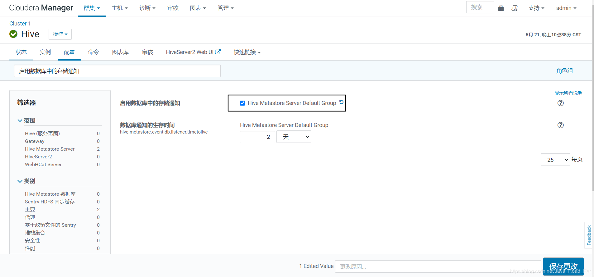
2. 在Hive配置项中搜索“<font color="red">**Sentry**</font>”，勾选Sentry。
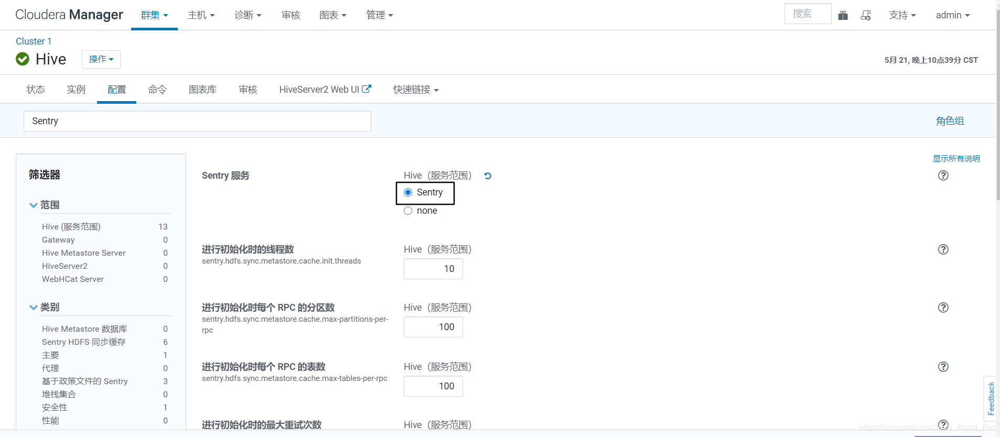
## 3.3 配置Impala使用Sentry
在Impala配置项中搜索“<font color="red">**Sentry**</font>”，勾选。
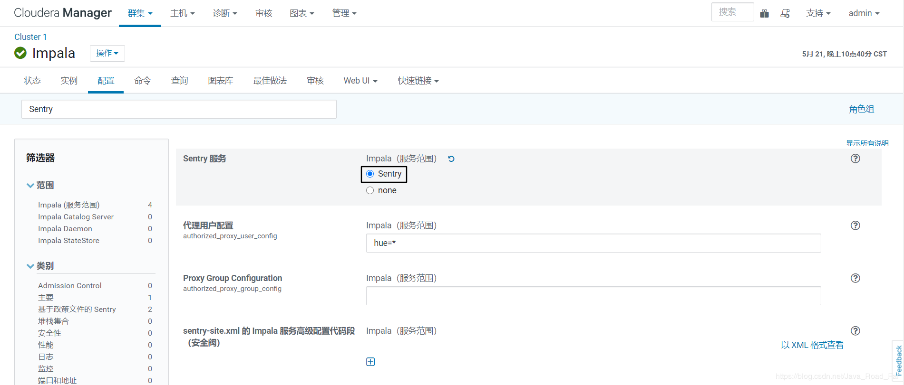
## 3.4 配置HDFS权限与Sentry同步
1. 在HDFS配置项中搜索“<font color="red">**启用访问控制列表**</font>”，勾选。
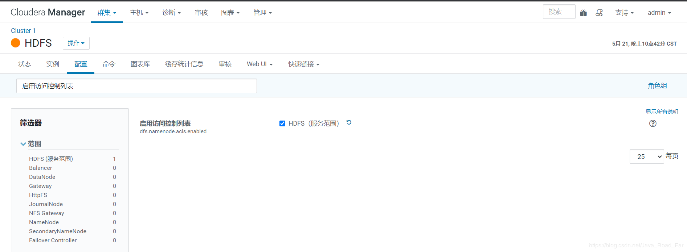
2. 在HDFS配置项中搜索“<font color="red">**启用 Sentry 同步**</font>”，做出下图修改。
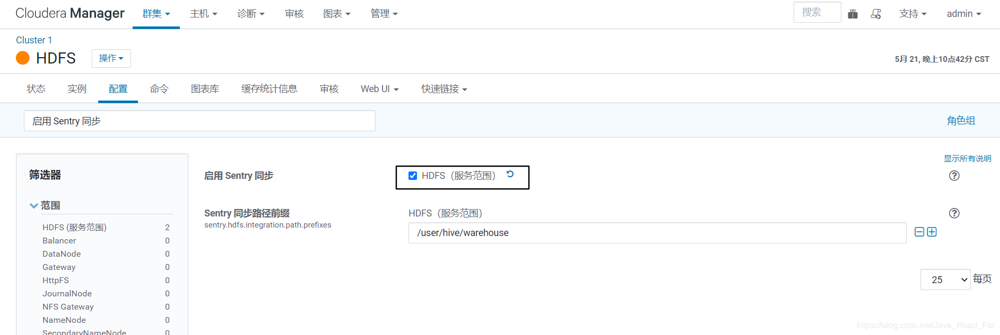

---
# 四、Sentry 授权
使用Sentry进行授权管理，需要使用Sentry的管理员用户对其他用户进行授权，授权的方式有两种，一是通过HUE进行可视化操作，一是使用HIVE中的授权语句进行操作。
## 4.1 基于 Hue
1. 配置HUE支持Sentry
在HUE配置项中搜索“<font color="red">**Sentry**</font>”，勾选Sentry。
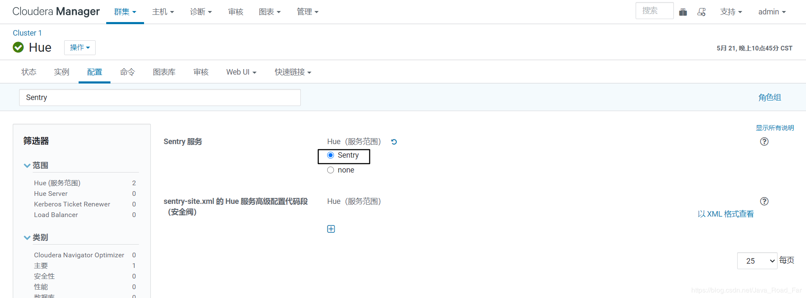
在HUE配置项中搜索“<font color="red">**sentry-site.xml**</font>”，添加如下内容。

	```bash
	sentry.hive.testing.mode
	true
	```
	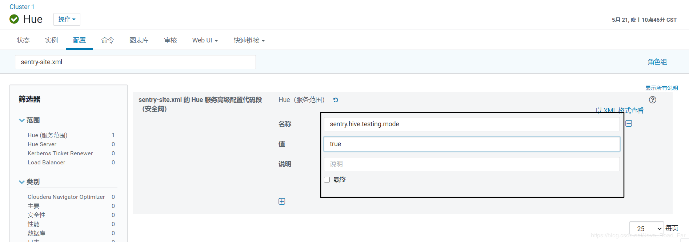
	2. 查看Sentry权限管理中的管理员组。
	在Sentry的配置项中搜索“管理员组”，其中包括hive、impala，只有当某用户所属组位于其中时，才可为其他用户授予权限。
	
2. 在Hive集群所有节点创建 kino 账号，为权限测试做准备。

	```bash
	useradd kino
	```
	使用hive用户登录HUE，创建用户组 kino ，并在两个用户组下创建用户 kino，为权限测试做准备。
	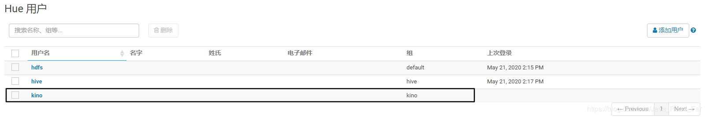
	Sentry 工作界面（需要授予 hive 用户访问Sentry的权限）
	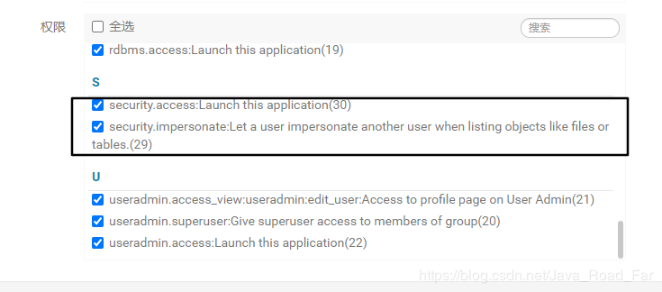
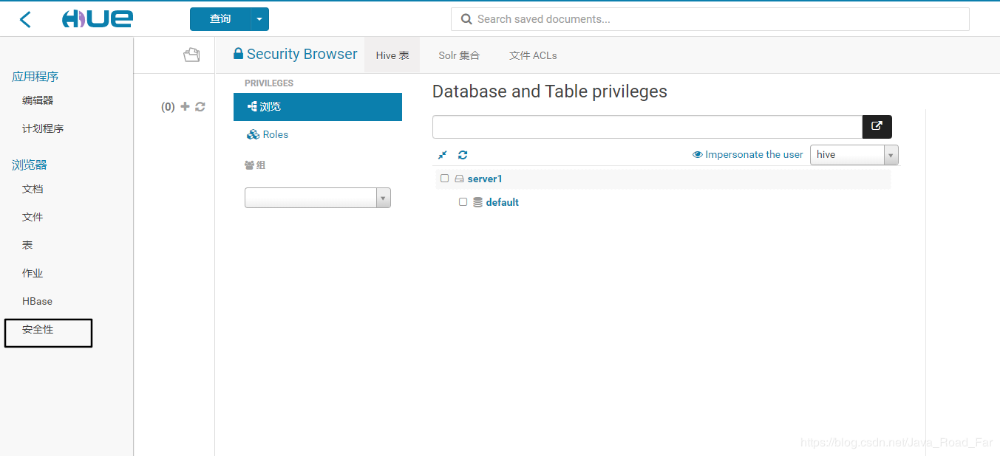
3. 点击Roles按钮，并点击添加按钮
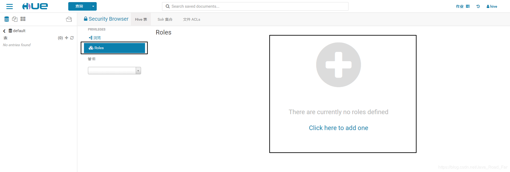
4. 编辑Role
admin_role（首先为hive用户添加管理员权限）
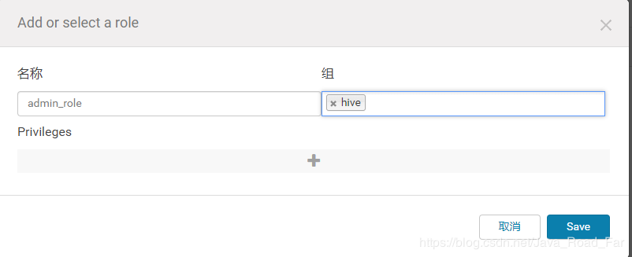
kino_role

5. 权限测试
使用kino账号登陆hue，查询default库的数据

## 4.2 基于 命令行

