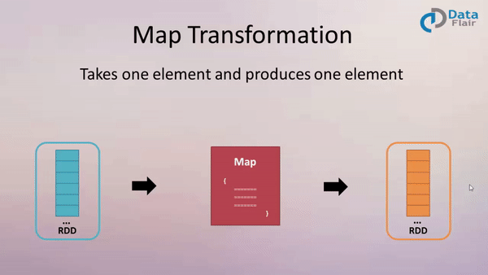
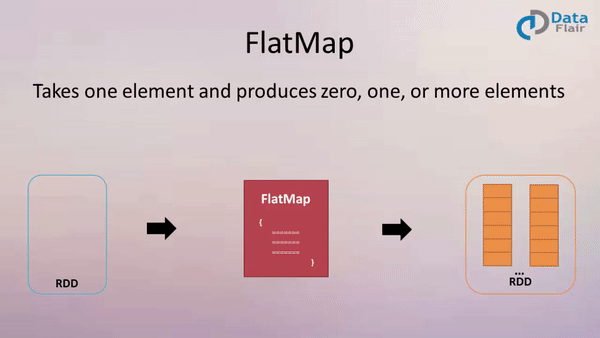

* [一、 map：](#%E4%B8%80-map)
* [二、 mapPartitions](#%E4%BA%8C-mappartitions)
* [三、 mapPartitionsWithIndex](#%E4%B8%89-mappartitionswithindex)
* [四、flatMap(func)](#%E5%9B%9Bflatmapfunc)
* [五、glom()](#%E4%BA%94glom)
* [六、groupBy(func)](#%E5%85%ADgroupbyfunc)
* [七、filter(func)](#%E4%B8%83filterfunc)
* [八、sample(withReplacement, fraction, seed)](#%E5%85%ABsamplewithreplacement-fraction-seed)
* [九、distinct([numTasks])](#%E4%B9%9Ddistinctnumtasks)
* [十、coalesce(numPartitions)](#%E5%8D%81coalescenumpartitions)
* [十一、repartition(numPartitions)](#%E5%8D%81%E4%B8%80repartitionnumpartitions)
* [十二、sortBy(func, [ascending], [numTasks])](#%E5%8D%81%E4%BA%8Csortbyfunc-ascending-numtasks)
* [十三、pipe(command, [envVars])](#%E5%8D%81%E4%B8%89pipecommand-envvars)
* [十四、union(otherDataset)](#%E5%8D%81%E5%9B%9Bunionotherdataset)
* [十五、subtract(otherDataset)](#%E5%8D%81%E4%BA%94subtractotherdataset)
* [十六、 intersection(otherDataset)](#%E5%8D%81%E5%85%AD-intersectionotherdataset)
* [十七、cartesian(otherDataset)](#%E5%8D%81%E4%B8%83cartesianotherdataset)
* [十八、zip(otherDataset)](#%E5%8D%81%E5%85%ABzipotherdataset)
* [十九、partitionBy](#%E5%8D%81%E4%B9%9Dpartitionby)
* [二十、reduceByKey(func, [numTasks])](#%E4%BA%8C%E5%8D%81reducebykeyfunc-numtasks)
* [二十一、groupByKey()](#%E4%BA%8C%E5%8D%81%E4%B8%80groupbykey)
* [reduceByKey 和 groupByKey 的区别](#reducebykey-%E5%92%8C-groupbykey-%E7%9A%84%E5%8C%BA%E5%88%AB)
* [二十二、aggregateByKey(zeroValue)(seqOp, combOp, [numTasks])](#%E4%BA%8C%E5%8D%81%E4%BA%8Caggregatebykeyzerovalueseqop-combop-numtasks)
* [二十三、foldByKey](#%E4%BA%8C%E5%8D%81%E4%B8%89foldbykey)
* [二十四、combineByKey[C]](#%E4%BA%8C%E5%8D%81%E5%9B%9Bcombinebykeyc)
* [二十五、sortByKey](#%E4%BA%8C%E5%8D%81%E4%BA%94sortbykey)
* [二十六、mapValue](#%E4%BA%8C%E5%8D%81%E5%85%ADmapvalue)
* [二十七、join(otherDataset, [numTasks])](#%E4%BA%8C%E5%8D%81%E4%B8%83joinotherdataset-numtasks)
* [二十八、cogroup(otherDataset, [numTasks])](#%E4%BA%8C%E5%8D%81%E5%85%ABcogroupotherdataset-numtasks)
* [行动算子](#%E8%A1%8C%E5%8A%A8%E7%AE%97%E5%AD%90)
* [二十九、reduce(func)](#%E4%BA%8C%E5%8D%81%E4%B9%9Dreducefunc)
* [三十、collect](#%E4%B8%89%E5%8D%81collect)
* [三十一、count](#%E4%B8%89%E5%8D%81%E4%B8%80count)
* [三十二、take(n)](#%E4%B8%89%E5%8D%81%E4%BA%8Ctaken)
* [三十三、first](#%E4%B8%89%E5%8D%81%E4%B8%89first)
* [三十四、takeOrdered(n, [ordering])](#%E4%B8%89%E5%8D%81%E5%9B%9Btakeorderedn-ordering)
* [三十五、aggregate](#%E4%B8%89%E5%8D%81%E4%BA%94aggregate)
* [三十六、fold](#%E4%B8%89%E5%8D%81%E5%85%ADfold)
* [三十七、countByKey](#%E4%B8%89%E5%8D%81%E4%B8%83countbykey)
* [三十九、foreach(func)](#%E4%B8%89%E5%8D%81%E4%B9%9Dforeachfunc)

---
# 一、 `map`：

作用: 返回一个新的 RDD, 该 RDD 是由原 RDD 的每个元素经过函数转换后的值而组成. 就是 **对 RDD 中的数据做转换.**




```scala
/**
 * map: 返回一个新的 RDD, 该 RDD 是由原 RDD 的每个元素经过函数转换后的值组成,
 * 就是对 RDD 中的数据做转换
 */
def main(args: Array[String]): Unit = {
   val conf: SparkConf = new SparkConf().setAppName("mapDemo").setMaster("local[2]")
   val sc: SparkContext = new SparkContext(conf)

   // 指定该 RDD 有两个分区
   val rdd1: RDD[Int] = sc.makeRDD(Array(10, 20, 30, 40, 50, 60), 2)

   val rdd2: RDD[Int] = rdd1.map(i => {
       println("执行了....")
       i * i
   })

   rdd2.collect().foreach(println)
   sc.stop()
}
```

运行结果：
```scala
[Stage 0:>(0 + 0) / 2]
执行了....
执行了....
执行了....
执行了....
执行了....
执行了....
100
400
900
1600
2500
3600
```
可以看到 `rdd1.map` 被执行了 **集合长度** 次数，是一个算子一个算子的转换


# 二、 `mapPartitions`

说明：执行次数 按分区数决定，如果有两个分区，将元素放入到指定 Iterator 中执行

```scala
def main(args: Array[String]): Unit = {
    val conf: SparkConf = new SparkConf().setAppName("mapPartitions").setMaster("local[2]")
    val sc = new SparkContext(conf)
    // 指定该 RDD 有两个分区
    val rdd1 = sc.makeRDD(Array(10, 20, 30, 40, 50, 60), 2)
    val rdd2: RDD[Int] = rdd1.mapPartitions(i => {
        println("执行了....")
        i.map(x => x * x)
    }, false)
    println(s"rdd2 分区数: ${rdd2.getNumPartitions}")
    rdd2.collect().foreach(println)

}
```
运行结果：
```scala
rdd2 分区数: 2
执行了....
执行了....
100
400
900
1600
2500
3600
```

# 三、 `mapPartitionsWithIndex`

作用：和 `mapPartitions(func)` 类似. 但是会给func多提供一个 `Int` 值来表示**分区的索引**. 所以func的类型是：`(Int, Iterator<T>) => Iterator<U>` 


```scala
/**
 * mapPartitionsWithIndex(fun):
 *     和 mapPartitions(fun) 类似, 但是会给 fun 多提供一个 Int 值来表示分区的索引,
 *         所以 func 的类型是: (Int, Iterator<T> => Iterator<U>)
 */
def main(args: Array[String]): Unit = {
    val conf: SparkConf = new SparkConf().setAppName("mapPatitionsWithIndex").setMaster("local[2]")
    val sc = new SparkContext(conf)
    val rdd1: RDD[Int] = sc.makeRDD(Array(10, 20, 30, 40, 50, 60), 2)
    val rdd2= rdd1.mapPartitionsWithIndex((index, items) => items.map((index, _)))
    rdd2.collect().foreach(println)
    sc.stop()
}
```
运行结果：
```scala
(0,10)
(0,20)
(0,30)
(1,40)
(1,50)
(1,60)
```

总结： 
`map()` 和 `mapPatitions()` 的区别：
1. `map()`：每次处理一条数据。
2.	`mapPartition()`：每次处理一个分区的数据，这个分区的数据处理完后，原 RDD 中该分区的数据才能释放，可能导致 OOM。
3.	`开发指导`：当内存空间较大的时候建议使用 `mapPartition()`，以提高处理效率
---


# 四、`flatMap(func)`

作用： 类似于map，但是每一个输入元素可以被映射为 0 或多个输出元素（所以func应该返回一个序列，而不是单一元素 T => TraversableOnce[U]）

```scala
def main(args: Array[String]): Unit = {
    val conf: SparkConf = new SparkConf().setAppName("flatMap").setMaster("local[2]")
    val sc = new SparkContext(conf)
    val rdd1: RDD[String] = sc.makeRDD(List("hello world", "hi kino", "kino hi kino"), 2)
    val rdd2: RDD[String] = rdd1.flatMap(line => line.split(" "))
    println(rdd2.collect().mkString(", "))
}
```
运行结果：
```scala
hello, world, hi, kino, kino, hi, kino
```
---

# 五、`glom()`
作用：将每一个分区的元素合并成一个数组，形成新的 RDD 类型是RDD[Array[T]]
```scala
def main(args: Array[String]): Unit = {
    val conf: SparkConf = new SparkConf().setAppName("glom").setMaster("local[2]")
    val sc = new SparkContext(conf)
    val rdd1: RDD[Int] = sc.makeRDD(Array(10,20,30,40,50,60), 4)
    rdd1.glom.collect.foreach(it => {
        it.foreach({
            println("---------------------分区分隔符----------------------")
            println
        })
    })
}
```
运行结果：
```scala
---------------------分区分隔符----------------------
10
---------------------分区分隔符----------------------
20
30
---------------------分区分隔符----------------------
40
---------------------分区分隔符----------------------
50
60
```

在创建 RDD 时，指定了 4 个分区， 运行结果表明了是将每一个 分区的元素合并成了数组


--- 
# 六、`groupBy(func)`
作用： 按照 func 的返回值进行分组

```scala
def main(args: Array[String]): Unit = {
    val conf: SparkConf = new SparkConf().setAppName("groupBy").setMaster("local")
    val sc = new SparkContext(conf)
    val rdd1: RDD[Int] = sc.makeRDD(Array(1, 3, 4, 20, 4, 5, 8),2)
    val rdd2 = rdd1.groupBy(x => if(x % 2 == 0) "odd" else "even")
    rdd2.collect.foreach(kv => {
        kv._2.foreach(it => println(kv._1, it))
    })
}
```
运行结果：
```
(even,1)
(even,3)
(even,5)
(odd,4)
(odd,20)
(odd,4)
(odd,8)
```

----
# 七、`filter(func)`
作用： 过滤，返回一个新的 RDD， 是由 func 的返回值为 true 的那些元素组成

```scala
def main(args: Array[String]): Unit = {
    val conf: SparkConf = new SparkConf().setAppName("filter").setMaster("local[2]")
    val sc = new SparkContext(conf)
    val rdd1 = sc.makeRDD(Array("xiaoli", "laoli", "laowang", "xiaocang", "xiaojing", "xiaokong"))
    val rdd2 = rdd1.filter(_.contains("xiao"))
    rdd2.collect().foreach(println)
}
```
运行结果：
```scala
xiaoli
xiaocang
xiaojing
xiaokong
```

---
# 八、`sample(withReplacement, fraction, seed)`
作用：
1. 以指定的随机种子随机抽样出比例为fraction的数据，(抽取到的数量是: size * fraction). 需要注意的是得到的结果并不能保证准确的比例.

2. `withReplacement` 表示是抽出的数据是否放回，true为有放回的抽样，false为无放回的抽样. 放回表示数据有可能会被重复抽取到, false 则不可能重复抽取到. 如果是false, 则fraction必须是:[0,1], 是 true 则大于等于0就可以了.

3. seed用于指定随机数生成器种子。 一般用默认的, 或者传入当前的时间戳

```python
/**
  * sample(withReplacement, fraction, seed)
  * 作用:
  *     1. 以指定的随机种子, 随机抽样出比例为 fraction 的数据, (抽取到的数量是: size * fraction)
  *         需要注意的是, 得到的结果并不能保证准确的比例
  *     2. withReplacement 表示是抽出的数据是否放回,
  *         true 为有放回的抽样, 数据可能会被重复抽取到, fraction 可以 大于 1
  *         false 为无放回的抽样, 数据不能被重复抽取到, fraction 必须是: [0, 1]
  *     3. seed 用于指定随机数生成器种子。 一般用默认的, 或者传入当前的时间戳,
  *         当指定一个固定数后, 得到的结果 每次一定是一样的
  */
 def main(args: Array[String]): Unit = {
     val conf: SparkConf = new SparkConf().setAppName("sample").setMaster("local[2]")
     val sc = new SparkContext(conf)
     val rdd1: RDD[Int] = sc.makeRDD(1 to 10)
     // 不放回抽样
     val rdd2: RDD[Int] = rdd1.sample(false, 0.6, 1)
     // 放回抽样
     val rdd3: RDD[Int] = rdd1.sample(true, 2,1)
     println(s"不放回抽样: ${rdd2.collect().mkString(" ")}")
     println(s"放回抽样: ${rdd3.collect().mkString(" ")}")
 }
```

运行结果：
```scala
不放回抽样: 1 3 5 7 10
放回抽样: 1 1 1 1 2 2 2 2 3 3 4 4 5 5 6 7 7 8 8 8 8 9 10 10 10
```

----

# 九、`distinct([numTasks])`

作用：对 RDD 中元素执行去重操作， 参数表示任务的数量，默认值和分区数保持一直。
```scala
def main(args: Array[String]): Unit = {
    val conf: SparkConf = new SparkConf().setAppName("distinct").setMaster("local[2]")
    val sc = new SparkContext(conf)
    val rdd1: RDD[Int] = sc.makeRDD(Array(10, 10, 2, 5, 3, 5, 3, 6, 9, 1))
    rdd1.distinct().collect().foreach(println)
}
```
运行结果：
```scala
6, 10, 2, 1, 3, 9, 5
```


---

# 十、`coalesce(numPartitions)`
作用：缩减分区数到指定的数量，用于大数据集过滤后，提高小数据集的执行效率

```scala
def main(args: Array[String]): Unit = {
    val conf: SparkConf = new SparkConf().setAppName("coalesce").setMaster("local[2]")
    val sc = new SparkContext(conf)
    val rdd1: RDD[Int] = sc.makeRDD(1 to 100, 5)
    println(s"rdd1 的分区数: ${rdd1.partitions.length}")

    //减少分区数的数量至 2
    val rdd2: RDD[Int] = rdd1.coalesce(2)

    println(s"减少分区后, rdd2 的分区数: ${rdd2.partitions.length}")
}
```
运行结果：
```scala
rdd1 的分区数: 5
减少分区后, rdd1 的分区数: 2
```

注意:
rdd1.coalesce()：第二个参数表示是否shuffle, 如果不传或者传入的为false, 则表示不进行shuffer, 此时分区数减少有效, 增加分区数无效.


---
# 十一、`repartition(numPartitions)`
作用：根据新的分区数，重新 shuffle 所有的数据， 这个操作总会通过网络

新的分区数相比以前可以多, 也可以少

```scala
def main(args: Array[String]): Unit = {
    val conf: SparkConf = new SparkConf().setAppName("coalesce").setMaster("local[2]")
    val sc = new SparkContext(conf)
    val rdd1: RDD[Int] = sc.makeRDD(1 to 100, 5)
    println(s"rdd1 的分区数: ${rdd1.partitions.length}")

    //减少分区数的数量至 2
    val rdd2: RDD[Int] = rdd1.coalesce(2)

    println(s"减少分区后, rdd2 的分区数: ${rdd2.partitions.length}")
}
```
运行结果：
```scala
repartition 减小后的分区大小: 3
repartition 增加后的分区大小: 10
```


总结：
`coalasce` 和 `repartition` 的区别：
1.	`coalesce` 重新分区，可以选择是否进行shuffle过程。由参数 `shuffle: Boolean = false/true` 决定。
2.	`repartition` 实际上是调用的 `coalesce`，进行shuffle。源码如下：
	```
	def repartition(numPartitions: Int)(implicit ord: Ordering[T] = null): RDD[T] = withScope {
		coalesce(numPartitions, shuffle = true)
	}
	```
3. 如果是减少分区, 尽量避免 shuffle

---
# 十二、`sortBy(func, [ascending], [numTasks])`
作用： 使用 func 先对数据进行处理，按照处理后结果排序
```scala
def main(args: Array[String]): Unit = {
    val conf: SparkConf = new SparkConf().setAppName("sortBy").setMaster("local[2]")
    val sc = new SparkContext(conf)
    val rdd1: RDD[Int] = sc.makeRDD(Array(1,3,4,10,4,6,9,20,30,16))
    
    //默认按升序排
    val rdd2: RDD[Int] = rdd1.sortBy(x => x)
    println(s"默认排序: ${rdd2.collect().mkString(", ")}")

    //指定按升序排
    val rdd3: RDD[Int] = rdd1.sortBy(x => x, true)
    println(s"指定升序: ${rdd3.collect().mkString(", ")}")

    //指定按降序排
    val rdd4: RDD[Int] = rdd1.sortBy(x => x, false)
    println(s"指定降序: ${rdd4.collect().mkString(", ")}")
}
```
运行结果：
```scala
默认排序: 1, 3, 4, 4, 6, 9, 10, 16, 20, 30
指定升序: 1, 3, 4, 4, 6, 9, 10, 16, 20, 30
指定降序: 30, 20, 16, 10, 9, 6, 4, 4, 3, 1
```
---
# 十三、`pipe(command, [envVars])`
作用：管道，可以让Shell 脚本对 RDD 进行处理，针对每个分区， 把 RDD 中的每个数据通过管道传递给 Shell 命令或脚本，返回输出的 RDD。一个分区指定一次这个命令，如果只有一个分区，则执行一次命令

注意：脚本要放在 worker 节点可以访问到的位置

步骤1：创建一个脚本文件 `pipe.sh`
```bash
vim pipe.sh

echo "hello"
while read line;do
    echo ">>>"$line
done
```

步骤2：创建只有一个分区的 RDD
```bash
scala> val rdd1 = sc.parallelize(Array(10,20,30,40), 1)
rdd1: org.apache.spark.rdd.RDD[Int] = ParallelCollectionRDD[0] at parallelize at <console>:24

scala> rdd1.pipe("./pipe.sh").collect
res1: Array[String] = Array(hello, >>>10, >>>20, >>>30, >>>40)
```

步骤3：创建只有两个分区的 RDD
```bash
scala> val rdd1 = sc.parallelize(Array(10,20,30,40), 2)
rdd1: org.apache.spark.rdd.RDD[Int] = ParallelCollectionRDD[3] at parallelize at <console>:24

scala> rdd1.pipe("./pipe.sh").collect
res2: Array[String] = Array(hello, >>>10, >>>20, hello, >>>30, >>>40)
```

**总结**：每个分区执行一次脚本，但是每个元素算是标准输入中的一个元素


---
# 十四、`union(otherDataset)`
作用：求并集，对源 RDD 和参数 RDD 求并集后返回一个新的 RDD

需求： 创建 两个 RDD，求并集
```scala
def main(args: Array[String]): Unit = {
    val conf: SparkConf = new SparkConf().setAppName("union").setMaster("local[2]")
    val sc = new SparkContext(conf)
    val rdd1: RDD[Int] = sc.makeRDD(1 to 6)
    val rdd2: RDD[Int] = sc.makeRDD(4 to 10)

//    val rdd3: RDD[Int] = rdd1.union(rdd2)
    // union 和 ++ 是等价的
    val rdd3: RDD[Int] = rdd1 ++ rdd2
    println(s"rdd1 和 rdd2 并集: ${rdd3.collect().mkString(", ")}")
}
```
运行结果：
```scala
rdd1 和 rdd2 并集: 1, 2, 3, 4, 5, 6, 4, 5, 6, 7, 8, 9, 10
```


----
# 十五、`subtract(otherDataset)`
作用：计算差集，从原 RDD 中减去 原 RDD 和 otherDataset 中的共同部分
```scala
def main(args: Array[String]): Unit = {
    val conf: SparkConf = new SparkConf().setAppName("union").setMaster("local[2]")
    val sc = new SparkContext(conf)
    val rdd1: RDD[Int] = sc.makeRDD(1 to 6)
    val rdd2: RDD[Int] = sc.makeRDD(4 to 10)

    val rdd3: RDD[Int] = rdd1.subtract(rdd2)
    println(s"rdd1.subtract(rdd2): ${rdd3.collect().mkString(", ")}")

    val rdd4: RDD[Int] = rdd2.subtract(rdd1)
    println(s"rdd2.subtract(rdd1): ${rdd4.collect().mkString(", ")}")
}
```
运行结果：
```scala
rdd1.subtract(rdd2): 2, 1, 3
rdd2.subtract(rdd1): 8, 10, 7, 9
```

---
# 十六、 `intersection(otherDataset)`
作用：计算交集，对源 RDD 和 参数RDD 求交集后返回一个新的 RDD
```scala
def main(args: Array[String]): Unit = {
    val conf: SparkConf = new SparkConf().setAppName("union").setMaster("local[2]")
    val sc = new SparkContext(conf)
    val rdd1: RDD[Int] = sc.makeRDD(1 to 6)
    val rdd2: RDD[Int] = sc.makeRDD(4 to 10)

    val rdd3: RDD[Int] = rdd1.intersection(rdd2)
    println(rdd3.collect().mkString(", "))
}
```
运行结果：
```scala
4, 6, 5
```

---
# 十七、`cartesian(otherDataset)`
作用：计算 2 个 RDD 的笛卡尔积，尽量避免使用
```scala
def main(args: Array[String]): Unit = {
    val conf: SparkConf = new SparkConf().setAppName("union").setMaster("local[2]")
    val sc = new SparkContext(conf)
    val rdd1: RDD[Int] = sc.makeRDD(1 to 6)
    val rdd2: RDD[Int] = sc.makeRDD(4 to 10)

    val rdd3: RDD[(Int, Int)] = rdd1.cartesian(rdd2)
    println(rdd3.collect().mkString(", "))
}
```
运行结果：
```scala
(1,4), (1,5), (1,6), (2,4), (2,5), (2,6), (3,4), (3,5), (3,6), (1,7), (1,8), (1,9), 
(1,10), (2,7), (2,8), (2,9), (2,10), (3,7), (3,8), (3,9), (3,10), (4,4), (4,5), 
(4,6), (5,4), (5,5), (5,6), (6,4), (6,5), (6,6), (4,7), (4,8), (4,9), (4,10), (5,7), 
(5,8), (5,9), (5,10), (6,7), (6,8), (6,9), (6,10)
```

---
# 十八、`zip(otherDataset)`
作用： 拉链操作

注意： 在 Spark 中， 两个 RDD 的元素的数量和分区数都必须相同，否则抛出异常(在 Scala 中， 两个集合的长度可以不停)

其实本质就是：**要求的没法分区的元素的数量相同**

```scala
def main(args: Array[String]): Unit = {
    val conf: SparkConf = new SparkConf().setAppName("union").setMaster("local[2]")
    val sc = new SparkContext(conf)

    val rdd1 = sc.parallelize(1 to 5)
    val rdd2 = sc.parallelize(11 to 15)
    val rdd3: RDD[(Int, Int)] = rdd1.zip(rdd2)

    rdd3.collect().foreach(println)
}
```
运行结果：
```scala
(1,11)
(2,12)
(3,13)
(4,14)
(5,15)
```
---

# 十九、`partitionBy`
作用：对 `pairRDD(键值对)` 进行分区操作，如果原有的 partitionRDD 的分区器和传入的分区器相同，则返回原 pairRDD，否则会生成 ShuffleRDD，即会产生 shuffle 过程。

partitionBy 源码：
```scala
def partitionBy(partitioner: Partitioner): RDD[(K, V)] = self.withScope {
  if (keyClass.isArray && partitioner.isInstanceOf[HashPartitioner]) {
    throw new SparkException("HashPartitioner cannot partition array keys.")
  }
  if (self.partitioner == Some(partitioner)) {
    self
  } else {
    new ShuffledRDD[K, V, V](self, partitioner)
  }
}
```

案例：
```scala
def main(args: Array[String]): Unit = {
    val conf: SparkConf = new SparkConf().setAppName("CreateRDD").setMaster("local[2]")
    val sc = new SparkContext(conf)
    val rdd1 = sc.makeRDD(Array((1, "a"), (2, "b"), (3, "c"), (4, "d")))

    rdd1.glom().collect().foreach(arr => println(arr.mkString(", ")))

    println("---------------")
    val rdd2: RDD[(Int, String)] = rdd1.partitionBy(new HashPartitioner(2))
    rdd2.glom().collect().foreach(arr => println(arr.mkString(", ")))

    sc.stop()
}
```

运行结果：
```scala
(1,a), (2,b)
(3,c), (4,d)
---------------
(2,b), (4,d)
(1,a), (3,c)
```

对 pairRDD 进行分区操作，可以传入分区器，`Partitioner` 有两个 实现类:
- `HashPartitioner`：
	根据 Key 的 Hash 值进行分区，关键源码如下:
	```scala
	def getPartition(key: Any): Int = key match {
	    case null => 0
	    case _ => Utils.nonNegativeMod(key.hashCode, numPartitions)
   }
   //-------- Utils.nonNegativeMod 具体实现
    def nonNegativeMod(x: Int, mod: Int): Int = {
	    val rawMod = x % mod
	    rawMod + (if (rawMod < 0) mod else 0)
	}
	```
- `RangePartitioner`：抽样进行分区，涉及到 鱼塘抽样
	```scala
	def getPartition(key: Any): Int = {
	 val k = key.asInstanceOf[K]
	  var partition = 0
	  if (rangeBounds.length <= 128) {
	    // If we have less than 128 partitions naive search
	    while (partition < rangeBounds.length && ordering.gt(k, rangeBounds(partition))) {
	      partition += 1
	    }
	  } else {
	    // Determine which binary search method to use only once.
	    partition = binarySearch(rangeBounds, k)
	    // binarySearch either returns the match location or -[insertion point]-1
	    if (partition < 0) {
	      partition = -partition-1
	    }
	    if (partition > rangeBounds.length) {
	      partition = rangeBounds.length
	    }
	  }
	  if (ascending) {
	    partition
	  } else {
	    rangeBounds.length - partition
	  }
	}
	```
---
# 二十、`reduceByKey(func, [numTasks])`
作用：在一个 (k, v) 的 RDD 上调用, 返回一个 (k, v) 的 RDD, 使用 指定的 reduce 函数,将相同 key 的 value 聚合到一起, reduce 任务的个数可以通过第二个可选的参数来设置

```scala
def main(args: Array[String]): Unit = {
    val conf: SparkConf = new SparkConf().setAppName("CreateRDD").setMaster("local[2]")
    val sc = new SparkContext(conf)
    val rdd1 = sc.makeRDD(List(("female",1),("male",5),("female",5),("male",2)))

    // reduceByKey 会进行预聚合, 先将每个 Partitioner 中的相同 Key 进行聚合, 再将每个 Partitioner 中相同 Key 进行聚合
    // reduceByKey 结束后, 新的 RDD 分区数可以重新指定, 并且重新指定分区器, 如果没有指定, 使用原来的分区
    val rdd2: RDD[(String, Int)] = rdd1.reduceByKey(_ + _)
    rdd2.collect().foreach(println)
    sc.stop()
}
```
运行结果：
```scala
(female,6)
(male,7)
```

---
# 二十一、`groupByKey()`
作用：按照 key 进行分组
```scala
def main(args: Array[String]): Unit = {
    val conf: SparkConf = new SparkConf().setAppName("CreateRDD").setMaster("local[2]")
    val sc = new SparkContext(conf)
    val rdd1 = sc.makeRDD(List(("female",1),("male",5),("female",5),("male",2)))
    val rdd2: RDD[(String, Iterable[Int])] = rdd1.groupByKey()

    rdd2.collect().foreach(println)

    sc.stop()
}
```
运行结果：
```scala
(female,CompactBuffer(1, 5))
(male,CompactBuffer(5, 2))
```

注意： 
- 基于当前的实现, groupByKey必须在内存中持有所有的键值对. 如果一个key有太多的value, 则会导致内存溢出(OutOfMemoryError)
- 所以这操作非常耗资源, 如果分组的目的是为了在每个key上执行聚合操作(比如: sum 和 average), 则应该使用PairRDDFunctions.aggregateByKey 或者PairRDDFunctions.reduceByKey, 因为他们有更好的性能(会先在分区进行预聚合)

---
# reduceByKey 和 groupByKey 的区别
> 1. reduceByKey: 按照 key 进行聚合, 在 shuffle 之前有 combine(预聚合) 操作, 返回结果是 RDD[k,v]
>   2. groupByKey: 按照 Key 进行分组, 直接进行 shuffle
>   3. 开发指导: reduceByKey 比 groupByKey 性能更好, 建议使用, 但是需要注意是否影响业务逻辑.
>   4. reduceByKey: 会有预聚合, 如果有预聚合有限选择这个
>   5. groupByKey: 仅仅分组, 不会有任何的预聚合
---
# 二十二、`aggregateByKey(zeroValue)(seqOp, combOp, [numTasks])`
在 reduceByKey 中, 我们可以将 键值对(k, v) 的数据按照 相同 K 聚合对应的 V，在这个期间不同分区的数据会有预聚合, 最终每个分区的数组再聚合, 预聚合 分区间聚合 规则不能改变

aggregateByKey 解决了 预聚合 和 分区间聚合 规则不一样的问题，可以指定分区内聚合的规则, 指定 分区间聚合 的规则

```python
def main(args: Array[String]): Unit = {
    val conf: SparkConf = new SparkConf().setAppName("CreateRDD").setMaster("local[2]")
    val sc = new SparkContext(conf)
    val rdd1 = sc.makeRDD(List(("female",1),("male",5),("female",5),("male",2)))

    /**
      * aggregateByKey(zeroValue)(seqOp, combOp):
      *     zeroValue: 零值, 初始值
      *     seqOp: 分区内聚合规则
      *     combOp: 分区间聚合规则
      */
    val rdd2 = rdd1.aggregateByKey(0)(_ + _, _ * _)
    rdd2.collect().foreach(kv => println(kv._1, kv._2))


    println("--------------------新需求-------------------")
    // 需求: 创建一个 pairRDD, 去除每个分区相同的 key 对应值的最大值, 然后相加
    val rdd3: RDD[(String, Int)] = sc.makeRDD(
          List(("a",3),("a",2),("c",4),("b",3),("c",6),("c",8)),2)
    val rdd4: RDD[(String, Int)] = rdd3.aggregateByKey(Int.MinValue)((x, y) => x.max(y), _ + _)
    rdd4.collect().foreach(println)


    println("--------------------求平均值的需求-------------------")
    // (a, (sum: 10, count: 2)) ==> (a, 10/2)
    val rdd5: RDD[(String, Double)] = rdd3.aggregateByKey((0, 0))({
        case ((sum, count), v) => (sum + v, count + 1)
    }, {
        case ((sum1, count1), (sum2, count2)) => (sum1 + sum2, count1 + count2)
    }).map({
        case (k, (sum, count)) => (k, sum.toDouble / count)
    })
    rdd5.collect().foreach(println)

    sc.stop()
}
```

运行结果：
```scala
(female,5)
(male,10)
--------------------新需求-------------------
(b,3)
(a,3)
(c,12)
--------------------求平均值的需求-------------------
(b,3.0)
(a,2.5)
(c,6.0)
```

---

# 二十三、`foldByKey`
作用：`aggregateByKey` 的简化操作，seqop 和 combop相同的时候使用 `foldByKey`

说明：相比 `reduceByKey`, 多了一个初始值(零值), 如果不需要零值, 可以使用 `reduceByKey`

```scala
def main(args: Array[String]): Unit = {
    val conf: SparkConf = new SparkConf().setAppName("CreateRDD").setMaster("local[2]")
    val sc = new SparkContext(conf)
    val rdd1 = sc.makeRDD(List(("female",1),("male",5),("female",5),("male",2)))
    val rdd2: RDD[(String, Int)] = rdd1.foldByKey(0)(_ + _)
    rdd2.collect().foreach(println)

    sc.stop()
}
```
运行结果：
```scala
(female,6)
(male,7)
```

---
# 二十四、`combineByKey[C]`
作用：针对每个K, 将V进行合并成C, 得到RDD[(K,C)]

参数说明：
1. `createCombiner：` combineByKey会遍历分区中的每个key-value对. 如果第一次碰到这个key, 则调用createCombiner函数,传入value, 得到一个C类型的值.(如果不是第一次碰到这个 key, 则不会调用这个方法)
2. `mergeValue: `如果不是第一个遇到这个key, 则调用这个函数进行合并操作. 分区内合并
3. `mergeCombiners：` 跨分区合并相同的key的值(C). 跨分区合并

```scala
/**
  * createCombiner: 创建 零值,
  * mergeValue: 分区内聚合
  * mergeCombiners: 分区间聚合
  */
def main(args: Array[String]): Unit = {
    val conf: SparkConf = new SparkConf().setAppName("CreateRDD").setMaster("local[2]")
    val sc = new SparkContext(conf)
    val rdd1 = sc.makeRDD(List(("female",1),("male",5),("female",5),("male",2)))

    val rdd2: RDD[(String, Int)] = rdd1.combineByKey(v => v, (last: Int, v: Int) => last + v, (v1: Int, v2: Int) => v1 + v2)
    rdd2.collect().foreach(println)

    sc.stop()
}
```
---
# 二十五、`sortByKey`
作用：在一个(K,V)的 RDD 上调用, K必须实现 Ordered[K] 接口(或者有一个隐式值: Ordering[K]), 返回一个按照key进行排序的(K,V)的 RDD

```scala
def main(args: Array[String]): Unit = {
    val conf: SparkConf = new SparkConf().setAppName("CreateRDD").setMaster("local[2]")
    val sc = new SparkContext(conf)
    val rdd1 = sc.makeRDD(List(("a",3),("a",2),("c",4),("b",3),("c",6),("c",8)))

    // 默认按 Key 升序 排序
    val rdd2: RDD[(String, Int)] = rdd1.sortByKey()
    println("默认按 Key 升序 排序: ")
    rdd2.collect.foreach(println)

    // 指定排序规则为 升序
    val rdd3: RDD[(String, Int)] = rdd1.sortByKey(true)
    println("\n指定排序规则为 升序: ")
    rdd3.collect.foreach(println)

    // 指定排序规则为 降序
    val rdd4 = rdd1.sortByKey(false)
    println("\n指定排序规则为 降序: ")
    rdd4.collect.foreach(println)


    sc.stop()
}
```
运行结果：
```scala
默认按 Key 升序 排序: 
(a,3)
(a,2)
(b,3)
(c,4)
(c,6)
(c,8)

指定排序规则为 升序: 
(a,3)
(a,2)
(b,3)
(c,4)
(c,6)
(c,8)

指定排序规则为 降序: 
(c,4)
(c,6)
(c,8)
(b,3)
(a,3)
(a,2)
```

---
# 二十六、`mapValue`
作用：针对 (K, V) 形式的类型只对 V 进行操作
```scala
def main(args: Array[String]): Unit = {
     val conf: SparkConf = new SparkConf().setAppName("CreateRDD").setMaster("local[2]")
     val sc = new SparkContext(conf)
     val rdd1 = sc.makeRDD(List(("female",1),("male",5),("female",5),("male",2)))

     val rdd2 = rdd1.mapValues("<" + _ + ">")
     rdd2.collect().foreach(println)
     sc.stop()
 }
```
运行结果：
```scala
(female,<1>)
(male,<5>)
(female,<5>)
(male,<2>)
```

---
# 二十七、`join(otherDataset, [numTasks])`
内连接

在类型为 (K, V) 和 (K, W) 的 RDD 上调用，返回一个相同 key 对应的所有元素对在一起的(K,(V,W))的RDD

```scala
def main(args: Array[String]): Unit = {
    val conf: SparkConf = new SparkConf().setAppName("CreateRDD").setMaster("local[2]")
    val sc = new SparkContext(conf)
    val rdd1 = sc.makeRDD(Array((1, "a"), (1, "b"), (2, "c")))

    val rdd2 = sc.parallelize(Array((1, "aa"), (3, "bb"), (2, "cc")))
    val rdd3: RDD[(Int, (String, String))] = rdd1.join(rdd2)
    val rdd4 = rdd1.leftOuterJoin(rdd2)
    val rdd5 = rdd1.rightOuterJoin(rdd2)
    val rdd6 = rdd1.fullOuterJoin(rdd2)
    println("join: ")
    rdd3.collect().foreach(println)
    println("\nleftOuterJoin: ")
    rdd4.collect().foreach(println)
    println("\nrightOuterJoin: ")
    rdd5.collect().foreach(println)
    println("\nfullOuterJoin: ")
    rdd6.collect().foreach(println)
    sc.stop()
}
```
运行结果：
```scala
join: 
(2,(c,cc))
(1,(a,aa))
(1,(b,aa))

leftOuterJoin: 
(2,(c,Some(cc)))
(1,(a,Some(aa)))
(1,(b,Some(aa)))

rightOuterJoin: 
(2,(Some(c),cc))
(1,(Some(a),aa))
(1,(Some(b),aa))
(3,(None,bb))

fullOuterJoin: 
(2,(Some(c),Some(cc)))
(1,(Some(a),Some(aa)))
(1,(Some(b),Some(aa)))
(3,(None,Some(bb)))
```
注意:
- 如果某一个 RDD 有重复的 Key, 则会分别与另外一个 RDD 的相同的 Key进行组合.
- 也支持外连接: leftOuterJoin, rightOuterJoin, and fullOuterJoin.

---
# 二十八、`cogroup(otherDataset, [numTasks])`
作用： 在类型为 (K, V) 和 (K, W) 的 RDD 上调用，返回一个  `(K,(Iterable<V>,Iterable<W>))` 类型的 RDD

```scala
def main(args: Array[String]): Unit = {
    val conf: SparkConf = new SparkConf().setAppName("CreateRDD").setMaster("local[2]")
    val sc = new SparkContext(conf)
    val rdd1 = sc.makeRDD(Array((1, 10),(2, 20),(1, 100),(3, 30)),1)
    val rdd2 = sc.parallelize(Array((1, "a"),(2, "b"),(1, "aa"),(3, "c")),1)

    val rdd3: RDD[(Int, (Iterable[Int], Iterable[String]))] = rdd1.cogroup(rdd2)
    rdd3.collect().foreach(println)
    sc.stop()
}
```

运行结果：
```scala
(1,(CompactBuffer(10, 100),CompactBuffer(a, aa)))
(3,(CompactBuffer(30),CompactBuffer(c)))
(2,(CompactBuffer(20),CompactBuffer(b)))
```

---
# 行动算子

---
# 二十九、`reduce(func)`
通过func函数聚集 RDD 中的所有元素，先聚合分区内数据，再聚合分区间数据。

```scala
scala> val rdd1 = sc.parallelize(1 to 100)
rdd1: org.apache.spark.rdd.RDD[Int] = ParallelCollectionRDD[0] at parallelize at <console>:24

scala> rdd1.reduce(_ + _)
res0: Int = 5050

scala> val rdd2 = sc.parallelize(Array(("a", 1), ("b", 2), ("c", 3)))
rdd2: org.apache.spark.rdd.RDD[(String, Int)] = ParallelCollectionRDD[1] at parallelize at <console>:24

scala> rdd2.reduce((x, y) => (x._1 + y._1, x._2 + y._2))
res2: (String, Int) = (abc,6)
```
--- 
# 三十、`collect`
以数组的形式返回 RDD 中的所有元素.
所有的数据都会被拉到 driver 端, 所以要慎用

---
# 三十一、`count`
返回 RDD 中元素的个数

---
# 三十二、`take(n)`
返回 RDD 中前 n 个元素组成的数组

take 的数据也会拉倒 driver 端，应该只对小数据集使用

---
# 三十三、`first`
返回 RDD 中的第一个元素，类似于 `take(1)`

---
# 三十四、`takeOrdered(n, [ordering])`
返回排序后的钱 n 和元素，默认是升序

数据也会被拉到 driver 端

---
# 三十五、`aggregate`
aggregate函数将每个分区里面的元素通过seqOp和初始值进行聚合，然后用combine函数将每个分区的结果和初始值(zeroValue)进行combine操作。这个函数最终返回的类型不需要和RDD中元素类型一致
注意:
- zeroValue 分区内聚合和分区间聚合的时候各会使用一次.
```scala
scala> val rdd1 = sc.makeRDD(Array(100, 30, 10, 30, 1, 50, 1, 60, 1), 2)
rdd1: org.apache.spark.rdd.RDD[Int] = ParallelCollectionRDD[8] at makeRDD at <console>:24

scala> rdd1.aggregate(0)(_ + _, _ + _)
res12: Int = 283

scala> val rdd1 = sc.makeRDD(Array("a", "b", "c", "d"), 2)
rdd1: org.apache.spark.rdd.RDD[String] = ParallelCollectionRDD[9] at makeRDD at <console>:24

scala> rdd1.aggregate("x")(_ + _, _ + _)
res13: String = xxabxcd
```


---
# 三十六、`fold`
折叠操作，`aggregate` 的简化操作， seqop 和 combop 一样的时候，可以使用 fold
```scala
scala> val rdd1 = sc.makeRDD(Array(100, 30, 10, 30, 1, 50, 1, 60, 1), 2)
rdd1: org.apache.spark.rdd.RDD[Int] = ParallelCollectionRDD[10] at makeRDD at <console>:24

scala> rdd1.fold(0)(_ + _)
res16: Int = 283

scala> val rdd1 = sc.makeRDD(Array("a", "b", "c", "d"), 2)
rdd1: org.apache.spark.rdd.RDD[String] = ParallelCollectionRDD[11] at makeRDD at <console>:24

scala> rdd1.fold("x")(_ + _)
res17: String = xxabxcd
```

---
# 三十七、`countByKey`
作用：针对 (K, V) 类型的 RDD，返回一个 (k, Int) 的 map，表示每一个 key 对应的元素个数

应用：可以用来查看数据是否倾斜

```scala
scala> val rdd1 = sc.parallelize(Array(("a", 10), ("a", 20), ("b", 100), ("c", 200)))
rdd1: org.apache.spark.rdd.RDD[(String, Int)] = ParallelCollectionRDD[15] at parallelize at <console>:24

scala> rdd1.countByKey()
res19: scala.collection.Map[String,Long] = Map(b -> 1, a -> 2, c -> 1)
```

---
# 三十九、`foreach(func)`
作用：针对 RDD 中的每个元素都执行一次 func

每个函数是在 Executor 上执行的，不是在 driver 端执行的


----