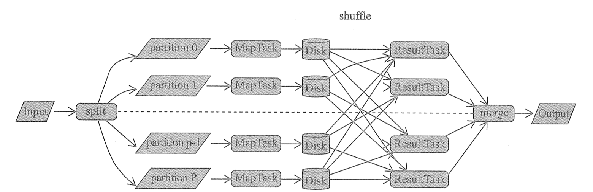
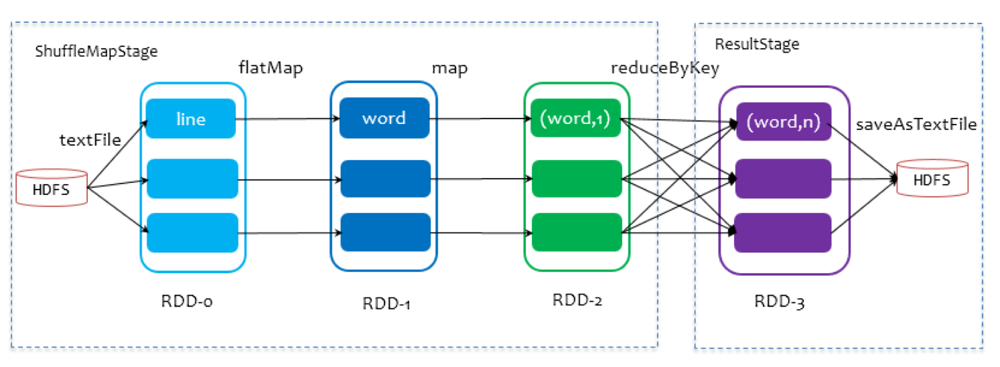
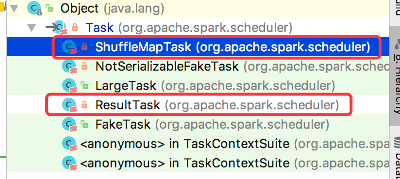
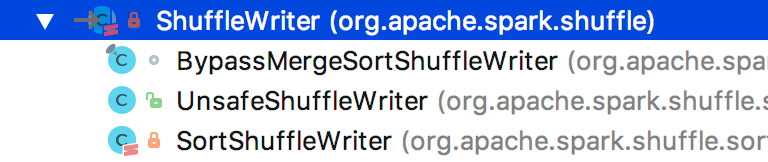
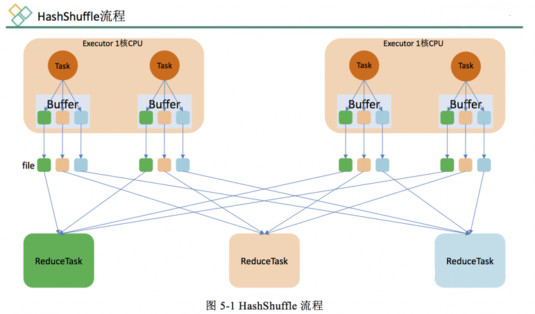
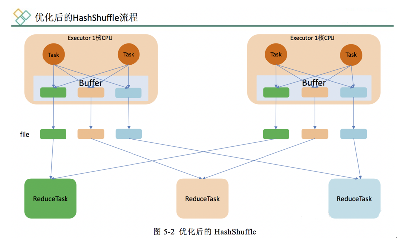
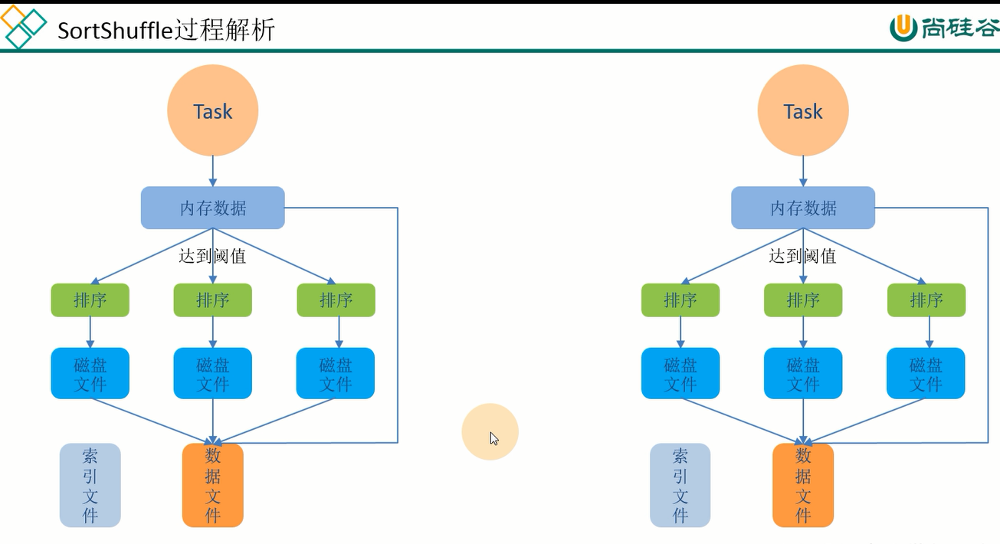

* [一、Shuffle 的核心要点](#%E4%B8%80shuffle-%E7%9A%84%E6%A0%B8%E5%BF%83%E8%A6%81%E7%82%B9)
  * [1\.1 Shuffle 流程源码分析](#11-shuffle-%E6%B5%81%E7%A8%8B%E6%BA%90%E7%A0%81%E5%88%86%E6%9E%90)
    * [ShuffleMapTask源码分析](#shufflemaptask%E6%BA%90%E7%A0%81%E5%88%86%E6%9E%90)
      * [ShuffleManager](#shufflemanager)
* [二、HashShuffle 解析](#%E4%BA%8Chashshuffle-%E8%A7%A3%E6%9E%90)
  * [2\.1 未优化的HashShuffle](#21-%E6%9C%AA%E4%BC%98%E5%8C%96%E7%9A%84hashshuffle)
  * [2\.2 优化的HashShuffle](#22-%E4%BC%98%E5%8C%96%E7%9A%84hashshuffle)
* [三、SortShuffle 解析](#%E4%B8%89sortshuffle-%E8%A7%A3%E6%9E%90)
  * [3\.1 普通 SortShuffle](#31-%E6%99%AE%E9%80%9A-sortshuffle)
  * [3\.2 bypass SortShuffle](#32-bypass-sortshuffle)
  * [3\.3 普通 SortShuffle 源码解析](#33-%E6%99%AE%E9%80%9A-sortshuffle-%E6%BA%90%E7%A0%81%E8%A7%A3%E6%9E%90)
  * [3\.4 bypass SortShuffle 源码解析](#34-bypass-sortshuffle-%E6%BA%90%E7%A0%81%E8%A7%A3%E6%9E%90)

--- 
在所有的 MapReduce 框架中, Shuffle 是连接 map 任务和 reduce 任务的桥梁. map 任务的中间输出要作为 reduce 任务的输入, 就必须经过 Shuffle, 所以 Shuffle 的性能的优劣直接决定了整个计算引擎的性能和吞吐量.

相比于 Hadoop 的 MapReduce, 我们将看到 Spark 提供了多种结算结果处理的方式及对 Shuffle 过程进行的多种优化.

Shuffle 是所有 MapReduce 计算框架必须面临的执行阶段, Shuffle 用于打通 map 任务的输出与reduce 任务的输入.

map 任务的中间输出结果按照指定的分区策略(例如, 按照 key 的哈希值)分配给处理某一个分区的 reduce 任务.

通用的 MapReduce 框架:


# 一、Shuffle 的核心要点


在划分 Stage 时，最后一个 Stage 称为finalStage(变量名)，它本质上是一个ResultStage类型的对象，前面的所有 Stage 被称为 ShuffleMapStage。

ShuffleMapStage 的结束伴随着 shuffle 文件的写磁盘。

ResultStage 基本上对应代码中的 action 算子，即将一个函数应用在 RDD的各个partition的数据集上，意味着一个job的运行结束。

## 1.1 Shuffle 流程源码分析
我们从CoarseGrainedExecutorBackend开始分析

启动任务
```scala
override def receive: PartialFunction[Any, Unit] = {
   
    case LaunchTask(data) =>
        if (executor == null) {
            
        } else {
            val taskDesc = ser.deserialize[TaskDescription](data.value)
            // 启动任务
            executor.launchTask(this, taskId = taskDesc.taskId, attemptNumber = taskDesc.attemptNumber,
                taskDesc.name, taskDesc.serializedTask)
        }
}
```


Executor.launchTask 方法
```scala
def launchTask(
                  context: ExecutorBackend,
                  taskId: Long,
                  attemptNumber: Int,
                  taskName: String,
                  serializedTask: ByteBuffer): Unit = {
    // Runnable 接口的对象.
    val tr = new TaskRunner(context, taskId = taskId, attemptNumber = attemptNumber, taskName,
        serializedTask)
    runningTasks.put(taskId, tr)
    // 在线程池中执行 task
    threadPool.execute(tr)
}
```


tr.run方法
```scala
override def run(): Unit = {
    // 更新 task 的状态
    execBackend.statusUpdate(taskId, TaskState.RUNNING, EMPTY_BYTE_BUFFER)
    try {
        // 把任务相关的数据反序列化出来
        val (taskFiles, taskJars, taskProps, taskBytes) =
            Task.deserializeWithDependencies(serializedTask)
        
        val value = try {
            // 开始运行 Task
            val res = task.run(
                taskAttemptId = taskId,
                attemptNumber = attemptNumber,
                metricsSystem = env.metricsSystem)
            res
        } finally {  
        }
    } catch {
    } finally { 
    }
}
```

Task.run 方法

```scala
final def run(
                 taskAttemptId: Long,
                 attemptNumber: Int,
                 metricsSystem: MetricsSystem): T = {
    context = new TaskContextImpl(
            stageId,
            partitionId,
            taskAttemptId,
            attemptNumber,
            taskMemoryManager,
            localProperties,
            metricsSystem,
            metrics)
    try {
        // 运行任务
        runTask(context)
    } catch {
        
    } finally {
       
    }
}
```


Task.runTask 方法
Task.runTask是一个抽象方法.
Task 有两个实现类, 分别执行不同阶段的Task


 
### ShuffleMapTask源码分析
ShuffleMapTask.runTask 方法
```scala
override def runTask(context: TaskContext): MapStatus = {
    
    var writer: ShuffleWriter[Any, Any] = null
    try {
        val manager = SparkEnv.get.shuffleManager
        // 获取 ShuffleWriter
        writer = manager.getWriter[Any, Any](dep.shuffleHandle, partitionId, context)
        // 写出 RDD 中的数据.  rdd.iterator 是读(计算)数据的操作. 
        writer.write(rdd.iterator(partition, context).asInstanceOf[Iterator[_ <: Product2[Any, Any]]])
    } catch {
    }
}
```
具体如何把数据写入到磁盘, 是由ShuffleWriter.write方法来完成.
ShuffleWriter是一个抽象类, 有 3 个实现:


 
根据在manager.getWriter[Any, Any](dep.shuffleHandle, partitionId, context)中的dep.shuffleHandle由manager来决定选使用哪种ShuffleWriter.


#### ShuffleManager
ShuffleManage 是一个Trait, 从2.0.0开始就只有一个实现类了: SortShuffleManager

registerShuffle 方法: 匹配出来使用哪种ShuffleHandle
```scala
override def registerShuffle[K, V, C](
                                         shuffleId: Int,
                                         numMaps: Int,
                                         dependency: ShuffleDependency[K, V, C]): ShuffleHandle = {
    if (SortShuffleWriter.shouldBypassMergeSort(SparkEnv.get.conf, dependency)) {
        new BypassMergeSortShuffleHandle[K, V](
            shuffleId, numMaps, dependency.asInstanceOf[ShuffleDependency[K, V, V]])
    } else if (SortShuffleManager.canUseSerializedShuffle(dependency)) {
        
        new SerializedShuffleHandle[K, V](
            shuffleId, numMaps, dependency.asInstanceOf[ShuffleDependency[K, V, V]])
    } else {
        new BaseShuffleHandle(shuffleId, numMaps, dependency)
    }
}
```
getWriter 方法
```scala
/** Get a writer for a given partition. Called on executors by map tasks. */
override def getWriter[K, V](
                                handle: ShuffleHandle,
                                mapId: Int,
                                context: TaskContext): ShuffleWriter[K, V] = {
    // 根据不同的 Handle, 创建不同的 ShuffleWriter
    handle match {

        case unsafeShuffleHandle: SerializedShuffleHandle[K@unchecked, V@unchecked] =>
            new UnsafeShuffleWriter(
                env.blockManager,
                shuffleBlockResolver.asInstanceOf[IndexShuffleBlockResolver],
                context.taskMemoryManager(),
                unsafeShuffleHandle,
                mapId,
                context,
                env.conf)
        case bypassMergeSortHandle: BypassMergeSortShuffleHandle[K@unchecked, V@unchecked] =>
            new BypassMergeSortShuffleWriter(
                env.blockManager,
                shuffleBlockResolver.asInstanceOf[IndexShuffleBlockResolver],
                bypassMergeSortHandle,
                mapId,
                context,
                env.conf)
        case other: BaseShuffleHandle[K@unchecked, V@unchecked, _] =>
            new SortShuffleWriter(shuffleBlockResolver, other, mapId, context)
    }
}
```

# 二、HashShuffle 解析
Spark-1.6 之前默认的shuffle方式是hash. 在 spark-1.6版本之后使用Sort-Base Shuffle，因为HashShuffle存在的不足所以就替换了HashShuffle. Spark2.0之后, 从源码中完全移除了HashShuffle.
本节 HashShuffle做个了解

## 2.1 未优化的HashShuffle


 
为了方便分析假设前提：每个 Executor 只有 1 个CPU core，也就是说，无论这个 Executor 上分配多少个 task 线程，同一时间都只能执行一个 task 线程。

如图中有 3个 Reducer，从 Task 开始那边各自把自己进行 Hash 计算(分区器：hash/numreduce取模)，分类出3个不同的类别，每个 Task 都分成3种类别的数据，想把不同的数据汇聚然后计算出最终的结果，所以Reducer 会在每个 Task 中把属于自己类别的数据收集过来，汇聚成一个同类别的大集合，每1个 Task 输出3份本地文件，这里有4个 Mapper Tasks，所以总共输出了4个 Tasks x 3个分类文件 = 12个本地小文件。

***缺点***:
1.	map 任务的中间结果首先存入内存(缓存), 然后才写入磁盘. 这对于内存的开销很大, 当一个节点上 map 任务的输出结果集很大时, 很容易导致内存紧张, 发送 OOM
2.	生成很多的小文件. 假设有 M 个 MapTask, 有 N 个 ReduceTask, 则会创建 M * n 个小文件, 磁盘 I/O 将成为性能瓶颈.


## 2.2 优化的HashShuffle

 
优化的 HashShuffle 过程就是启用合并机制，合并机制就是复用buffer，开启合并机制的配置是spark.shuffle.consolidateFiles。该参数默认值为false，将其设置为true即可开启优化机制。通常来说，如果我们使用HashShuffleManager，那么都建议开启这个选项。

这里还是有 4 个Tasks，数据类别还是分成 3 种类型，因为Hash算法会根据你的 Key 进行分类，在同一个进程中，无论是有多少过Task，都会把同样的Key放在同一个Buffer里，然后把Buffer中的数据写入以Core数量为单位的本地文件中，(一个Core只有一种类型的Key的数据)，每1个Task所在的进程中，分别写入共同进程中的3份本地文件，这里有4个Mapper Tasks，所以总共输出是 2个Cores x 3个分类文件 = 6个本地小文件。


# 三、SortShuffle 解析
## 3.1 普通 SortShuffle
在该模式下，数据会先写入一个数据结构，reduceByKey 写入 Map，一边通过 Map 局部聚合，一遍写入内存。Join 算子写入 ArrayList 直接写入内存中。然后需要判断是否达到阈值，如果达到就会将内存数据结构的数据写入到磁盘，清空内存数据结构。


在溢写磁盘前，先根据 key 进行排序，排序过后的数据，会分批写入到磁盘文件中。默认批次为 10000 条，数据会以每批一万条写入到磁盘文件。写入磁盘文件通过缓冲区溢写的方式，每次溢写都会产生一个磁盘文件，也就是说一个 Task 过程会产生多个临时文件。

最后在每个 Task 中，将所有的临时文件合并，这就是merge过程，此过程将所有临时文件读取出来，一次写入到最终文件。意味着一个Task的所有数据都在这一个文件中。同时单独写一份索引文件，标识下游各个Task的数据在文件中的索引，start offset和end offset。

## 3.2 bypass SortShuffle
bypass运行机制的触发条件如下(必须同时满足)：
1. shuffle map task数量小于spark.shuffle.sort.bypassMergeThreshold参数的值，默认为200。
2. 不是聚合类的shuffle算子（比如reduceByKey，可以是GroupByKey,rRepartition）。

此时 task 会为每个 reduce 端的 task 都创建一个临时磁盘文件，并将数据按 key 进行 hash 然后根据key 的 hash 值，将 key 写入对应的磁盘文件之中。当然，写入磁盘文件时也是先写入内存缓冲，缓冲写满之后再溢写到磁盘文件的。最后，同样会将所有临时磁盘文件都合并成一个磁盘文件，并创建一个单独的索引文件。
 
该过程的磁盘写机制其实跟未经优化的 HashShuffleManager 是一模一样的，因为都要创建数量惊人的磁盘文件，只是在最后会做一个磁盘文件的合并而已。因此少量的最终磁盘文件，也让该机制相对未经优化的HashShuffleManager来说，shuffle read的性能会更好。 而该机制与普通SortShuffleManager运行机制的不同在于：不会进行排序。也就是说，启用该机制的最大好处在于，shuffle write过程中，不需要进行数据的排序操作，也就节省掉了这部分的性能开销。


## 3.3 普通 SortShuffle 源码解析
write 方法
```scala
override def write(records: Iterator[Product2[K, V]]): Unit = {
    // 排序器
    sorter = if (dep.mapSideCombine) {
        require(dep.aggregator.isDefined, "Map-side combine without Aggregator specified!")
        new ExternalSorter[K, V, C](
            context, dep.aggregator, Some(dep.partitioner), dep.keyOrdering, dep.serializer)
    } else {
        // In this case we pass neither an aggregator nor an ordering to the sorter, because we don't
        // care whether the keys get sorted in each partition; that will be done on the reduce side
        // if the operation being run is sortByKey.
        new ExternalSorter[K, V, V](
            context, aggregator = None, Some(dep.partitioner), ordering = None, dep.serializer)
    }
    // 将 Map 任务的输出记录插入到缓存中
    sorter.insertAll(records)

    // 数据 shuffle 数据文件
    val output = shuffleBlockResolver.getDataFile(dep.shuffleId, mapId)

    try { // 将 map 端缓存的数据写入到磁盘中, 并生成 Block 文件对应的索引文件.
        val blockId = ShuffleBlockId(dep.shuffleId, mapId, IndexShuffleBlockResolver.NOOP_REDUCE_ID)
        // 记录各个分区数据的长度
        val partitionLengths = sorter.writePartitionedFile(blockId, tmp)
        // 生成 Block 文件对应的索引文件. 此索引文件用于记录各个分区在 Block文件中的偏移量, 以便于
        // Reduce 任务拉取时使用
        shuffleBlockResolver.writeIndexFileAndCommit(dep.shuffleId, mapId, partitionLengths, tmp)
        mapStatus = MapStatus(blockManager.shuffleServerId, partitionLengths)
    } finally {
        
    }
}
```


## 3.4 bypass SortShuffle 源码解析
有时候, map 端不需要在持久化数据之前进行排序等操作, 那么 ShuffleWriter的实现类之一BypassMergeSortShuffleWriter 就可以派上用场了.

触发 BypassMergeSort
```scala
private[spark] object SortShuffleWriter {
    def shouldBypassMergeSort(conf: SparkConf, dep: ShuffleDependency[_, _, _]): Boolean = {
        // We cannot bypass sorting if we need to do map-side aggregation.
        // 如果 map 端有聚合, 则不能绕过排序
        if (dep.mapSideCombine) {
            require(dep.aggregator.isDefined, "Map-side combine without Aggregator specified!")
            false
        } else {
            val bypassMergeThreshold: Int = conf.getInt("spark.shuffle.sort.bypassMergeThreshold", 200)
            // 分区数不能超过200 默认值
            dep.partitioner.numPartitions <= bypassMergeThreshold
        }
    }
}
```