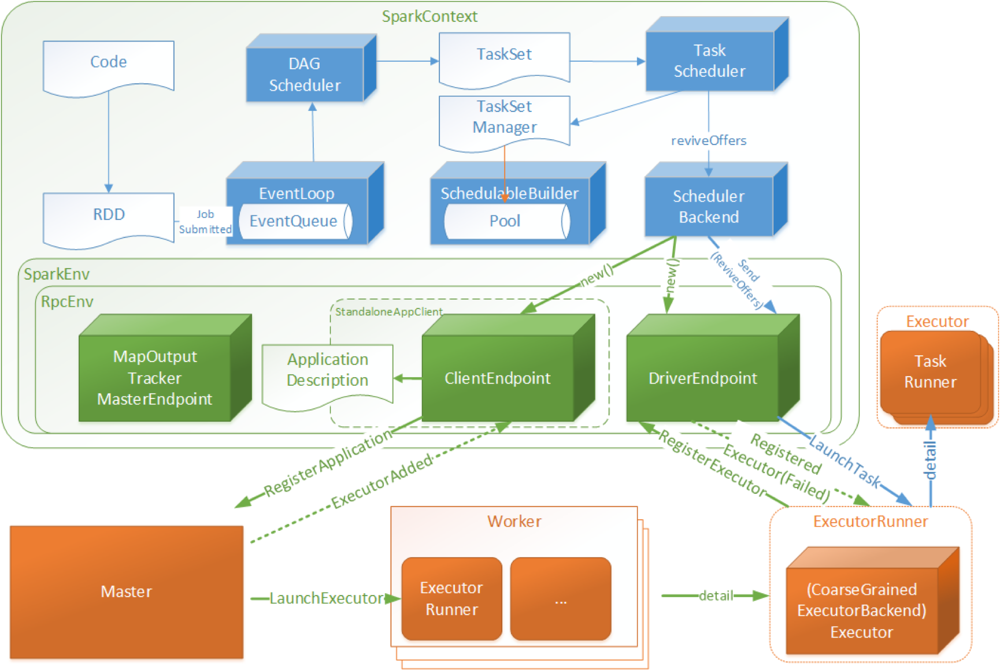
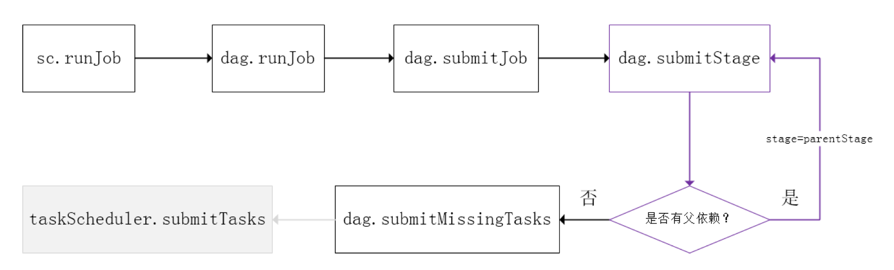
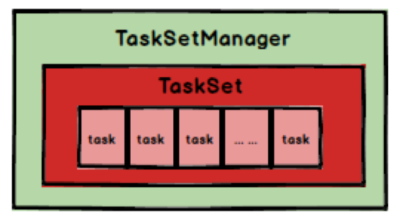
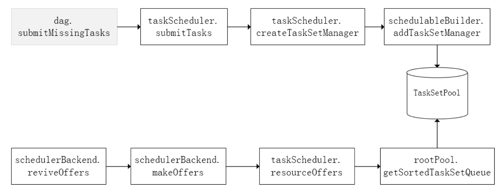
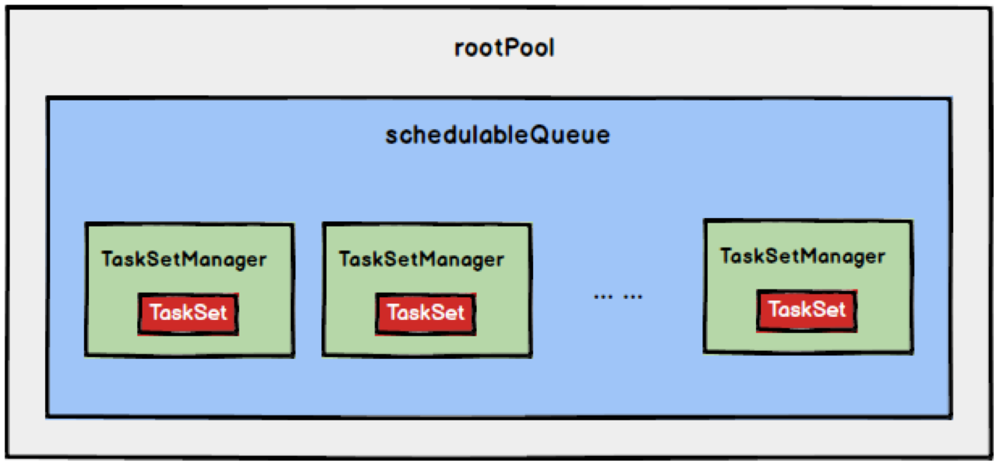
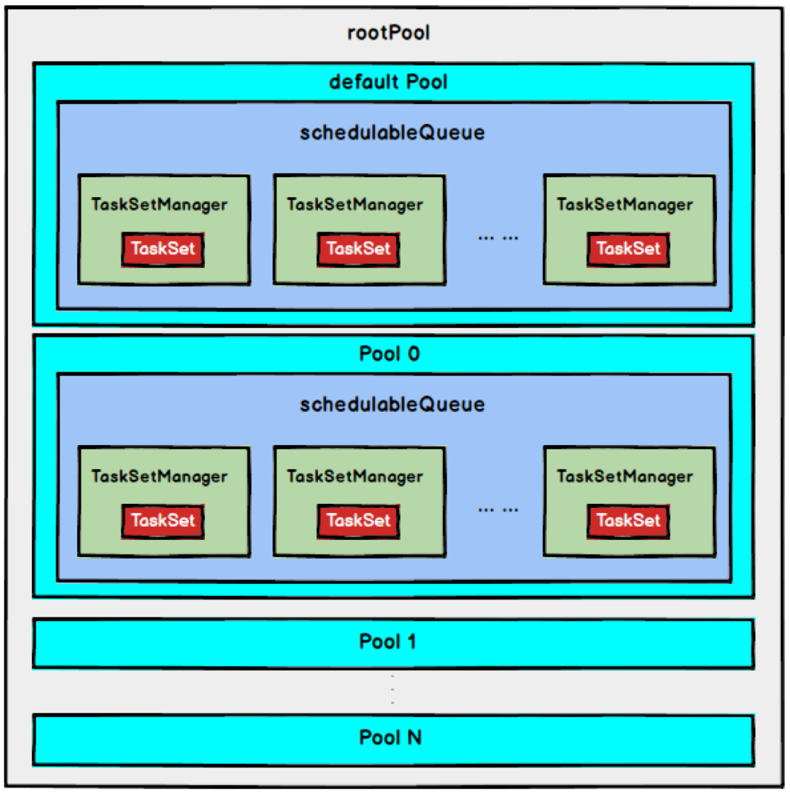

* [一、Spark 任务调度概述](#%E4%B8%80spark-%E4%BB%BB%E5%8A%A1%E8%B0%83%E5%BA%A6%E6%A6%82%E8%BF%B0)
* [三、Spark Stage 级别调度](#%E4%B8%89spark-stage-%E7%BA%A7%E5%88%AB%E8%B0%83%E5%BA%A6)
* [三、Spark Task 级别调度](#%E4%B8%89spark-task-%E7%BA%A7%E5%88%AB%E8%B0%83%E5%BA%A6)
  * [3\.1 调度策略](#31-%E8%B0%83%E5%BA%A6%E7%AD%96%E7%95%A5)
    * [FIFO调度策略](#fifo%E8%B0%83%E5%BA%A6%E7%AD%96%E7%95%A5)
    * [FAIR调度策略(0\.8 开始支持)](#fair%E8%B0%83%E5%BA%A6%E7%AD%96%E7%95%A508-%E5%BC%80%E5%A7%8B%E6%94%AF%E6%8C%81)
  * [3\.2 本地化调度](#32-%E6%9C%AC%E5%9C%B0%E5%8C%96%E8%B0%83%E5%BA%A6)
  * [3\.3 失败重试和黑名单](#33-%E5%A4%B1%E8%B4%A5%E9%87%8D%E8%AF%95%E5%92%8C%E9%BB%91%E5%90%8D%E5%8D%95)
* [四、Stage 级别任务调度源码分析](#%E5%9B%9Bstage-%E7%BA%A7%E5%88%AB%E4%BB%BB%E5%8A%A1%E8%B0%83%E5%BA%A6%E6%BA%90%E7%A0%81%E5%88%86%E6%9E%90)
  * [SparkContext初始化](#sparkcontext%E5%88%9D%E5%A7%8B%E5%8C%96)
  * [RDD 类源码分析](#rdd-%E7%B1%BB%E6%BA%90%E7%A0%81%E5%88%86%E6%9E%90)
  * [DAGScheduler类源码分析](#dagscheduler%E7%B1%BB%E6%BA%90%E7%A0%81%E5%88%86%E6%9E%90)
  * [TaskScheduler类源码分析](#taskscheduler%E7%B1%BB%E6%BA%90%E7%A0%81%E5%88%86%E6%9E%90)
  * [CoarseGrainedExecutorBackend 源码分析](#coarsegrainedexecutorbackend-%E6%BA%90%E7%A0%81%E5%88%86%E6%9E%90)
* [五、Task 级别任务调度源码分析](#%E4%BA%94task-%E7%BA%A7%E5%88%AB%E4%BB%BB%E5%8A%A1%E8%B0%83%E5%BA%A6%E6%BA%90%E7%A0%81%E5%88%86%E6%9E%90)
  * [SchedulableBuilder(调度池构建器)](#schedulablebuilder%E8%B0%83%E5%BA%A6%E6%B1%A0%E6%9E%84%E5%BB%BA%E5%99%A8)
    * [1\. FIFOSchedulableBuilder](#1-fifoschedulablebuilder)
    * [2\. FairSchedulableBuilder](#2-fairschedulablebuilder)
  * [SchedulingAlgorithm(调度算法)](#schedulingalgorithm%E8%B0%83%E5%BA%A6%E7%AE%97%E6%B3%95)
    * [1\. FIFOSchedulingAlgorithm](#1-fifoschedulingalgorithm)
    * [2\. FairSchedulingAlgorithm](#2-fairschedulingalgorithm)


---

在生产环境下，Spark 集群的部署方式一般为 YARN-Cluster 模式，之后的内核分析内容中我们默认集群的部署方式为YARN-Cluster模式。

在上一章中我们讲解了 Spark YARN-Cluster 模式下的任务提交流程，但是我们并没有具体说明 Driver 的工作流程， Driver 线程主要是初始化 SparkContext对象，准备运行所需的上下文，然后一方面保持与ApplicationMaster的RPC连接，通过ApplicationMaster申请资源，另一方面根据用户业务逻辑开始调度任务，将任务下发到已有的空闲Executor上。

当ResourceManager向ApplicationMaster返回Container资源时，ApplicationMaster就尝试在对应的Container上启动Executor进程，Executor进程起来后，会向Driver反向注册，注册成功后保持与Driver的心跳，同时等待Driver分发任务，当分发的任务执行完毕后，将任务状态上报给Driver。

# 一、Spark 任务调度概述
当 Driver 起来后，Driver 则会根据用户程序逻辑准备任务，并根据Executor资源情况逐步分发任务。

在详细阐述任务调度前，首先说明下 Spark 里的几个概念。一个 Spark 应用程序包括Job、Stage以及Task三个概念：
1. Job 是以 Action 算子为界，遇到一个Action算子则触发一个Job；
2. Stage 是 Job 的子集，以 RDD 宽依赖(即 Shuffle )为界，遇到 Shuffle 做一次划分；
3. Task 是 Stage 的子集，以并行度(分区数)来衡量，这个 Stage 分区数是多少，则这个Stage 就有多少个 Task。

Spark 的任务调度总体来说分两路进行，一路是 Stage 级的调度，一路是 Task 级的调度，总体调度流程如下图所示：


 
Spark RDD 通过其 Transactions 操作，形成了RDD血缘关系图，即DAG，最后通过Action的调用，触发Job并调度执行。

DAGScheduler负责Stage级的调度，主要是将job切分成若干Stages，并将每个Stage打包成TaskSet交给TaskScheduler调度。

TaskScheduler负责Task级的调度，将DAGScheduler传过来的TaskSet按照指定的调度策略分发到Executor上执行，调度过程中SchedulerBackend负责提供可用资源，其中SchedulerBackend有多种实现，分别对接不同的资源管理系统。


 
Driver初始化SparkContext过程中，会分别初始化DAGScheduler、TaskScheduler、SchedulerBackend以及HeartbeatReceiver，并启动 SchedulerBackend以及HeartbeatReceiver。

SchedulerBackend通过ApplicationMaster申请资源，并不断从TaskScheduler中拿到合适的Task分发到Executor执行。

HeartbeatReceiver负责接收Executor的心跳信息，监控Executor的存活状况，并通知到TaskScheduler。

# 三、Spark Stage 级别调度
Spark的任务调度是从DAG切割开始，主要是由DAGScheduler来完成。当遇到一个Action操作后就会触发一个Job的计算，并交给DAGScheduler来提交，下图是涉及到Job提交的相关方法调用流程图。

 

1.	Job 由最终的RDD和Action方法封装而成；
2.	SparkContext将Job交给DAGScheduler提交，它会根据RDD的血缘关系构成的DAG进行切分，将一个Job划分为若干Stages，具体划分策略是，由最终的RDD不断通过依赖回溯判断父依赖是否是宽依赖，即以Shuffle为界，划分Stage，窄依赖的RDD之间被划分到同一个Stage中，可以进行pipeline式的计算。
3.	划分的Stages分两类，一类叫做ResultStage，为DAG最下游的Stage，由Action方法决定，另一类叫做ShuffleMapStage，为下游Stage准备数据

下面看一个简单的例子WordCount:

 
 
说明:
- Job由saveAsTextFile触发，该Job由RDD-3和saveAsTextFile方法组成，根据RDD之间的依赖关系从RDD-3开始回溯搜索，直到没有依赖的RDD-0，
- 在回溯搜索过程中，RDD-3依赖RDD-2，并且是宽依赖，所以在RDD-2和RDD-3之间划分Stage，RDD-3被划到最后一个Stage，即ResultStage中
- RDD-2依赖RDD-1，RDD-1依赖RDD-0，这些依赖都是窄依赖，所以将RDD-0、RDD-1和RDD-2划分到同一个Stage，即ShuffleMapStage中，实际执行的时候，数据记录会一气呵成地执行RDD-0到RDD-2的转化。
- 不难看出，其本质上是一个深度优先搜索算法。

一个Stage是否被提交，需要判断它的父Stage是否执行，只有在父Stage执行完毕才能提交当前Stage

如果一个Stage没有父Stage，那么从该Stage开始提交。

Stage提交时会将Task信息（分区信息以及方法等）序列化并被打包成TaskSet交给TaskScheduler，一个Partition对应一个Task，另一方面TaskScheduler会监控Stage的运行状态，只有Executor丢失或者Task由于Fetch失败才需要重新提交失败的Stage以调度运行失败的任务，其他类型的Task失败会在TaskScheduler的调度过程中重试。

相对来说DAGScheduler做的事情较为简单，仅仅是在Stage层面上划分DAG，提交Stage并监控相关状态信息。

TaskScheduler则相对较为复杂，下面详细阐述其细节。


# 三、Spark Task 级别调度
Spark Task 的调度是由TaskScheduler来完成，由前文可知，DAGScheduler将Stage打包到TaskSet交给TaskScheduler，TaskScheduler会将TaskSet封装为TaskSetManager加入到调度队列中，
TaskSetManager结构如下图所示：

 
 
TaskSetManager负责监控管理同一个Stage中的Tasks，TaskScheduler就是以TaskSetManager为单元来调度任务。

前面也提到，TaskScheduler初始化后会启动SchedulerBackend，它负责跟外界打交道，接收Executor的注册信息，并维护Executor的状态，所以说SchedulerBackend是管“粮食”的，同时它在启动后会定期地去“询问”TaskScheduler有没有任务要运行，也就是说，它会定期地“问”TaskScheduler“我有这么余量，你要不要啊”，TaskScheduler在SchedulerBackend“问”它的时候，会从调度队列中按照指定的调度策略选择TaskSetManager去调度运行，大致方法调用流程如下图所示：

 

将TaskSetManager加入rootPool调度池中之后，调用SchedulerBackend的riviveOffers方法给driverEndpoint发送ReviveOffer消息；driverEndpoint收到ReviveOffer消息后调用makeOffers方法，过滤出活跃状态的Executor（这些Executor都是任务启动时反向注册到Driver的Executor），然后将Executor封装成WorkerOffer对象；准备好计算资源（WorkerOffer）后，taskScheduler基于这些资源调用resourceOffer在Executor上分配task。


## 3.1 调度策略
TaskScheduler支持两种调度策略，一种是FIFO，也是默认的调度策略，另一种是FAIR。

在TaskScheduler初始化过程中会实例化rootPool，表示树的根节点，是Pool类型。

### FIFO调度策略
如果是采用FIFO调度策略，则直接简单地将TaskSetManager按照先来先到的方式入队，出队时直接拿出最先进队的TaskSetManager，其树结构如下图所示，TaskSetManager保存在一个FIFO队列中。

 
### FAIR调度策略(0.8 开始支持)


FAIR模式中有一个rootPool和多个子Pool，各个子Pool中存储着所有待分配的TaskSetMagager。

在FAIR模式中，需要先对子Pool进行排序，再对子Pool里面的TaskSetMagager进行排序，因为Pool和TaskSetMagager都继承了Schedulable特质，因此使用相同的排序算法。

排序过程的比较是基于Fair-share来比较的，每个要排序的对象包含三个属性: runningTasks值（正在运行的Task数）、minShare值、weight值，比较时会综合考量runningTasks值，minShare值以及weight值。

注意，minShare、weight的值均在公平调度配置文件fairscheduler.xml中被指定，调度池在构建阶段会读取此文件的相关配置。
1. 如果 A 对象的runningTasks大于它的minShare，B 对象的runningTasks小于它的minShare，那么B排在A前面；（runningTasks 比 minShare 小的先执行）
2. 如果A、B对象的 runningTasks 都小于它们的 minShare，那么就比较 runningTasks 与 math.max(minShare1, 1.0) 的比值（minShare使用率），谁小谁排前面；（minShare使用率低的先执行）
3. 如果A、B对象的runningTasks都大于它们的minShare，那么就比较runningTasks与weight的比值（权重使用率），谁小谁排前面。（权重使用率低的先执行）
4. 如果上述比较均相等，则比较名字。

整体上来说就是通过minShare和weight这两个参数控制比较过程，可以做到让minShare使用率和权重使用率少（实际运行task比例较少）的先运行。

FAIR模式排序完成后，所有的TaskSetManager被放入一个ArrayBuffer里，之后依次被取出并发送给Executor执行。

从调度队列中拿到TaskSetManager后，由于TaskSetManager封装了一个Stage的所有Task，并负责管理调度这些Task，那么接下来的工作就是TaskSetManager按照一定的规则一个个取出Task给TaskScheduler，TaskScheduler再交给SchedulerBackend去发到Executor上执行。

如何启用公平调度器:
```scala
val conf = new SparkConf().setMaster(...).setAppName(...)
conf.set("spark.scheduler.mode", "FAIR")
val sc = new SparkContext(conf)
```

## 3.2 本地化调度
DAGScheduler切割Job，划分Stage, 通过调用submitStage来提交一个Stage对应的tasks，submitStage会调用submitMissingTasks，submitMissingTasks 确定每个需要计算的 task 的preferredLocations，通过调用getPreferrdeLocations()得到partition的优先位置，由于一个partition对应一个Task，此partition的优先位置就是task的优先位置，

对于要提交到TaskScheduler的TaskSet中的每一个Task，该ask优先位置与其对应的partition对应的优先位置一致。

从调度队列中拿到TaskSetManager后，那么接下来的工作就是TaskSetManager按照一定的规则一个个取出task给TaskScheduler，TaskScheduler再交给SchedulerBackend去发到Executor上执行。前面也提到，TaskSetManager封装了一个Stage的所有Task，并负责管理调度这些Task。 根据每个Task的优先位置，确定Task的Locality级别，Locality一共有五种，优先级由高到低顺序：

名称 |	解析
--- | ----
PROCESS_LOCAL | 进程本地化，task和数据在同一个Executor中，性能最好。
NODE_LOCAL | 节点本地化，task和数据在同一个节点中，但是task和数据不在同一个Executor中，数据需要在进程间进行传输。
RACK_LOCAL | 机架本地化，task和数据在同一个机架的两个节点上，数据需要通过网络在节点之间进行传输。
NO_PREF | 对于task来说，从哪里获取都一样，没有好坏之分。
ANY | task和数据可以在集群的任何地方，而且不在一个机架中，性能最差。

在调度执行时，Spark 调度总是会尽量让每个task以最高的本地性级别来启动，当一个task以本地性级别启动，但是该本地性级别对应的所有节点都没有空闲资源而启动失败，此时并不会马上降低本地性级别启动而是在某个时间长度内再次以本地性级别来启动该task，若超过限时时间则降级启动，去尝试下一个本地性级别，依次类推。

可以通过调大每个类别的最大容忍延迟时间，在等待阶段对应的Executor可能就会有相应的资源去执行此task，这就在在一定程度上提升了运行性能。

## 3.3 失败重试和黑名单
除了选择合适的Task调度运行外，还需要监控Task的执行状态，前面也提到，与外部打交道的是SchedulerBackend，Task被提交到Executor启动执行后，Executor会将执行状态上报给SchedulerBackend，SchedulerBackend则告诉TaskScheduler，TaskScheduler找到该Task对应的TaskSetManager，并通知到该TaskSetManager，这样TaskSetManager就知道Task的失败与成功状态，对于失败的Task，会记录它失败的次数，如果失败次数还没有超过最大重试次数，那么就把它放回待调度的Task池子中，否则整个Application失败。

在记录Task失败次数过程中，会记录它上一次失败所在的Executor Id和Host，这样下次再调度这个Task时，会使用黑名单机制，避免它被调度到上一次失败的节点上，起到一定的容错作用。黑名单记录Task上一次失败所在的Executor Id和Host，以及其对应的“拉黑”时间，
“拉黑”时间是指这段时间内不要再往这个节点上调度这个Task了。

# 四、Stage 级别任务调度源码分析

## SparkContext初始化
任务调度的时候, 需要用到 3 个非常重要的组件, 都是在 SparkContext 初始化的时候创建并启动:

这三个组件分别是:

SchedulerBackend TaskScheduler DAGScheduler
```scala
// 用来与其他组件通讯用
private var _schedulerBackend: SchedulerBackend = _
// DAG 调度器, 是调度系统的中的中的重要组件之一, 负责创建 Job, 将 DAG 中的 RDD 划分到不同的 Stage, 提交 Stage 等.
// SparkUI 中有关 Job 和 Stage 的监控数据都来自 DAGScheduler
@volatile private var _dagScheduler: DAGScheduler = _
// TaskScheduler 按照调度算法对集群管理器已经分配给应用程序的资源进行二次调度后分配给任务
// TaskScheduler 调度的 Task 是由DAGScheduler 创建的, 所以 DAGScheduler 是 TaskScheduler的前置调度器
private var _taskScheduler: TaskScheduler = _

// 创建 SchedulerBackend 和 TaskScheduler
val (sched, ts):(SchedulerBackend, TaskScheduler) = SparkContext.createTaskScheduler(this, master, deployMode)
_schedulerBackend = sched
_taskScheduler = ts
// 创建 DAGScheduler
_dagScheduler = new DAGScheduler(this)
// 启动 TaskScheduler, 内部会也会启动 SchedulerBackend
_taskScheduler.start()
```

我们从一个 action 开始. 例如: collect

## RDD 类源码分析
```scala
def collect(): Array[T] = withScope {
    val results = sc.runJob(this, (iter: Iterator[T]) => iter.toArray)
    Array.concat(results: _*)
}
```

sc.runJob 方法
```scala
def runJob[T, U: ClassTag](
                              rdd: RDD[T],
                              func: (TaskContext, Iterator[T]) => U,
                              partitions: Seq[Int],
                              resultHandler: (Int, U) => Unit): Unit = {
    // 作业的切分                          
    dagScheduler.runJob(rdd, cleanedFunc, partitions, callSite, resultHandler, localProperties.get)
}
```

## DAGScheduler类源码分析
dagScheduler.runJob 方法
```scala
def runJob[T, U](
                    rdd: RDD[T],
                    func: (TaskContext, Iterator[T]) => U,
                    partitions: Seq[Int],
                    callSite: CallSite,
                    resultHandler: (Int, U) => Unit,
                    properties: Properties): Unit = {
    // 提交任务  返回值 JobWaiter 用来确定 Job 的成功与失败
    val waiter = submitJob(rdd, func, partitions, callSite, resultHandler, properties)
}
```

dagScheduler.submitJob 方法
```scala
def submitJob[T, U](
                       rdd: RDD[T],
                       func: (TaskContext, Iterator[T]) => U,
                       partitions: Seq[Int],
                       callSite: CallSite,
                       resultHandler: (Int, U) => Unit,
                       properties: Properties): JobWaiter[U] = {
    // 创建 JobWaiter 对象
    val waiter = new JobWaiter(this, jobId, partitions.size, resultHandler)
    // 向内部事件循环器发送消息 JobSubmitted
    eventProcessLoop.post(JobSubmitted(
        jobId, rdd, func2, partitions.toArray, callSite, waiter,
        SerializationUtils.clone(properties)))
    waiter
}
```

DAGSchedulerEventProcessLoop 类

DAGSchedulerEventProcessLoop 是 DAGSheduler内部的事件循环处理器, 用于处理DAGSchedulerEvent类型的事件

前面发送的是JobSubmitted类型的事件
```scala
private def doOnReceive(event: DAGSchedulerEvent): Unit = event match {
    case JobSubmitted(jobId, rdd, func, partitions, callSite, listener, properties) =>
        // 处理提交的 Job
        dagScheduler.handleJobSubmitted(jobId, rdd, func, partitions, callSite, listener, properties)

}
```
DAGScheduler.handleJobSubmitted

```scala
private[scheduler] def handleJobSubmitted(jobId: Int,
                                          finalRDD: RDD[_],
                                          func: (TaskContext, Iterator[_]) => _,
                                          partitions: Array[Int],
                                          callSite: CallSite,
                                          listener: JobListener,
                                          properties: Properties) {
    
    var finalStage: ResultStage = null
    try {
        // New stage creation may throw an exception if, for example, jobs are run on a
        // HadoopRDD whose underlying HDFS files have been deleted.
        // Stage 的划分是从后向前推断的, 所以先创建最后的阶段
        finalStage = createResultStage(finalRDD, func, partitions, jobId, callSite)
    } catch {
        
    }
    
    submitStage(finalStage)
}
```

DAGScheduler.createResultStage() 方法
```scala
private def createResultStage(
                                 rdd: RDD[_],
                                 func: (TaskContext, Iterator[_]) => _,
                                 partitions: Array[Int],
                                 jobId: Int,
                                 callSite: CallSite): ResultStage = {
    // 1. 获取所有父 Stage 的列表
    val parents: List[Stage] = getOrCreateParentStages(rdd, jobId)
    // 2. 给 resultStage 生成一个 id
    val id = nextStageId.getAndIncrement()
    // 3. 创建 ResultStage
    val stage: ResultStage = new ResultStage(id, rdd, func, partitions, parents, jobId, callSite)
    // 4. stageId 和 ResultStage 做映射
    stageIdToStage(id) = stage
    updateJobIdStageIdMaps(jobId, stage)
    stage
}
```

DAGScheduler.getOrCreateParentStages() 方法
```scala
private def getOrCreateParentStages(rdd: RDD[_], firstJobId: Int): List[Stage] = {
    // 获取所有的 Shuffle 依赖(宽依赖)
    getShuffleDependencies(rdd).map { shuffleDep =>
        // 对每个 shuffle 依赖,  获取或者创建新的 Stage: ShuffleMapStage
        getOrCreateShuffleMapStage(shuffleDep, firstJobId)
    }.toList
}
```

说明:
- 一共有两种Stage: ResultStage和ShuffleMapStage

DAGScheduler.getShuffleDependencies
```scala
// 得到所有宽依赖
private[scheduler] def getShuffleDependencies(
                                                 rdd: RDD[_]): HashSet[ShuffleDependency[_, _, _]] = {
    val parents = new HashSet[ShuffleDependency[_, _, _]]
    val visited = new HashSet[RDD[_]]
    val waitingForVisit = new Stack[RDD[_]]
    waitingForVisit.push(rdd)
    while (waitingForVisit.nonEmpty) {
        val toVisit = waitingForVisit.pop()
        if (!visited(toVisit)) {
            visited += toVisit
            toVisit.dependencies.foreach {
                case shuffleDep: ShuffleDependency[_, _, _] =>
                    parents += shuffleDep
                case dependency =>
                    waitingForVisit.push(dependency.rdd)
            }
        }
    }
    parents
}
```

DAGScheduler.submitStage(finalStage) 方法

提交 finalStage
```scala
private def submitStage(stage: Stage) {
    val jobId = activeJobForStage(stage)
    if (jobId.isDefined) {
        
        if (!waitingStages(stage) && !runningStages(stage) && !failedStages(stage)) {
            // 获取所有的父 Stage
            val missing = getMissingParentStages(stage).sortBy(_.id)
            // 如果为空, 则提交这个 Stage
            if (missing.isEmpty) {
                submitMissingTasks(stage, jobId.get)
            } else { // 如果还有父 Stage , 则递归调用
                for (parent <- missing) {
                    submitStage(parent)
                }
                waitingStages += stage
            }
        }
    } else {
        
    }
}
```
说明:
- 从前面的分析可以看到, 阶段划分是从后向前
- 最前面的 Stage 先提交

DAGScheduler.submitMissingTasks 方法
```scala
private def submitMissingTasks(stage: Stage, jobId: Int) {
    
    // 任务划分. 每个分区创建一个 Task
    val tasks: Seq[Task[_]] = try {
        stage match {
            case stage: ShuffleMapStage =>
                partitionsToCompute.map { id =>
                    val locs = taskIdToLocations(id)
                    val part = stage.rdd.partitions(id)
                    new ShuffleMapTask(stage.id, stage.latestInfo.attemptId,
                        taskBinary, part, locs, stage.latestInfo.taskMetrics, properties, Option(jobId),
                        Option(sc.applicationId), sc.applicationAttemptId)
                }

            case stage: ResultStage =>
                partitionsToCompute.map { id =>
                    val p: Int = stage.partitions(id)
                    val part = stage.rdd.partitions(p)
                    val locs = taskIdToLocations(id)
                    new ResultTask(stage.id, stage.latestInfo.attemptId,
                        taskBinary, part, locs, id, properties, stage.latestInfo.taskMetrics,
                        Option(jobId), Option(sc.applicationId), sc.applicationAttemptId)
                }
        }
    } catch {
        
    }
    // 提交任务
    if (tasks.size > 0) {
        
        // 使用 taskScheduler 提交任务
        taskScheduler.submitTasks(new TaskSet(
            tasks.toArray, stage.id, stage.latestInfo.attemptId, jobId, properties))
    } else {
        
    }
}
```


## TaskScheduler类源码分析
TaskScheduler是一个Trait, 我们分析它的实现类: TaskSchedulerImpl
```scala
override def submitTasks(taskSet: TaskSet) {
    val tasks = taskSet.tasks
    
    this.synchronized {
        // 创建 TaskManger 对象. 用来追踪每个任务
        val manager: TaskSetManager = createTaskSetManager(taskSet, maxTaskFailures)
        val stage = taskSet.stageId
        
        // manage 和 TaskSet 交给合适的任务调度器来调度
        schedulableBuilder.addTaskSetManager(manager, manager.taskSet.properties)

    }
    // 跟 ExecutorBackend 通讯
    backend.reviveOffers()
}
```


CoarseGrainedSchedulerBackend.reviveOffers
```scala
override def reviveOffers() {
    // DriverEndpoint 给自己发信息: ReviveOffers
    driverEndpoint.send(ReviveOffers)
}
```

DriverEndpoint.receive 方法
```scala
private def makeOffers() {
    // 过滤出 Active 的Executor
    val activeExecutors = executorDataMap.filterKeys(executorIsAlive)
    // 封装资源
    val workOffers = activeExecutors.map { case (id, executorData) =>
        new WorkerOffer(id, executorData.executorHost, executorData.freeCores)
    }.toIndexedSeq
    // 启动任务
    launchTasks(scheduler.resourceOffers(workOffers))
}
```
DriverEndpoint.launchTasks
```scala
private def launchTasks(tasks: Seq[Seq[TaskDescription]]) {
    for (task <- tasks.flatten) {
        // 序列化任务
        val serializedTask = ser.serialize(task)
        if (serializedTask.limit >= maxRpcMessageSize) {
            
        }
        else {
            
            val executorData = executorDataMap(task.executorId)
            executorData.freeCores -= scheduler.CPUS_PER_TASK

            // 发送任务到 Executor. CoarseGrainedExecutorBackend 会收到消息
            executorData.executorEndpoint.send(LaunchTask(new SerializableBuffer(serializedTask)))
        }
    }
}
```

## CoarseGrainedExecutorBackend 源码分析
```scala
override def receive: PartialFunction[Any, Unit] = {
    // 
    case LaunchTask(data) =>
        if (executor == null) {
            exitExecutor(1, "Received LaunchTask command but executor was null")
        } else {
            // 把要执行的任务反序列化
            val taskDesc = ser.deserialize[TaskDescription](data.value)
            // 启动任务开始执行
            executor.launchTask(this, taskId = taskDesc.taskId, attemptNumber = taskDesc.attemptNumber,
                taskDesc.name, taskDesc.serializedTask)
        }
}
```

至此, stage 级别的任务调度完成

# 五、Task 级别任务调度源码分析
```scala
taskScheduler.submitTasks(new TaskSet(
            tasks.toArray, stage.id, stage.latestInfo.attemptId, jobId, properties))
```

根据前面的分析介绍, DAGSheduler将Task 提交给TaskScheduler时, 需要将多个 Task打包为TaskSet.

TaskSet是整个调度池中对Task进行调度管理的基本单位, 由调度池中的TaskManager来管理.

taskScheduler.submitTasks 方法
```scala
// 把 TaskSet 交给任务调度池来调度
schedulableBuilder.addTaskSetManager(manager, manager.taskSet.properties)
```

schedulableBuilder的类型是:SchedulableBuilder, 它是一个Trait, 有两个已知的实现子类: FIFOSchedulableBuilder 和 FairSchedulableBuilder

## SchedulableBuilder(调度池构建器)
### 1. FIFOSchedulableBuilder
```scala
FIFOSchedulableBuilder.addTaskSetManager
override def addTaskSetManager(manager: Schedulable, properties: Properties) {
    // 对 FIFO 调度, 则直接交给根调度器来调度
    // 因为 FIFO 调度只有一个根调度度池
    rootPool.addSchedulable(manager)
}
```
说明:
- rootPool是根调度池, 它的类型是Pool, 表示Poll或TaskSet的可调度实体.
- FIFO 调度是默认调度算法
- spark.scheduler.mode类设置调度算法:FIFO,FAIR
- 根调度池是在初始化TaskSchedulerImpl的时候创建的.
- FIFOSchedulableBuilder 不需要再构建新的子调度池, 只需要有 rootPoll就可以了
    ```scala
    override def buildPools() {
    // nothing
    }
    ``` 
### 2. FairSchedulableBuilder

不仅仅需要根调度池, 还需要创建更多的调度池

FairSchedulableBuilder.buildPools 方法内会创建更多的子调度池.

## SchedulingAlgorithm(调度算法)
```scala
/**
* An interface for sort algorithm
*     用于排序算法的接口
* FIFO: FIFO algorithm between TaskSetManagers
*  FIFO:   TaskSetManager 之间的排序
*
* FS: FS algorithm between Pools, and FIFO or FS within Pools
*  FS: 池之间排序
*/
private[spark] trait SchedulingAlgorithm {
    def comparator(s1: Schedulable, s2: Schedulable): Boolean
}
```
### 1. FIFOSchedulingAlgorithm
```scala
private[spark] class FIFOSchedulingAlgorithm extends SchedulingAlgorithm {
    // 是不是先调度 s1
    override def comparator(s1: Schedulable, s2: Schedulable): Boolean = {
        val priority1 = s1.priority
        val priority2 = s2.priority
        var res = math.signum(priority1 - priority2)
        if (res == 0) {
            val stageId1 = s1.stageId
            val stageId2 = s2.stageId
            res = math.signum(stageId1 - stageId2)
        }
        res < 0  // 值小的先调度
    }
}
```
### 2. FairSchedulingAlgorithm
```scala
private[spark] class FairSchedulingAlgorithm extends SchedulingAlgorithm {
    override def comparator(s1: Schedulable, s2: Schedulable): Boolean = {
        val minShare1 = s1.minShare
        val minShare2 = s2.minShare
        val runningTasks1 = s1.runningTasks
        val runningTasks2 = s2.runningTasks
        val s1Needy = runningTasks1 < minShare1
        val s2Needy = runningTasks2 < minShare2
        val minShareRatio1 = runningTasks1.toDouble / math.max(minShare1, 1.0)
        val minShareRatio2 = runningTasks2.toDouble / math.max(minShare2, 1.0)
        val taskToWeightRatio1 = runningTasks1.toDouble / s1.weight.toDouble
        val taskToWeightRatio2 = runningTasks2.toDouble / s2.weight.toDouble

        var compare = 0
        if (s1Needy && !s2Needy) { // 谁的 runningTasks1 < minShare1 谁先被调度
            return true
        } else if (!s1Needy && s2Needy) {
            return false
        } else if (s1Needy && s2Needy) { // 如果都 runningTasks < minShare
            // 则比较 runningTasks / math.max(minShare1, 1.0) 的比值 小的优先级高
            compare = minShareRatio1.compareTo(minShareRatio2)
        } else {
            // 如果都runningTasks > minShare, 则比较 runningTasks / weight 的比值
            // 小的优先级高
            compare = taskToWeightRatio1.compareTo(taskToWeightRatio2)
        }

        if (compare < 0) {
            true
        } else if (compare > 0) {
            false
        } else {
            // 如果前面都一样, 则比较 TaskSetManager 或 Pool 的名字
            s1.name < s2.name
        }
    }
}
```