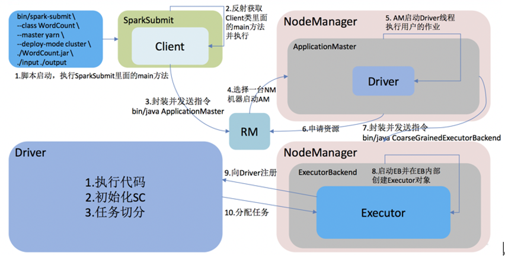
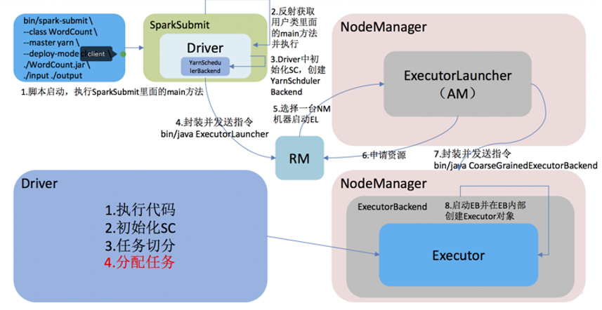
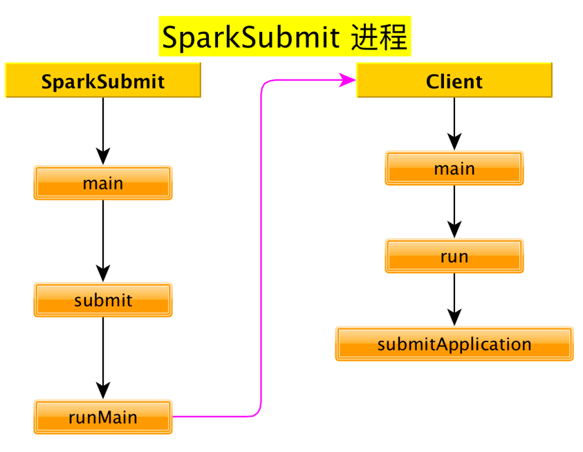
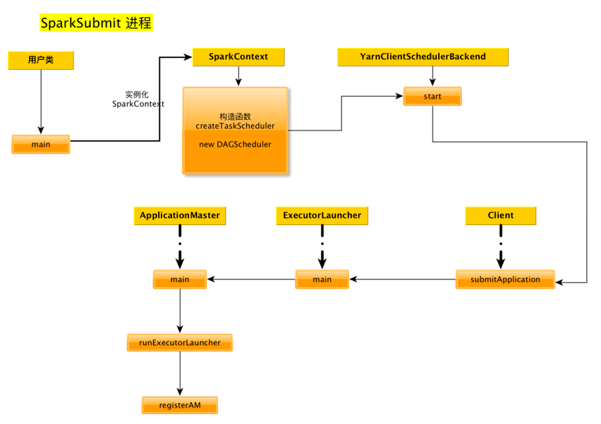
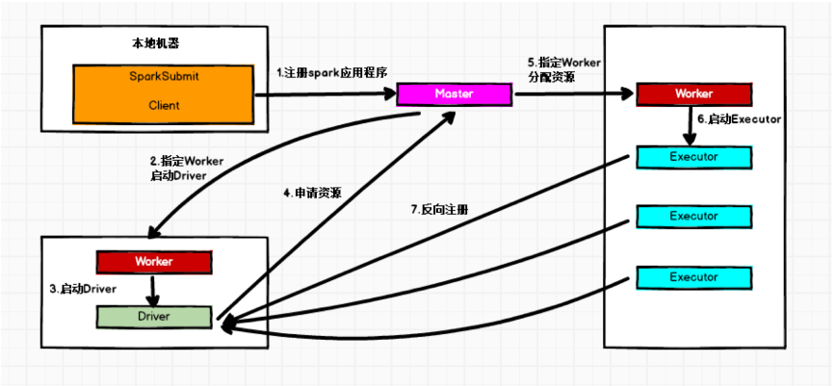
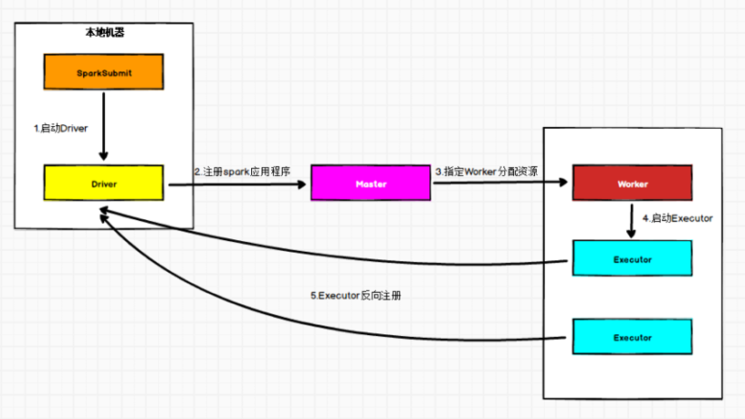

* [一、Yarn 模式运行机制](#%E4%B8%80yarn-%E6%A8%A1%E5%BC%8F%E8%BF%90%E8%A1%8C%E6%9C%BA%E5%88%B6)
  * [1\.1 YARN Cluster 模式](#11-yarn-cluster-%E6%A8%A1%E5%BC%8F)
  * [1\.2 Yarn Client 模式](#12-yarn-client-%E6%A8%A1%E5%BC%8F)
  * [1\.3 Yarn cluster 模式运行机制源码分析](#13-yarn-cluster-%E6%A8%A1%E5%BC%8F%E8%BF%90%E8%A1%8C%E6%9C%BA%E5%88%B6%E6%BA%90%E7%A0%81%E5%88%86%E6%9E%90)
    * [1\.3\.1 bin/spark\-submit 启动脚本分析](#131-binspark-submit-%E5%90%AF%E5%8A%A8%E8%84%9A%E6%9C%AC%E5%88%86%E6%9E%90)
      * [/bin/spark\-class](#binspark-class)
    * [1\.3\.2 org\.apache\.spark\.deploy\.SparkSubmit 源码分析](#132-orgapachesparkdeploysparksubmit-%E6%BA%90%E7%A0%81%E5%88%86%E6%9E%90)
      * [SparkSubmit伴生对象](#sparksubmit%E4%BC%B4%E7%94%9F%E5%AF%B9%E8%B1%A1)
    * [1\.3\.3\. org\.apache\.spark\.deploy\.yarn\.Client 源码分析](#133-orgapachesparkdeployyarnclient-%E6%BA%90%E7%A0%81%E5%88%86%E6%9E%90)
    * [1\.3\.4 org\.apache\.spark\.deploy\.yarn\.ApplicationMaster 源码分析](#134-orgapachesparkdeployyarnapplicationmaster-%E6%BA%90%E7%A0%81%E5%88%86%E6%9E%90)
    * [1\.3\.5 org\.apache\.spark\.executor\.CoarseGrainedExecutorBackend 源码分析](#135-orgapachesparkexecutorcoarsegrainedexecutorbackend-%E6%BA%90%E7%A0%81%E5%88%86%E6%9E%90)
      * [CoarseGrainedExecutorBackend 伴生对象](#coarsegrainedexecutorbackend-%E4%BC%B4%E7%94%9F%E5%AF%B9%E8%B1%A1)
      * [CoarseGrainedExecutorBackend 伴生类](#coarsegrainedexecutorbackend-%E4%BC%B4%E7%94%9F%E7%B1%BB)
  * [1\.4 Yarn client 模式运行机制源码分析](#14-yarn-client-%E6%A8%A1%E5%BC%8F%E8%BF%90%E8%A1%8C%E6%9C%BA%E5%88%B6%E6%BA%90%E7%A0%81%E5%88%86%E6%9E%90)
    * [1\.4\.1 client 模式下直接运行用户的主类:](#141-client-%E6%A8%A1%E5%BC%8F%E4%B8%8B%E7%9B%B4%E6%8E%A5%E8%BF%90%E8%A1%8C%E7%94%A8%E6%88%B7%E7%9A%84%E4%B8%BB%E7%B1%BB)
    * [1\.4\.2 org\.apache\.spark\.deploy\.yarn\.Client 源码再分析](#142-orgapachesparkdeployyarnclient-%E6%BA%90%E7%A0%81%E5%86%8D%E5%88%86%E6%9E%90)
    * [1\.4\.3 ApplicationMaster 源码再分析](#143-applicationmaster-%E6%BA%90%E7%A0%81%E5%86%8D%E5%88%86%E6%9E%90)
* [二、Standalone 模式运行机制](#%E4%BA%8Cstandalone-%E6%A8%A1%E5%BC%8F%E8%BF%90%E8%A1%8C%E6%9C%BA%E5%88%B6)
  * [2\.1 Standalone Cluster 模式](#21-standalone-cluster-%E6%A8%A1%E5%BC%8F)
  * [2\.2 Standalone Client 模式](#22-standalone-client-%E6%A8%A1%E5%BC%8F)


---


Spark支持3种集群管理器（Cluster Manager），分别为：
1. Standalone：独立模式，Spark 原生的简单集群管理器，自带完整的服务，可单独部署到一个集群中，无需依赖任何其他资源管理系统，使用 Standalone 可以很方便地搭建一个集群；
2. Hadoop YARN：统一的资源管理机制，在上面可以运行多套计算框架，如 MR、Storm等。根据 Driver 在集群中的位置不同，分为 yarn client 和 yarn cluster；
3. Apache Mesos：一个强大的分布式资源管理框架，它允许多种不同的框架部署在其上，包括 Yarn。
实际上，除了上述这些通用的集群管理器外，Spark 内部也提供了方便用户测试和学习的简单集群部署模式。由于在实际工厂环境下使用的绝大多数的集群管理器是 Hadoop YARN，因此我们关注的重点是 Hadoop YARN 模式下的 Spark 集群部署。


# 一、Yarn 模式运行机制
## 1.1 YARN Cluster 模式

 
1. 执行脚本提交任务，实际是启动一个 SparkSubmit 的 JVM 进程；
2. SparkSubmit 类中的 main方法反射调用Client的main方法；
3. Client创建Yarn客户端，然后向Yarn发送执行指令：bin/java ApplicationMaster；
4. Yarn框架收到指令后会在指定的NM中启动ApplicationMaster；
5. ApplicationMaster启动Driver线程，执行用户的作业；
6. AM向RM注册，申请资源；
7. 获取资源后AM向NM发送指令：bin/java CoarseGrainedExecutorBacken；
8. ExecutorBackend进程会接收消息，启动计算对象Executor并跟Driver通信，注册已经启动的Executor；
9. Driver分配任务并监控任务的执行。

注意:
- SparkSubmit、ApplicationMaster和CoarseGrainedExecutorBacken是独立的进程；
- Client和Driver是独立的线程；
- Executor是一个对象。


## 1.2 Yarn Client 模式

 
1. 执行脚本提交任务，实际是启动一个SparkSubmit的 JVM 进程；
2. SparkSubmit伴生对象中的main方法反射调用用户代码的main方法；
3. 启动Driver线程，执行用户的作业，并创建ScheduleBackend；
4. YarnClientSchedulerBackend向RM发送指令：bin/java ExecutorLauncher；
5. Yarn框架收到指令后会在指定的NM中启动ExecutorLauncher（实际上还是调用ApplicationMaster的main方法）；
    ```scala
    object ExecutorLauncher {

    def main(args: Array[String]): Unit = {
        ApplicationMaster.main(args)
    }
    }
    ```
6. AM向RM注册，申请资源；
7. 获取资源后AM向NM发送指令：bin/java CoarseGrainedExecutorBacken；
8. ExecutorBackend进程会接收消息，启动计算对象Executor并跟Driver通信，注册已经启动的Executor；
9. Driver分配任务并监控任务的执行。

注意：SparkSubmit、ExecutorLauncher和CoarseGrainedExecutorBacken是独立的进程；Client和Driver是独立的线程；Executor是一个对象。


## 1.3 Yarn cluster 模式运行机制源码分析
启动下面的代码:
```scala
bin/spark-submit \
--class org.apache.spark.examples.SparkPi \
--master yarn \
--deploy-mode cluster \
./examples/jars/spark-examples_2.11-2.1.1.jar \
100
```
yarn 会按照下面的顺序依次启动了 3 个进程:
```bash
SparkSubmit
ApplicationMaster
CoarseGrainedExecutorB ackend
```
### 1.3.1 bin/spark-submit 启动脚本分析
启动类org.apache.spark.deploy.SparkSubmit
```bash
exec "${SPARK_HOME}"/bin/spark-class org.apache.spark.deploy.SparkSubmit "$@"
```
#### /bin/spark-class
```bash
exec "${CMD[@]}"
```
最终启动类:
```bash
/opt/module/jdk1.8.0_172/bin/java \ 
-cp /opt/module/spark-yarn/conf/:/opt/module/spark-yarn/jars/*:/opt/module/hadoop-2.7.2/etc/hadoop/ \
rg.apache.spark.deploy.SparkSubmit \ 
--master yarn \ 
--deploy-mode cluster \ 
--class org.apache.spark.xamples.SparkPi \ 
./examples/jars/spark-examples_2.11-2.1.1.jar 100
```
### 1.3.2 org.apache.spark.deploy.SparkSubmit 源码分析
#### SparkSubmit伴生对象
main方法
```scala
def main(args: Array[String]): Unit = {
    /*
        参数
        --master yarn
        --deploy-mode cluster
        --class org.apache.spark.examples.SparkPi
        ./examples/jars/spark-examples_2.11-2.1.1.jar 100
    */
    val appArgs = new SparkSubmitArguments(args)
    appArgs.action match {
            // 如果没有指定 action, 则 action 的默认值是:   action = Option(action).getOrElse(SUBMIT)
        case SparkSubmitAction.SUBMIT => submit(appArgs)
        case SparkSubmitAction.KILL => kill(appArgs)
        case SparkSubmitAction.REQUEST_STATUS => requestStatus(appArgs)
    }
}
```
submit 方法
```scala
/**
  * 使用提供的参数提交应用程序
  * 有 2 步:
  * 1. 准备启动环境. 
  *    根据集群管理器和部署模式为 child main class 设置正确的 classpath, 系统属性,应用参数
  * 2. 使用启动环境调用 child main class 的 main 方法
  */
@tailrec
private def submit(args: SparkSubmitArguments): Unit = {
    // 准备提交环境  childMainClass = "org.apache.spark.deploy.yarn.Client"
    val (childArgs, childClasspath, sysProps, childMainClass) = prepareSubmitEnvironment(args)

    def doRunMain(): Unit = {
        if (args.proxyUser != null) {
            
        } else {
            runMain(childArgs, childClasspath, sysProps, childMainClass, args.verbose)
        }
    }
    if (args.isStandaloneCluster && args.useRest) {
        // 在其他任何模式, 仅仅运行准备好的主类
    } else {
        doRunMain()
    }
}
```
prepareSubmitEnvironment 方法
```scala
// In yarn-cluster mode, use yarn.Client as a wrapper around the user class
if (isYarnCluster) {
    // 在 yarn 集群模式下, 使用 yarn.Client 来封装一下 user class
    childMainClass = "org.apache.spark.deploy.yarn.Client"
}
```

doRunMain 方法
```scala
def doRunMain(): Unit = {
    if (args.proxyUser != null) {
        
    } else {
        runMain(childArgs, childClasspath, sysProps, childMainClass, args.verbose)
    }
}
```
runMain 方法
```scala
/**
  * 
  * 使用给定启动环境运行 child class 的 main 方法
  * 注意: 如果使用了cluster deploy mode, 主类并不是用户提供
  */
private def runMain(
                       childArgs: Seq[String],
                       childClasspath: Seq[String],
                       sysProps: Map[String, String],
                       childMainClass: String,
                       verbose: Boolean): Unit = {
   
    var mainClass: Class[_] = null
    try {
        // 使用反射的方式加载 childMainClass = "org.apache.spark.deploy.yarn.Client"
        mainClass = Utils.classForName(childMainClass)
    } catch {
        
    }
    // 反射出来 Client 的 main 方法
    val mainMethod = mainClass.getMethod("main", new Array[String](0).getClass)
    if (!Modifier.isStatic(mainMethod.getModifiers)) {
        throw new IllegalStateException("The main method in the given main class must be static")
    }
    try {
        // 调用 main 方法. 
        mainMethod.invoke(null, childArgs.toArray)
    } catch {

    }
}
```

### 1.3.3. org.apache.spark.deploy.yarn.Client 源码分析
main方法
```scala
def main(argStrings: Array[String]) {
    
    // 设置环境变量 SPARK_YARN_MODE 表示运行在 YARN mode
    // 注意: 任何带有 SPARK_ 前缀的环境变量都会分发到所有的进程, 也包括远程进程
    System.setProperty("SPARK_YARN_MODE", "true")
    val sparkConf = new SparkConf
    // 对传递来的参数进一步封装
    val args = new ClientArguments(argStrings)
    new Client(args, sparkConf).run()
}
```
Client.run方法
```scala
def run(): Unit = {
    // 提交应用, 返回应用的 id
    this.appId = submitApplication()
}
```

client.submitApplication 方法
```scala
/**
  *
  * 向 ResourceManager 提交运行 ApplicationMaster 的应用程序。
  *
  */
def submitApplication(): ApplicationId = {
    var appId: ApplicationId = null
    try {
        // 初始化 yarn 客户端
        yarnClient.init(yarnConf)
        // 启动 yarn 客户端
        yarnClient.start()

        // 从 RM 创建一个应用程序
        val newApp = yarnClient.createApplication()
        val newAppResponse = newApp.getNewApplicationResponse()
        // 获取到 applicationID
        appId = newAppResponse.getApplicationId()
        reportLauncherState(SparkAppHandle.State.SUBMITTED)
        launcherBackend.setAppId(appId.toString)

        // Set up the appropriate contexts to launch our AM
        // 设置正确的上下文对象来启动 ApplicationMaster
        val containerContext = createContainerLaunchContext(newAppResponse)
        // 创建应用程序提交任务上下文
        val appContext = createApplicationSubmissionContext(newApp, containerContext)

        // 提交应用给 ResourceManager 启动 ApplicationMaster 
        // "org.apache.spark.deploy.yarn.ApplicationMaster"
        yarnClient.submitApplication(appContext)
        appId
    } catch {

    }
}
```

方法: createContainerLaunchContext
```scala
private def createContainerLaunchContext(newAppResponse: GetNewApplicationResponse)
: ContainerLaunchContext = {
    val amClass =
        if (isClusterMode) {  // 如果是 Cluster 模式
            Utils.classForName("org.apache.spark.deploy.yarn.ApplicationMaster").getName
        } else { // 如果是 Client 模式
            Utils.classForName("org.apache.spark.deploy.yarn.ExecutorLauncher").getName
        }
    amContainer
}
```

至此, SparkSubmit 进程启动完毕.


### 1.3.4 org.apache.spark.deploy.yarn.ApplicationMaster 源码分析
ApplicationMaster伴生对象的 main方法
```scala
def main(args: Array[String]): Unit = {
    SignalUtils.registerLogger(log)
    // 构建 ApplicationMasterArguments 对象, 对传来的参数做封装
    val amArgs: ApplicationMasterArguments = new ApplicationMasterArguments(args)

    SparkHadoopUtil.get.runAsSparkUser { () =>
        // 构建 ApplicationMaster 实例  ApplicationMaster 需要与 RM通讯
        master = new ApplicationMaster(amArgs, new YarnRMClient)
        // 运行 ApplicationMaster 的 run 方法, run 方法结束之后, 结束 ApplicationMaster 进程
        System.exit(master.run())
    }
}
```

ApplicationMaster 伴生类的 run方法
```scala
final def run(): Int = {
    // 关键核心代码
    try {

        val fs = FileSystem.get(yarnConf)

        if (isClusterMode) {
            runDriver(securityMgr)
        } else {
            runExecutorLauncher(securityMgr)
        }
    } catch {
        
    }
    exitCode
}
```

runDriver 方法
```scala
private def runDriver(securityMgr: SecurityManager): Unit = {
    addAmIpFilter()
    // 开始执行用户类. 启动一个子线程来执行用户类的 main 方法.  返回值就是运行用户类的子线程.
    // 线程名就叫 "Driver"
    userClassThread = startUserApplication()

    val totalWaitTime = sparkConf.get(AM_MAX_WAIT_TIME)
    try {
        // 注册 ApplicationMaster , 其实就是请求资源
        registerAM(sc.getConf, rpcEnv, driverRef, sc.ui.map(_.appUIAddress).getOrElse(""),
                    securityMgr)
        // 线程 join: 把userClassThread线程执行完毕之后再继续执行当前线程.
        userClassThread.join()
    } catch {
        
    }
}
```
startUserApplication 方法
```scala
private def startUserApplication(): Thread = {
    // 得到用户类的 main 方法
    val mainMethod = userClassLoader.loadClass(args.userClass)
        .getMethod("main", classOf[Array[String]])
    // 创建及线程
    val userThread = new Thread {
        override def run() {
            try {
                // 调用用户类的主函数
                mainMethod.invoke(null, userArgs.toArray)
            } catch {
                
            } finally {
                
            }
        }
    }
    userThread.setContextClassLoader(userClassLoader)
    userThread.setName("Driver")
    userThread.start()
    userThread
}
```

registerAM 方法

```scala
private def registerAM(
                          _sparkConf: SparkConf,
                          _rpcEnv: RpcEnv,
                          driverRef: RpcEndpointRef,
                          uiAddress: String,
                          securityMgr: SecurityManager) = {

    // 向 RM 注册, 得到 YarnAllocator
    allocator = client.register(driverUrl,
        driverRef,
        yarnConf,
        _sparkConf,
        uiAddress,
        historyAddress,
        securityMgr,
        localResources)
    // 请求分配资源
    allocator.allocateResources()
}
```

allocator.allocateResources() 方法
```scala
/**
  请求资源，如果 Yarn 满足了我们的所有要求，我们就会得到一些容器(数量: maxExecutors)。
  
通过在这些容器中启动 Executor 来处理 YARN 授予我们的任何容器。 

必须同步，因为在此方法中读取的变量会被其他方法更改。
  */
def allocateResources(): Unit = synchronized {
    
    if (allocatedContainers.size > 0) {
        
        handleAllocatedContainers(allocatedContainers.asScala)
    }
}
handleAllocatedContainers方法
/**
  处理 RM 授权给我们的容器
  */
def handleAllocatedContainers(allocatedContainers: Seq[Container]): Unit = {
    val containersToUse = new ArrayBuffer[Container](allocatedContainers.size)
    runAllocatedContainers(containersToUse)
}
runAllocatedContainers 方法
/**
  * Launches executors in the allocated containers.
  在已经分配的容器中启动 Executors
  */
private def runAllocatedContainers(containersToUse: ArrayBuffer[Container]): Unit = {
    // 每个容器上启动一个 Executor
    for (container <- containersToUse) {
        if (numExecutorsRunning < targetNumExecutors) {
            if (launchContainers) {
                launcherPool.execute(new Runnable {
                    override def run(): Unit = {
                        try {
                            new ExecutorRunnable(
                                Some(container),
                                conf,
                                sparkConf,
                                driverUrl,
                                executorId,
                                executorHostname,
                                executorMemory,
                                executorCores,
                                appAttemptId.getApplicationId.toString,
                                securityMgr,
                                localResources
                            ).run()  // 启动 executor
                            updateInternalState()
                        } catch {
                            
                        }
                    }
                })
            } else {
                
            }
        } else {
            
        }
    }
}
```

ExecutorRunnable.run方法
```scala
def run(): Unit = {
    logDebug("Starting Executor Container")
    // 创建 NodeManager 客户端
    nmClient = NMClient.createNMClient()
    // 初始化 NodeManager 客户端
    nmClient.init(conf)
    // 启动 NodeManager 客户端
    nmClient.start()
    // 启动容器
    startContainer()
}
```

ExecutorRunnable.startContainer()
```scala
def startContainer(): java.util.Map[String, ByteBuffer] = {
    val ctx = Records.newRecord(classOf[ContainerLaunchContext])
        .asInstanceOf[ContainerLaunchContext]
    // 准备要执行的命令
    val commands = prepareCommand()

    ctx.setCommands(commands.asJava)
    // Send the start request to the ContainerManager
    try {
        // 启动容器
        nmClient.startContainer(container.get, ctx)
    } catch {
        
    }
}
```

ExecutorRunnable.prepareCommand 方法

```scala
private def prepareCommand(): List[String] = {
    
    val commands = prefixEnv ++ Seq(
        YarnSparkHadoopUtil.expandEnvironment(Environment.JAVA_HOME) + "/bin/java",
        "-server") ++
        javaOpts ++
        // 要执行的类
        Seq("org.apache.spark.executor.CoarseGrainedExecutorBackend",  
            "--driver-url", masterAddress,
            "--executor-id", executorId,
            "--hostname", hostname,
            "--cores", executorCores.toString,
            "--app-id", appId) ++
        userClassPath ++
        Seq(
            s"1>${ApplicationConstants.LOG_DIR_EXPANSION_VAR}/stdout",
            s"2>${ApplicationConstants.LOG_DIR_EXPANSION_VAR}/stderr")

    commands.map(s => if (s == null) "null" else s).toList
}
```

至此, ApplicationMaster 进程启动完毕


### 1.3.5 org.apache.spark.executor.CoarseGrainedExecutorBackend 源码分析
#### CoarseGrainedExecutorBackend 伴生对象

main方法
```scala
def main(args: Array[String]) {
  
  // 启动 CoarseGrainedExecutorBackend
  run(driverUrl, executorId, hostname, cores, appId, workerUrl, userClassPath)
  // 运行结束之后退出进程
  System.exit(0)
}
```

run 方法
 
```scala
/**
    准备 RpcEnv
*/
private def run(
                   driverUrl: String,
                   executorId: String,
                   hostname: String,
                   cores: Int,
                   appId: String,
                   workerUrl: Option[String],
                   userClassPath: Seq[URL]) {

    SparkHadoopUtil.get.runAsSparkUser { () =>      
        val env = SparkEnv.createExecutorEnv(
            driverConf, executorId, hostname, port, cores, cfg.ioEncryptionKey, isLocal = false)

        env.rpcEnv.setupEndpoint("Executor", new CoarseGrainedExecutorBackend(
            env.rpcEnv, driverUrl, executorId, hostname, cores, userClassPath, env))
    }
}
```

#### CoarseGrainedExecutorBackend 伴生类

继承自: ThreadSafeRpcEndpoint 是一个RpcEndpoint

查看生命周期方法

onStart 方法

连接到 Driver, 并向 Driver注册Executor
```scala
override def onStart() {
    rpcEnv.asyncSetupEndpointRefByURI(driverUrl).flatMap { ref =>
        // This is a very fast action so we can use "ThreadUtils.sameThread"
        driver = Some(ref)
        // 向驱动注册 Executor 关键方法
        ref.ask[Boolean](RegisterExecutor(executorId, self, hostname, cores, extractLogUrls))
    }(ThreadUtils.sameThread).onComplete {
        case Success(msg) =>
        case Failure(e) =>
            // 注册失败, 退出 executor 
            exitExecutor(1, s"Cannot register with driver: $driverUrl", e, notifyDriver = false)
    }(ThreadUtils.sameThread)
}
```

Driver端的CoarseGrainedSchedulerBackend 的 receiveAndReply 方法
```scala
override def receiveAndReply(context: RpcCallContext): PartialFunction[Any, Unit] = {
    // 接收注册 Executor
    case RegisterExecutor(executorId, executorRef, hostname, cores, logUrls) =>
        if (executorDataMap.contains(executorId)) {  // 已经注册过了
            
        } else {
            // 给 Executor  发送注册成功的信息
            executorRef.send(RegisteredExecutor)
            
        }
}
```

Eexcutor端的CoarseGrainedExecutorBackend的receive方法

```scala
override def receive: PartialFunction[Any, Unit] = {
    // 向 Driver 注册成功
    case RegisteredExecutor =>
        logInfo("Successfully registered with driver")
        try {
            // 创建 Executor 对象   注意: Executor 其实是一个对象
            executor = new Executor(executorId, hostname, env, userClassPath, isLocal = false)
        } catch {
            
        }
}
```
至此, Executor 创建完毕
总结

 
 

---

## 1.4 Yarn client 模式运行机制源码分析
执行下面的代码:
```bash
bin/spark-submit \
--class org.apache.spark.examples.SparkPi \
--master yarn \
--deploy-mode client \
./examples/jars/spark-examples_2.11-2.1.1.jar \
100
```

启动类:
```bash
/opt/module/jdk1.8.0_172/bin/java 
-cp /opt/module/spark-yarn/conf/:/opt/module/spark-yarn/jars/*:/opt/module/hadoop-2.7.2/etc/hadoop/ 
-Xmx1g 
org.apache.spark.deploy.SparkSubmit 
--master yarn 
--deploy-mode client 
--class org.apache.spark.examples.SparkPi 
./examples/jars/spark-examples_2.11-2.1.1.jar 100
```

依次启动 3 个不同的进程:
```xml
SparkSubmit
ExecutorLauncher
CoarseGrainedExecutorBackend
```

### 1.4.1 client 模式下直接运行用户的主类:
prepareSubmitEnvironment 方法
```scala
/*
    client 模式下, 直接启动用户的主类
*/
if (deployMode == CLIENT || isYarnCluster) {
    // 如果是客户端模式, childMainClass 就是用户的类
    // 集群模式下, childMainClass 被重新赋值为 org.apache.spark.deploy.yarn.Client
    childMainClass = args.mainClass
}
```

然后不会创建ApplicationMaster, 而是直接执行用户类的main方法

然后开始实例化 SparkContext

实例化SparkContext
```scala
val (sched, ts):(SchedulerBackend, TaskScheduler) = SparkContext.createTaskScheduler(this, master, deployMode)
_schedulerBackend = sched
_taskScheduler = ts
// 启动 YarnScheduler
_taskScheduler.start()
```

SparkContext.createTaskScheduler 方法

关键代码:
```scala
private def createTaskScheduler(
                                   sc: SparkContext,
                                   master: String,
                                   deployMode: String): (SchedulerBackend, TaskScheduler) = {
    import SparkMasterRegex._

    master match {

        case masterUrl =>
            // 得到的是 YarnClusterManager
            val cm = getClusterManager(masterUrl) match {
                case Some(clusterMgr) => clusterMgr
                case None => throw new SparkException("Could not parse Master URL: '" + master + "'")
            }
            try {
                // 创建 YarnScheduler
                val scheduler: TaskScheduler = cm.createTaskScheduler(sc, masterUrl)
                // 创建 YarnClientSchedulerBackend
                val backend: SchedulerBackend = cm.createSchedulerBackend(sc, masterUrl, scheduler)
                cm.initialize(scheduler, backend)
                (backend, scheduler)
            } catch {
                
            }
    }
}
```

YarnClusterManager 类
```scala
private[spark] class YarnClusterManager extends ExternalClusterManager {

    override def canCreate(masterURL: String): Boolean = {
        masterURL == "yarn"
    }

    override def createTaskScheduler(sc: SparkContext, masterURL: String): TaskScheduler = {
        sc.deployMode match {
            case "cluster" => new YarnClusterScheduler(sc)
            case "client" => new YarnScheduler(sc)
            case _ => throw new SparkException(s"Unknown deploy mode '${sc.deployMode}' for Yarn")
        }
    }

    override def createSchedulerBackend(sc: SparkContext,
                                        masterURL: String,
                                        scheduler: TaskScheduler): SchedulerBackend = {
        sc.deployMode match {
            case "cluster" =>
                new YarnClusterSchedulerBackend(scheduler.asInstanceOf[TaskSchedulerImpl], sc)
            case "client" =>
                new YarnClientSchedulerBackend(scheduler.asInstanceOf[TaskSchedulerImpl], sc)
            case _ =>
                throw new SparkException(s"Unknown deploy mode '${sc.deployMode}' for Yarn")
        }
    }

    override def initialize(scheduler: TaskScheduler, backend: SchedulerBackend): Unit = {
        scheduler.asInstanceOf[TaskSchedulerImpl].initialize(backend)
    }
}
```
_taskScheduler.start()
YarnClientSchedulerBackend 的 start 方法
```scala
/**
  * Create a Yarn client to submit an application to the ResourceManager.
  * This waits until the application is running.
  *
  * 创建客户端, 提交应用给 ResourceManager
  * 会一直等到应用开始执行
  */
override def start() {
    val driverHost = conf.get("spark.driver.host")
    val driverPort = conf.get("spark.driver.port")
    val argsArrayBuf = new ArrayBuffer[String]()
    argsArrayBuf += ("--arg", hostport)
    val args = new ClientArguments(argsArrayBuf.toArray)
    client = new Client(args, conf)
    // 使用 Client 提交应用
    bindToYarn(client.submitApplication(), None)
    waitForApplication()
}
```

### 1.4.2 org.apache.spark.deploy.yarn.Client 源码再分析
submitApplication 方法
```scala
yarnClient.submitApplication(appContext)
```
ExecutorLauncher 类

yarnClient 提交应用的时候, 把要执行的主类(ExecutorLauncher)封装到配置中. 所以不是启动ApplicationMaster, 而是启动ExecutorLauncher
```scala
// createContainerLaunchContext()
val amClass =
    if (isClusterMode) {
        Utils.classForName("org.apache.spark.deploy.yarn.ApplicationMaster").getName
    } else {
        Utils.classForName("org.apache.spark.deploy.yarn.ExecutorLauncher").getName
    }
/**
  * This object does not provide any special functionality. It exists so that it's easy to tell
  * apart the client-mode AM from the cluster-mode AM when using tools such as ps or jps.
  * 
  * 这个对象不提供任何特定的功能.
  * 
  * 它的存在使得在使用诸如ps或jps之类的工具时，很容易区分客户机模式AM和集群模式AM。
  * 
  */
object ExecutorLauncher {

    def main(args: Array[String]): Unit = {
        ApplicationMaster.main(args)
    }
}
```

### 1.4.3 ApplicationMaster 源码再分析
run 方法
```scala
final def run(): Int = {
    try {
        if (isClusterMode) {
            runDriver(securityMgr)
        } else {
            // 非集群模式, 直接执行 ExecutorLauncher, 而不在需要运行 Driver
            runExecutorLauncher(securityMgr)
        }
    } catch {
        
    }
    exitCode
}
```

runExecutorLauncher
```scala
private def runExecutorLauncher(securityMgr: SecurityManager): Unit = {
    val driverRef = waitForSparkDriver()
    addAmIpFilter()
    registerAM(sparkConf, rpcEnv, driverRef, sparkConf.get("spark.driver.appUIAddress", ""),
        securityMgr)

    // In client mode the actor will stop the reporter thread.
    reporterThread.join()
}
```

在以后的执行流程就和yarn-cluster模式一样了. 不再赘述

总结



# 二、Standalone 模式运行机制
Standalone 集群有 2 个重要组成部分，分别是：
1. Master(RM)：是一个进程，主要负责资源的调度和分配，并进行集群的监控等职责；
2. Worker(NM)：是一个进程，一个 Worker 运行在集群中的一台服务器上，主要负责两个职责，
    - 一个是用自己的内存存储 RDD 的某个或某些 partition
    - 另一个是启动其他进程和线程（Executor），对 RDD 上的 partition 进行并行的处理和计算。

根据 driver的位置不同, 也分 2 种:

## 2.1 Standalone Cluster 模式


在Standalone Cluster模式下，任务提交后，Master会找到一个 Worker 启动Driver。

Driver启动后向Master注册应用程序，Master根据 submit 脚本的资源需求找到内部资源至少可以启动一个Executor 的所有Worker，然后在这些 Worker之间分配Executor，Worker上的Executor启动后会向Driver反向注册，所有的 Executor 注册完成后，Driver 开始执行main函数，之后执行到Action算子时，开始划分 tage，每个 Stage 生成对应的taskSet，之后将 Task 分发到各个 Executor 上执行。

## 2.2 Standalone Client 模式



在 Standalone Client 模式下，Driver 在任务提交的本地机器上运行。

Driver启动后向 Master 注册应用程序，Master 根据 submit 脚本的资源需求找到内部资源至少可以启动一个Executor 的所有 Worker，然后在这些 Worker 之间分配 Executor，Worker 上的 Executor 启动后会向Driver反向注册，所有的Executor注册完成后，Driver 开始执行main函数，之后执行到Action算子时，开始划分Stage，每个Stage生成对应的TaskSet，之后将Task分发到各个Executor上执行。
