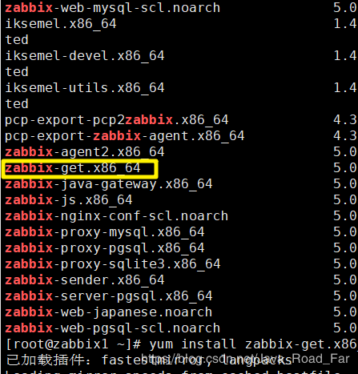

* [一、配置阿里云yum源](#%E4%B8%80%E9%85%8D%E7%BD%AE%E9%98%BF%E9%87%8C%E4%BA%91yum%E6%BA%90)
* [二、Zabbix5\.0 YUM源](#%E4%BA%8Czabbix50-yum%E6%BA%90)
* [三、安装 Zabbix agent](#%E4%B8%89%E5%AE%89%E8%A3%85-zabbix-agent)
* [四、修改配置文件](#%E5%9B%9B%E4%BF%AE%E6%94%B9%E9%85%8D%E7%BD%AE%E6%96%87%E4%BB%B6)
* [五、测试是否成功加入agent（在server端检查）](#%E4%BA%94%E6%B5%8B%E8%AF%95%E6%98%AF%E5%90%A6%E6%88%90%E5%8A%9F%E5%8A%A0%E5%85%A5agent%E5%9C%A8server%E7%AB%AF%E6%A3%80%E6%9F%A5)
  * [5\.1 安装 zabbix\-get](#51-%E5%AE%89%E8%A3%85-zabbix-get)

---
# 一、配置阿里云yum源
```bash
[root@zabbix2 ~]# curl -o /etc/yum.repos.d/epel.repos http://mirrors.aliyun.com/repo/epel-7.repo
[root@zabbix2 ~]# curl -o /etc/yum.repos.d/CentOS-Base.repo http://mirrors.aliyun.com/repo/Centos-7.repo
```
---
# 二、Zabbix5.0 YUM源
```bash
[root@zabbix2 ~]# rpm -Uvh https://repo.zabbix.com/zabbix/5.0/rhel/7/x86_64/zabbix-release-5.0-1.el7.noarch.rpm
```
Zabbix5.0 YUM源切换到阿里

```bash
[root@zabbix2 ~]# vim /etc/yum.repos.d/zabbix.repo
%s#repo.zabbix.com#mirrors.aliyun.com/zabbix#g
[root@zabbix2 ~]# yum clean all
[root@zabbix2 ~]# yum makecache
```
---
# 三、安装 Zabbix agent

```bash
[root@zabbix2 ~]# yum install zabbix-agent -y
```
---
# 四、修改配置文件
```bash
[root@zabbix2 ~]# vim /etc/zabbix/zabbix_agentd.conf

PidFile=/var/run/zabbix/zabbix_agentd.pid
LogFile=/var/log/zabbix/zabbix_agentd.log
DebugLevel=3
Server=192.168.161.200
ListenPort=10050
ListenIP=192.168.161.201
ServerActive=192.168.161.200
Hostname=192.168.161.201
Include=/etc/zabbix/zabbix_agentd.d/*.conf
# UserParameter
```
说明:
	

 - `PidFile`：Pid
 - `LogFile`：日志文件
 - `DebugLevel`：日志级别
 - `Server`：zabbix server 的地址
 - `ListenPort`：nginx的地址 默认10050
 - `ListenIP`：自己的ip
 - `ServerActive`：主动将自己的作业给到server 的ip
 - `Hostname`：agent的主机名/ip
 - `Include`	：包含的配置文件
---

# 五、测试是否成功加入agent（在server端检查）
## 5.1 安装 zabbix-get

```bash
[root@zabbix1 ~]# yum list all | grep zabbix
```


```bash
[root@zabbix1 ~]# yum install zabbix-get.x86_64

# 在 zabbix 服务器端检查
[root@zabbix1 ~]# zabbix_get -s 192.168.161.201 -p10050 -k "system.hostname"
zabbix2
[root@zabbix1 ~]# zabbix_get -s 192.168.161.201 -p 10050 -k "system.cpu.load"
0.040000
```

 