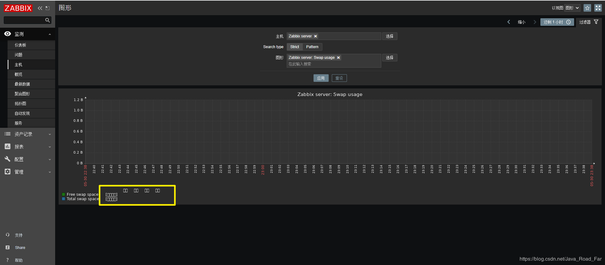
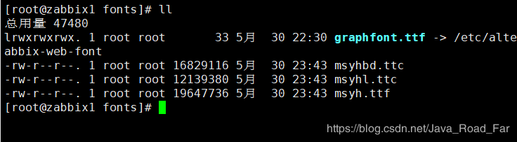
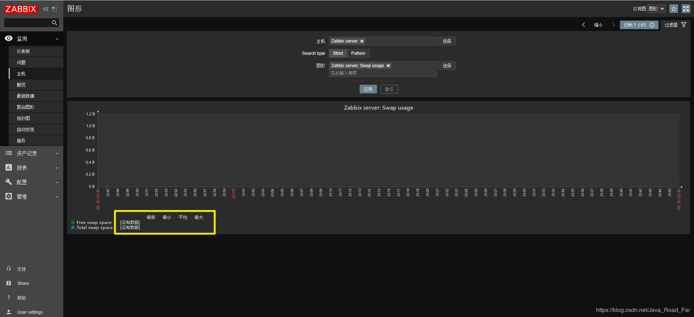

字体文件目录:

```bash
zabbix 4.0：/usr/share/zabbix/fonts/
zabbix 4.2：/usr/share/zabbix/assets/fonts/
zabbix5.0：/usr/share/zabbix/assets/fonts
```
php 脚本文件位置:

```bash
/usr/share/zabbix/include/defines.inc.php
```
将Win10操作系统 C:\Windows\Fonts目录下的任意字体，拷贝到/usr/share/zabbix/assets/fonts/目录下（如果是zabbix4.0请拷贝到/usr/share/zabbix/fonts/这个目录下），更改后缀为’.ttf’

修改php脚本文件

```bash
vim /usr/share/zabbix/include/defines.inc.php 
define('ZBX_GRAPH_FONT_NAME',           'msyh'); // font file name
define('ZBX_FONT_NAME', 'msyh');
```
重启zabbix服务

```bash
systemctl restart zabbix-server
```
f5 刷新页面
