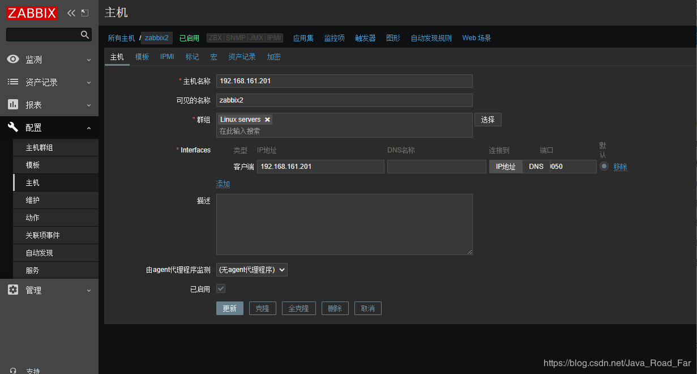
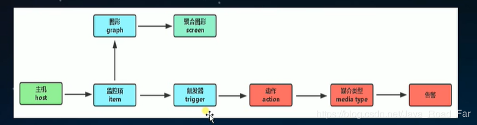
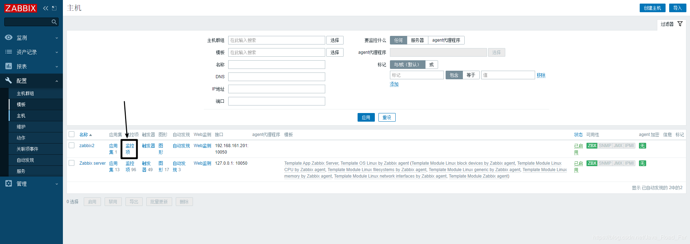
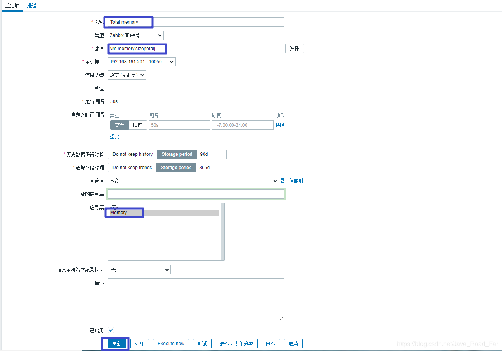
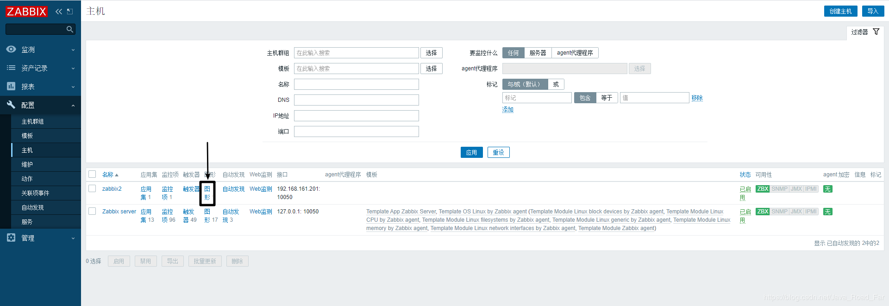
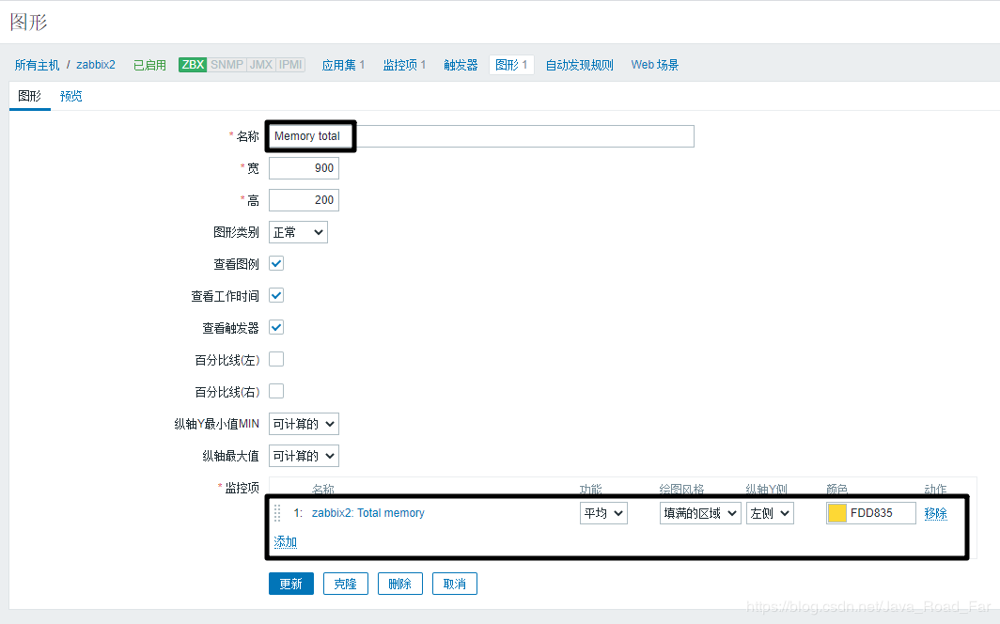
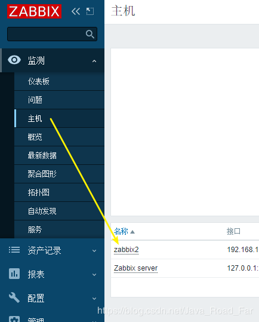
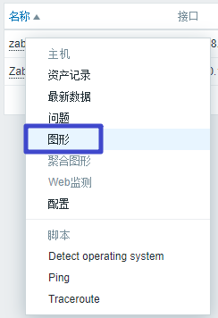
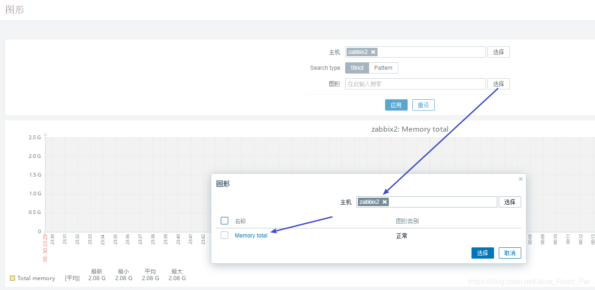
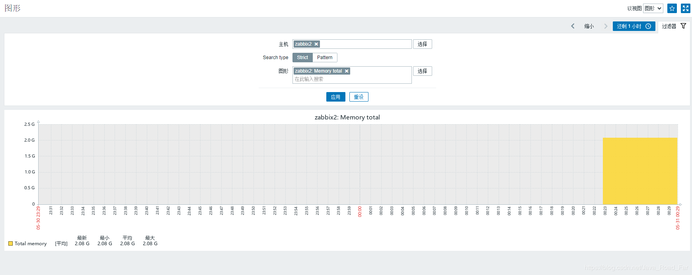

* [一、添加主机](#%E4%B8%80%E6%B7%BB%E5%8A%A0%E4%B8%BB%E6%9C%BA)
* [二、zabbix 监控流程](#%E4%BA%8Czabbix-%E7%9B%91%E6%8E%A7%E6%B5%81%E7%A8%8B)
* [三、添加监控项](#%E4%B8%89%E6%B7%BB%E5%8A%A0%E7%9B%91%E6%8E%A7%E9%A1%B9)
* [四、添加图形](#%E5%9B%9B%E6%B7%BB%E5%8A%A0%E5%9B%BE%E5%BD%A2)
* [五、查看图形](#%E4%BA%94%E6%9F%A5%E7%9C%8B%E5%9B%BE%E5%BD%A2)

---
# 一、添加主机
"配置" → "主机" → "创建主机"
 

注意:
	- 主机名称要和agent节点配置文件的: `vim /etc/zabbix/zabbix_agentd.conf `  → `Hostname` 一致

---
# 二、zabbix 监控流程

---
# 三、添加监控项

点击 "创建监控项"

---
# 四、添加图形

点击 "创建图形"

---
# 五、查看图形

