* [一、检查服务，如果有就关闭](#%E4%B8%80%E6%A3%80%E6%9F%A5%E6%9C%8D%E5%8A%A1%E5%A6%82%E6%9E%9C%E6%9C%89%E5%B0%B1%E5%85%B3%E9%97%AD)
* [二、安装服务](#%E4%BA%8C%E5%AE%89%E8%A3%85%E6%9C%8D%E5%8A%A1)
* [三、编辑配置文件](#%E4%B8%89%E7%BC%96%E8%BE%91%E9%85%8D%E7%BD%AE%E6%96%87%E4%BB%B6)
* [四、测试](#%E5%9B%9B%E6%B5%8B%E8%AF%95)
* [五、配置自定义邮件脚本](#%E4%BA%94%E9%85%8D%E7%BD%AE%E8%87%AA%E5%AE%9A%E4%B9%89%E9%82%AE%E4%BB%B6%E8%84%9A%E6%9C%AC)
* [六、测试](#%E5%85%AD%E6%B5%8B%E8%AF%95)
* [七、zabbix 对hadoop namenode报警](#%E4%B8%83zabbix-%E5%AF%B9hadoop-namenode%E6%8A%A5%E8%AD%A6)
  * [7\.1 创建 Items](#71-%E5%88%9B%E5%BB%BA-items)
  * [7\.2 创建 Trigger](#72-%E5%88%9B%E5%BB%BA-trigger)
  * [7\.3 关闭HDFS会出现如下警报](#73-%E5%85%B3%E9%97%ADhdfs%E4%BC%9A%E5%87%BA%E7%8E%B0%E5%A6%82%E4%B8%8B%E8%AD%A6%E6%8A%A5)
  * [7\.4 创建 Media Type](#74-%E5%88%9B%E5%BB%BA-media-type)
  * [7\.5 Email 绑定收件人](#75-email-%E7%BB%91%E5%AE%9A%E6%94%B6%E4%BB%B6%E4%BA%BA)
  * [7\.6 创建 Action](#76-%E5%88%9B%E5%BB%BA-action)
  * [7\.7 修改 mail\.sh 文件](#77-%E4%BF%AE%E6%94%B9-mailsh-%E6%96%87%E4%BB%B6)


---
# 一、检查服务，如果有就关闭
sendmail
```bash
systemctl status sendmail
```
postfix
```bash
systemctl status postfix.service
systemctl stop postfix.service
systemctl disable postfix.service
```
---
# 二、安装服务
mailx
```bash
yum install mailx
```
dos2unix

```bash
yum install dos2unix -y
```

---
# 三、编辑配置文件
```bash
vim /etc/mail.rc

在最末尾增加
set from="xxx@163.com"
set smtp="smtp.163.com"
set smtp-auth-user="xxx@163.com"
set smtp-auth-password="password"
set smtp-auth="login"
```

---
# 四、测试
```bash
echo "zabbix test"|mailx -s"zabbix alert" xxx@163.com
```
去邮箱收邮件


---
# 五、配置自定义邮件脚本
打开 zabbix_server.conf  查看 `AlertScriptsPath` 
```bash
### Option: AlertScriptsPath
#       Full path to location of custom alert scripts.
#       Default depends on compilation options.
#       To see the default path run command "zabbix_server --help".
#
# Mandatory: no
# Default:
# AlertScriptsPath=${datadir}/zabbix/alertscripts

AlertScriptsPath=/usr/lib/zabbix/alertscripts
```
进入该目录创建 mail.sh 文件

```bash
cd /usr/lib/zabbix/alertscripts
vim mail.sh

#! /bin/bash
SENT_TO=$1
SENT_SUBJECT=$2
SENT_CONTENT=$2
echo "$SENT_CONTENT" |mailx -v -s "$SENT_SUBJECT" $SENT_TO

chmod 777 mail.sh
```
---
# 六、测试

```bash
./mail.sh 18827403358@163.com "zabbix test" "test"
```
去邮箱查看邮件

---
# 七、zabbix 对hadoop namenode报警
## 7.1 创建 Items
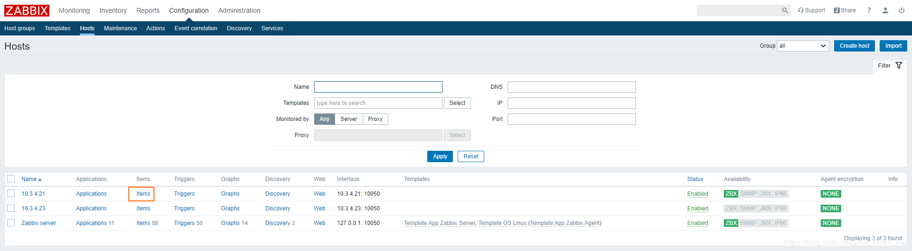
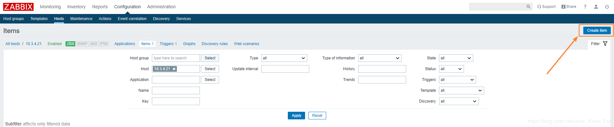
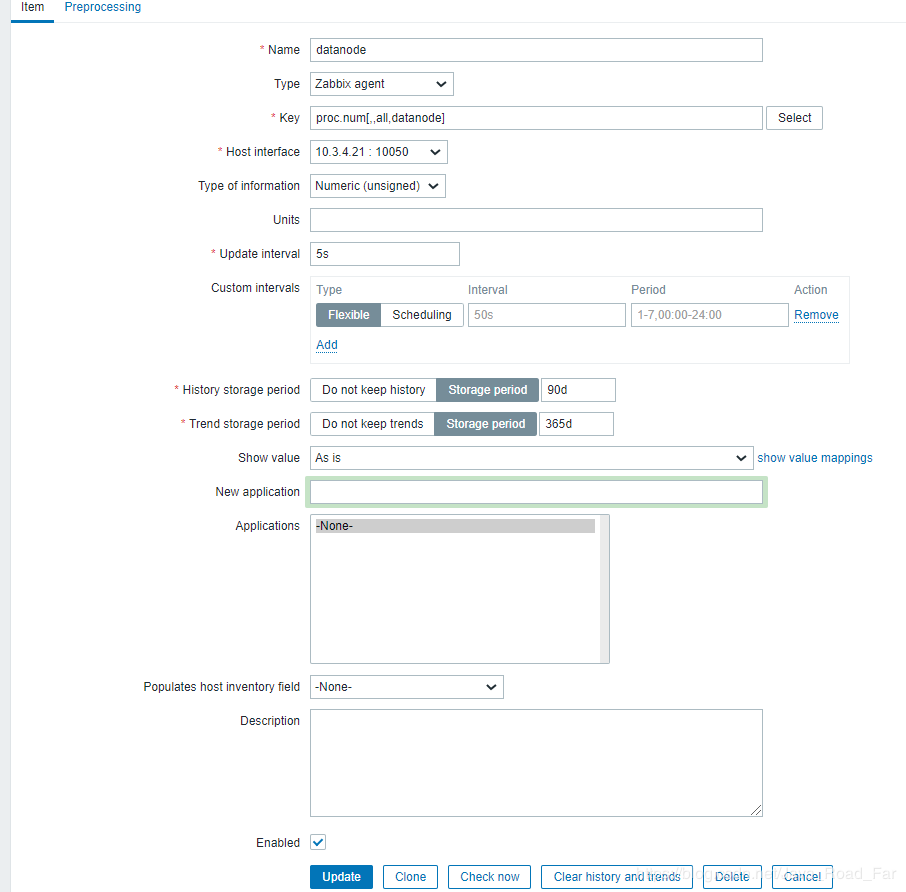
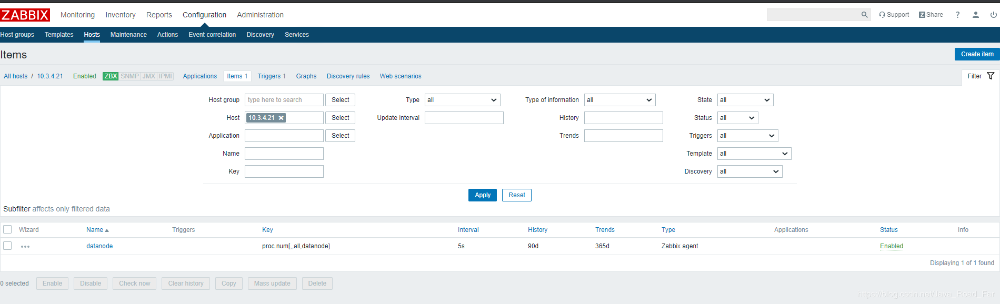
## 7.2 创建 Trigger
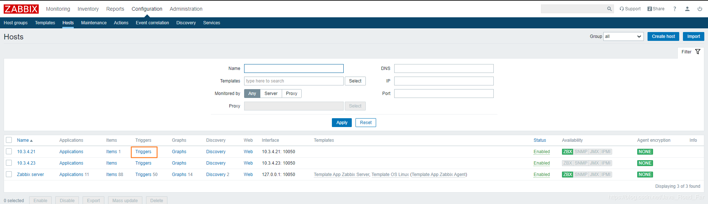
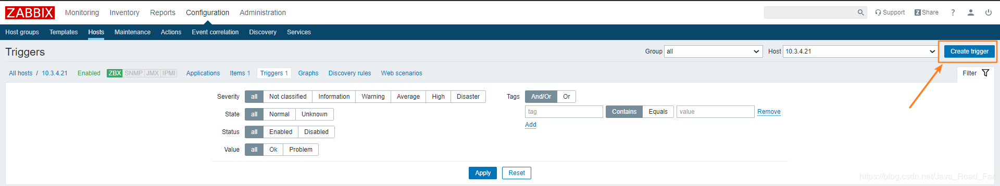
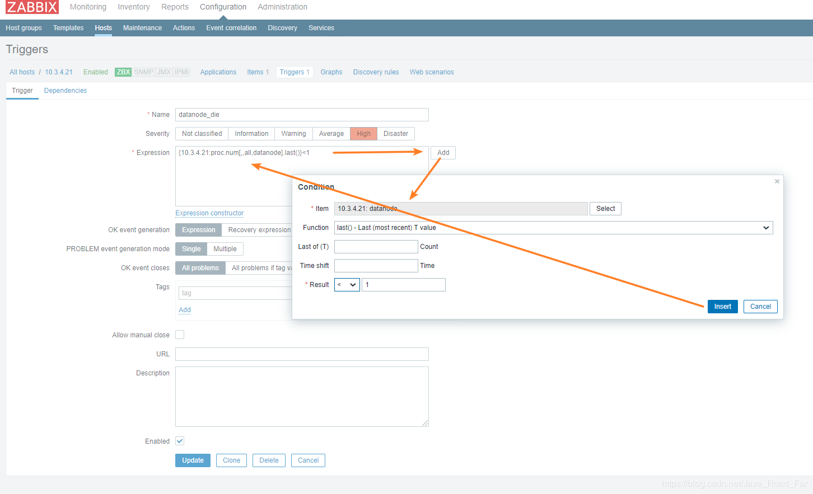
## 7.3 关闭HDFS会出现如下警报
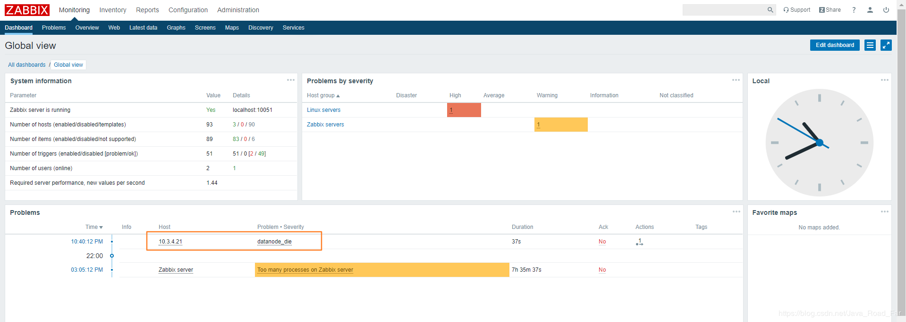
## 7.4 创建 Media Type
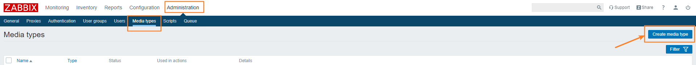
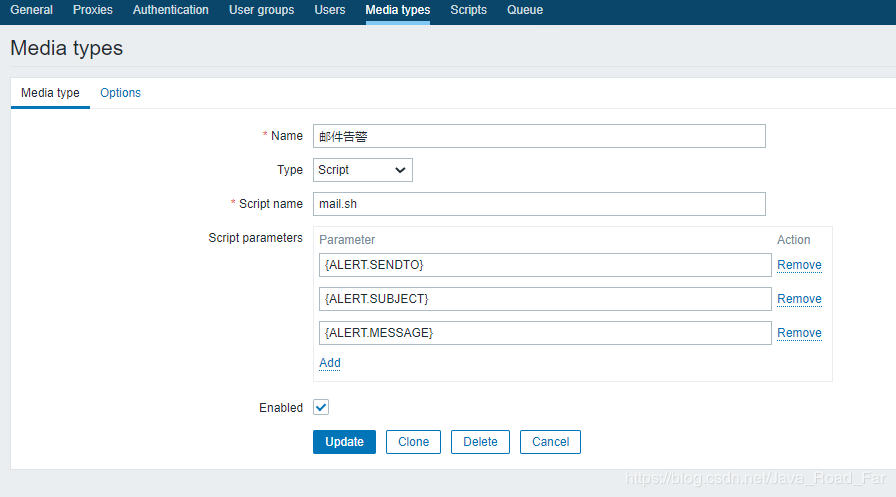
## 7.5 Email 绑定收件人
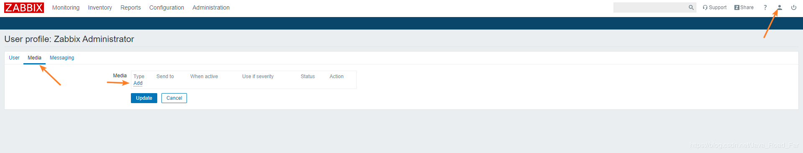
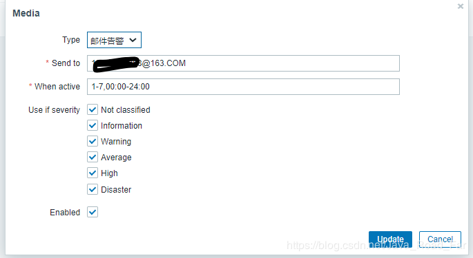
## 7.6 创建 Action
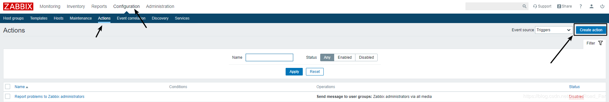
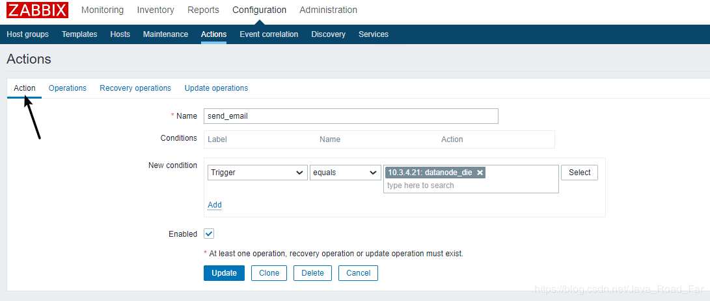
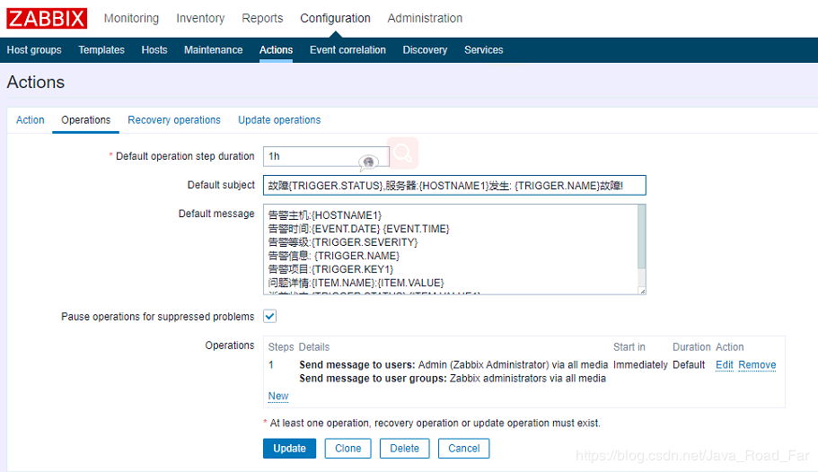
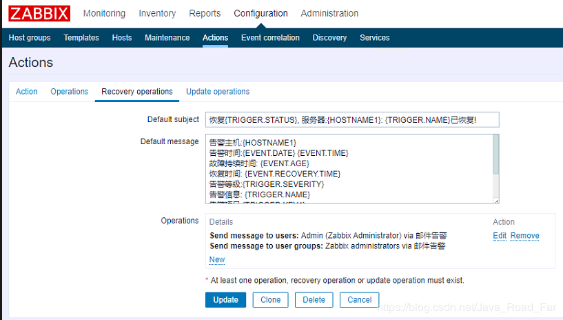
```bash
警告：
故障{TRIGGER.STATUS},服务器:{HOSTNAME1}发生: {TRIGGER.NAME}故障!
告警主机:{HOSTNAME1}
告警时间:{EVENT.DATE} {EVENT.TIME}
告警等级:{TRIGGER.SEVERITY}
告警信息: {TRIGGER.NAME}
告警项目:{TRIGGER.KEY1}
问题详情:{ITEM.NAME}:{ITEM.VALUE}
当前状态:{TRIGGER.STATUS}:{ITEM.VALUE1}
事件 ID:{EVENT.ID}

恢复：
恢复{TRIGGER.STATUS}, 服务器:{HOSTNAME1}: {TRIGGER.NAME}已恢复!
告警主机:{HOSTNAME1}
告警时间:{EVENT.DATE} {EVENT.TIME}
故障持续时间: {EVENT.AGE}
恢复时间: {EVENT.RECOVERY.TIME}
告警等级:{TRIGGER.SEVERITY}
告警信息: {TRIGGER.NAME}
告警项目:{TRIGGER.KEY1}
问题详情:{ITEM.NAME}:{ITEM.VALUE}
当前状态:{TRIGGER.STATUS}:{ITEM.VALUE1}
事件 ID:{EVENT.ID}
```
## 7.7 修改 mail.sh 文件
避免预警信息为附件的形式发送出来，所以修改一下配置文件为

```bash

#! /bin/bash
SENT_TO=$1
SENT_SUBJECT=$2
SENT_CONTENT="/tmp/alert_$$".tmp

echo "$3">$SENT_CONTENT
dos2unix $SENT_CONTENT

#echo "$SENT_CONTENT" |mailx -v -s "$SENT_SUBJECT" $SENT_TO

mailx -s "$SENT_SUBJECT" $SENT_TO<$SENT_CONTENT
```

重启 HDFS然后关闭，会发送故障邮件到邮箱中
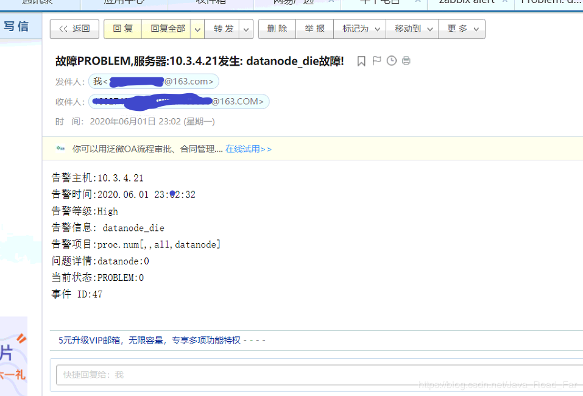
当重启HDFS后，恢复邮件会发送到邮箱中
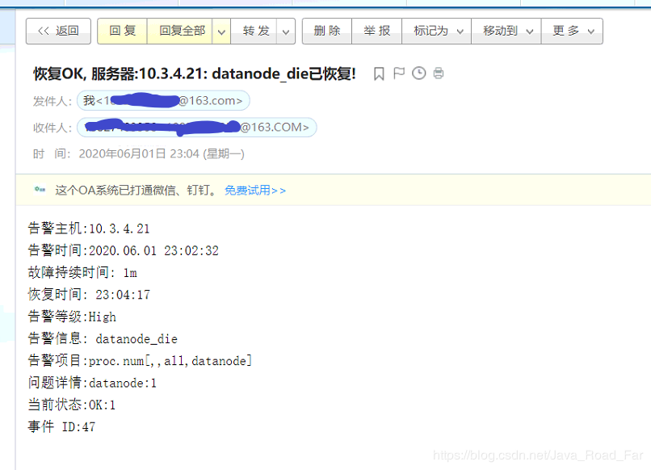