* [zookeeper 节点](#zookeeper-%E8%8A%82%E7%82%B9)
* [Zookeeper 分布式锁原理](#zookeeper-%E5%88%86%E5%B8%83%E5%BC%8F%E9%94%81%E5%8E%9F%E7%90%86)
  * [1\. 获取锁](#1-%E8%8E%B7%E5%8F%96%E9%94%81)
* [释放锁](#%E9%87%8A%E6%94%BE%E9%94%81)
  * [1\. 任务完成时, 客户端显示释放](#1-%E4%BB%BB%E5%8A%A1%E5%AE%8C%E6%88%90%E6%97%B6-%E5%AE%A2%E6%88%B7%E7%AB%AF%E6%98%BE%E7%A4%BA%E9%87%8A%E6%94%BE)
  * [2\. 任务执行过程中，客户端崩溃](#2-%E4%BB%BB%E5%8A%A1%E6%89%A7%E8%A1%8C%E8%BF%87%E7%A8%8B%E4%B8%AD%E5%AE%A2%E6%88%B7%E7%AB%AF%E5%B4%A9%E6%BA%83)

---

# zookeeper 节点
zookeeper存储数据结构就像一棵树一样，这棵树由节点组成，这种节点叫做Znode。
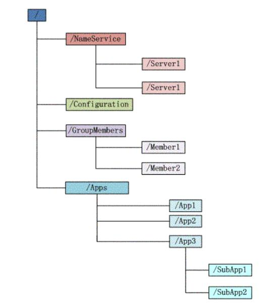

- 持久节点(Persistent):
    - 客户端与 Zookeeper 断开连接后, 该节点依旧存在;
- 持久节点顺序节点(Persistent_Sequential): 
    - 客户端与 Zookeeper 断开连接后, 该节点依旧存在, 只是Zookeeper 给该节点名称进行顺序编号;
- 临时节点(Ephemeral):
    - 客户端与 Zookeeper 断开连接后, 该节点被删除;
- 临时顺序节点(Ephemeral_Sequential): 
    - 客户端与 Zookeeper 断开连接后, 该节点被删除, 只是Zookeeper 给该节点名称进行顺序编号;

说明: 创建 ZNode 时设置顺序表示, ZNode 名称后会附加一个值, 顺序号是一个单调递增的计数器, 由父节点维护。

注意: 在分布式系统中, 顺序号可以被用于为所有的时间进行全局排序, 这样客户端可以通过顺序号推断事件的顺序。

# Zookeeper 分布式锁原理
## 1. 获取锁
首先，在Zookeeper当中创建一个持久节点 ParentLock。当第一个客户端想要获得锁时，需要在 ParentLock 这个节点下面创建一个临时顺序节点 Lock1。
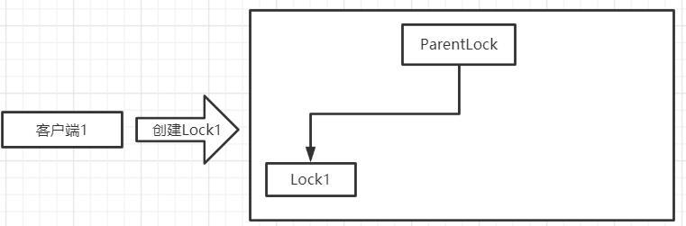

之后，Client1查找ParentLock下面所有的临时顺序节点并排序，判断自己所创建的节点Lock1是不是顺序最靠前的一个。如果是第一个节点，则成功获得锁。
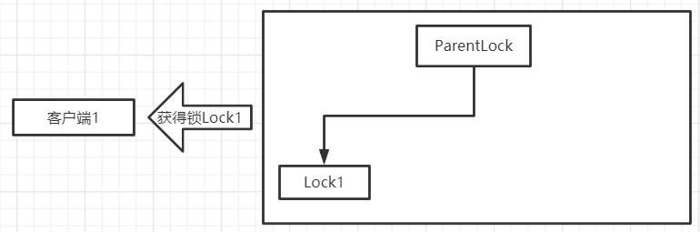

这时候，如果再有一个客户端 Client2 前来获取锁，则在ParentLock下载再创建一个临时顺序节点Lock2。 
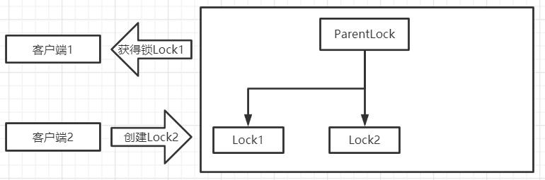

Client2查找ParentLock下面所有的临时顺序节点并排序，判断自己所创建的节点Lock2是不是顺序最靠前的一个，结果发现节点Lock2并不是最小的。

于是，Client2向排序仅比它靠前的节点Lock1注册 Watcher，用于监听Lock1节点是否存在。这意味着Client2抢锁失败，进入了等待状态。 
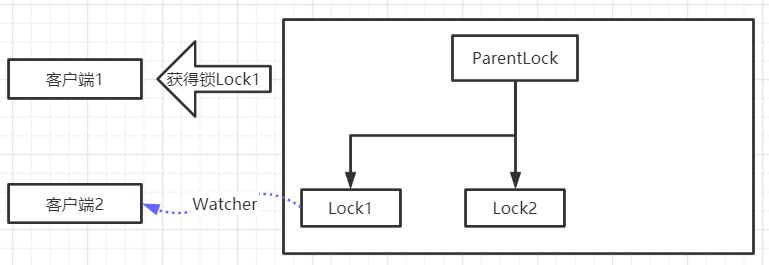

这时候，如果又有一个客户端Client3前来获取锁，则在ParentLock下载再创建一个临时顺序节点Lock3。 
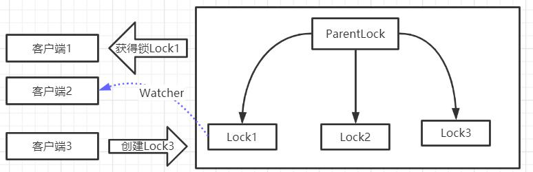

Client3查找ParentLock下面所有的临时顺序节点并排序，判断自己所创建的节点Lock3是不是顺序最靠前的一个，结果同样发现节点Lock3并不是最小的。

于是，Client3向排序仅比它靠前的节点Lock2注册Watcher，用于监听Lock2节点是否存在。这意味着Client3同样抢锁失败，进入了等待状态。 
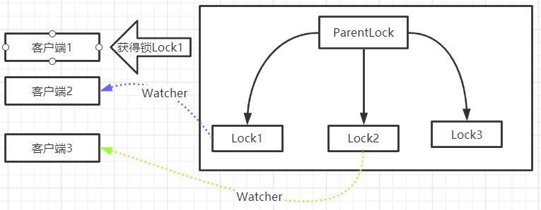

这样一来，Client1得到了锁，Client2监听了Lock1，Client3监听了Lock2。这恰恰形成了一个等待队列，很像是Java当中ReentrantLock所依赖的AQS（AbstractQueuedSynchronizer）。

# 释放锁
释放锁分为两种情况
## 1. 任务完成时, 客户端显示释放
当任务完成时，Client1会显示调用删除节点Lock1的指令。
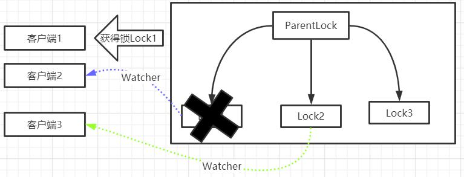

## 2. 任务执行过程中，客户端崩溃
获得锁的Client1在任务执行过程中，如果Duang的一声崩溃，则会断开与Zookeeper服务端的链接。根据临时节点的特性，相关联的节点Lock1会随之自动删除。 
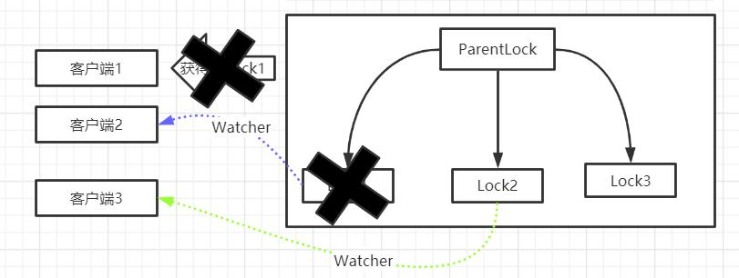

由于Client2一直监听着Lock1的存在状态，当Lock1节点被删除，Client2会立刻收到通知。这时候Client2会再次查询ParentLock下面的所有节点，确认自己创建的节点Lock2是不是目前最小的节点。如果是最小，则Client2顺理成章获得了锁。 
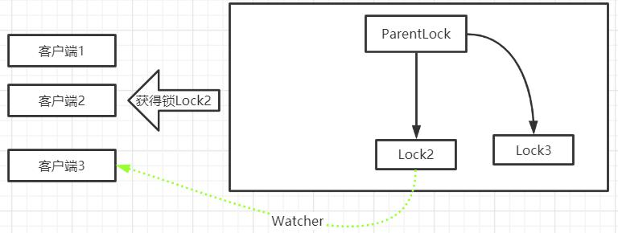

同理，如果Client2也因为任务完成或者节点崩溃而删除了节点Lock2，那么Client3就会接到通知。 
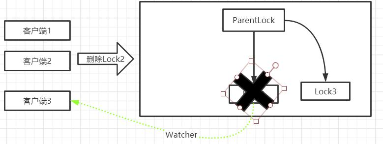

最终，Client3成功得到了锁。
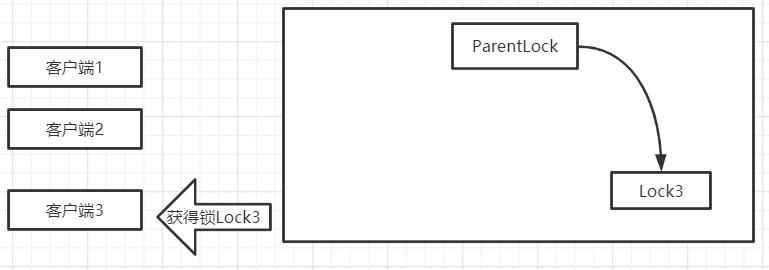