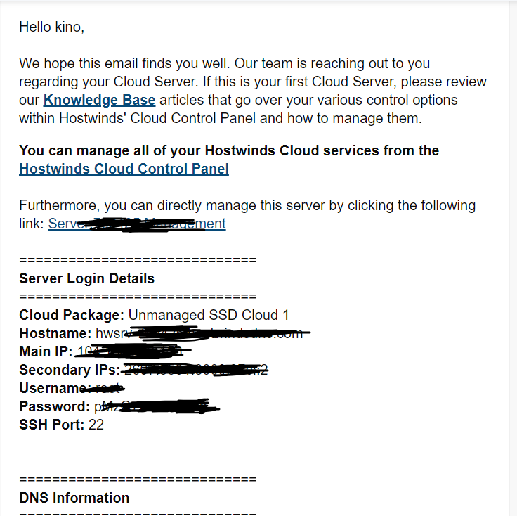

---
# 官方教程
https://233v2.com/post/1/

# 一、购买美国 VPS Hostwinds
[购买地址](https://affiliates.hostwinds.com/hostwinds.php?id=7011&url=1224
)

选择自己需要的配置, 一路 next 即可

完成购买后，你会收到一封邮件，里面包含 VPS 的IP地址、用户名、密码、ssh连接端口。如下图所示：

安装配置看官方教程即可

# 二、快速管理
- bash <(curl -s -L https://git.io/v2ray.sh)
- `v2ray info` 查看 V2Ray 配置信息
- `v2ray config` 修改 V2Ray 配置
- `v2ray link` 生成 V2Ray 配置文件链接
- `v2ray infolink` 生成 V2Ray 配置信息链接
- `v2ray qr` 生成 V2Ray 配置二维码链接
- `v2ray ss` 修改 Shadowsocks 配置
- `v2ray ssinfo` 查看 Shadowsocks 配置信息
- `v2ray ssqr` 生成 Shadowsocks 配置二维码链接
- `v2ray status` 查看 V2Ray 运行状态
- `v2ray start` 启动 V2Ray
- `v2ray stop` 停止 V2Ray
- `v2ray restart` 重启 V2Ray
- `v2ray log` 查看 V2Ray 运行日志
- `v2ray update` 更新 V2Ray
- `v2ray update.sh` 更新 V2Ray 管理脚本
- `v2ray uninstall` 卸载 V2Ray

# 三、IP被封解决办法
[美国VPS Hostwinds IP被屏蔽Ping不通解决新方法 - 免费换IP](https://www.vps234.com/hostwinds-ip-blocked-fix-isp/)

[检测 ip 是否被封](https://www.vps234.com/ipchecker/)

！！！！免费换好 IP 之后， 需要重装系统才会生效！！！！

