# TCP/IP 网络模型分层


# 一、应用层
## 1.1 HTTP
### 1.1.1 HTTP 是什么
HTTP 是超文本传输协议，也就是HyperText Transfer Protocol。

- `超文本`: 网页文本、音频、视频、图片、压缩包 的混合体,并且有超链接, 可以从一个超文本跳转到另一个超文本中.
- `传输`: 把 `超文本` 从 A 传输 到 B, 也可以从 B 传输到 A。这是双向的。
- `协议`: `协` 表示至少有2个以上的参与者, `议` 表示对行为的约定和规范。

总结就是: HTTP 是计算机世界中, 在 `两点` 之间 `传输` 文字、图片、音频等 `超文本` 数据的`约定`和`规范`.

### 1.1.2 GET 和 POST 区别
在 RFC 协议中, GET 是从服务器获取资源的. POST 是根据请求报文, 对指定资源做处理的.

GET 传输的数据在URL中(也可以在 body 中), 是明文的, 且有大小限制；

POST 传输的数据可以在URL中, 也可以在 body 中, body 无大小限制.

从 RFC 规范协议的语义上来讲, GET 请求是 安全且幂等 的. 因为 GET 是`只读`操作, 无论操作多少次, 服务器上的数据都是安全的, 且每次结果相同。 所以可以对 GET请求的数据做缓存, 比如缓存可以做到浏览器本身, 也可以做到代理上(nginx), 而且在浏览器中的 GET 请求可以保存为书签。

而 POST 请求是`新增或者提交`数据, 会修改服务器上的资源, 所以是不安全的, 且多次提交数据就会创建多个资源, 所以也不是幂等的.

但是在实际的开发中, 也有人用 GET 请求保存数据, 有人用 POST 请求读取数据.

### 1.1.3 HTTP 缓存技术

#### 强制缓存
强制缓存生效的话, 不会向服务器发起请求.

强制缓存是只要浏览器判断缓存没有过期, 则直接使用浏览器本地缓存, 决定是否使用缓存的主动性在于浏览器.

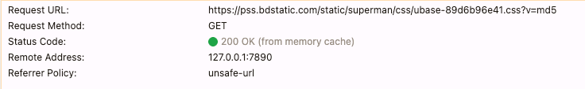

强制缓存利用 HTTP 响应头部字段实现:
1. `Cache-Control` 相对时间. 优先级高于 `Expires`
2. `Expires` 绝对时间.

强制缓存的流程:
1. 第一次请求服务器资源, 服务器会在返回资源的时候, 在 Response header 加上 Cache-Control, Cache-Control 设置了过期时间大小;
2. 再次请求服务器资源, 会先通过请求资源的时间 和 Cache-Control 中设置的过期时间, 来计算出资源是否过期, 如果没有, 就使用缓存, 否则重新请求服务器;
3. 服务器再次收到请求, 会再次更新 Response header 的 Cache-Control.


nginx 配置强制缓存
```bash
# a.html 
<!DOCTYPE html>
<html lang="en">
<head>
  <meta charset="UTF-8">
  <title>Fetch Login</title>
</head>
<body>
  <h2>nginx 强制缓存测试</h2>
</body>
</html>


# nginx config
server {
    listen 80;
    server_name 192.168.1.168;
    location /a.html {
       add_header Cache-Control "max-age=600";  # 设置缓存时间为 600s, max-age 需要加引号
       add_header Last-Modified "";             # 关闭协商缓存
       etag off;                                # 关闭ETag
       root /Users/kino/;
    }
}
```
在浏览器中访问结果:

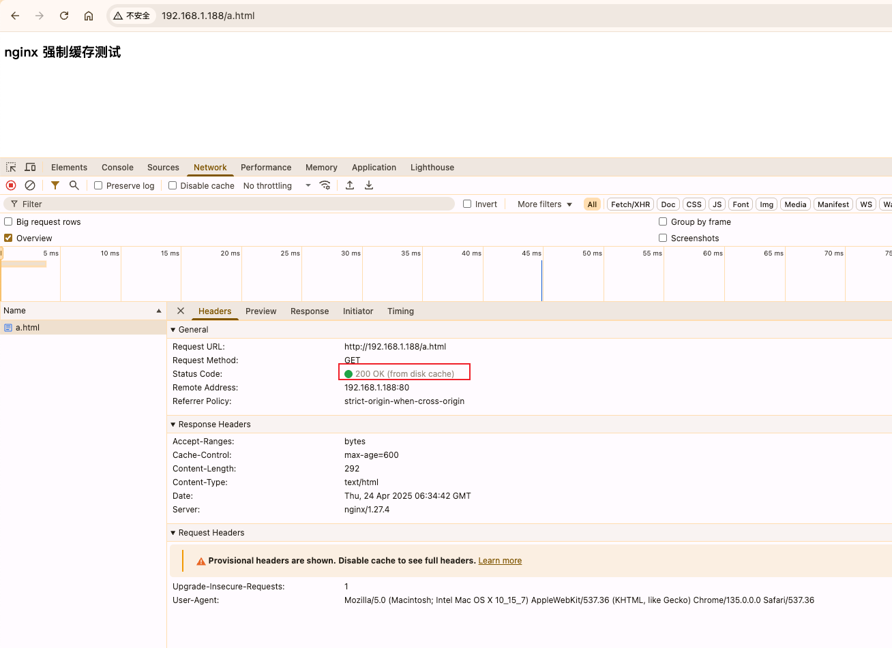

> 注意: 在浏览器中, 要按回车键才能使用到强制缓存, 按刷新按钮或者f5, 会走协商缓存, 原因是浏览器会在 Request Headers 中添加: `Cache-Control: max-age=0`, 告诉服务端帮我确认该资源是否过期, 也就是说浏览器是真的会发出请求的.


#### 协商缓存
协商缓存 区别于 强制缓存 的地方在, 协商缓存必定会向服务器发起请求, 是否使用缓存取决于服务器端, 协商缓存有两种实现:

第一种: Request Header 的 `If-Modified-Since` 字段与 Response Header 的 `Last-Modified` 字段
- Response Header 的 `Last-Modified` 表示这个响应资源的最后修改时间.
- Header Header 的 `If-Modified-Since` 当资源过期了, 发现响应头中有 `Last-Modified` 则再次发起请求的时候带上 `Last-Modified` 的时间, 服务器收到请求后发现有 `If-Modified-Since` 则与被请求资源的最后修改时间进行对比(`Last-Modified`), 如果最后修改时间大, 说明资源被修改过, 则返回最新的资源, HTTP 200 OK; 如果最后修改时间小, 说明资源没有修改过, 响应 HTTP 304 走缓存.

第二种: Request Header 的 `If-None-Match` 和 Response Header 的 `ETag` 字段
- Response Header 的 `ETag`, 响应资源的唯一标识。
- Request Header 的 `If-None-Match`, 当资源过期时, 浏览器发现响应头里有 ETag, 则再次向服务器发起请求时, 会将请求头 `If-None-Match` 值设置成 ETag 值。服务器收到请求后进行对比, 如果资源没有变化返回 304, 变化了返回 200.

两种协商缓存的方式都依赖于强制缓存的 Cache-Control 字段来使用, 在未命中强制缓存之后, 才能发起带有协商缓存字段的请求, 在两种协商缓存种, ETag 的优先级 高于 第一种时间对比 的方式.

强制缓存和协商缓存的工作流程：

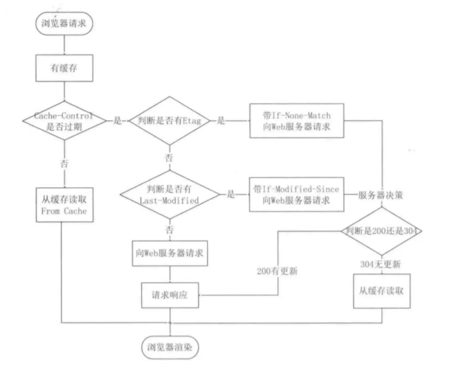

当使用 ETag 字段实现的协商缓存的过程：
- 当浏览器第一次请求访问服务器资源时, 服务器会在返回这个资源的同时, 在 Response Header 加上 ETag 唯一标识, 这个唯一标识的值是根据当前请求的资源生成的.
- 当浏览器再次请求访问服务器中的该资源时, 首先会检查强制缓存是否过期:
  - 如果没有过期, 则直接使用本地缓存.
  - 如果缓存过期, 会在 Request Header 加上 `If-None-Match` 字段, 该字段的值就是 ETag 唯一标识。
- 服务器再次收到请求后, 会根据请求中的 `If-None-Match` 字段, 与当前请求的资源生成的唯一标识进行对比:
  - 如果值相等: 则返回 304 Not Modified, 不会返回资源.
  - 如果不相等: 则返回 200 状态码和返回资源, 并在 Response Header 中加上新的 ETag 唯一标识;
- 如果浏览器收到 304 的请求响应状态码, 则会从本地缓存中加载资源, 否则更新资源.

nginx 配置协商缓存
```bash
# vim a.html 
与强制缓存一致

# nginx config
server {
    listen 80;
    server_name 192.168.1.168;
    location /a.html {
       add_header Cache-Control "public max-age=600";
       etag on;
       root /Users/kino/;
    }
}
```
在浏览器中第一次请求的请求头和响应头如下(去除无关信息):
```bash
# Request Headers
GET /a.html HTTP/1.1
Cache-Control: no-cache
Connection: keep-alive
Pragma: no-cache

# Response Headers
HTTP/1.1 200 OK                                # 正常响应, 未走缓存
Date: Thu, 24 Apr 2025 06:59:25 GMT            # 请求时间
Last-Modified: Thu, 24 Apr 2025 06:34:40 GMT   # 资源最后一次修改的时间
Connection: keep-alive
ETag: "6809db80-124"                           # 资源的唯一标识
Cache-Control: public max-age=600              # 缓存 600s
```
在浏览器中第二次请求的请求头和响应头如下(去除无关信息):
```bash
# Request Headers
GET /a.html HTTP/1.1
Cache-Control: max-age=0                           # 询问服务器该资源是否过期
Connection: keep-alive
If-Modified-Since: Thu, 24 Apr 2025 06:34:40 GMT   # 资源最后一次修改的时间
If-None-Match: "6809db80-124"                      # 资源的唯一标识

# Response Headers
HTTP/1.1 304 Not Modified                          # 304 Not Modified 表示使用协商缓存
Last-Modified: Thu, 24 Apr 2025 06:34:40 GMT       # 资源最后一次修改的时间
Connection: keep-alive
ETag: "6809db80-124"                               # 资源的唯一标识
Cache-Control: public max-age=600                  # 缓存 600s
```
尝试修改资源文件的最后一次修改时间:
```bash
touch -mt 202504241508 a.html
```
在浏览器中第三次请求的请求头和响应头如下(去除无关信息):
```bash
# Request Headers
GET /a.html HTTP/1.1
Connection: keep-alive
If-Modified-Since: Thu, 24 Apr 2025 06:34:40 GMT  # 资源最后一次修改的时间
If-None-Match: "6809db80-124"                     # 资源的唯一标识

# Response Headers
HTTP/1.1 200 OK                                   # 没有走缓存
Last-Modified: Thu, 24 Apr 2025 07:08:00 GMT      # 资源最后一次修改时间( 和 Request Header 中的不一样了)
Connection: keep-alive
ETag: "6809e350-124"                              # 资源的唯一标识( 和 Request Header 中的不一样了)
Cache-Control: public max-age=600                 # 缓存 600s
```

> 这里有个有意思的地方, 在上面解释过浏览器的刷新和回车的区别, 这里配置上协商缓存之后, 在浏览器点击刷新, 会发现是先使用了协商缓存, 再回车走的是强制缓存。

### 1.1.4 HTTP 特性
优点:
1. 简单: Header 和 Body 都是 key-value 格式.
2. 灵活、易于扩展: 字段可以自定义和扩充.
3. 应用广泛、跨平台: pc、app.

缺点:
1. 无状态: 无法记住身份信息, 所以有了Cookie技术
2. 不安全(SSL/TLS解决了):
   3. 明文传输: 请求数据没有加密.
   4. 身份验证: 无法验证服务器(客户端)的身份.
   5. 报文完整性: 无法保证数据报文不被穿篡改.

### 1.1.5 HTTP/1
#### 1.1.5.1 HTTP/1.0 和 HTTP/1.1
HTTP/1.1 相比 HTTP/1.0 做了以下改进:
1. 使用长连接, 改善了HTTP/1.0短连接造成的性能开销.
2. 支持管道(pipeline)网络传输: 只要请求发出去了, 不用等响应, 就可以发第二个请求, 减少了整体的响应时间.

但是 HTTP/1.1 还是存在以下问题, HTTP2 和 HTTP3 都是致力于解决这些问题:
1. HTTP/1.1 只能压缩Body 部分数据, Request Header 和 Response Header 未经过压缩就发送, Header 越多, 网络开销越大延迟越大.
2. 每次请求首部信息大部分是一样的, 每次都需要发送冗余的首部信息.
3. 虽然HTTP/1.1 支持了管道, 但是服务器是按请求顺序响应的, 如果服务器响应慢, 会导致客户端一直请求不到数据, 这就是服务端的队头阻塞.
4. 没有请求优先级控制.
5. 请求只能从客户端开始, 服务端只能被动响应.

#### 1.1.5.2 HTTP 如何优化


### 1.1.6 HTTP/2

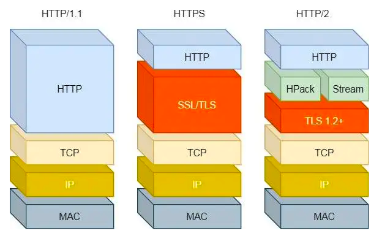

HTTP2 是基于 HTTPS 的, 所以 HTTP2 的安全性是有保障的.

HTTP2 相比 HTTP/1.1 在性能上的改进:
1. 头部压缩: 如果同时发起多个请求, 它们的头是一样或者是相似, 那么协议会消除重复的部分.
    > 这就是 `HPACK` 算法: 在客户端和服务端同时维护一张头信息表, 所有字段都会存入这个表, 生成一个索引号, 以后就不用发送同样的字段只发索引号.
2. 二进制格式: HTTP2报文全面采用二进制格式, 头信息和数据主体都是二进制, 统称为帧(Frame): 头信息帧(Headers Frame) 和 数据帧(Data Frame)
   > 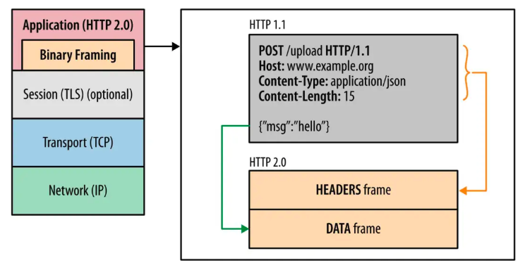
3. 并发传输
4. 服务器主动推送资源

### 1.1.7 HTTP/3


## 1.2 HTTPS

### 1.2.1 HTTP 和 HTTPS

### 1.2.2 HTTPS RSA 握手过程

### 1.2.3 HTTPS ECDHE 握手过程

##### 第一次握手
###### client hello
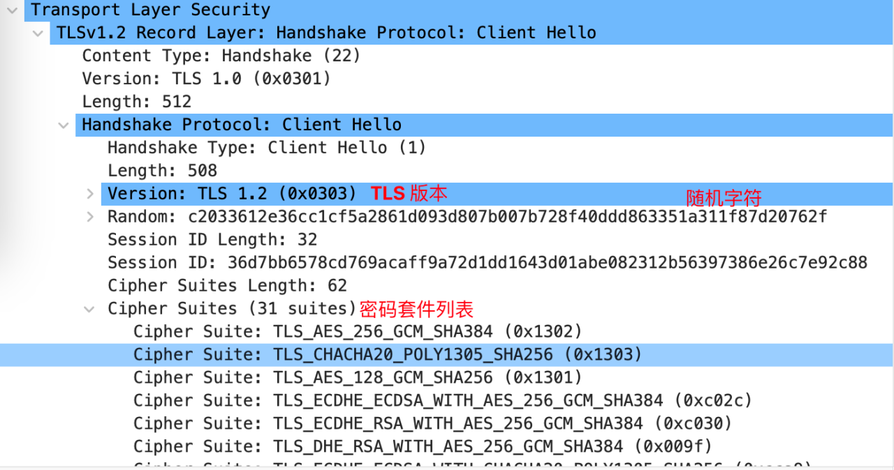
> 客户端发送 TLS 版本、客户端随机字符、支持的秘钥套件列表.


##### 第二次握手
###### 1.server hello
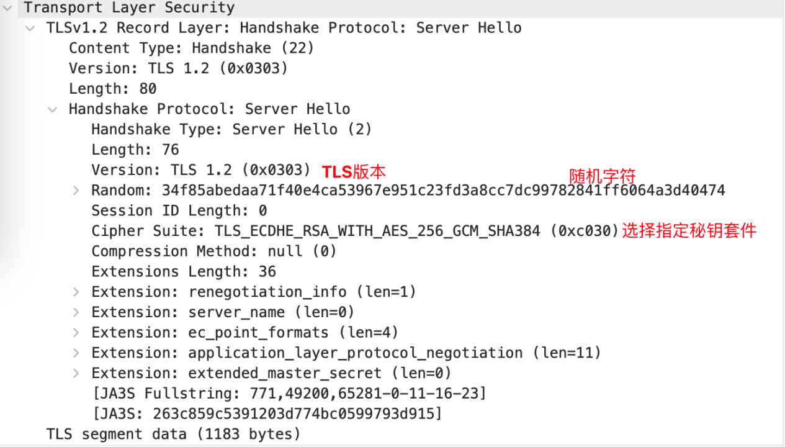

> `收到`: 客户端的 `TLS` 版本、随机字符、支持的秘钥套件列表。
>
> `发送`: 服务端的 `TLS` 版本、随机字符、选择秘钥套件。

###### 2.Certificate
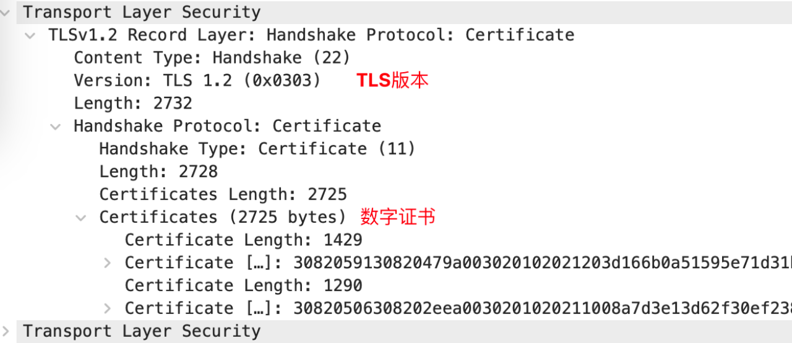
> `发送`: 服务端的 TLS 版本、数字证书。

###### 3.Server Key Exchange
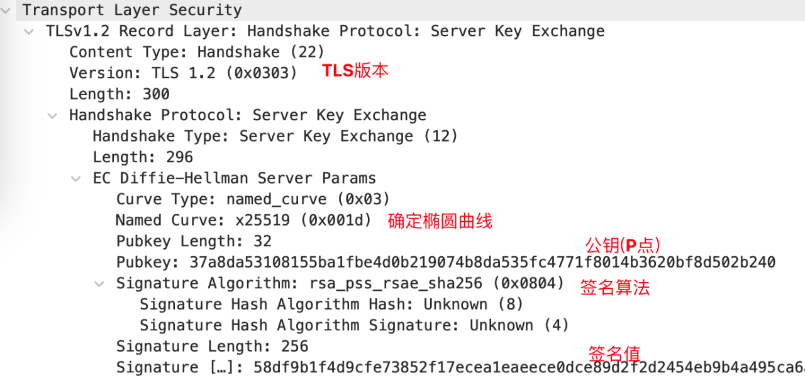
> 发送的内容: 
> 1. TLS 版本在 `Server Hello` 阶段已经协商确定, 该阶段无需再发送.
> 2. 椭圆曲线参数
> 3. 公钥
> 4. 签名算法和签名值
> 
> 过程:
> 1. 生成临时私钥: 服务器生成一个临时的私钥.
> 2. 确定好椭圆曲线(G): 选择用于秘钥交换的椭圆曲线参数.
> 3. 计算临时公钥: 使用临时私钥和椭圆曲线参数(G)计算出公钥(P).
> 4. 签名: 使用服务器的长期私钥(证书中的)对前面协商出来的临时公钥进行签名, 证明这些参数来自服务器.

###### 4.Server Hello Done
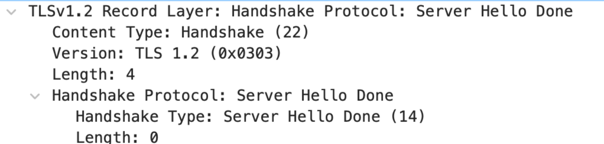
> 服务端提供完信息, 结束.

##### 第三次握手
###### 1.Client Key Exchange
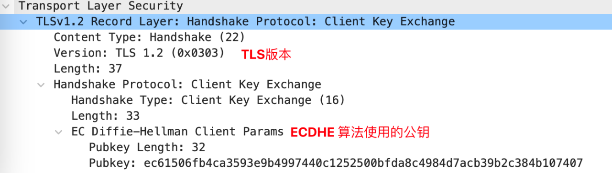
> 收到: 椭圆曲线(G)、公钥(P)、签名算法、签名值。
> 
> 发送: client 端公钥.
> 
> 过程:
> 1. client 生成随机字符，表示私钥。
> 2. 根据服务端发送的 椭圆曲线(G)、公钥(P)，client 私钥, 计算出对应的公钥。

###### 2.Change Cipher Spec
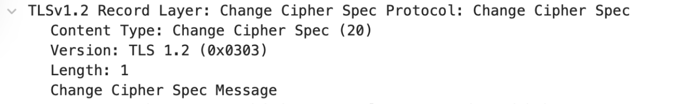
> 发送: 通知 server 在后续使用对称加密的会话秘钥。
> 
> 过程:
> 1. 根据client 私钥、server 公钥、根据ECDHE算法，计算出对称加密的会话秘钥。

###### 3.Encrypted Handshake Message
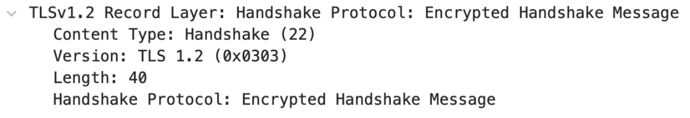
> 发送: 将之前发送的数据做一个摘要, 用对称秘钥加密。


##### 第四次握手
###### 1.Change Cipher Spec

> 收到: client 公钥.
> 
> 发送: 通知client后续使用对称加密会话秘钥。
> 
> 过程:
> 1. 收到 client公钥之后,  server 有了 椭圆曲线、server 公钥、server 私钥、client 私钥。
> 2. 使用 server 私钥、client 公钥、ECDHE算法计算对称加密会话秘钥。

###### 2.Encrypted Handshake Message


### 1.2.4 HTTPS 如何优化

1. 硬件优化: 使用更好的CPU, 如支持 AES_NI 指令集的处理器.
2. 软件优化: 升级内核、openssl.
3. 协议优化: 
   4. 使用 ECDHE 协议, 不使用 RSA 协议.
   4. 秘钥交换算法优化: 使用 x25519 椭圆曲线.
   5. TLS 升级 v1.3.
4. 证书优化
   5. 证书传输优化.
   6. 证书验证优化.
5. 会话复用
   6. Session ID
   7. Session Ticket
   8. Pre-shared Key

## 1.3 HTTP 和 RPC

## 1.4 HTTP 和 WebSocket


# 二、传输层

## 2.1 TCP


## 2.2 UDP


# 三、网络层

## 3.1 IP 


