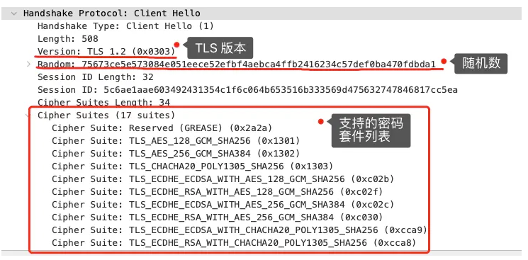
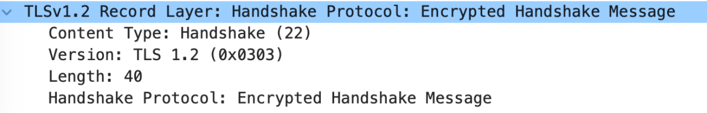

# TCP/IP 网络模型分层


# 一、应用层
## 1.1 HTTP
### 1.1.1 HTTP 是什么
HTTP 是超文本传输协议，也就是HyperText Transfer Protocol。

- `超文本`: 网页文本、音频、视频、图片、压缩包 的混合体,并且有超链接, 可以从一个超文本跳转到另一个超文本中.
- `传输`: 把 `超文本` 从 A 传输 到 B, 也可以从 B 传输到 A。这是双向的。
- `协议`: `协` 表示至少有2个以上的参与者, `议` 表示对行为的约定和规范。

总结就是: HTTP 是计算机世界中, 在 `两点` 之间 `传输` 文字、图片、音频等 `超文本` 数据的`约定`和`规范`.

### 1.1.2 GET 和 POST 区别
在 RFC 协议中, GET 是从服务器获取资源的. POST 是根据请求报文, 对指定资源做处理的.

GET 传输的数据在URL中(也可以在 body 中), 是明文的, 且有大小限制；

POST 传输的数据可以在URL中, 也可以在 body 中, body 无大小限制.

从 RFC 规范协议的语义上来讲, GET 请求是 安全且幂等 的. 因为 GET 是`只读`操作, 无论操作多少次, 服务器上的数据都是安全的, 且每次结果相同。 所以可以对 GET请求的数据做缓存, 比如缓存可以做到浏览器本身, 也可以做到代理上(nginx), 而且在浏览器中的 GET 请求可以保存为书签。

而 POST 请求是`新增或者提交`数据, 会修改服务器上的资源, 所以是不安全的, 且多次提交数据就会创建多个资源, 所以也不是幂等的.

但是在实际的开发中, 也有人用 GET 请求保存数据, 有人用 POST 请求读取数据.

### 1.1.3 HTTP 缓存技术

#### 强制缓存
强制缓存生效的话, 不会向服务器发起请求.

强制缓存是只要浏览器判断缓存没有过期, 则直接使用浏览器本地缓存, 决定是否使用缓存的主动性在于浏览器.


强制缓存利用 HTTP 响应头部字段实现:
1. `Cache-Control` 相对时间. 优先级高于 `Expires`
2. `Expires` 绝对时间.

强制缓存的流程:
1. 第一次请求服务器资源, 服务器会在返回资源的时候, 在 Response header 加上 Cache-Control, Cache-Control 设置了过期时间大小;
2. 再次请求服务器资源, 会先通过请求资源的时间 和 Cache-Control 中设置的过期时间, 来计算出资源是否过期, 如果没有, 就使用缓存, 否则重新请求服务器;
3. 服务器再次收到请求, 会再次更新 Response header 的 Cache-Control.


nginx 配置强制缓存
```bash
# a.html 
<!DOCTYPE html>
<html lang="en">
<head>
  <meta charset="UTF-8">
  <title>Fetch Login</title>
</head>
<body>
  <h2>nginx 强制缓存测试</h2>
</body>
</html>


# nginx config
server {
    listen 80;
    server_name 192.168.1.168;
    location /a.html {
       add_header Cache-Control "max-age=600";  # 设置缓存时间为 600s, max-age 需要加引号
       add_header Last-Modified "";             # 关闭协商缓存
       etag off;                                # 关闭ETag
       root /Users/kino/;
    }
}
```
在浏览器中访问结果:


> 注意: 在浏览器中, 要按回车键才能使用到强制缓存, 按刷新按钮或者f5, 会走协商缓存, 原因是浏览器会在 Request Headers 中添加: `Cache-Control: max-age=0`, 告诉服务端帮我确认该资源是否过期, 也就是说浏览器是真的会发出请求的.


#### 协商缓存
协商缓存 区别于 强制缓存 的地方在, 协商缓存必定会向服务器发起请求, 是否使用缓存取决于服务器端, 协商缓存有两种实现:

第一种: Request Header 的 `If-Modified-Since` 字段与 Response Header 的 `Last-Modified` 字段
- Response Header 的 `Last-Modified` 表示这个响应资源的最后修改时间.
- Header Header 的 `If-Modified-Since` 当资源过期了, 发现响应头中有 `Last-Modified` 则再次发起请求的时候带上 `Last-Modified` 的时间, 服务器收到请求后发现有 `If-Modified-Since` 则与被请求资源的最后修改时间进行对比(`Last-Modified`), 如果最后修改时间大, 说明资源被修改过, 则返回最新的资源, HTTP 200 OK; 如果最后修改时间小, 说明资源没有修改过, 响应 HTTP 304 走缓存.

第二种: Request Header 的 `If-None-Match` 和 Response Header 的 `ETag` 字段
- Response Header 的 `ETag`, 响应资源的唯一标识。
- Request Header 的 `If-None-Match`, 当资源过期时, 浏览器发现响应头里有 ETag, 则再次向服务器发起请求时, 会将请求头 `If-None-Match` 值设置成 ETag 值。服务器收到请求后进行对比, 如果资源没有变化返回 304, 变化了返回 200.

两种协商缓存的方式都依赖于强制缓存的 Cache-Control 字段来使用, 在未命中强制缓存之后, 才能发起带有协商缓存字段的请求, 在两种协商缓存种, ETag 的优先级 高于 第一种时间对比 的方式.

强制缓存和协商缓存的工作流程：


当使用 ETag 字段实现的协商缓存的过程：
- 当浏览器第一次请求访问服务器资源时, 服务器会在返回这个资源的同时, 在 Response Header 加上 ETag 唯一标识, 这个唯一标识的值是根据当前请求的资源生成的.
- 当浏览器再次请求访问服务器中的该资源时, 首先会检查强制缓存是否过期:
  - 如果没有过期, 则直接使用本地缓存.
  - 如果缓存过期, 会在 Request Header 加上 `If-None-Match` 字段, 该字段的值就是 ETag 唯一标识。
- 服务器再次收到请求后, 会根据请求中的 `If-None-Match` 字段, 与当前请求的资源生成的唯一标识进行对比:
  - 如果值相等: 则返回 304 Not Modified, 不会返回资源.
  - 如果不相等: 则返回 200 状态码和返回资源, 并在 Response Header 中加上新的 ETag 唯一标识;
- 如果浏览器收到 304 的请求响应状态码, 则会从本地缓存中加载资源, 否则更新资源.

nginx 配置协商缓存
```bash
# vim a.html 
与强制缓存一致

# nginx config
server {
    listen 80;
    server_name 192.168.1.168;
    location /a.html {
       add_header Cache-Control "public max-age=600";
       etag on;
       root /Users/kino/;
    }
}
```
在浏览器中第一次请求的请求头和响应头如下(去除无关信息):
```bash
# Request Headers
GET /a.html HTTP/1.1
Cache-Control: no-cache
Connection: keep-alive
Pragma: no-cache

# Response Headers
HTTP/1.1 200 OK                                # 正常响应, 未走缓存
Date: Thu, 24 Apr 2025 06:59:25 GMT            # 请求时间
Last-Modified: Thu, 24 Apr 2025 06:34:40 GMT   # 资源最后一次修改的时间
Connection: keep-alive
ETag: "6809db80-124"                           # 资源的唯一标识
Cache-Control: public max-age=600              # 缓存 600s
```
在浏览器中第二次请求的请求头和响应头如下(去除无关信息):
```bash
# Request Headers
GET /a.html HTTP/1.1
Cache-Control: max-age=0                           # 询问服务器该资源是否过期
Connection: keep-alive
If-Modified-Since: Thu, 24 Apr 2025 06:34:40 GMT   # 资源最后一次修改的时间
If-None-Match: "6809db80-124"                      # 资源的唯一标识

# Response Headers
HTTP/1.1 304 Not Modified                          # 304 Not Modified 表示使用协商缓存
Last-Modified: Thu, 24 Apr 2025 06:34:40 GMT       # 资源最后一次修改的时间
Connection: keep-alive
ETag: "6809db80-124"                               # 资源的唯一标识
Cache-Control: public max-age=600                  # 缓存 600s
```
尝试修改资源文件的最后一次修改时间:
```bash
touch -mt 202504241508 a.html
```
在浏览器中第三次请求的请求头和响应头如下(去除无关信息):
```bash
# Request Headers
GET /a.html HTTP/1.1
Connection: keep-alive
If-Modified-Since: Thu, 24 Apr 2025 06:34:40 GMT  # 资源最后一次修改的时间
If-None-Match: "6809db80-124"                     # 资源的唯一标识

# Response Headers
HTTP/1.1 200 OK                                   # 没有走缓存
Last-Modified: Thu, 24 Apr 2025 07:08:00 GMT      # 资源最后一次修改时间( 和 Request Header 中的不一样了)
Connection: keep-alive
ETag: "6809e350-124"                              # 资源的唯一标识( 和 Request Header 中的不一样了)
Cache-Control: public max-age=600                 # 缓存 600s
```

> 这里有个有意思的地方, 在上面解释过浏览器的刷新和回车的区别, 这里配置上协商缓存之后, 在浏览器点击刷新, 会发现是先使用了协商缓存, 再回车走的是强制缓存。

### 1.1.4 HTTP 特性
优点:
1. 简单: Header 和 Body 都是 key-value 格式.
2. 灵活、易于扩展: 字段可以自定义和扩充.
3. 应用广泛、跨平台: pc、app.

缺点:
1. 无状态: 无法记住身份信息, 所以有了Cookie技术
2. 不安全(SSL/TLS解决了):
   3. 明文传输: 请求数据没有加密.
   4. 身份验证: 无法验证服务器(客户端)的身份.
   5. 报文完整性: 无法保证数据报文不被穿篡改.

### 1.1.5 HTTP/1
#### 1.1.5.1 HTTP/1.0 和 HTTP/1.1
HTTP/1.1 相比 HTTP/1.0 做了以下改进:
1. 使用长连接, 改善了HTTP/1.0短连接造成的性能开销.
2. 支持管道(pipeline)网络传输: 只要请求发出去了, 不用等响应, 就可以发第二个请求, 减少了整体的响应时间.

但是 HTTP/1.1 还是存在以下问题, HTTP2 和 HTTP3 都是致力于解决这些问题:
1. HTTP/1.1 只能压缩Body 部分数据, Request Header 和 Response Header 未经过压缩就发送, Header 越多, 网络开销越大延迟越大.
2. 每次请求首部信息大部分是一样的, 每次都需要发送冗余的首部信息.
3. 虽然HTTP/1.1 支持了管道, 但是服务器是按请求顺序响应的, 如果服务器响应慢, 会导致客户端一直请求不到数据, 这就是服务端的队头阻塞.
4. 没有请求优先级控制.
5. 请求只能从客户端开始, 服务端只能被动响应.

#### 1.1.5.2 HTTP/1.1 如何优化
#### 1.1.5.2.1 避免发送请求
合理使用缓存技术, 参考上面的协商缓存和强制缓存.

#### 1.1.5.2.2 减少HTTP请求次数
- 减少重定向请求次数;
  - 重定向一次, 客户端就要多发起一次HTTP请求, 会降低网络性能. 最好是将重定向交给 代理服务器 完成.
  - HTTP 重定向响应码:
  
- 合并请求;
  - 浏览器会同时发起6个请求(Chrome), 每个请求都是不同的TCP连接, 如果把请求合并, 就会减少TCP的连接方式, 因此省去了TCP握手和慢启动过程耗费的时间.
- 延迟发送请求;
  - 通常一个 HTML 包含许多 HTTP 的 URL, 当前不需要的资源, 也没必要直接加载, 所以可以通过按需获取的方式, 来减少第一时间的HTTP请求次数.


#### 1.1.5.2.3 减少HTTP响应的数据大小(压缩)
- 无损压缩: gzip就是常见的一种无损压缩, 在 HTTP 请求头中通过 `Accept-Encoding: gzip defalte, br` 设置, 响应头中 `Content-Encoding: gzip` 告诉客户端使用该压缩算法. gzip 压缩效率相比 Google 的Brotli 算法效率低, 服务器应该尽可能选择 br 压缩算法.
- 有损压缩: 有损压缩会将次要的数据舍弃, Bi如牺牲一些质量来减少数据量、提高压缩比, 在多媒体数据、音频视频图片使用的比较多, 在 HTTP 请求头中通过 `Accept: audio/*; q=0.2, audio/basic` 设置, 目前压缩比比较高的是 Google 推出的 WebP 格式


### 1.1.6 HTTP/2


HTTP2 是基于 HTTPS 的, 所以 HTTP2 的安全性是有保障的.

HTTP2 相比 HTTP/1.1 在性能上的改进:
1. 头部压缩: 如果同时发起多个请求, 它们的头是一样或者是相似, 那么协议会消除重复的部分.
    > 这就是 `HPACK` 算法: 在客户端和服务端同时维护一张头信息表, 所有字段都会存入这个表, 生成一个索引号, 以后就不用发送同样的字段只发索引号.
2. 二进制格式: HTTP2报文全面采用二进制格式, 头信息和数据主体都是二进制, 统称为帧(Frame): 头信息帧(Headers Frame) 和 数据帧(Data Frame)
   > 
3. 并发传输
4. 服务器主动推送资源

### 1.1.7 HTTP/3


## 1.2 HTTPS
### 1.2.1 HTTP 和 HTTPS

#### 1.2.1.1 HTTP 和 HTTPS 的区别
- HTTP 是超文本传输协议, 信息是明文传输, 存在安全风险。HTTPS 则能解决 HTTP 不安全的缺陷, HTTPS 是在 TCP 和 HTTP 之间加入了 SSL/TLS 安全协议, 使得报文能够加密传输.
- HTTP 连接建立相对简单, TCP 三次握手之后才可以进行 HTTP 报文传输. 而 HTTPS 在 TCP 三次握手之后, 还需要进行 SSL/TLS 的握手过程, 才可以进入加密报文传输.
- HTTP 默认端口是 80, HTTPS 默认端口号是 443.
- HTTPS 需要向 CA(证书权威机构) 申请数字证书, 来保证服务器的身份是可信的.

#### 1.2.1.2 HTTPS 解决了 HTTP 的哪些问题
之前说过 HTTP 的缺陷:
1. 无状态: 通过 Cookie 技术解决.
2. 不安全:
   - 明文传输(窃听风险)
   - 无法服务端/客户端验证身份(冒充风险)
   - 数据完整性(篡改风险)


HTTPS 是为了解决 HTTP 无状态、不安全的问题的, 具体通过如下方式解决的:
- 混合加密的方式实现信息的机密性, 解决了窃听的风险.
- 摘要算法的方式时间完整性, 它能够为数据生成独一无二的指纹, 指纹用于校验数据的完整性, 解决了篡改风险.
- 将服务器公钥放入到数字证书中, 解决了冒充风险.

#### 1.2.1.2.1 混合加密


HTTPS 采用的是对称加密和非对称加密结合的混合加密方式:
- 在通信建立前, 采用非对称加密的方式交换 会话秘钥, 后续就不再使用对称加密.
- 在通信建立后, 全部采用对称加密的方式 加密明文数据.

- 对称加密: 只使用一个秘钥, 运算速度快, 秘钥必须保密, 无法做到权限的秘钥交换.
- 非对称加密: 使用两个秘钥, 公钥 和 私钥, 公钥可以任意分发, 私钥保密, 解决了秘钥交换问题但速度慢.


#### 1.2.1.2.2 摘要算法+数字签名
为了保证传输的内容不被篡改, 需要对内容计算出一个 指纹, 然后同内容一起传输给对方.

对方收到后, 先是对内容也计算出一个 指纹, 然后跟发送方发送的 指纹 做对比, 如果相同, 说明内容没有被篡改, 否则就可以判断出内容被篡改了.

在计算机里会用摘要算法(哈希函数)来计算出内容的哈希值, 也就是内容的 指纹, 这个哈希值是唯一的, 且无法通过哈希值推导出内容.


通过哈希算法可以确保内容不被篡改, 但是并不能保证 内容+哈希值 不会被中间人替换, 因为这里缺少对客户端收到的消息是否来源于服务端的证明.

为了避免这个问题, 计算机里会使用 非对称加密算法 来解决, 共有两个秘钥:
1. 公钥: 可以同开给所有人.
2. 私钥: 必须本人管理, 不能泄露.

这两个秘钥可以双向加解密, 比如可以用公钥加密内容, 然后用私钥解密, 也可以用私钥加密内容, 公钥解密内容.
- 公钥加密, 私钥解密: 为了保证内容传输的安全, 因为公钥加密的内容, 其他人是无法解密的, 只有持有私钥的人, 才能解密出实际的内容;
- 私钥加密, 公钥解密: 为了保证消息不会被冒充, 因为私钥是不可泄露的, 如果公钥能正常解密出私钥加密的内容, 就能证明这个消息是来源于持有私钥身份的人发送的.

但是在一般情况下, 不会使用非对称加密来加密实际的传输内容, 因为非对称加密的计算比较耗费性能.

所以非对称加密的用途主要在于通过 私钥加密, 公钥解密 的方式, 来确认消息的身份, 我们常说的 数字签名算法, 就是采用这种方式, 不过私钥加密内容不是内容本身, 而是对 内容的哈希值加密.


私钥是由服务端保管, 然后服务端会向客户端颁发对应的公钥, 如果客户端收到消息, 能被公钥解密, 就说明该消息是由服务器发送的.

总结起来就是:
- 可以通过哈希算法来保证消息的完整性;
- 可以通过数字签名来保证消息的来源可靠性(能确认消息是由持有私钥的一方发送的);

#### 1.2.1.2.3 数字证书

上面的环节中, 还缺少 身份验证的环节, 因为公钥可能被伪造, 所以需要有一个权威机构CA(数字证书认证机构), 将服务器公钥放在数字证书(由数字证书认证机构颁发)中, 只要证书是可信的, 公钥就是可信的.


通过数字证书的方式保证服务器公钥的身份，解决冒充的风险。


### 1.2.2 HTTPS RSA 握手过程
##### 第一次握手
###### client hello



第一次握手的消息中有客户端使用的 TLS 版本号、支持的密码套件列表、生成的随机数(Client Random), 这个随机数会被服务端保留, 它是生成对称加密秘钥的材料之一.


##### 第二次握手
第二次握手中, 当服务端收到客户端的 Client Hello 消息后, 会确认 TLS 版本号是否支持, 和从密码套件列表中选择一个密码套件, 以及生成随机数(Server Random)

接着, 返回 Server Hello 消息, 消息里面有服务器确认的 TLS 版本号, 也给随机数(Server Random), 然后从客户端的密码套件列表选择一个合适的密码套件.


Cipher Suite: TLS_RSA_WITH_AES_128_GCM_SHA256, 这个基本格式是: 秘钥交换算法 + 签名算法 + 对称加密算法 + 摘要算法, 一般 WITH 前面有两个单词, 第一个单词是约定秘钥交换的算法, 第二个单词是约定证书的验证算法, 比如这个就是: 
- 由于 WIHT 前只有 RSA, 则说明握手时秘钥交换算法和签名算法都是使用 RSA;
- 握手后的通信使用 AES 对称算法, 秘钥长度 128位, 分组模式是 GCM;
- 摘要算法 SHA256 用于消息认证和产生随机数;

随机数是后续作为生成 会话秘钥 的条件, 所谓的会话秘钥就是数据传输时, 使用的对称加密秘钥.

接着服务端为了证明自己的身份, 会发送 Server Certificate 给客户端, 这个消息里包含数字证书


接着，服务端发了 Server Hello Done 消息, 告诉客户端, 我已经把该给你的东西都给你了, 本地打招呼结束。


##### 客户端验证证书

客户端拿到服务端的数字证书后, 会通过CA机构验证真实性. 

一个数字证书通常应该包含:
1. 公钥
2. 持有者信息
3. 证书认证机构(CA)的信息
4. CA对这份文件的数据签名及使用的算法
5. 证书有效期
6. 还有一些其他额外信息

正常来讲, 服务端的证书都是由 CA 签名的, CA 就是网络世界里的 公证中心, 具有可信度。

数字证书签发和验证的流程:


CA 签发证书的过程:
1. CA 会把持有者的公钥、用途、颁发者、有效时间等信息打包, 然后对这些信息进行Hash 计算, 得到一个 Hash 值.
2. CA 会使用自己的 私钥 将该 Hash 值加密, 生成 Certificate Signature, 也就是 CA 对证书做了签名.
3. Certificate Signature 添加在文件证书上, 形成数字证书.

客户端校验服务端证书的过程:
1. 客户端会使用同样的 Hash 算法获取该证书的 Hash 值 H1.
2. 通常浏览器和操作系统中集成了 CA 的公钥信息, 浏览器收到证书后可以使用 CA 的公钥解密 Certificate Signature 内容, 得到 H2.
3. 最后比较 H1 和 H2, 如果值相同, 则为可信赖的证书, 否则则认为证书不可信.

但是事实上, 证书的验证过程中还存在一个证书信任链的问题, 因为我们向 CA 申请的证书一般不是根证书签发的, 而是由中间证书签发的, 比如百度的证书, 从下图中可以看到, 证书的层级有三级:


对于这种三级层级关系的证书的验证过程如下:
1. 客户端收到 baidu.com 的证书之后, 发现这个证书的签发者不是根证书, 就无法根据本地已有的根证书中的公钥去验证 baidu.com 证书是否可信, 于是, 客户端根据baidu.com证书中的签发者, 找到该证书的颁发机构是 GlobalSign RSA OV SSL CA 2018, 然后向 CA 请求该中间证书.
2. 请求到证书后发现 GlobalSign RSA OV SSL CA 2018 证书是由 GlobalSign Root CA 签发的, 由于 GlobalSign Root CA 没有再上级签发机构, 说明它是根证书, 也就是自签证书. 应用软件会检查此证书是否已预载于根证书清单上, 如果有, 则可以利用根证书中的公钥去验证 GlobalSign RSA OV SSL CA 2018 证书，如果发现验证通过, 就认为该中间证书是可信的。
3. GlobalSign RSA OV SSL CA 2018 证书被信任之后, 可以使用 GlobalSign RSA OV SSL CA 2018 证书中的公钥去验证 baidu.com 证书的可信性, 如果验证通过, 就可以信任 baidu.com 证书。

总的来说, 由于用户信任 GlobalSign, 所以由 GlobalSign 所担保的 baidu.com 可以被信任, 另外由于用户信任操作系统或浏览器的软件商, 所以由软件商预载了根证书的 GlobalSign 都可以被信任。


之所以需要这么麻烦的证书链, 是因为为了确保根证书的绝对安全性, 将根证书隔离的越严格越好, 不然根证书如果失守, 那么整个信任链都会有问题。

##### 第三次握手
客户端验证完证书后, 认为可信, 则继续第三次握手.

客户端会生成一个随机数(pre-master), 用服务器的RSA公钥加密该随机数, 通过 Client Key Exchange 消息传递给服务端.


服务端收到后, 用 RSA 私钥解密, 得到客户端发来的随机数(pre-master)

至此, 客户端和服务端双方都有了 Client Random、Server Random、pre-master。

于是双方根据已经得到的三个随机数, 生成 会话秘钥(Master Secret), 它是对称秘钥, 用于对后续的 HTTP 请求/响应 的数据加解密.

生成完 会话秘钥 后, 然后客户端发送一个 Change Cipher Spec, 告诉服务端开始使用对称加密方式发送消息.


然后客户端再发送一个 Encrypted Handshake Message(Finished)消息, 把之前所有发送的数据做个摘要, 再用 会话秘钥(master secret)加密, 让服务器做个验证, 验证加密通信 是否可用 和 之前握手信息是否有被中途篡改过.


可以发现, Change Cipher Spec 之前传输的 TLS 握手数据都是明文, 之后都是对称秘钥加密的密文。

##### 第四次握手
服务器也是同样的操作, 发送 Change Cipher Spec 和 Encrypted Handshake Message 消息, 如果双方都验证加密和解密没有问题, 那么握手正式完成.

最后, 就用 会话秘钥 加解密 HTTP 请求和响应了。


RSA 算法最大的问题在于不支持向前保密, 因为 客户端和服务端 传递的随机数, 是明文传输的, 而 pre-master 使用公钥加密, 服务端使用私钥解密. 如果 服务端私钥 泄露, 监听者监听了整个握手过程, 就能使用 私钥 + pre-master 推导出未加密的值, 从而解出session key(会话秘钥), 这时候整个 TLS 通讯密文都会被破解.


### 1.2.3 HTTPS ECDHE 握手过程

##### 第一次握手
###### client hello

> 客户端发送 TLS 版本、客户端随机字符、支持的秘钥套件列表.


##### 第二次握手
###### 1.server hello


> `收到`: 客户端的 `TLS` 版本、随机字符、支持的秘钥套件列表。
>
> `发送`: 服务端的 `TLS` 版本、随机字符、选择秘钥套件。

###### 2.Certificate

> `发送`: 服务端的 TLS 版本、数字证书。

###### 3.Server Key Exchange

> 发送的内容: 
> 1. TLS 版本在 `Server Hello` 阶段已经协商确定, 该阶段无需再发送.
> 2. 椭圆曲线参数
> 3. 公钥
> 4. 签名算法和签名值
> 
> 过程:
> 1. 生成临时私钥: 服务器生成一个临时的私钥.
> 2. 确定好椭圆曲线(G): 选择用于秘钥交换的椭圆曲线参数.
> 3. 计算临时公钥: 使用临时私钥和椭圆曲线参数(G)计算出公钥(P).
> 4. 签名: 使用服务器的长期私钥(证书中的)对前面协商出来的临时公钥进行签名, 证明这些参数来自服务器.

###### 4.Server Hello Done

> 服务端提供完信息, 结束.

##### 第三次握手
###### 1.Client Key Exchange

> 收到: 椭圆曲线(G)、公钥(P)、签名算法、签名值。
> 
> 发送: client 端公钥.
> 
> 过程:
> 1. client 生成随机字符，表示私钥。
> 2. 根据服务端发送的 椭圆曲线(G)、公钥(P)，client 私钥, 计算出对应的公钥。

###### 2.Change Cipher Spec

> 发送: 通知 server 在后续使用对称加密的会话秘钥。
> 
> 过程:
> 1. 根据client 私钥、server 公钥、根据ECDHE算法，计算出对称加密的会话秘钥。

###### 3.Encrypted Handshake Message

> 发送: 将之前发送的数据做一个摘要, 用对称秘钥加密。


##### 第四次握手
###### 1.Change Cipher Spec

> 收到: client 公钥.
> 
> 发送: 通知client后续使用对称加密会话秘钥。
> 
> 过程:
> 1. 收到 client公钥之后,  server 有了 椭圆曲线、server 公钥、server 私钥、client 私钥。
> 2. 使用 server 私钥、client 公钥、ECDHE算法计算对称加密会话秘钥。

###### 2.Encrypted Handshake Message



### 1.2.4 HTTPS 如何优化

1. 硬件优化: 使用更好的CPU, 如支持 AES_NI 指令集的处理器.
2. 软件优化: 升级内核、openssl.
3. 协议优化: 
   4. 使用 ECDHE 协议, 不使用 RSA 协议.
   4. 秘钥交换算法优化: 使用 x25519 椭圆曲线.
   5. TLS 升级 v1.3.
4. 证书优化
   5. 证书传输优化.
   6. 证书验证优化.
5. 会话复用
   6. Session ID
   7. Session Ticket
   8. Pre-shared Key

## 1.3 HTTP 和 RPC

## 1.4 HTTP 和 WebSocket


# 二、传输层

## 2.1 TCP


## 2.2 UDP


# 三、网络层

## 3.1 IP 


