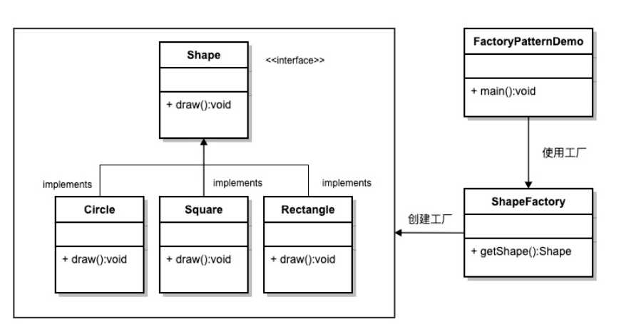
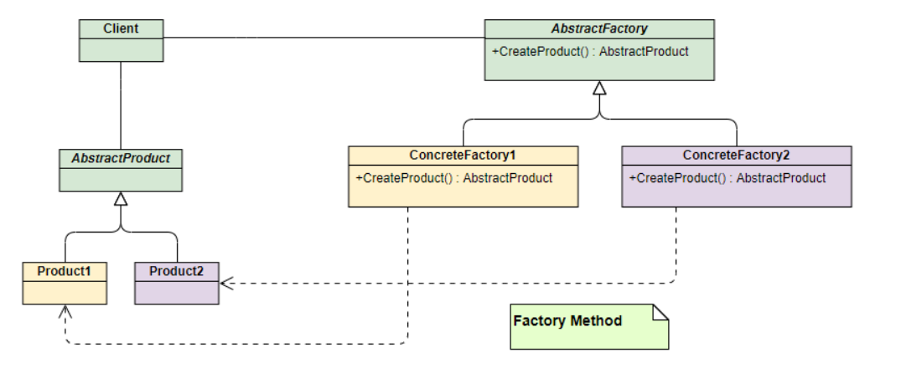

---
# 一、工厂模式
工厂模式是一种创建对象的模式, 被广泛的应用在 jdk、 Spring 中.

工厂模式根据 "输入", 应用在超类和多个子类之间的情况, 这种模式将创建对象的责任转移到工厂类.

在软件开发中, 当我们会用到大量的创建某种、某类或者某批对象时, 就会用到工厂模式。

# 二、工厂模式的分类
在 《Java与模式》一书中, 被分为三类:
1. 简单工厂模式: 不利于产生系列产品;
2. 工厂方法模式: 多形态工厂;
3. 抽象工厂模式: 又称工具箱、产品族, 不利于产生新的产品

# 三、简单工厂模式
## 3.1 简单工厂模式的说明
简单工厂模式属于**创建型模式**, 是工厂模式的一种

简单工厂模式是由一个工厂对象决定创建出哪一种产品类的实例。**简单工厂模式是工厂模式家族中最简单实用的模式**

简单工厂模式: 定义了一个创建对象的类, 由这个类来封装实例化对象的行为(代码)

UML 图:




## 3.2 简单工厂模式的使用
Shape: 图形的规范类(AbstractProduct)
```java
public interface Shape {
    void draw();
}
```
Circle: 圆形的图形(Product1)
```java
public class Circle implements Shape {
    
    public Circle() {
        this.draw();
    }

    @Override
    public void draw() {
        System.out.println("Circle.draw method.");
    }
}
```
Square: 正方形图形(Product2)
```java
public class Square implements Shape {

    public Square() {
        this.draw();
    }

    @Override
    public void draw() {
        System.out.println("Square.draw method.");
    }
}
```
ShapeFactory: 绘制图形代工厂(Factory)
```java
public class ShapeFactory {
    public Shape getShape(String shapeType) {
        if (shapeType == null) {
            return null;
        }
        if (shapeType.equalsIgnoreCase("circle")){
            return new Circle();
        } else if (shapeType.equalsIgnoreCase("square")) {
            return new Square();
        }
        return null;
    }
}
```
调用:
```java
public class FactoryPatternDemo {
    public static void main(String[] args) {
        ShapeFactory shapeFactory = new ShapeFactory();
        Shape circle = shapeFactory.getShape("circle");

        Shape square = shapeFactory.getShape("square");
    }
}
```

## 3.3 优缺点分析
1. 优点是比较好理解, 简单易操作;
2. 缺点是违反了设计模式的 ocp 模式, 即对扩展开放, 对修改关闭, 当我们给类增加新功能的时候, 尽量不修改代码, 或者尽可能少的修改代码
3. 比如需要增加一个 Rectangle 的图形, 就需要把 ShapeFactory 进行修改:
    ```java
    public class ShapeFactory {
        public Shape getShape(String shapeType) {
            if (shapeType == null) {
                return null;
            }
            if (shapeType.equalsIgnoreCase("circle")){
                return new Circle();
            } else if (shapeType.equalsIgnoreCase("rectangle")) {
                return new Rectangle();
            } else if (shapeType.equalsIgnoreCase("square")) {
                return new Square();
            }
            return null;
        }
    }
    ```
# 四、工厂方法模式
和简单工厂模式中工厂负责生产所有产品相比，工厂方法模式将生成具体产品的任务分发给具体的产品工厂，其UML类图如下



Shape: 图形的规范类(AbstractProduct)
```java
public interface Shape {
    void draw();
}
```
Circle: 圆形的图形(Product1)
```java
public class Circle implements Shape {
    
    public Circle() {
        this.draw();
    }

    @Override
    public void draw() {
        System.out.println("Circle.draw method.");
    }
}
```
Square: 正方形图形(Product2)
```java
public class Square implements Shape {

    public Square() {
        this.draw();
    }

    @Override
    public void draw() {
        System.out.println("Square.draw method.");
    }
}
```
AbstractFactory: 生产不同图形的工厂的抽象类
```java
public interface AbstractFactory {
    Shape makeShape();
}
```
CircleFactory: 生产圆形的图形的工厂
```java
public class CircleFactory implements AbstractFactory{
    @Override
    public Shape makeShape() {
        return new Circle();
    }
}
```
SquareFactory: 生产正方形图形的工厂
```java
public class SquareFactory implements AbstractFactory{
    @Override
    public Shape makeShape() {
        return new Square();
    }
}
```
调用:
```java
public class MethodFactoryPatternDemo {
    public static void main(String[] args) {
        CircleFactory circleFactory = new CircleFactory();
        SquareFactory squareFactory = new SquareFactory();
        circleFactory.makeShape();
        squareFactory.makeShape();
    }
}
```

# 五、抽象工厂模式
简单工厂模式 和 工厂方法模式 这两种设计模式只能针对一种类型的产品, 如果要生产颜色(多种产品), 则需要用到抽象工厂模式


Shape: 图形的规范类(AbstractProduct)
```java
public interface Shape {
    void draw();
}
```
Circle: 圆形的图形(Product1)
```java
public class Circle implements Shape {
    
    public Circle() {
        this.draw();
    }

    @Override
    public void draw() {
        System.out.println("Circle.draw method.");
    }
}
```
Square: 正方形图形(Product2)
```java
public class Square implements Shape {

    public Square() {
        this.draw();
    }

    @Override
    public void draw() {
        System.out.println("Square.draw method.");
    }
}
```
Color: 颜色的规范类
```java
public interface Color {
    void fill();
}
```
Blue: 蓝色
```java
public class Blue implements Color {

   public Blue() {
      this.fill();
   }

   @Override
   public void fill() {
      System.out.println("Blue.fill method.");
   }
}
```
Red: 红色
```java
public class Red implements Color {

    public Red() {
        this.fill();
    }

    @Override
    public void fill() {
        System.out.println("Red.fill method.");
    }
}
```
AbstractFactory: 两种规范接口的抽象接口
```java
public abstract class AbstractFactory {
    public abstract Color getColor(String colorType);
    public abstract Shape getShape(String shapeType) ;
}
```
ShapeFactory: 生产图形的工厂
```java
public class ShapeFactory extends AbstractFactory {
    
   @Override
   public Shape getShape(String shapeType){
      if(shapeType == null){
         return null;
      }        
      if(shapeType.equalsIgnoreCase("CIRCLE")){
         return new Circle();
      } else if(shapeType.equalsIgnoreCase("RECTANGLE")){
         return new Rectangle();
      } else if(shapeType.equalsIgnoreCase("SQUARE")){
         return new Square();
      }
      return null;
   }
   
   @Override
   public Color getColor(String color) {
      return null;
   }
}
```
ColorFactory: 生产颜色的工厂
```java
public class ColorFactory extends AbstractFactory {
    
   @Override
   public Shape getShape(String shapeType){
      return null;
   }
   
   @Override
   public Color getColor(String color) {
      if(color == null){
         return null;
      }        
      if(color.equalsIgnoreCase("RED")){
         return new Red();
      } else if(color.equalsIgnoreCase("GREEN")){
         return new Green();
      } else if(color.equalsIgnoreCase("BLUE")){
         return new Blue();
      }
      return null;
   }
}
```
FactoryProducer: 工厂生成器, 用来传递形状、颜色信息来获取工厂
```java
public class FactoryProducer {
   public static AbstractFactory getFactory(String choice){
      if(choice.equalsIgnoreCase("SHAPE")){
         return new ShapeFactory();
      } else if(choice.equalsIgnoreCase("COLOR")){
         return new ColorFactory();
      }
      return null;
   }
}
```
AbstractFactoryPatternDemo: 调用代码
```java
public class AbstractFactoryPatternDemo {
    public static void main(String[] args) {

        //获取形状工厂
        AbstractFactory shapeFactory = FactoryProducer.getFactory("SHAPE");

        //获取形状为 Circle 的对象
        shapeFactory.getShape("CIRCLE");

        //获取形状为 Rectangle 的对象
        shapeFactory.getShape("RECTANGLE");

        //获取形状为 Square 的对象
        shapeFactory.getShape("SQUARE");

        //获取颜色工厂
        AbstractFactory colorFactory = FactoryProducer.getFactory("COLOR");

        //获取颜色为 Red 的对象
        colorFactory.getColor("RED");

        //获取颜色为 Green 的对象
        colorFactory.getColor("Green");

        //获取颜色为 Blue 的对象
        colorFactory.getColor("BLUE");
    }
}
```